# Statistical Analysis

> Comprehensive descriptive statistics including central tendency, dispersion, distribution characteristics, and weighted statistics using ACS sample weights.

## Summary Statistics

- **Variables Analyzed**: 41

### Income_Adjustment_Factor

| Statistic | Unweighted | Weighted (ACS) |
| :--- | :--- | :--- |
| Mean | 1,014,884.66 | 1,014,656.45 |
| Median | 1,010,207.00 | 1,014,656.45 |
| Std Deviation | 11,388.28 | — |
| Minimum | 1,001,264.00 | — |
| Maximum | 1,042,311.00 | — |
| Count | 44,368 | — |

> *Distribution is highly right-skewed (skewness: 1.31), light-tailed/platykurtic (kurtosis: 0.71).*

- **Coefficient of Variation**: 1.1 % (low variability)

### Property_Value

| Statistic | Unweighted | Weighted (ACS) |
| :--- | :--- | :--- |
| Mean | 175,127.48 | 198,856.40 |
| Median | 140,000.00 | 170,917.83 |
| Std Deviation | 195,658.69 | — |
| Minimum | 1.00 | — |
| Maximum | 2,064,000.00 | — |
| Count | 29,491 | — |

> *Distribution is highly right-skewed (skewness: 4.13), heavy-tailed/leptokurtic (kurtosis: 27.97).*

- **Coefficient of Variation**: 111.7 % (very high variability)

### Electricity_Cost_Monthly

| Statistic | Unweighted | Weighted (ACS) |
| :--- | :--- | :--- |
| Mean | 138.48 | 119.91 |
| Median | 110.00 | 98.12 |
| Std Deviation | 123.74 | — |
| Minimum | 1.00 | — |
| Maximum | 2,600.00 | — |
| Count | 48,737 | — |

> *Distribution is highly right-skewed (skewness: 6.80), heavy-tailed/leptokurtic (kurtosis: 111.50).*

- **Coefficient of Variation**: 89.4 % (high variability)

### Fuel_Cost_Monthly

| Statistic | Unweighted | Weighted (ACS) |
| :--- | :--- | :--- |
| Mean | 215.21 | 385.90 |
| Median | 2.00 | 250.12 |
| Std Deviation | 610.50 | — |
| Minimum | 1.00 | — |
| Maximum | 6,200.00 | — |
| Count | 34,729 | — |

> *Distribution is highly right-skewed (skewness: 3.91), heavy-tailed/leptokurtic (kurtosis: 18.54).*

- **Coefficient of Variation**: 283.7 % (very high variability)

### Gas_Cost_Monthly

| Statistic | Unweighted | Weighted (ACS) |
| :--- | :--- | :--- |
| Mean | 73.28 | 70.62 |
| Median | 30.00 | 27.06 |
| Std Deviation | 129.57 | — |
| Minimum | 1.00 | — |
| Maximum | 3,000.00 | — |
| Count | 41,323 | — |

> *Distribution is highly right-skewed (skewness: 8.67), heavy-tailed/leptokurtic (kurtosis: 156.31).*

- **Coefficient of Variation**: 176.8 % (very high variability)

### Insurance_Cost_Yearly

| Statistic | Unweighted | Weighted (ACS) |
| :--- | :--- | :--- |
| Mean | 1,102.33 | 1,129.21 |
| Median | 980.00 | 1,005.00 |
| Std Deviation | 789.82 | — |
| Minimum | 4.00 | — |
| Maximum | 9,200.00 | — |
| Count | 30,468 | — |

> *Distribution is highly right-skewed (skewness: 2.57), heavy-tailed/leptokurtic (kurtosis: 12.85).*

- **Coefficient of Variation**: 71.7 % (high variability)

### Water_Cost_Yearly

| Statistic | Unweighted | Weighted (ACS) |
| :--- | :--- | :--- |
| Mean | 449.71 | 420.52 |
| Median | 420.00 | 268.75 |
| Std Deviation | 461.01 | — |
| Minimum | 1.00 | — |
| Maximum | 3,700.00 | — |
| Count | 45,359 | — |

> *Distribution is highly right-skewed (skewness: 1.46), heavy-tailed/leptokurtic (kurtosis: 4.58).*

- **Coefficient of Variation**: 102.5 % (very high variability)

### Mobile_Home_Costs_Monthly

| Statistic | Unweighted | Weighted (ACS) |
| :--- | :--- | :--- |
| Mean | 1,794.07 | 2,392.31 |
| Median | 900.00 | 1,725.00 |
| Std Deviation | 2,300.71 | — |
| Minimum | 4.00 | — |
| Maximum | 19,900.00 | — |
| Count | 1,819 | — |

> *Distribution is highly right-skewed (skewness: 3.06), heavy-tailed/leptokurtic (kurtosis: 16.68).*

- **Coefficient of Variation**: 128.2 % (very high variability)

### First_Mortgage_Payment_Monthly

| Statistic | Unweighted | Weighted (ACS) |
| :--- | :--- | :--- |
| Mean | 739.09 | 924.02 |
| Median | 650.00 | 808.00 |
| Std Deviation | 644.48 | — |
| Minimum | 4.00 | — |
| Maximum | 4,300.00 | — |
| Count | 21,439 | — |

> *Distribution is highly right-skewed (skewness: 1.22), light-tailed/platykurtic (kurtosis: 2.65).*

- **Coefficient of Variation**: 87.2 % (high variability)

### First_Mortgage_Includes_Taxes

| Statistic | Unweighted | Weighted (ACS) |
| :--- | :--- | :--- |
| Mean | 1.33 | 1.29 |
| Median | 1.00 | 1.00 |
| Std Deviation | 0.47 | — |
| Minimum | 1.00 | — |
| Maximum | 2.00 | — |
| Count | 16,841 | — |

> *Distribution is moderately right-skewed (skewness: 0.70), light-tailed/platykurtic (kurtosis: -1.51).*

- **Coefficient of Variation**: 35.4 % (moderate variability)

### Second_Mortgage_Payment_Monthly

| Statistic | Unweighted | Weighted (ACS) |
| :--- | :--- | :--- |
| Mean | 405.46 | 425.95 |
| Median | 300.00 | 318.75 |
| Std Deviation | 384.77 | — |
| Minimum | 4.00 | — |
| Maximum | 4,500.00 | — |
| Count | 2,241 | — |

> *Distribution is highly right-skewed (skewness: 3.83), heavy-tailed/leptokurtic (kurtosis: 24.15).*

- **Coefficient of Variation**: 94.9 % (high variability)

### Property_Taxes_Yearly

| Statistic | Unweighted | Weighted (ACS) |
| :--- | :--- | :--- |
| Mean | 240.32 | 261.08 |
| Median | 24.00 | 221.08 |
| Std Deviation | 966.37 | — |
| Minimum | 1.00 | — |
| Maximum | 16,500.00 | — |
| Count | 27,665 | — |

> *Distribution is highly right-skewed (skewness: 7.79), heavy-tailed/leptokurtic (kurtosis: 91.00).*

- **Coefficient of Variation**: 402.1 % (very high variability)

### Meals_Included_in_Rent

| Statistic | Unweighted | Weighted (ACS) |
| :--- | :--- | :--- |
| Mean | 1.97 | 1.97 |
| Median | 2.00 | 2.00 |
| Std Deviation | 0.18 | — |
| Minimum | 1.00 | — |
| Maximum | 2.00 | — |
| Count | 11,251 | — |

> *Distribution is highly left-skewed (skewness: -5.30), heavy-tailed/leptokurtic (kurtosis: 26.11).*

- **Coefficient of Variation**: 9.0 % (low variability)

### Rent_Amount_Monthly

| Statistic | Unweighted | Weighted (ACS) |
| :--- | :--- | :--- |
| Mean | 636.29 | 702.61 |
| Median | 550.00 | 634.38 |
| Std Deviation | 418.09 | — |
| Minimum | 4.00 | — |
| Maximum | 3,300.00 | — |
| Count | 11,251 | — |

> *Distribution is highly right-skewed (skewness: 2.12), heavy-tailed/leptokurtic (kurtosis: 7.65).*

- **Coefficient of Variation**: 65.7 % (high variability)

### Gross_Rent

| Statistic | Unweighted | Weighted (ACS) |
| :--- | :--- | :--- |
| Mean | 745.09 | 791.41 |
| Median | 660.00 | 713.88 |
| Std Deviation | 442.59 | — |
| Minimum | 4.00 | — |
| Maximum | 5,800.00 | — |
| Count | 10,386 | — |

> *Distribution is highly right-skewed (skewness: 2.18), heavy-tailed/leptokurtic (kurtosis: 9.23).*

- **Coefficient of Variation**: 59.4 % (high variability)

### Gross_Rent_Percentage_Income

| Statistic | Unweighted | Weighted (ACS) |
| :--- | :--- | :--- |
| Mean | 32.71 | 33.65 |
| Median | 24.00 | 24.50 |
| Std Deviation | 26.05 | — |
| Minimum | 1.00 | — |
| Maximum | 101.00 | — |
| Count | 10,201 | — |

> *Distribution is highly right-skewed (skewness: 1.45), light-tailed/platykurtic (kurtosis: 1.24).*

- **Coefficient of Variation**: 79.6 % (high variability)

### Selected_Monthly_Owner_Costs

| Statistic | Unweighted | Weighted (ACS) |
| :--- | :--- | :--- |
| Mean | 865.78 | 997.80 |
| Median | 643.00 | 806.06 |
| Std Deviation | 683.32 | — |
| Minimum | 3.00 | — |
| Maximum | 8,813.00 | — |
| Count | 37,877 | — |

> *Distribution is highly right-skewed (skewness: 2.00), heavy-tailed/leptokurtic (kurtosis: 6.53).*

- **Coefficient of Variation**: 78.9 % (high variability)

### Owner_Costs_Percentage_Income

| Statistic | Unweighted | Weighted (ACS) |
| :--- | :--- | :--- |
| Mean | 17.96 | 19.08 |
| Median | 13.00 | 14.75 |
| Std Deviation | 17.46 | — |
| Minimum | 1.00 | — |
| Maximum | 101.00 | — |
| Count | 37,648 | — |

> *Distribution is highly right-skewed (skewness: 2.69), heavy-tailed/leptokurtic (kurtosis: 8.86).*

- **Coefficient of Variation**: 97.2 % (high variability)

### Family_Income

| Statistic | Unweighted | Weighted (ACS) |
| :--- | :--- | :--- |
| Mean | 95,173.36 | 94,450.39 |
| Median | 76,000.00 | 76,868.75 |
| Std Deviation | 86,126.55 | — |
| Minimum | 1.00 | — |
| Maximum | 1,584,000.00 | — |
| Count | 31,912 | — |

> *Distribution is highly right-skewed (skewness: 3.75), heavy-tailed/leptokurtic (kurtosis: 26.05).*

- **Coefficient of Variation**: 90.5 % (high variability)

### Household_Income

| Statistic | Unweighted | Weighted (ACS) |
| :--- | :--- | :--- |
| Mean | 78,355.49 | 76,239.82 |
| Median | 59,600.00 | 57,811.88 |
| Std Deviation | 80,141.61 | — |
| Minimum | 1.00 | — |
| Maximum | 1,584,000.00 | — |
| Count | 49,352 | — |

> *Distribution is highly right-skewed (skewness: 3.91), heavy-tailed/leptokurtic (kurtosis: 29.01).*

- **Coefficient of Variation**: 102.3 % (very high variability)

### Specified_Rent_Unit

| Statistic | Unweighted | Weighted (ACS) |
| :--- | :--- | :--- |
| Mean | 0.22 | 0.34 |
| Median | 0.00 | 0.00 |
| Std Deviation | 0.41 | — |
| Minimum | 0.00 | — |
| Maximum | 1.00 | — |
| Count | 55,966 | — |

> *Distribution is highly right-skewed (skewness: 1.35), light-tailed/platykurtic (kurtosis: -0.16).*

- **Coefficient of Variation**: 188.5 % (very high variability)

### Specified_Value_Unit

| Statistic | Unweighted | Weighted (ACS) |
| :--- | :--- | :--- |
| Mean | 0.52 | 0.44 |
| Median | 1.00 | 0.00 |
| Std Deviation | 0.50 | — |
| Minimum | 0.00 | — |
| Maximum | 1.00 | — |
| Count | 55,966 | — |

> *Distribution is approximately symmetric (skewness: -0.06), light-tailed/platykurtic (kurtosis: -2.00).*

- **Coefficient of Variation**: 96.9 % (high variability)

### Flag_Family_Income

| Statistic | Unweighted | Weighted (ACS) |
| :--- | :--- | :--- |
| Mean | 0.19 | 0.17 |
| Median | 0.00 | 0.00 |
| Std Deviation | 0.39 | — |
| Minimum | 0.00 | — |
| Maximum | 1.00 | — |
| Count | 43,378 | — |

> *Distribution is highly right-skewed (skewness: 1.62), light-tailed/platykurtic (kurtosis: 0.61).*

- **Coefficient of Variation**: 209.4 % (very high variability)

### Flag_Gross_Rent

| Statistic | Unweighted | Weighted (ACS) |
| :--- | :--- | :--- |
| Mean | 0.05 | 0.10 |
| Median | 0.00 | 0.00 |
| Std Deviation | 0.23 | — |
| Minimum | 0.00 | — |
| Maximum | 1.00 | — |
| Count | 27,775 | — |

> *Distribution is highly right-skewed (skewness: 3.97), heavy-tailed/leptokurtic (kurtosis: 13.72).*

- **Coefficient of Variation**: 420.3 % (very high variability)

### Flag_Household_Income

| Statistic | Unweighted | Weighted (ACS) |
| :--- | :--- | :--- |
| Mean | 0.29 | 0.28 |
| Median | 0.00 | 0.00 |
| Std Deviation | 0.45 | — |
| Minimum | 0.00 | — |
| Maximum | 1.00 | — |
| Count | 43,378 | — |

> *Distribution is moderately right-skewed (skewness: 0.94), light-tailed/platykurtic (kurtosis: -1.12).*

- **Coefficient of Variation**: 157.2 % (very high variability)

### Flag_First_Mortgage_Payment

| Statistic | Unweighted | Weighted (ACS) |
| :--- | :--- | :--- |
| Mean | 0.03 | 0.03 |
| Median | 0.00 | 0.00 |
| Std Deviation | 0.16 | — |
| Minimum | 0.00 | — |
| Maximum | 1.00 | — |
| Count | 55,966 | — |

> *Distribution is highly right-skewed (skewness: 5.72), heavy-tailed/leptokurtic (kurtosis: 30.77).*

- **Coefficient of Variation**: 589.4 % (very high variability)

### Flag_First_Mortgage_Taxes

| Statistic | Unweighted | Weighted (ACS) |
| :--- | :--- | :--- |
| Mean | 0.03 | 0.02 |
| Median | 0.00 | 0.00 |
| Std Deviation | 0.16 | — |
| Minimum | 0.00 | — |
| Maximum | 1.00 | — |
| Count | 55,966 | — |

> *Distribution is highly right-skewed (skewness: 6.08), heavy-tailed/leptokurtic (kurtosis: 34.92).*

- **Coefficient of Variation**: 623.6 % (very high variability)

### Flag_Meals_Included_Rent

| Statistic | Unweighted | Weighted (ACS) |
| :--- | :--- | :--- |
| Mean | 0.01 | 0.01 |
| Median | 0.00 | 0.00 |
| Std Deviation | 0.07 | — |
| Minimum | 0.00 | — |
| Maximum | 1.00 | — |
| Count | 55,966 | — |

> *Distribution is highly right-skewed (skewness: 13.76), heavy-tailed/leptokurtic (kurtosis: 187.33).*

- **Coefficient of Variation**: 1,383.2 % (very high variability)

### Flag_Rent_Amount

| Statistic | Unweighted | Weighted (ACS) |
| :--- | :--- | :--- |
| Mean | 0.02 | 0.03 |
| Median | 0.00 | 0.00 |
| Std Deviation | 0.13 | — |
| Minimum | 0.00 | — |
| Maximum | 1.00 | — |
| Count | 55,966 | — |

> *Distribution is highly right-skewed (skewness: 7.24), heavy-tailed/leptokurtic (kurtosis: 50.38).*

- **Coefficient of Variation**: 737.3 % (very high variability)

### Flag_Selected_Monthly_Owner_Costs

| Statistic | Unweighted | Weighted (ACS) |
| :--- | :--- | :--- |
| Mean | 0.24 | 0.22 |
| Median | 0.00 | 0.00 |
| Std Deviation | 0.43 | — |
| Minimum | 0.00 | — |
| Maximum | 1.00 | — |
| Count | 37,849 | — |

> *Distribution is highly right-skewed (skewness: 1.20), light-tailed/platykurtic (kurtosis: -0.55).*

- **Coefficient of Variation**: 176.9 % (very high variability)

### Flag_Second_Mortgage_Payment

| Statistic | Unweighted | Weighted (ACS) |
| :--- | :--- | :--- |
| Mean | 0.02 | 0.02 |
| Median | 0.00 | 0.00 |
| Std Deviation | 0.15 | — |
| Minimum | 0.00 | — |
| Maximum | 1.00 | — |
| Count | 55,966 | — |

> *Distribution is highly right-skewed (skewness: 6.58), heavy-tailed/leptokurtic (kurtosis: 41.24).*

- **Coefficient of Variation**: 672.4 % (very high variability)

### Flag_Property_Taxes

| Statistic | Unweighted | Weighted (ACS) |
| :--- | :--- | :--- |
| Mean | 0.10 | 0.09 |
| Median | 0.00 | 0.00 |
| Std Deviation | 0.30 | — |
| Minimum | 0.00 | — |
| Maximum | 1.00 | — |
| Count | 52,157 | — |

> *Distribution is highly right-skewed (skewness: 2.68), heavy-tailed/leptokurtic (kurtosis: 5.20).*

- **Coefficient of Variation**: 301.5 % (very high variability)

### Flag_Property_Value

| Statistic | Unweighted | Weighted (ACS) |
| :--- | :--- | :--- |
| Mean | 0.08 | 0.07 |
| Median | 0.00 | 0.00 |
| Std Deviation | 0.28 | — |
| Minimum | 0.00 | — |
| Maximum | 1.00 | — |
| Count | 55,966 | — |

> *Distribution is highly right-skewed (skewness: 3.03), heavy-tailed/leptokurtic (kurtosis: 7.19).*

- **Coefficient of Variation**: 333.1 % (very high variability)

### Flag_Water_Cost

| Statistic | Unweighted | Weighted (ACS) |
| :--- | :--- | :--- |
| Mean | 0.08 | 0.08 |
| Median | 0.00 | 0.00 |
| Std Deviation | 0.26 | — |
| Minimum | 0.00 | — |
| Maximum | 1.00 | — |
| Count | 3,809 | — |

> *Distribution is highly right-skewed (skewness: 3.22), heavy-tailed/leptokurtic (kurtosis: 8.40).*

- **Coefficient of Variation**: 351.0 % (very high variability)

### Annual_Rent_to_Value_Ratio

### Total_Monthly_Utility_Cost

| Statistic | Unweighted | Weighted (ACS) |
| :--- | :--- | :--- |
| Mean | 200.19 | 169.75 |
| Median | 162.00 | 140.50 |
| Std Deviation | 182.92 | — |
| Minimum | 2.00 | — |
| Maximum | 4,800.00 | — |
| Count | 48,840 | — |

> *Distribution is highly right-skewed (skewness: 6.93), heavy-tailed/leptokurtic (kurtosis: 111.39).*

- **Coefficient of Variation**: 91.4 % (high variability)

### Property_Tax_Rate

| Statistic | Unweighted | Weighted (ACS) |
| :--- | :--- | :--- |
| Mean | 24.97 | 28.11 |
| Median | 0.02 | 27.65 |
| Std Deviation | 81.47 | — |
| Minimum | 0.00 | — |
| Maximum | 1,200.00 | — |
| Count | 18,867 | — |

> *Distribution is highly right-skewed (skewness: 4.59), heavy-tailed/leptokurtic (kurtosis: 31.13).*

- **Coefficient of Variation**: 326.3 % (very high variability)

#### Weighted Statistics by Year

| Year | Weighted Mean | Weighted Median |
| :--- | :--- | :--- |
| 2007 | 223.41 | 220.00 |
| 2012 | 0.02 | 0.02 |
| 2013 | 0.04 | 0.02 |
| 2014 | 0.05 | 0.02 |
| 2015 | 0.02 | 0.02 |
| 2016 | 0.03 | 0.02 |
| 2017 | 0.03 | 0.02 |
| 2023 | 1.26 | 1.07 |

### Structure_Age

| Statistic | Unweighted | Weighted (ACS) |
| :--- | :--- | :--- |
| Mean | 1,864.04 | 1,877.17 |
| Median | 2,019.00 | 1,877.64 |
| Std Deviation | 529.42 | — |
| Minimum | 1.00 | — |
| Maximum | 2,023.00 | — |
| Count | 48,443 | — |

> *Distribution is highly left-skewed (skewness: -3.13), heavy-tailed/leptokurtic (kurtosis: 7.81).*

- **Coefficient of Variation**: 28.4 % (moderate variability)

### Structure_Age_Score

| Statistic | Unweighted | Weighted (ACS) |
| :--- | :--- | :--- |
| Mean | 0.04 | 0.04 |
| Median | 0.00 | 0.04 |
| Std Deviation | 0.15 | — |
| Minimum | 0.00 | — |
| Maximum | 0.99 | — |
| Count | 48,443 | — |

> *Distribution is highly right-skewed (skewness: 4.24), heavy-tailed/leptokurtic (kurtosis: 17.75).*

- **Coefficient of Variation**: 389.2 % (very high variability)

### Working_Age_Persons

| Statistic | Unweighted | Weighted (ACS) |
| :--- | :--- | :--- |
| Mean | 1.58 | 1.68 |
| Median | 2.00 | 1.94 |
| Std Deviation | 1.35 | — |
| Minimum | 0.00 | — |
| Maximum | 19.00 | — |
| Count | 49,815 | — |

> *Distribution is highly right-skewed (skewness: 1.02), light-tailed/platykurtic (kurtosis: 2.60).*

- **Coefficient of Variation**: 85.1 % (high variability)

### Income_to_FPL_Ratio

| Statistic | Unweighted | Weighted (ACS) |
| :--- | :--- | :--- |
| Mean | 3.64 | 3.52 |
| Median | 2.81 | 2.78 |
| Std Deviation | 3.68 | — |
| Minimum | -0.87 | — |
| Maximum | 99.73 | — |
| Count | 49,815 | — |

> *Distribution is highly right-skewed (skewness: 4.33), heavy-tailed/leptokurtic (kurtosis: 36.22).*

- **Coefficient of Variation**: 101.1 % (very high variability)

## Distribution Analysis

### Skewed Distributions

> Variables with skewness > |0.5| indicate non-normal distributions. Consider log transformations for highly skewed variables in modeling.

| Variable | Skewness | Direction | Severity |
| :--- | :--- | :--- | :--- |
| Flag_Meals_Included_Rent | 13.760 | Right-skewed | High |
| Gas_Cost_Monthly | 8.665 | Right-skewed | High |
| Property_Taxes_Yearly | 7.787 | Right-skewed | High |
| Flag_Rent_Amount | 7.237 | Right-skewed | High |
| Total_Monthly_Utility_Cost | 6.931 | Right-skewed | High |
| Electricity_Cost_Monthly | 6.804 | Right-skewed | High |
| Flag_Second_Mortgage_Payment | 6.575 | Right-skewed | High |
| Flag_First_Mortgage_Taxes | 6.076 | Right-skewed | High |
| Flag_First_Mortgage_Payment | 5.724 | Right-skewed | High |
| Meals_Included_in_Rent | -5.302 | Left-skewed | High |
| Property_Tax_Rate | 4.586 | Right-skewed | High |
| Income_to_FPL_Ratio | 4.331 | Right-skewed | High |
| Structure_Age_Score | 4.241 | Right-skewed | High |
| Property_Value | 4.127 | Right-skewed | High |
| Flag_Gross_Rent | 3.965 | Right-skewed | High |
| Household_Income | 3.914 | Right-skewed | High |
| Fuel_Cost_Monthly | 3.908 | Right-skewed | High |
| Second_Mortgage_Payment_Monthly | 3.833 | Right-skewed | High |
| Family_Income | 3.748 | Right-skewed | High |
| Flag_Water_Cost | 3.225 | Right-skewed | High |

- **Total Skewed Variables**: 39

- **Right-skewed**: 37

- **Left-skewed**: 2

## Variance Analysis

### Coefficient of Variation Ranking

> CV (Coefficient of Variation) = (Std Dev / Mean) × 100%. Higher CV indicates greater relative variability.

| Variable | CV (%) | Std Dev | Mean | Variability |
| :--- | :--- | :--- | :--- | :--- |
| Flag_Meals_Included_Rent | 1383.2% | 0.07 | 0.01 | Very High |
| Flag_Rent_Amount | 737.3% | 0.13 | 0.02 | Very High |
| Flag_Second_Mortgage_Payment | 672.4% | 0.15 | 0.02 | Very High |
| Flag_First_Mortgage_Taxes | 623.6% | 0.16 | 0.03 | Very High |
| Flag_First_Mortgage_Payment | 589.4% | 0.16 | 0.03 | Very High |
| Flag_Gross_Rent | 420.3% | 0.23 | 0.05 | Very High |
| Property_Taxes_Yearly | 402.1% | 966.37 | 240.32 | Very High |
| Structure_Age_Score | 389.2% | 0.15 | 0.04 | Very High |
| Flag_Water_Cost | 351.0% | 0.26 | 0.08 | Very High |
| Flag_Property_Value | 333.1% | 0.28 | 0.08 | Very High |
| Property_Tax_Rate | 326.3% | 81.47 | 24.97 | Very High |
| Flag_Property_Taxes | 301.5% | 0.30 | 0.10 | Very High |
| Fuel_Cost_Monthly | 283.7% | 610.50 | 215.21 | Very High |
| Flag_Family_Income | 209.4% | 0.39 | 0.19 | Very High |
| Specified_Rent_Unit | 188.5% | 0.41 | 0.22 | Very High |
| Flag_Selected_Monthly_Owner_Costs | 176.9% | 0.43 | 0.24 | Very High |
| Gas_Cost_Monthly | 176.8% | 129.57 | 73.28 | Very High |
| Flag_Household_Income | 157.2% | 0.45 | 0.29 | Very High |
| Mobile_Home_Costs_Monthly | 128.2% | 2,300.71 | 1,794.07 | Very High |
| Property_Value | 111.7% | 195,658.69 | 175,127.48 | Very High |

- **Average CV**: 235.7 %

- **High Variance Variables (CV > 50%)**: 36

## Visualizations

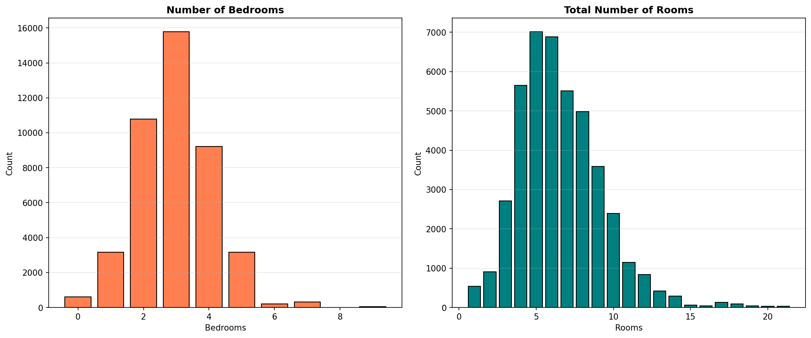

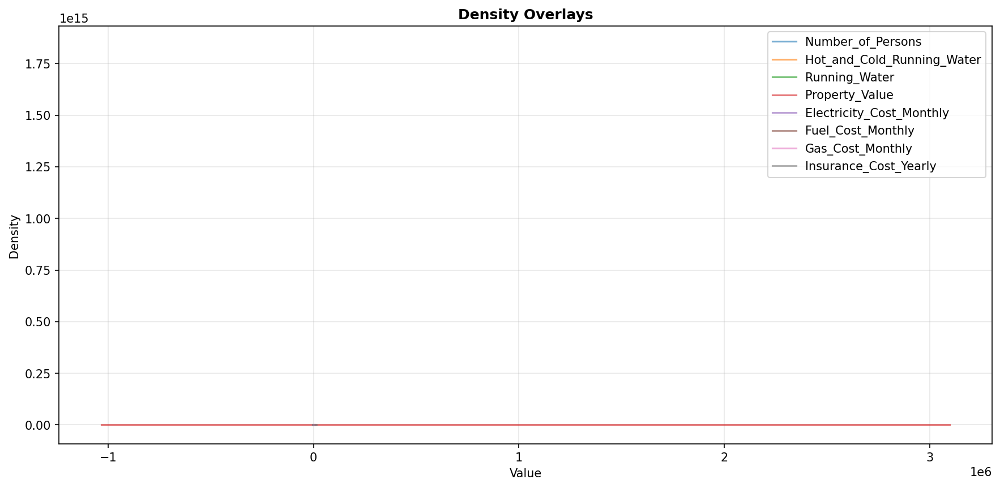

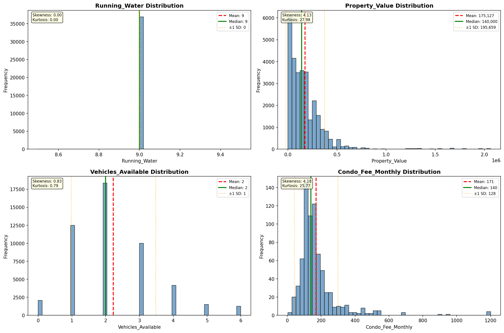

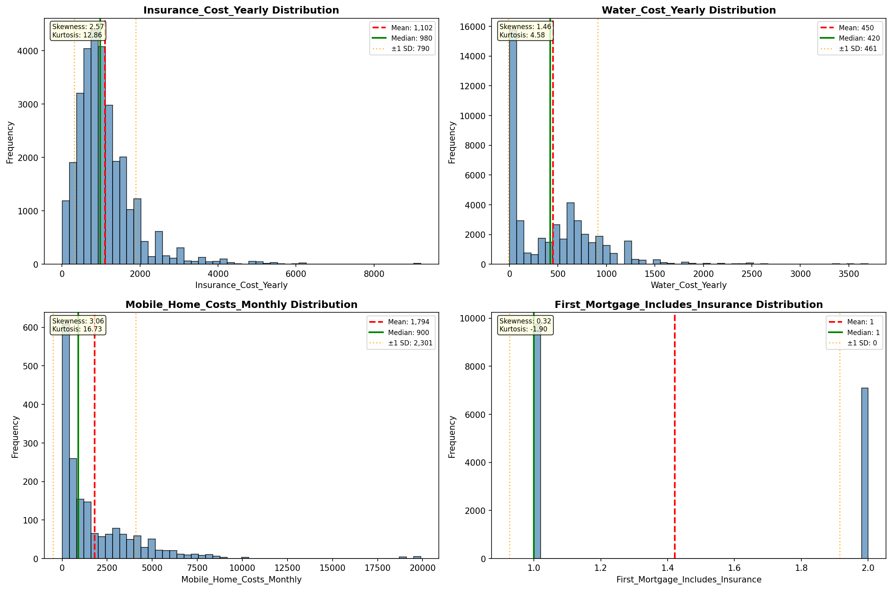

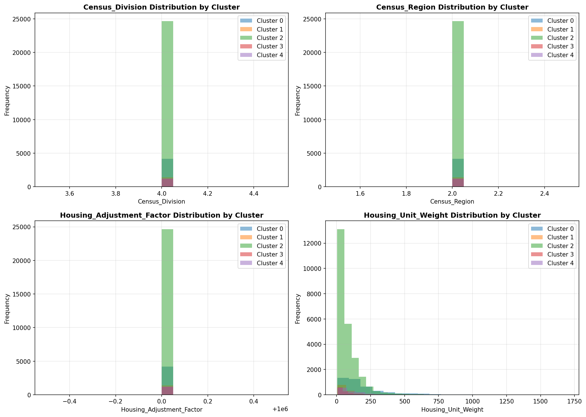

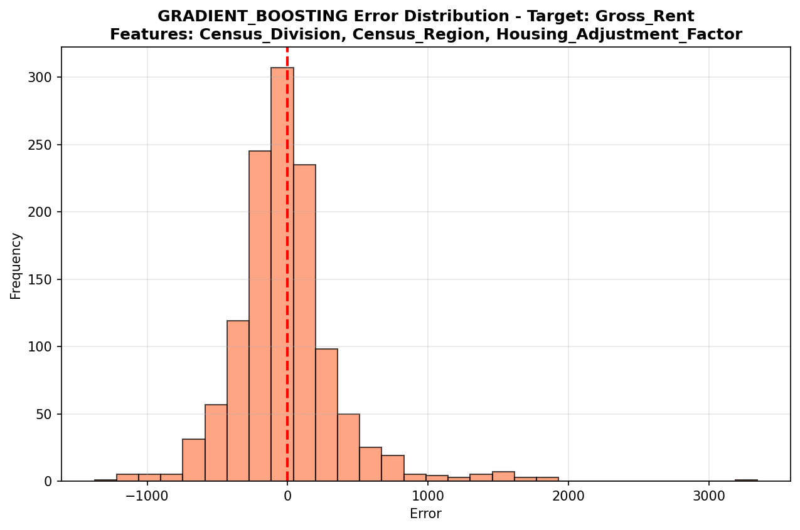

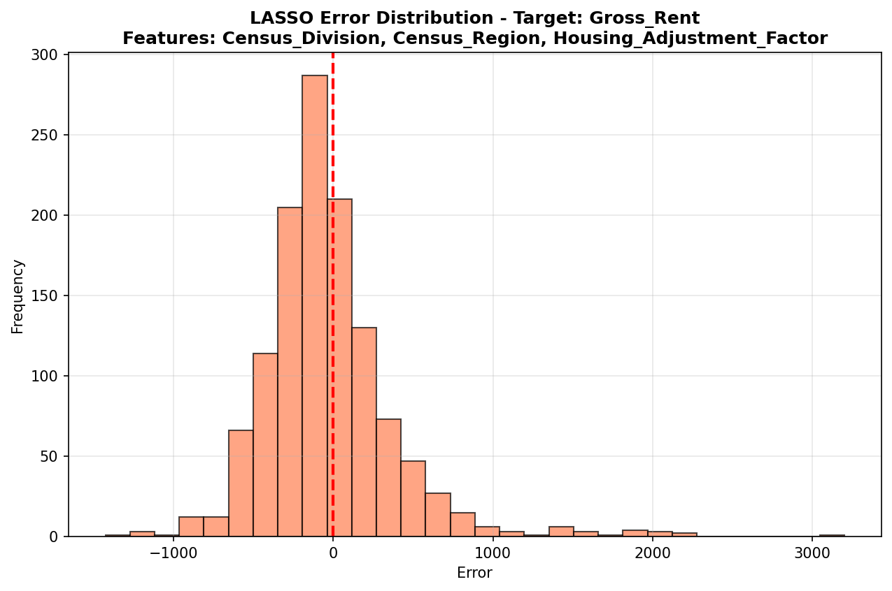

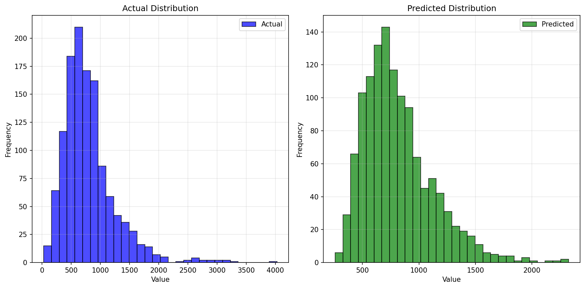

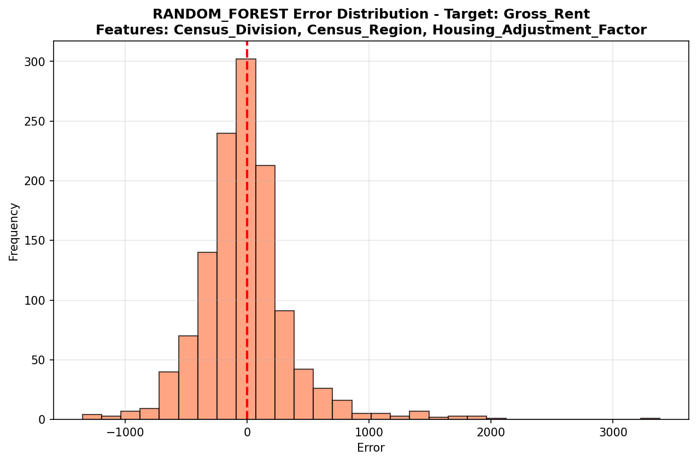

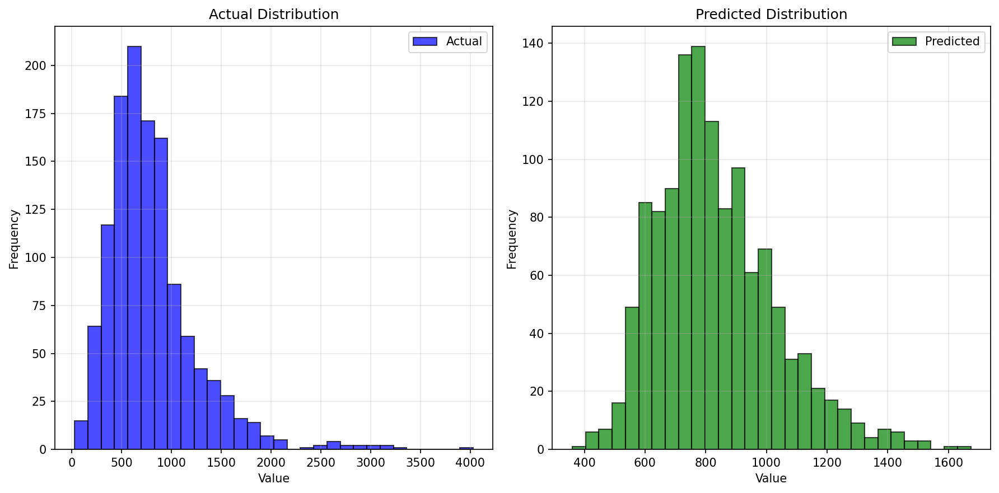

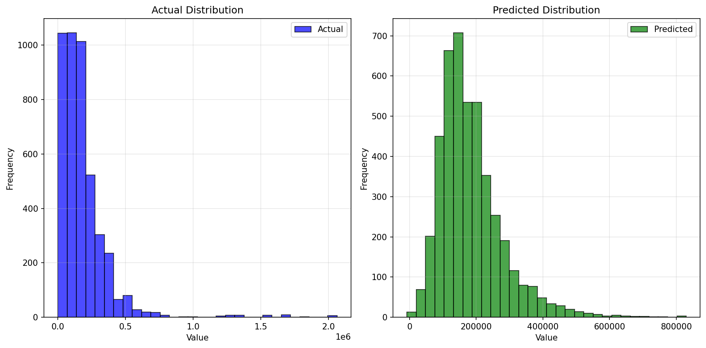

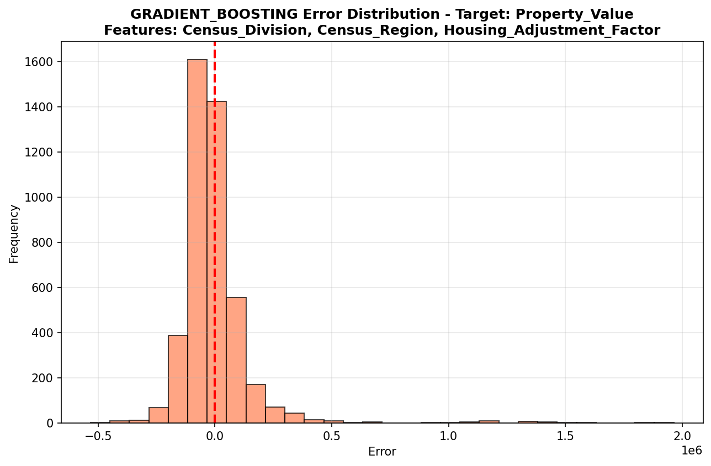

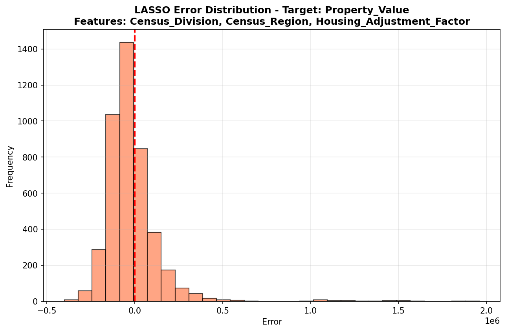

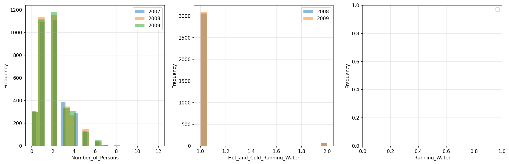

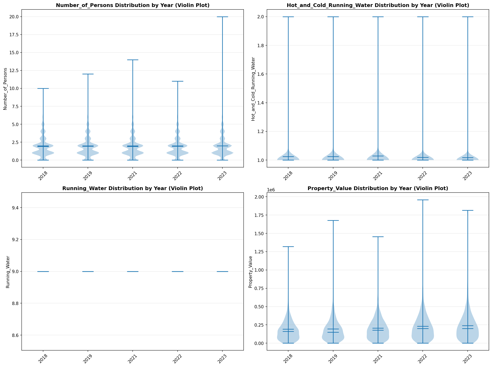

