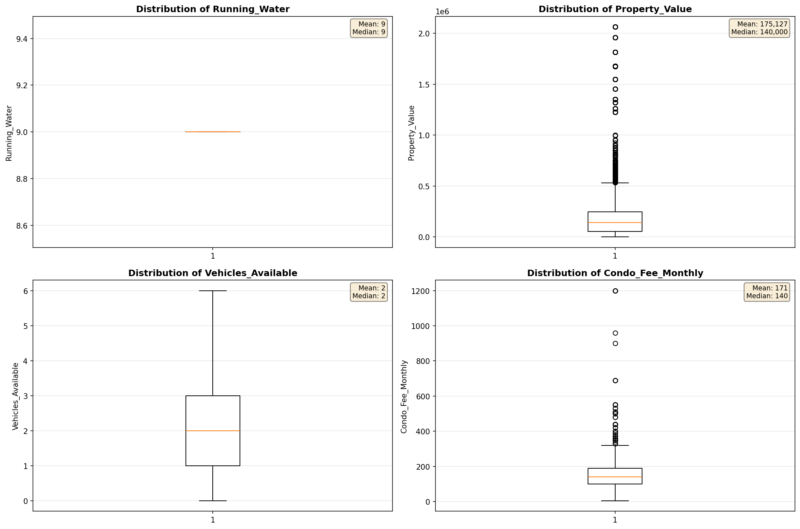

# Outlier Detection

> Statistical outlier detection using IQR (Interquartile Range) method. Outliers are values falling outside Q1 - 1.5×IQR or Q3 + 1.5×IQR bounds.

## Detection Methodology

| Parameter | Value | Description |
| :--- | :--- | :--- |
| Method | IQR | Outlier detection algorithm |
| Lower Bound | Q1 - 1.5 × IQR | Values below are outliers |
| Upper Bound | Q3 + 1.5 × IQR | Values above are outliers |
| IQR Definition | Q3 - Q1 | Interquartile Range |

> **Note**: The IQR method is robust to extreme values and works well for approximately symmetric distributions.

## Outlier Summary

_No outlier summary available._
## High Outlier Rate Variables

> Variables with outlier rate > 5% may indicate data quality issues, non-normal distributions, or genuinely extreme values.

- **('Flag_Selected_Monthly_Owner_Costs', 24.212000317049327)**: 0 outliers (0.00%)

- **('Property_Tax_Rate', 23.776965071288494)**: 0 outliers (0.00%)

- **('Specified_Rent_Unit', 21.959761283636496)**: 0 outliers (0.00%)

- **('Fuel_Cost_Monthly', 21.57274899939532)**: 0 outliers (0.00%)

- **('Flag_Family_Income', 18.569320853889067)**: 0 outliers (0.00%)

- **('Structure_Age', 10.416365625580578)**: 0 outliers (0.00%)

- **('Flag_Property_Taxes', 9.912379929827253)**: 0 outliers (0.00%)

- **('Gross_Rent_Percentage_Income', 9.783354573081072)**: 0 outliers (0.00%)

- **('Income_Adjustment_Factor', 9.504597908402452)**: 0 outliers (0.00%)

- **('Property_Taxes_Yearly', 8.989698174588831)**: 0 outliers (0.00%)

- **('Flag_Property_Value', 8.26573276632241)**: 0 outliers (0.00%)

- **('Structure_Age_Score', 7.862849121648123)**: 0 outliers (0.00%)

- **('Flag_Water_Cost', 7.508532423208192)**: 0 outliers (0.00%)

- **('Gas_Cost_Monthly', 6.664569368148489)**: 0 outliers (0.00%)

- **('Owner_Costs_Percentage_Income', 6.295155121121971)**: 0 outliers (0.00%)

> *Consider investigating these variables for data entry errors, applying transformations, or using robust statistical methods.*

## Visualizations

