# Deep Learning Models

> Neural network analysis using TensorFlow/Keras for complex pattern recognition and multi-output prediction tasks.

## Deep Learning Summary

- **Total Tasks**: 3

- **Tasks**: Income Prediction, Employment Analysis, Demographic Profile

### Aggregate Statistics

| Metric | Value |
| :--- | :--- |
| Total Parameters | 57,930 |
| Average Validation Loss | 572068715.7740 |
| Number of Tasks | 3 |

## Task: Income Prediction

### Model Configuration

| Property | Value |
| :--- | :--- |
| Model Type | PopulationIncomeModel |
| Task Type | Multi_Output |
| Target Variables | Total_Person_Income, Wage_Income, Total_Person_Earnings |
| Number of Targets | 3 |
| Input Features | 10 |

### Network Architecture

| Component | Value | Notes |
| :--- | :--- | :--- |
| Total Layers | 7 | Including input and output |
| Total Parameters | 37,123 | Trainable weights |
| Parameters per Layer | 5,303 | Average |

### Performance Metrics

| Metric | Value | Assessment |
| :--- | :--- | :--- |
| Training Loss | 1711296512.0000 | Final epoch |
| Validation Loss | 1716205440.0000 | Final epoch |
| Loss Gap | 4908928.0000 | HIGH overfitting risk |

> *Model may be overfitting significantly*

#### Test Set Metrics

| Metric | Value | Description |
| :--- | :--- | :--- |
| MAE | 20110.0156 | Mean Absolute Error (lower is better) |
| MSE | 1652994688.0000 | Mean Squared Error (lower is better) |
| RMSE | 40657.0374 | Root Mean Squared Error (lower is better) |
| R2 | 0.2058 | R-squared (higher is better) |

### Training Analysis

| Training Statistic | Value |
| :--- | :--- |
| Epochs Trained | 75 |
| Initial Training Loss | 2151894016.0000 |
| Final Training Loss | 1711296512.0000 |
| Loss Improvement | 20.5% |
| Initial Validation Loss | 1916818048.0000 |
| Final Validation Loss | 1716205440.0000 |
| Validation Improvement | 10.5% |

#### Convergence Assessment

- **Status**: Fully converged (< 1% change in last 10 epochs)

- **Last 10 epochs change**: 0.37%

## Task: Employment Analysis

### Model Configuration

| Property | Value |
| :--- | :--- |
| Model Type | PopulationEmploymentModel |
| Task Type | Multi_Output |
| Target Variables | Hours_Worked_Per_Week, Employment_Status_Recode, Weeks_Worked_Past_Year |
| Number of Targets | 3 |
| Input Features | 10 |

### Network Architecture

| Component | Value | Notes |
| :--- | :--- | :--- |
| Total Layers | 6 | Including input and output |
| Total Parameters | 10,371 | Trainable weights |
| Parameters per Layer | 1,728 | Average |

### Performance Metrics

| Metric | Value | Assessment |
| :--- | :--- | :--- |
| Training Loss | 70.2508 | Final epoch |
| Validation Loss | 70.3173 | Final epoch |
| Loss Gap | 0.0665 | LOW overfitting risk |

> *Minimal overfitting*

#### Test Set Metrics

| Metric | Value | Description |
| :--- | :--- | :--- |
| MAE | 3.6118 | Mean Absolute Error (lower is better) |
| MSE | 69.9415 | Mean Squared Error (lower is better) |
| RMSE | 8.3631 | Root Mean Squared Error (lower is better) |
| R2 | 0.2961 | R-squared (higher is better) |

### Training Analysis

| Training Statistic | Value |
| :--- | :--- |
| Epochs Trained | 75 |
| Initial Training Loss | 96.4008 |
| Final Training Loss | 70.2508 |
| Loss Improvement | 27.1% |
| Initial Validation Loss | 72.9684 |
| Final Validation Loss | 70.3173 |
| Validation Improvement | 3.6% |

#### Convergence Assessment

- **Status**: Fully converged (< 1% change in last 10 epochs)

- **Last 10 epochs change**: 0.09%

## Task: Demographic Profile

### Model Configuration

| Property | Value |
| :--- | :--- |
| Model Type | PopulationDemographicModel |
| Task Type | Multi_Output |
| Target Variables | Educational_Attainment, Age, Sex, Marital_Status |
| Number of Targets | 4 |
| Input Features | 10 |

### Network Architecture

| Component | Value | Notes |
| :--- | :--- | :--- |
| Total Layers | 7 | Including input and output |
| Total Parameters | 10,436 | Trainable weights |
| Parameters per Layer | 1,490 | Average |

### Performance Metrics

| Metric | Value | Assessment |
| :--- | :--- | :--- |
| Training Loss | 636.0742 | Final epoch |
| Validation Loss | 637.0048 | Final epoch |
| Loss Gap | 0.9305 | HIGH overfitting risk |

> *Model may be overfitting significantly*

#### Test Set Metrics

| Metric | Value | Description |
| :--- | :--- | :--- |
| MAE | 15.3674 | Mean Absolute Error (lower is better) |
| MSE | 635.1525 | Mean Squared Error (lower is better) |
| RMSE | 25.2022 | Root Mean Squared Error (lower is better) |
| R2 | -5.6962 | R-squared (higher is better) |

### Training Analysis

| Training Statistic | Value |
| :--- | :--- |
| Epochs Trained | 75 |
| Initial Training Loss | 636.0889 |
| Final Training Loss | 636.0742 |
| Loss Improvement | 0.0% |
| Initial Validation Loss | 636.7415 |
| Final Validation Loss | 637.0048 |
| Validation Improvement | -0.0% |

#### Convergence Assessment

- **Status**: Fully converged (< 1% change in last 10 epochs)

- **Last 10 epochs change**: 0.01%

## Cross-Task Comparison

| Task | Model Type | Parameters | Train Loss | Val Loss | Gap |
| :--- | :--- | :--- | :--- | :--- | :--- |
| Income Prediction | PopulationIncomeModel | 37,123 | 1711296512.0000 | 1716205440.0000 | 4908928.0000 |
| Employment Analysis | PopulationEmploymentModel | 10,371 | 70.2508 | 70.3173 | 0.0665 |
| Demographic Profile | PopulationDemographicModel | 10,436 | 636.0742 | 637.0048 | 0.9305 |

## Visualizations

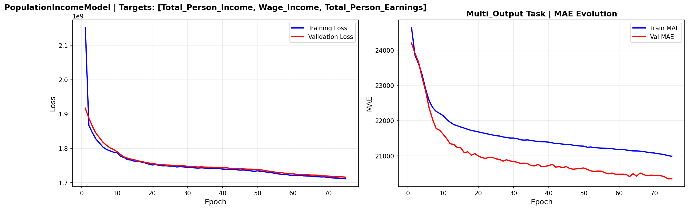

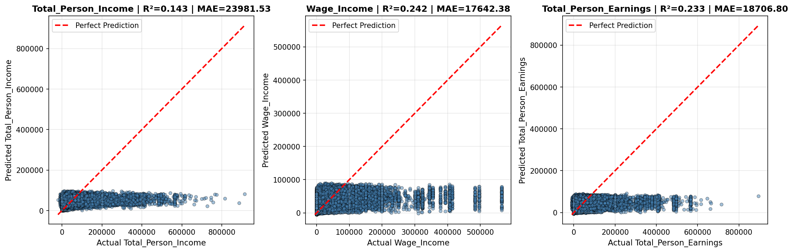

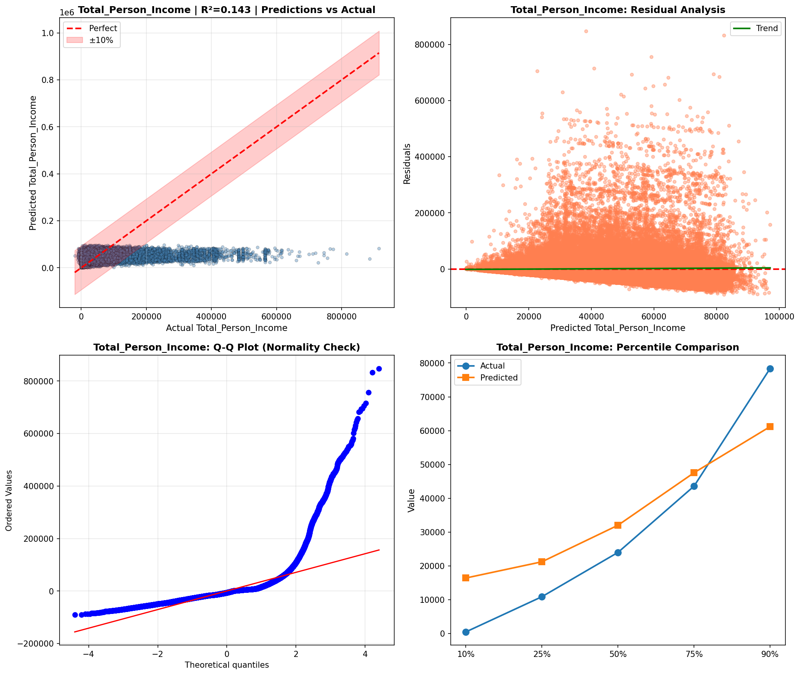

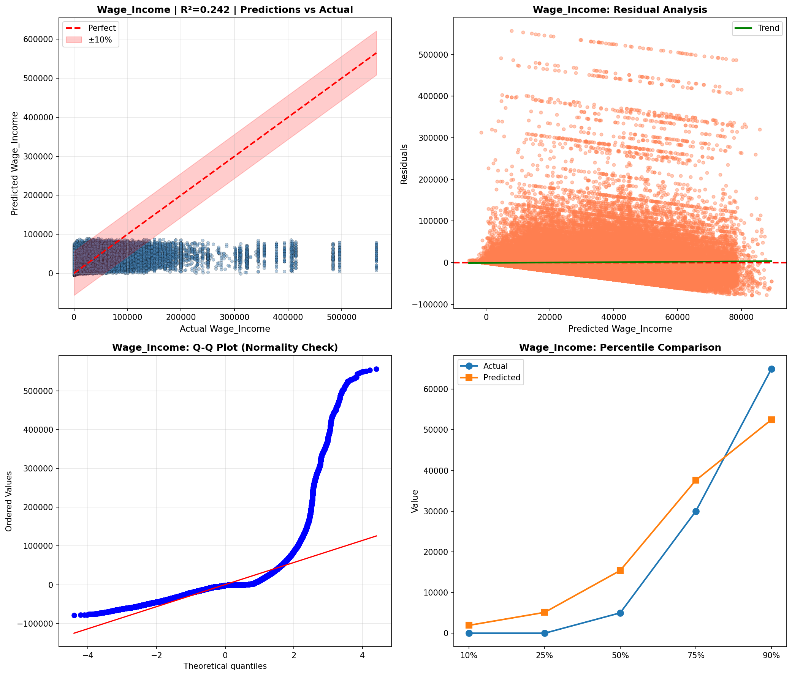

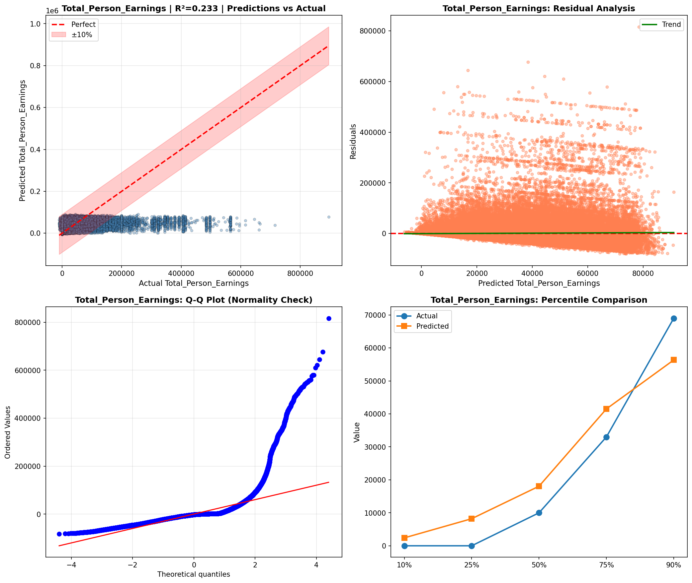

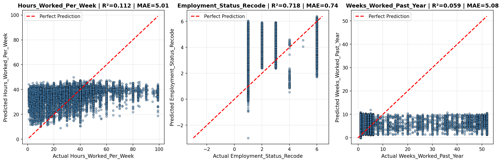

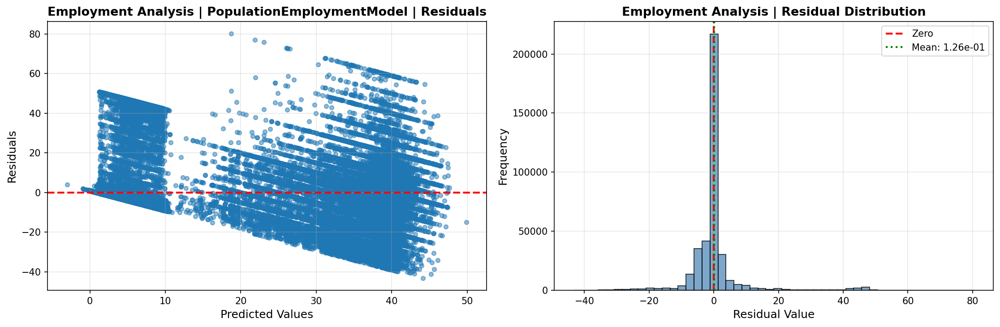

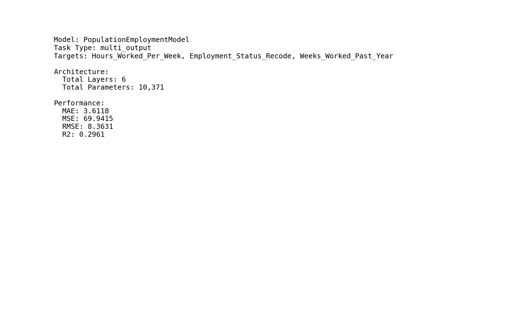

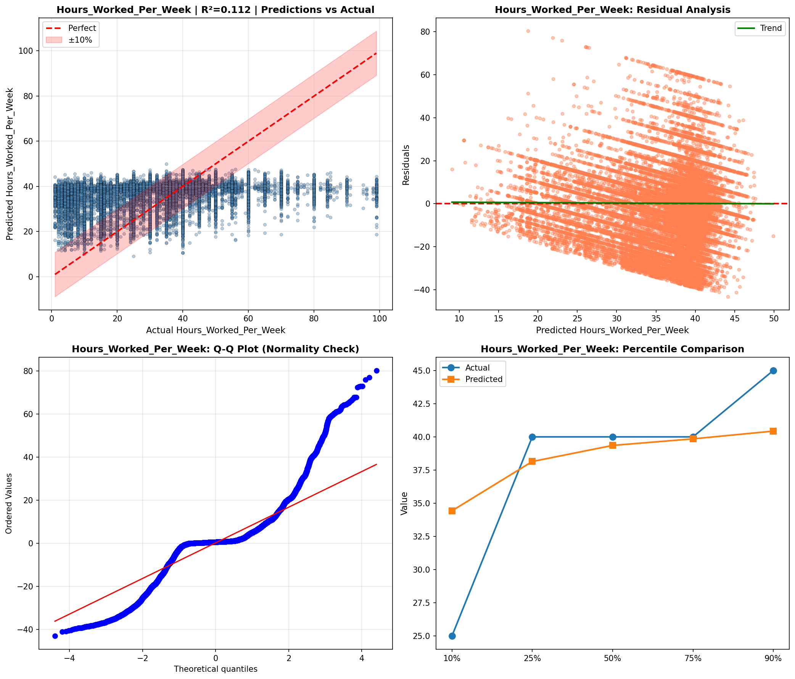

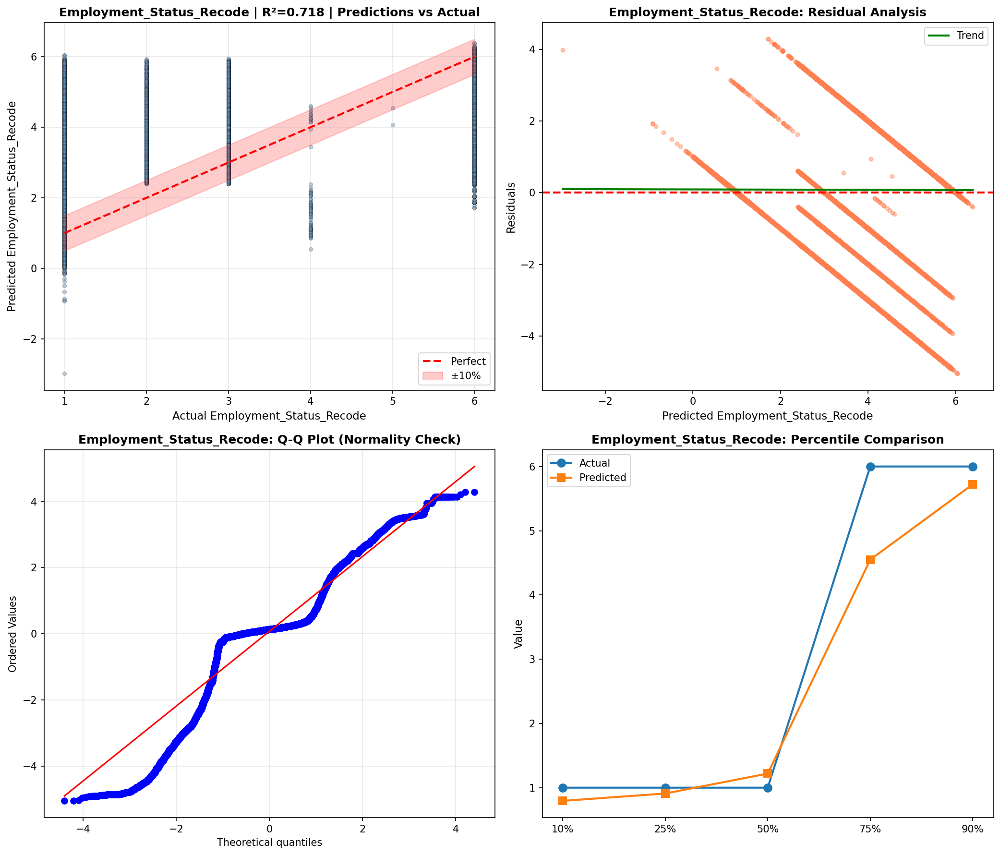

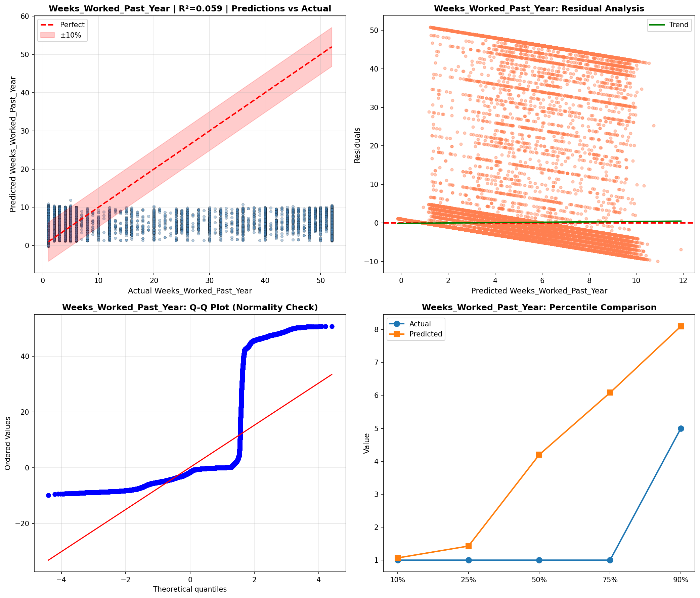

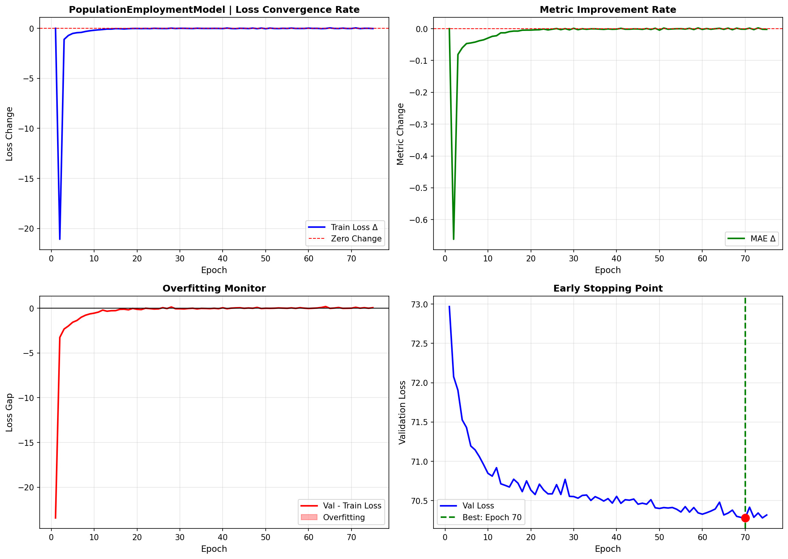

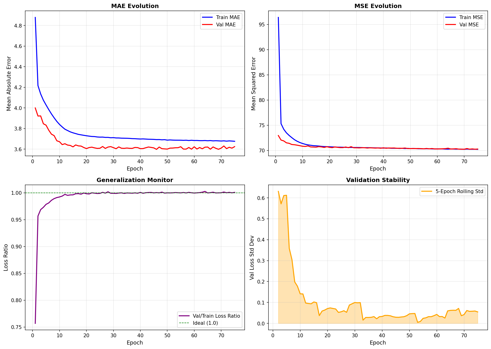

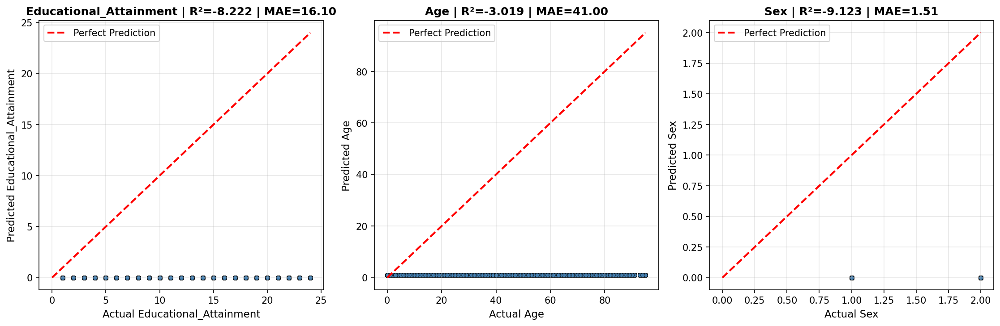

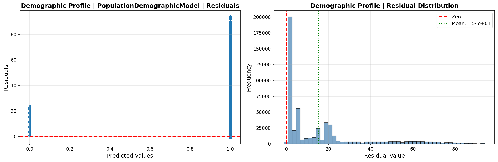

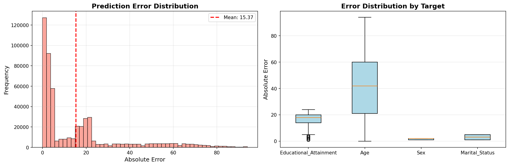

