# Temporal Analysis

> Analysis of data patterns and trends over time, including year-over-year changes and growth rate calculations.

## Year Distribution

### Summary

- **Total Years**: 16

- **Year Range**: 2007 - 2023

- **Total Records**: 1,011,500

- **Average Records/Year**: 63,219

### Records by Year

| Year | Records | % of Total | Deviation from Avg |
| :--- | :--- | :--- | :--- |
| 2007 | 59,441 | 5.9% | -6.0% |
| 2008 | 59,664 | 5.9% | -5.6% |
| 2009 | 59,888 | 5.9% | -5.3% |
| 2010 | 59,949 | 5.9% | -5.2% |
| 2011 | 64,211 | 6.3% | +1.6% |
| 2012 | 63,628 | 6.3% | +0.6% |
| 2013 | 63,188 | 6.2% | -0.0% |
| 2014 | 63,271 | 6.3% | +0.1% |
| 2015 | 63,762 | 6.3% | +0.9% |
| 2016 | 63,567 | 6.3% | +0.6% |
| 2017 | 64,357 | 6.4% | +1.8% |
| 2018 | 64,645 | 6.4% | +2.3% |
| 2019 | 64,608 | 6.4% | +2.2% |
| 2021 | 64,883 | 6.4% | +2.6% |
| 2022 | 66,132 | 6.5% | +4.6% |
| 2023 | 66,306 | 6.6% | +4.9% |

> *Sample size increased by 11.5% from 2007 to 2023.*

## Sample Size Consistency

- **Standard Deviation**: 2,184 records

- **Coefficient of Variation**: 3.5 %

- **Consistency Rating**: highly consistent

> *Sample sizes are stable across years.*

## Temporal Trends

### Trend Summary

| Direction | Count | Percentage |
| :--- | :--- | :--- |
| Increasing | 0 | 0.0% |
| Decreasing | 0 | 0.0% |
| Stable/Other | 250 | 100.0% |

## Growth Rates

### Growth Rate Summary

- **Average Growth Rate**: 1,154.93 %

- **Variables with Positive Growth**: 1

- **Variables with Negative Growth**: 0

### Top Growth Rates

| Variable | Growth Rate | Direction |
| :--- | :--- | :--- |
| sample_growth | 1154.93% | Increasing |

## Visualizations

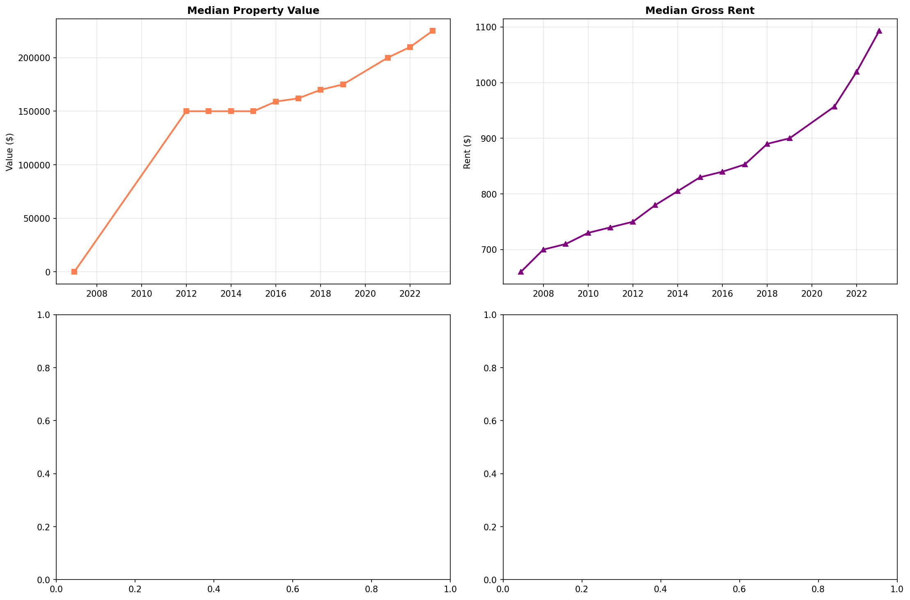

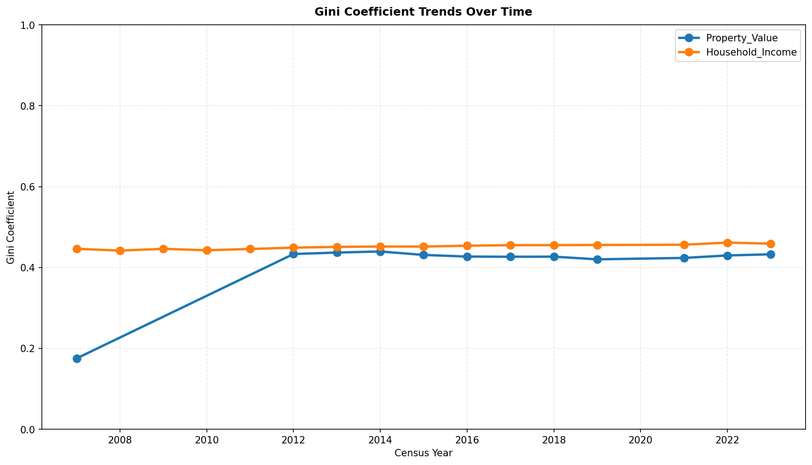

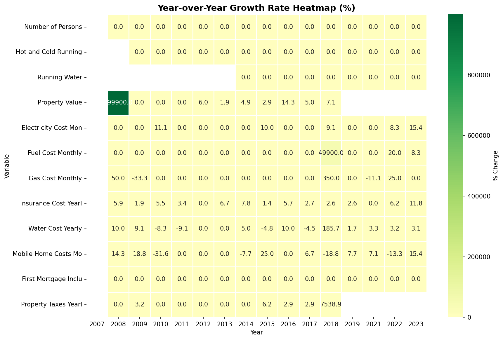

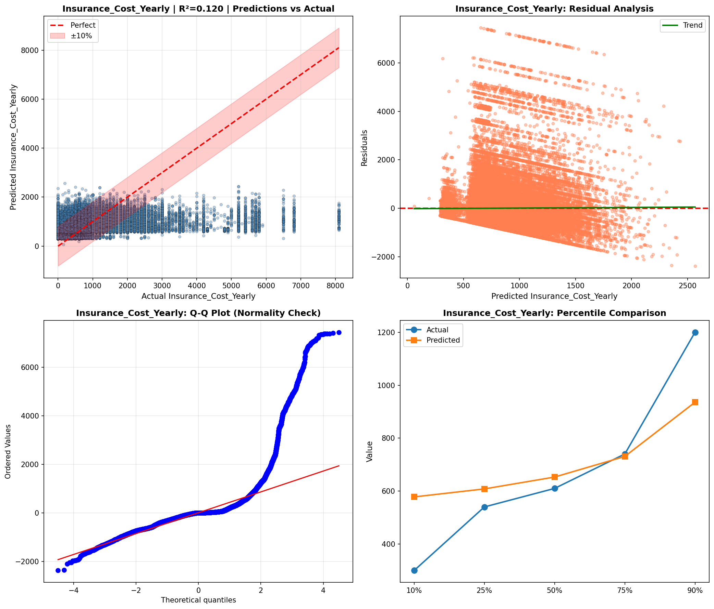

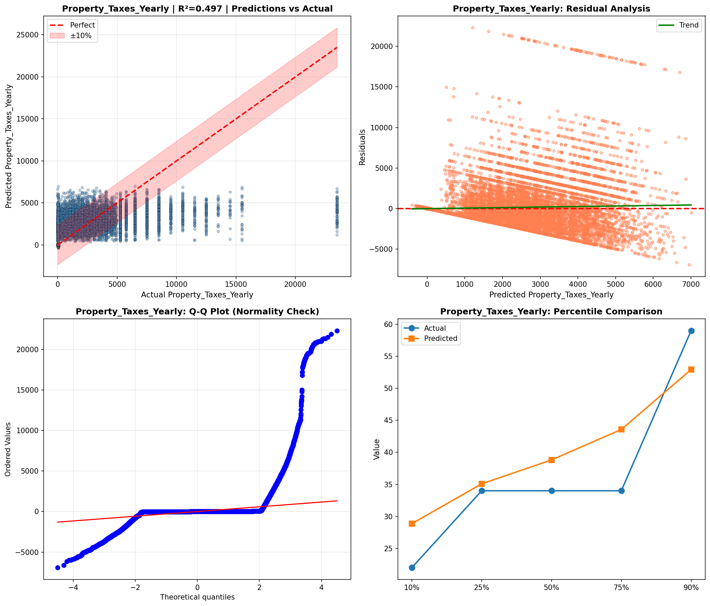

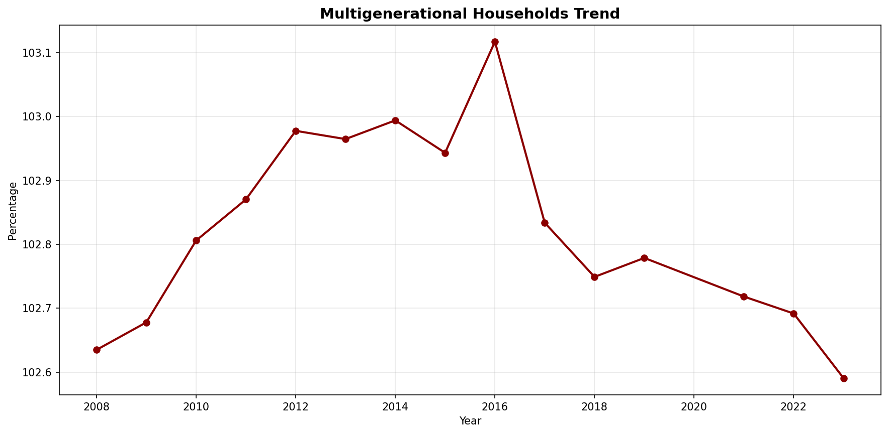

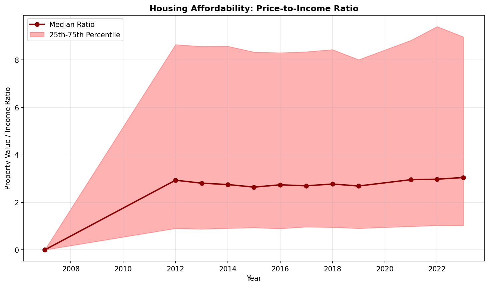

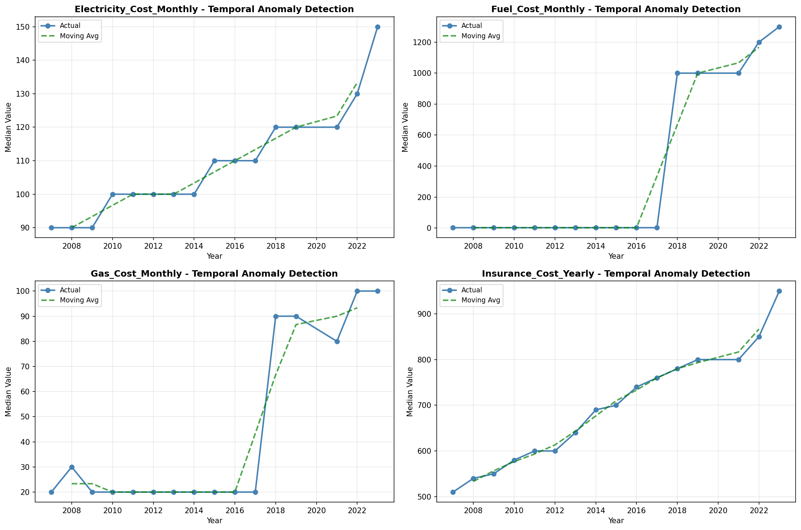

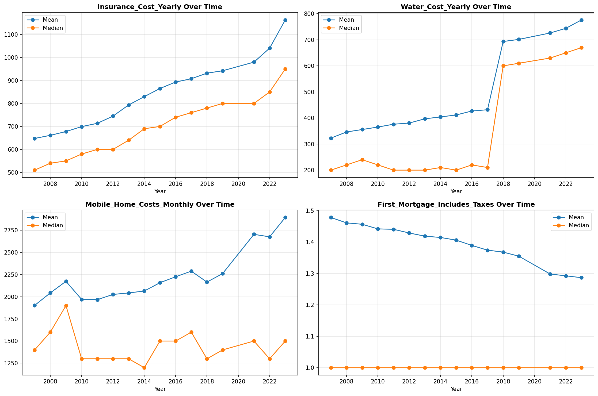

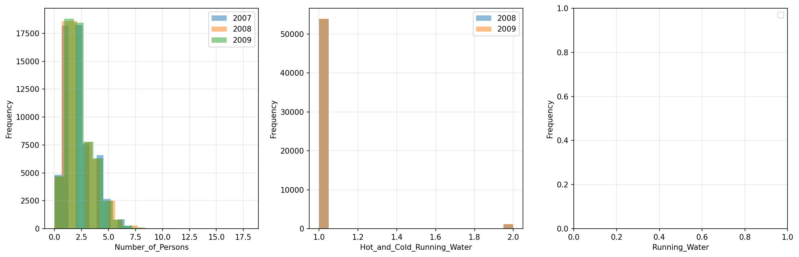

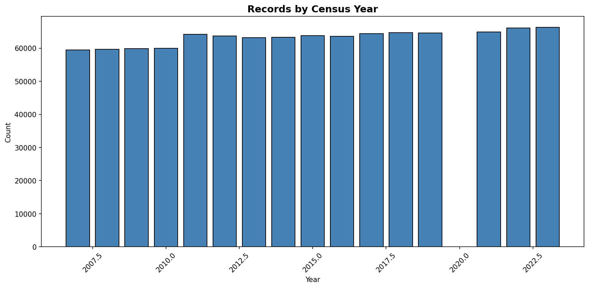

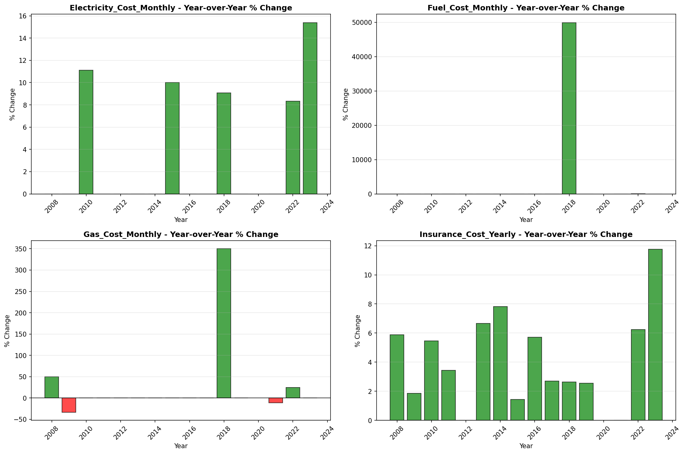

