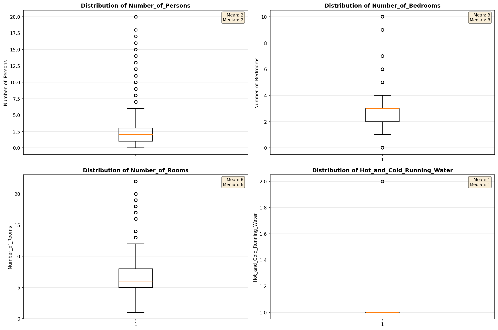
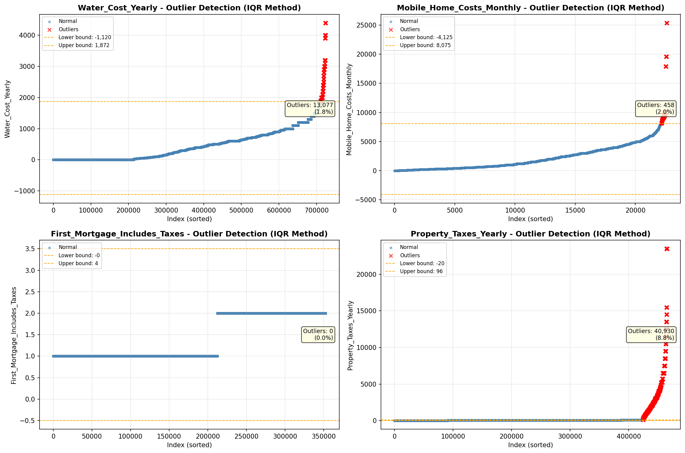

# Outlier Detection

> Statistical outlier detection using IQR (Interquartile Range) method. Outliers are values falling outside Q1 - 1.5×IQR or Q3 + 1.5×IQR bounds.

## Detection Methodology

| Parameter | Value | Description |
| :--- | :--- | :--- |
| Method | IQR | Outlier detection algorithm |
| Lower Bound | Q1 - 1.5 × IQR | Values below are outliers |
| Upper Bound | Q3 + 1.5 × IQR | Values above are outliers |
| IQR Definition | Q3 - Q1 | Interquartile Range |

> **Note**: The IQR method is robust to extreme values and works well for approximately symmetric distributions.

## Outlier Summary

_No outlier summary available._
## High Outlier Rate Variables

> Variables with outlier rate > 5% may indicate data quality issues, non-normal distributions, or genuinely extreme values.

- **('Flag_Selected_Monthly_Owner_Costs', 23.743524301300635)**: 0 outliers (0.00%)

- **('Specified_Rent_Unit', 22.176434439413335)**: 0 outliers (0.00%)

- **('Property_Tax_Rate', 19.939034803651467)**: 0 outliers (0.00%)

- **('Flag_Family_Income', 19.616646545824118)**: 0 outliers (0.00%)

- **('Gross_Rent_Percentage_Income', 9.633529835630274)**: 0 outliers (0.00%)

- **('Flag_Property_Taxes', 9.434564263873172)**: 0 outliers (0.00%)

- **('Income_Adjustment_Factor', 9.336102221086557)**: 0 outliers (0.00%)

- **('Fuel_Cost_Monthly', 9.240811104467632)**: 0 outliers (0.00%)

- **('Property_Taxes_Yearly', 8.800731064882008)**: 0 outliers (0.00%)

- **('Structure_Age', 8.304938260605034)**: 0 outliers (0.00%)

- **('Working_Age_Persons', 8.272640441188072)**: 0 outliers (0.00%)

- **('Flag_Water_Cost', 8.164383561643836)**: 0 outliers (0.00%)

- **('Flag_Property_Value', 7.801979363329199)**: 0 outliers (0.00%)

- **('Owner_Costs_Percentage_Income', 7.465485653284093)**: 0 outliers (0.00%)

- **('Structure_Age_Score', 7.433420608140359)**: 0 outliers (0.00%)

> *Consider investigating these variables for data entry errors, applying transformations, or using robust statistical methods.*

## Visualizations

