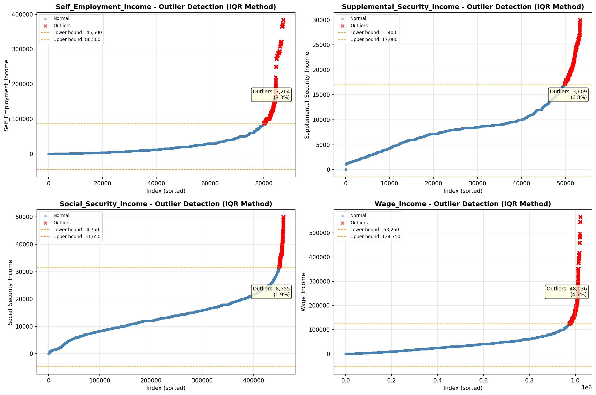

# Outlier Detection

> Statistical outlier detection using IQR (Interquartile Range) method. Outliers are values falling outside Q1 - 1.5×IQR or Q3 + 1.5×IQR bounds.

## Detection Methodology

| Parameter | Value | Description |
| :--- | :--- | :--- |
| Method | IQR | Outlier detection algorithm |
| Lower Bound | Q1 - 1.5 × IQR | Values below are outliers |
| Upper Bound | Q3 + 1.5 × IQR | Values above are outliers |
| IQR Definition | Q3 - Q1 | Interquartile Range |

> **Note**: The IQR method is robust to extreme values and works well for approximately symmetric distributions.

## Outlier Summary

_No outlier summary available._
## High Outlier Rate Variables

> Variables with outlier rate > 5% may indicate data quality issues, non-normal distributions, or genuinely extreme values.

- **('Presence_And_Age_Own_Children', 22.855566294955207)**: 0 outliers (0.00%)

- **('Hours_Worked_Per_Week', 17.476399400184246)**: 0 outliers (0.00%)

- **('Total_Annual_Hours', 15.390471016684337)**: 0 outliers (0.00%)

- **('Flag_Wage_Income', 13.585727986377547)**: 0 outliers (0.00%)

- **('Interest_Dividend_Rental_Income', 12.733806354619293)**: 0 outliers (0.00%)

- **('Flag_Interest_Dividend_Income', 12.476078634988099)**: 0 outliers (0.00%)

- **('Flag_Social_Security_Income', 11.99304849638178)**: 0 outliers (0.00%)

- **('Flag_Retirement_Income', 11.170626000630273)**: 0 outliers (0.00%)

- **('Flag_Other_Income', 10.587989465588548)**: 0 outliers (0.00%)

- **('Flag_Supplemental_Security_Income', 10.187566881189783)**: 0 outliers (0.00%)

- **('Income_Adjustment_Factor', 8.570494180879729)**: 0 outliers (0.00%)

- **('Self_Employment_Income', 8.324738132893259)**: 0 outliers (0.00%)

- **('Flag_Self_Employment_Income', 8.301426003163051)**: 0 outliers (0.00%)

- **('Public_Assistance_Income', 8.051480575930453)**: 0 outliers (0.00%)

- **('Other_Income', 7.894900635753345)**: 0 outliers (0.00%)

> *Consider investigating these variables for data entry errors, applying transformations, or using robust statistical methods.*

## Visualizations

