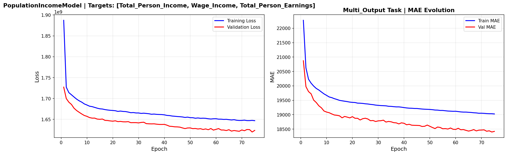
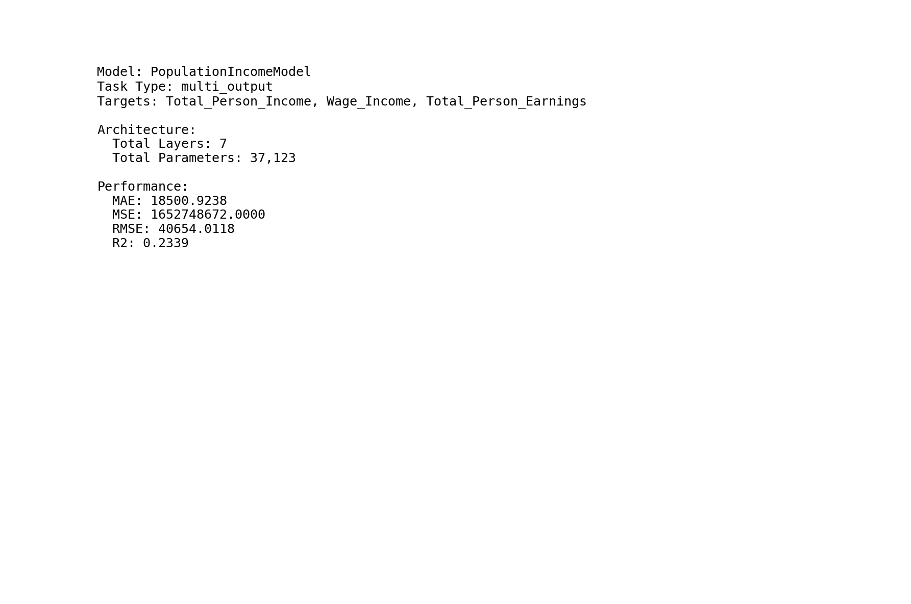
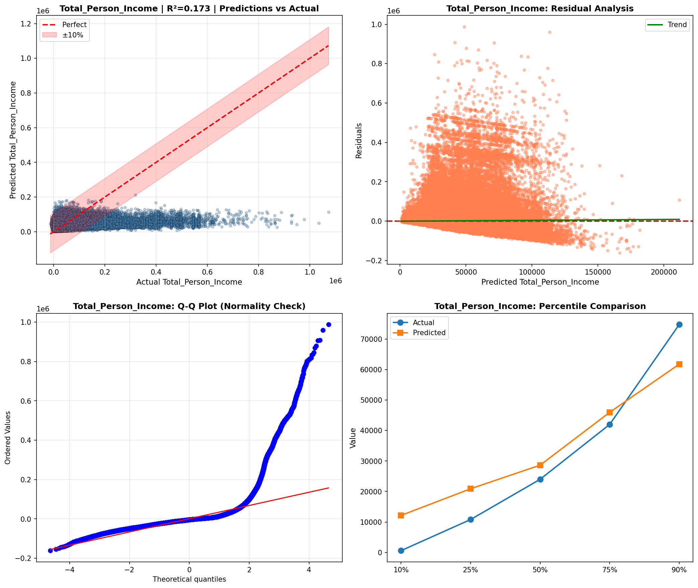
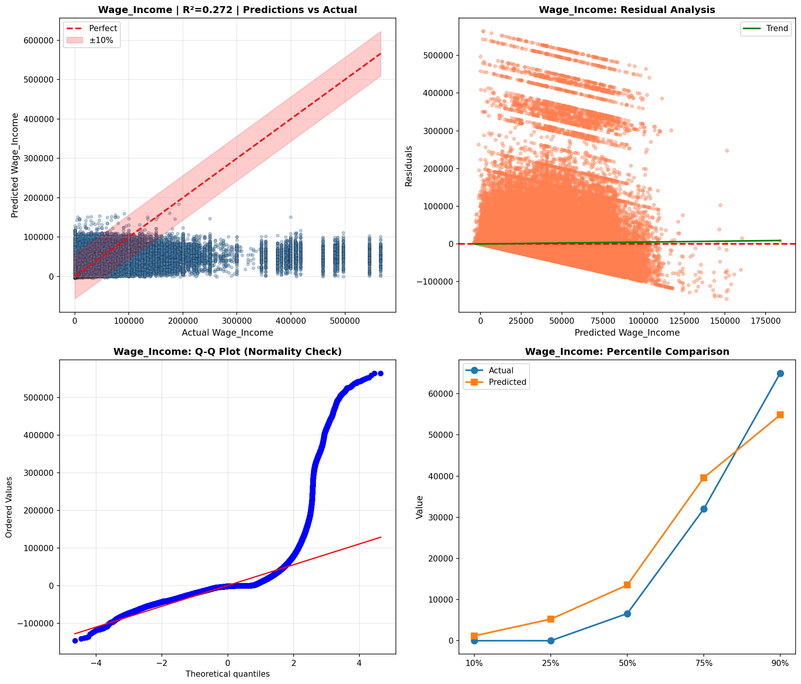
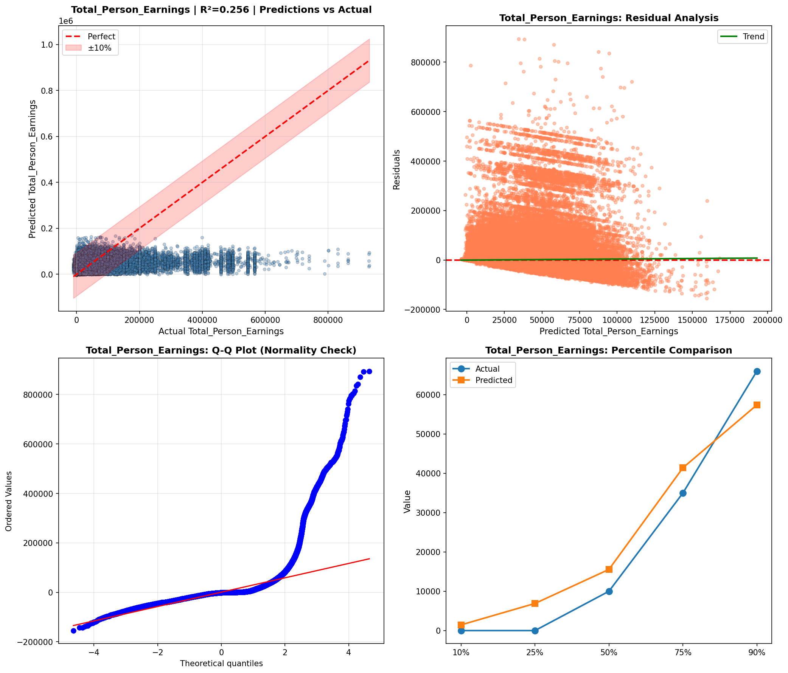
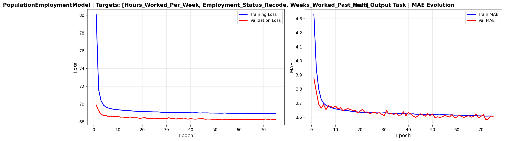
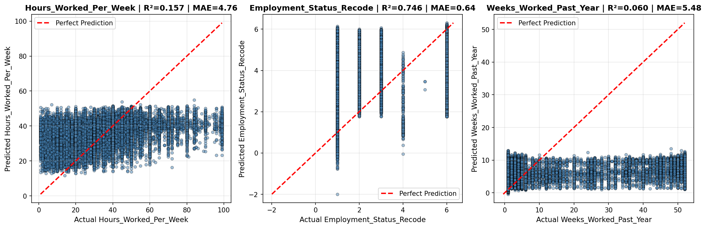
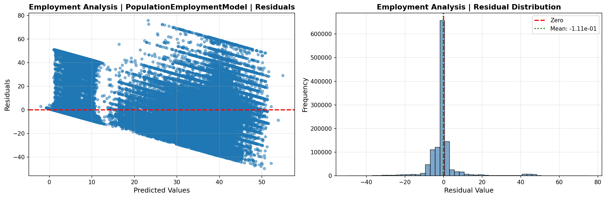
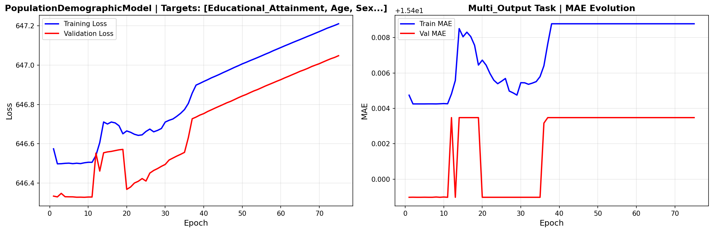

# Deep Learning Models

> Neural network analysis using TensorFlow/Keras for complex pattern recognition and multi-output prediction tasks.

## Deep Learning Summary

- **Total Tasks**: 3

- **Tasks**: Income Prediction, Employment Analysis, Demographic Profile

### Aggregate Statistics

| Metric | Value |
| :--- | :--- |
| Total Parameters | 57,930 |
| Average Validation Loss | 541206937.0948 |
| Number of Tasks | 3 |

## Task: Income Prediction

### Model Configuration

| Property | Value |
| :--- | :--- |
| Model Type | PopulationIncomeModel |
| Task Type | Multi_Output |
| Target Variables | Total_Person_Income, Wage_Income, Total_Person_Earnings |
| Number of Targets | 3 |
| Input Features | 10 |

### Network Architecture

| Component | Value | Notes |
| :--- | :--- | :--- |
| Total Layers | 7 | Including input and output |
| Total Parameters | 37,123 | Trainable weights |
| Parameters per Layer | 5,303 | Average |

### Performance Metrics

| Metric | Value | Assessment |
| :--- | :--- | :--- |
| Training Loss | 1646945536.0000 | Final epoch |
| Validation Loss | 1623620096.0000 | Final epoch |
| Loss Gap | -23325440.0000 | NONE overfitting risk |

> *Good generalization*

#### Test Set Metrics

| Metric | Value | Description |
| :--- | :--- | :--- |
| MAE | 18500.9238 | Mean Absolute Error (lower is better) |
| MSE | 1652748672.0000 | Mean Squared Error (lower is better) |
| RMSE | 40654.0118 | Root Mean Squared Error (lower is better) |
| R2 | 0.2339 | R-squared (higher is better) |

### Training Analysis

| Training Statistic | Value |
| :--- | :--- |
| Epochs Trained | 75 |
| Initial Training Loss | 1887215488.0000 |
| Final Training Loss | 1646945536.0000 |
| Loss Improvement | 12.7% |
| Initial Validation Loss | 1727264512.0000 |
| Final Validation Loss | 1623620096.0000 |
| Validation Improvement | 6.0% |

#### Convergence Assessment

- **Status**: Fully converged (< 1% change in last 10 epochs)

- **Last 10 epochs change**: 0.10%

## Task: Employment Analysis

### Model Configuration

| Property | Value |
| :--- | :--- |
| Model Type | PopulationEmploymentModel |
| Task Type | Multi_Output |
| Target Variables | Hours_Worked_Per_Week, Employment_Status_Recode, Weeks_Worked_Past_Year |
| Number of Targets | 3 |
| Input Features | 10 |

### Network Architecture

| Component | Value | Notes |
| :--- | :--- | :--- |
| Total Layers | 6 | Including input and output |
| Total Parameters | 10,371 | Trainable weights |
| Parameters per Layer | 1,728 | Average |

### Performance Metrics

| Metric | Value | Assessment |
| :--- | :--- | :--- |
| Training Loss | 68.9221 | Final epoch |
| Validation Loss | 68.2363 | Final epoch |
| Loss Gap | -0.6859 | NONE overfitting risk |

> *Good generalization*

#### Test Set Metrics

| Metric | Value | Description |
| :--- | :--- | :--- |
| MAE | 3.6289 | Mean Absolute Error (lower is better) |
| MSE | 68.9481 | Mean Squared Error (lower is better) |
| RMSE | 8.3035 | Root Mean Squared Error (lower is better) |
| R2 | 0.3217 | R-squared (higher is better) |

### Training Analysis

| Training Statistic | Value |
| :--- | :--- |
| Epochs Trained | 75 |
| Initial Training Loss | 80.0841 |
| Final Training Loss | 68.9221 |
| Loss Improvement | 13.9% |
| Initial Validation Loss | 69.8907 |
| Final Validation Loss | 68.2363 |
| Validation Improvement | 2.4% |

#### Convergence Assessment

- **Status**: Fully converged (< 1% change in last 10 epochs)

- **Last 10 epochs change**: 0.03%

## Task: Demographic Profile

### Model Configuration

| Property | Value |
| :--- | :--- |
| Model Type | PopulationDemographicModel |
| Task Type | Multi_Output |
| Target Variables | Educational_Attainment, Age, Sex, Marital_Status |
| Number of Targets | 4 |
| Input Features | 10 |

### Network Architecture

| Component | Value | Notes |
| :--- | :--- | :--- |
| Total Layers | 7 | Including input and output |
| Total Parameters | 10,436 | Trainable weights |
| Parameters per Layer | 1,490 | Average |

### Performance Metrics

| Metric | Value | Assessment |
| :--- | :--- | :--- |
| Training Loss | 647.2106 | Final epoch |
| Validation Loss | 647.0482 | Final epoch |
| Loss Gap | -0.1625 | NONE overfitting risk |

> *Good generalization*

#### Test Set Metrics

| Metric | Value | Description |
| :--- | :--- | :--- |
| MAE | 15.4073 | Mean Absolute Error (lower is better) |
| MSE | 647.0275 | Mean Squared Error (lower is better) |
| RMSE | 25.4367 | Root Mean Squared Error (lower is better) |
| R2 | -5.7171 | R-squared (higher is better) |

### Training Analysis

| Training Statistic | Value |
| :--- | :--- |
| Epochs Trained | 75 |
| Initial Training Loss | 646.5742 |
| Final Training Loss | 647.2106 |
| Loss Improvement | -0.1% |
| Initial Validation Loss | 646.3334 |
| Final Validation Loss | 647.0482 |
| Validation Improvement | -0.1% |

#### Convergence Assessment

- **Status**: Fully converged (< 1% change in last 10 epochs)

- **Last 10 epochs change**: 0.01%

## Cross-Task Comparison

| Task | Model Type | Parameters | Train Loss | Val Loss | Gap |
| :--- | :--- | :--- | :--- | :--- | :--- |
| Income Prediction | PopulationIncomeModel | 37,123 | 1646945536.0000 | 1623620096.0000 | -23325440.0000 |
| Employment Analysis | PopulationEmploymentModel | 10,371 | 68.9221 | 68.2363 | -0.6859 |
| Demographic Profile | PopulationDemographicModel | 10,436 | 647.2106 | 647.0482 | -0.1625 |

## Visualizations

