# Statistical Analysis

> Comprehensive descriptive statistics including central tendency, dispersion, distribution characteristics, and weighted statistics using ACS sample weights.

## Summary Statistics

- **Variables Analyzed**: 41

### Income_Adjustment_Factor

| Statistic | Unweighted | Weighted (ACS) |
| :--- | :--- | :--- |
| Mean | 1,014,674.42 | 1,014,656.45 |
| Median | 1,010,207.00 | 1,014,656.45 |
| Std Deviation | 11,261.10 | — |
| Minimum | 1,001,264.00 | — |
| Maximum | 1,042,311.00 | — |
| Count | 59,297 | — |

> *Distribution is highly right-skewed (skewness: 1.34), light-tailed/platykurtic (kurtosis: 0.81).*

- **Coefficient of Variation**: 1.1 % (low variability)

### Property_Value

| Statistic | Unweighted | Weighted (ACS) |
| :--- | :--- | :--- |
| Mean | 328,482.05 | 314,709.07 |
| Median | 260,000.00 | 253,668.25 |
| Std Deviation | 367,982.81 | — |
| Minimum | 1.00 | — |
| Maximum | 4,314,000.00 | — |
| Count | 35,001 | — |

> *Distribution is highly right-skewed (skewness: 5.44), heavy-tailed/leptokurtic (kurtosis: 42.37).*

- **Coefficient of Variation**: 112.0 % (very high variability)

### Electricity_Cost_Monthly

| Statistic | Unweighted | Weighted (ACS) |
| :--- | :--- | :--- |
| Mean | 118.92 | 117.61 |
| Median | 100.00 | 96.25 |
| Std Deviation | 127.31 | — |
| Minimum | 1.00 | — |
| Maximum | 2,900.00 | — |
| Count | 66,452 | — |

> *Distribution is highly right-skewed (skewness: 10.31), heavy-tailed/leptokurtic (kurtosis: 194.06).*

- **Coefficient of Variation**: 107.1 % (very high variability)

### Fuel_Cost_Monthly

| Statistic | Unweighted | Weighted (ACS) |
| :--- | :--- | :--- |
| Mean | 739.29 | 895.85 |
| Median | 2.00 | 445.12 |
| Std Deviation | 1,141.03 | — |
| Minimum | 1.00 | — |
| Maximum | 6,400.00 | — |
| Count | 52,556 | — |

> *Distribution is highly right-skewed (skewness: 1.77), heavy-tailed/leptokurtic (kurtosis: 3.09).*

- **Coefficient of Variation**: 154.3 % (very high variability)

### Gas_Cost_Monthly

| Statistic | Unweighted | Weighted (ACS) |
| :--- | :--- | :--- |
| Mean | 80.78 | 86.75 |
| Median | 40.00 | 48.12 |
| Std Deviation | 109.68 | — |
| Minimum | 1.00 | — |
| Maximum | 1,500.00 | — |
| Count | 58,768 | — |

> *Distribution is highly right-skewed (skewness: 3.59), heavy-tailed/leptokurtic (kurtosis: 29.19).*

- **Coefficient of Variation**: 135.8 % (very high variability)

### Insurance_Cost_Yearly

| Statistic | Unweighted | Weighted (ACS) |
| :--- | :--- | :--- |
| Mean | 1,348.67 | 1,317.45 |
| Median | 1,100.00 | 1,091.88 |
| Std Deviation | 1,093.86 | — |
| Minimum | 4.00 | — |
| Maximum | 9,700.00 | — |
| Count | 41,674 | — |

> *Distribution is highly right-skewed (skewness: 2.85), heavy-tailed/leptokurtic (kurtosis: 12.07).*

- **Coefficient of Variation**: 81.1 % (high variability)

### Water_Cost_Yearly

| Statistic | Unweighted | Weighted (ACS) |
| :--- | :--- | :--- |
| Mean | 392.23 | 415.03 |
| Median | 230.00 | 206.25 |
| Std Deviation | 510.85 | — |
| Minimum | 1.00 | — |
| Maximum | 4,200.00 | — |
| Count | 59,676 | — |

> *Distribution is highly right-skewed (skewness: 2.40), heavy-tailed/leptokurtic (kurtosis: 9.09).*

- **Coefficient of Variation**: 130.2 % (very high variability)

### Mobile_Home_Costs_Monthly

| Statistic | Unweighted | Weighted (ACS) |
| :--- | :--- | :--- |
| Mean | 3,963.03 | 3,880.42 |
| Median | 4,400.00 | 4,456.25 |
| Std Deviation | 2,240.62 | — |
| Minimum | 40.00 | — |
| Maximum | 9,800.00 | — |
| Count | 509 | — |

> *Distribution is approximately symmetric (skewness: -0.17), light-tailed/platykurtic (kurtosis: -0.58).*

- **Coefficient of Variation**: 56.5 % (high variability)

### First_Mortgage_Payment_Monthly

| Statistic | Unweighted | Weighted (ACS) |
| :--- | :--- | :--- |
| Mean | 1,205.44 | 1,296.62 |
| Median | 1,200.00 | 1,138.00 |
| Std Deviation | 897.06 | — |
| Minimum | 4.00 | — |
| Maximum | 6,900.00 | — |
| Count | 35,495 | — |

> *Distribution is highly right-skewed (skewness: 1.12), heavy-tailed/leptokurtic (kurtosis: 3.19).*

- **Coefficient of Variation**: 74.4 % (high variability)

### First_Mortgage_Includes_Taxes

| Statistic | Unweighted | Weighted (ACS) |
| :--- | :--- | :--- |
| Mean | 1.34 | 1.31 |
| Median | 1.00 | 1.00 |
| Std Deviation | 0.47 | — |
| Minimum | 1.00 | — |
| Maximum | 2.00 | — |
| Count | 30,366 | — |

> *Distribution is moderately right-skewed (skewness: 0.69), light-tailed/platykurtic (kurtosis: -1.52).*

- **Coefficient of Variation**: 35.4 % (moderate variability)

### Second_Mortgage_Payment_Monthly

| Statistic | Unweighted | Weighted (ACS) |
| :--- | :--- | :--- |
| Mean | 395.85 | 394.77 |
| Median | 300.00 | 283.75 |
| Std Deviation | 414.03 | — |
| Minimum | 4.00 | — |
| Maximum | 5,600.00 | — |
| Count | 7,420 | — |

> *Distribution is highly right-skewed (skewness: 3.52), heavy-tailed/leptokurtic (kurtosis: 20.01).*

- **Coefficient of Variation**: 104.6 % (very high variability)

### Property_Taxes_Yearly

| Statistic | Unweighted | Weighted (ACS) |
| :--- | :--- | :--- |
| Mean | 511.72 | 487.23 |
| Median | 51.00 | 423.75 |
| Std Deviation | 1,948.82 | — |
| Minimum | 1.00 | — |
| Maximum | 32,500.00 | — |
| Count | 33,969 | — |

> *Distribution is highly right-skewed (skewness: 7.40), heavy-tailed/leptokurtic (kurtosis: 85.42).*

- **Coefficient of Variation**: 380.8 % (very high variability)

### Meals_Included_in_Rent

| Statistic | Unweighted | Weighted (ACS) |
| :--- | :--- | :--- |
| Mean | 1.98 | 1.98 |
| Median | 2.00 | 2.00 |
| Std Deviation | 0.14 | — |
| Minimum | 1.00 | — |
| Maximum | 2.00 | — |
| Count | 22,519 | — |

> *Distribution is highly left-skewed (skewness: -6.98), heavy-tailed/leptokurtic (kurtosis: 46.67).*

- **Coefficient of Variation**: 7.0 % (low variability)

### Rent_Amount_Monthly

| Statistic | Unweighted | Weighted (ACS) |
| :--- | :--- | :--- |
| Mean | 877.74 | 879.66 |
| Median | 800.00 | 836.25 |
| Std Deviation | 520.05 | — |
| Minimum | 4.00 | — |
| Maximum | 4,000.00 | — |
| Count | 22,519 | — |

> *Distribution is highly right-skewed (skewness: 1.57), heavy-tailed/leptokurtic (kurtosis: 4.56).*

- **Coefficient of Variation**: 59.2 % (high variability)

### Gross_Rent

| Statistic | Unweighted | Weighted (ACS) |
| :--- | :--- | :--- |
| Mean | 1,006.28 | 1,006.38 |
| Median | 940.00 | 976.00 |
| Std Deviation | 570.26 | — |
| Minimum | 4.00 | — |
| Maximum | 5,100.00 | — |
| Count | 21,246 | — |

> *Distribution is highly right-skewed (skewness: 1.33), heavy-tailed/leptokurtic (kurtosis: 3.69).*

- **Coefficient of Variation**: 56.7 % (high variability)

### Gross_Rent_Percentage_Income

| Statistic | Unweighted | Weighted (ACS) |
| :--- | :--- | :--- |
| Mean | 38.62 | 38.87 |
| Median | 29.00 | 29.38 |
| Std Deviation | 27.24 | — |
| Minimum | 1.00 | — |
| Maximum | 101.00 | — |
| Count | 20,770 | — |

> *Distribution is highly right-skewed (skewness: 1.21), light-tailed/platykurtic (kurtosis: 0.36).*

- **Coefficient of Variation**: 70.5 % (high variability)

### Selected_Monthly_Owner_Costs

| Statistic | Unweighted | Weighted (ACS) |
| :--- | :--- | :--- |
| Mean | 1,618.93 | 1,638.98 |
| Median | 1,473.00 | 1,524.88 |
| Std Deviation | 1,020.41 | — |
| Minimum | 7.00 | — |
| Maximum | 11,047.00 | — |
| Count | 45,996 | — |

> *Distribution is highly right-skewed (skewness: 1.73), heavy-tailed/leptokurtic (kurtosis: 5.92).*

- **Coefficient of Variation**: 63.0 % (high variability)

### Owner_Costs_Percentage_Income

| Statistic | Unweighted | Weighted (ACS) |
| :--- | :--- | :--- |
| Mean | 27.14 | 27.87 |
| Median | 21.00 | 21.50 |
| Std Deviation | 21.92 | — |
| Minimum | 1.00 | — |
| Maximum | 101.00 | — |
| Count | 45,752 | — |

> *Distribution is highly right-skewed (skewness: 1.85), heavy-tailed/leptokurtic (kurtosis: 3.34).*

- **Coefficient of Variation**: 80.8 % (high variability)

### Family_Income

| Statistic | Unweighted | Weighted (ACS) |
| :--- | :--- | :--- |
| Mean | 106,434.09 | 99,968.87 |
| Median | 83,975.00 | 79,993.75 |
| Std Deviation | 97,272.88 | — |
| Minimum | 1.00 | — |
| Maximum | 1,585,000.00 | — |
| Count | 42,364 | — |

> *Distribution is highly right-skewed (skewness: 3.19), heavy-tailed/leptokurtic (kurtosis: 17.40).*

- **Coefficient of Variation**: 91.4 % (high variability)

### Household_Income

| Statistic | Unweighted | Weighted (ACS) |
| :--- | :--- | :--- |
| Mean | 87,820.53 | 82,821.71 |
| Median | 65,600.00 | 62,273.12 |
| Std Deviation | 89,563.51 | — |
| Minimum | 1.00 | — |
| Maximum | 1,585,000.00 | — |
| Count | 67,393 | — |

> *Distribution is highly right-skewed (skewness: 3.35), heavy-tailed/leptokurtic (kurtosis: 19.44).*

- **Coefficient of Variation**: 102.0 % (very high variability)

### Specified_Rent_Unit

| Statistic | Unweighted | Weighted (ACS) |
| :--- | :--- | :--- |
| Mean | 0.32 | 0.37 |
| Median | 0.00 | 0.00 |
| Std Deviation | 0.46 | — |
| Minimum | 0.00 | — |
| Maximum | 1.00 | — |
| Count | 73,886 | — |

> *Distribution is moderately right-skewed (skewness: 0.79), light-tailed/platykurtic (kurtosis: -1.37).*

- **Coefficient of Variation**: 147.1 % (very high variability)

### Specified_Value_Unit

| Statistic | Unweighted | Weighted (ACS) |
| :--- | :--- | :--- |
| Mean | 0.54 | 0.47 |
| Median | 1.00 | 0.00 |
| Std Deviation | 0.50 | — |
| Minimum | 0.00 | — |
| Maximum | 1.00 | — |
| Count | 73,886 | — |

> *Distribution is approximately symmetric (skewness: -0.15), light-tailed/platykurtic (kurtosis: -1.98).*

- **Coefficient of Variation**: 92.7 % (high variability)

### Flag_Family_Income

| Statistic | Unweighted | Weighted (ACS) |
| :--- | :--- | :--- |
| Mean | 0.20 | 0.21 |
| Median | 0.00 | 0.00 |
| Std Deviation | 0.40 | — |
| Minimum | 0.00 | — |
| Maximum | 1.00 | — |
| Count | 55,703 | — |

> *Distribution is highly right-skewed (skewness: 1.46), light-tailed/platykurtic (kurtosis: 0.14).*

- **Coefficient of Variation**: 197.0 % (very high variability)

### Flag_Gross_Rent

| Statistic | Unweighted | Weighted (ACS) |
| :--- | :--- | :--- |
| Mean | 0.08 | 0.12 |
| Median | 0.00 | 0.00 |
| Std Deviation | 0.27 | — |
| Minimum | 0.00 | — |
| Maximum | 1.00 | — |
| Count | 37,518 | — |

> *Distribution is highly right-skewed (skewness: 3.09), heavy-tailed/leptokurtic (kurtosis: 7.56).*

- **Coefficient of Variation**: 338.7 % (very high variability)

### Flag_Household_Income

| Statistic | Unweighted | Weighted (ACS) |
| :--- | :--- | :--- |
| Mean | 0.32 | 0.33 |
| Median | 0.00 | 0.00 |
| Std Deviation | 0.47 | — |
| Minimum | 0.00 | — |
| Maximum | 1.00 | — |
| Count | 55,703 | — |

> *Distribution is moderately right-skewed (skewness: 0.77), light-tailed/platykurtic (kurtosis: -1.40).*

- **Coefficient of Variation**: 145.8 % (very high variability)

### Flag_First_Mortgage_Payment

| Statistic | Unweighted | Weighted (ACS) |
| :--- | :--- | :--- |
| Mean | 0.04 | 0.04 |
| Median | 0.00 | 0.00 |
| Std Deviation | 0.20 | — |
| Minimum | 0.00 | — |
| Maximum | 1.00 | — |
| Count | 73,886 | — |

> *Distribution is highly right-skewed (skewness: 4.55), heavy-tailed/leptokurtic (kurtosis: 18.66).*

- **Coefficient of Variation**: 475.5 % (very high variability)

### Flag_First_Mortgage_Taxes

| Statistic | Unweighted | Weighted (ACS) |
| :--- | :--- | :--- |
| Mean | 0.04 | 0.03 |
| Median | 0.00 | 0.00 |
| Std Deviation | 0.19 | — |
| Minimum | 0.00 | — |
| Maximum | 1.00 | — |
| Count | 73,886 | — |

> *Distribution is highly right-skewed (skewness: 4.97), heavy-tailed/leptokurtic (kurtosis: 22.72).*

- **Coefficient of Variation**: 516.6 % (very high variability)

### Flag_Meals_Included_Rent

| Statistic | Unweighted | Weighted (ACS) |
| :--- | :--- | :--- |
| Mean | 0.01 | 0.01 |
| Median | 0.00 | 0.00 |
| Std Deviation | 0.09 | — |
| Minimum | 0.00 | — |
| Maximum | 1.00 | — |
| Count | 73,886 | — |

> *Distribution is highly right-skewed (skewness: 10.67), heavy-tailed/leptokurtic (kurtosis: 111.92).*

- **Coefficient of Variation**: 1,076.6 % (very high variability)

### Flag_Rent_Amount

| Statistic | Unweighted | Weighted (ACS) |
| :--- | :--- | :--- |
| Mean | 0.03 | 0.04 |
| Median | 0.00 | 0.00 |
| Std Deviation | 0.17 | — |
| Minimum | 0.00 | — |
| Maximum | 1.00 | — |
| Count | 73,886 | — |

> *Distribution is highly right-skewed (skewness: 5.54), heavy-tailed/leptokurtic (kurtosis: 28.69).*

- **Coefficient of Variation**: 571.5 % (very high variability)

### Flag_Selected_Monthly_Owner_Costs

| Statistic | Unweighted | Weighted (ACS) |
| :--- | :--- | :--- |
| Mean | 0.22 | 0.23 |
| Median | 0.00 | 0.00 |
| Std Deviation | 0.42 | — |
| Minimum | 0.00 | — |
| Maximum | 1.00 | — |
| Count | 45,822 | — |

> *Distribution is highly right-skewed (skewness: 1.32), light-tailed/platykurtic (kurtosis: -0.26).*

- **Coefficient of Variation**: 185.7 % (very high variability)

### Flag_Second_Mortgage_Payment

| Statistic | Unweighted | Weighted (ACS) |
| :--- | :--- | :--- |
| Mean | 0.04 | 0.04 |
| Median | 0.00 | 0.00 |
| Std Deviation | 0.19 | — |
| Minimum | 0.00 | — |
| Maximum | 1.00 | — |
| Count | 73,886 | — |

> *Distribution is highly right-skewed (skewness: 4.97), heavy-tailed/leptokurtic (kurtosis: 22.73).*

- **Coefficient of Variation**: 516.7 % (very high variability)

### Flag_Property_Taxes

| Statistic | Unweighted | Weighted (ACS) |
| :--- | :--- | :--- |
| Mean | 0.08 | 0.07 |
| Median | 0.00 | 0.00 |
| Std Deviation | 0.26 | — |
| Minimum | 0.00 | — |
| Maximum | 1.00 | — |
| Count | 69,440 | — |

> *Distribution is highly right-skewed (skewness: 3.22), heavy-tailed/leptokurtic (kurtosis: 8.37).*

- **Coefficient of Variation**: 350.5 % (very high variability)

### Flag_Property_Value

| Statistic | Unweighted | Weighted (ACS) |
| :--- | :--- | :--- |
| Mean | 0.06 | 0.05 |
| Median | 0.00 | 0.00 |
| Std Deviation | 0.23 | — |
| Minimum | 0.00 | — |
| Maximum | 1.00 | — |
| Count | 73,886 | — |

> *Distribution is highly right-skewed (skewness: 3.84), heavy-tailed/leptokurtic (kurtosis: 12.73).*

- **Coefficient of Variation**: 408.3 % (very high variability)

### Flag_Water_Cost

| Statistic | Unweighted | Weighted (ACS) |
| :--- | :--- | :--- |
| Mean | 0.08 | 0.08 |
| Median | 0.00 | 0.00 |
| Std Deviation | 0.27 | — |
| Minimum | 0.00 | — |
| Maximum | 1.00 | — |
| Count | 4,446 | — |

> *Distribution is highly right-skewed (skewness: 3.13), heavy-tailed/leptokurtic (kurtosis: 7.82).*

- **Coefficient of Variation**: 342.7 % (very high variability)

### Annual_Rent_to_Value_Ratio

### Total_Monthly_Utility_Cost

| Statistic | Unweighted | Weighted (ACS) |
| :--- | :--- | :--- |
| Mean | 190.00 | 187.98 |
| Median | 150.00 | 152.44 |
| Std Deviation | 179.13 | — |
| Minimum | 2.00 | — |
| Maximum | 4,200.00 | — |
| Count | 66,578 | — |

> *Distribution is highly right-skewed (skewness: 6.46), heavy-tailed/leptokurtic (kurtosis: 95.79).*

- **Coefficient of Variation**: 94.3 % (high variability)

### Property_Tax_Rate

| Statistic | Unweighted | Weighted (ACS) |
| :--- | :--- | :--- |
| Mean | 30.14 | 29.37 |
| Median | 0.02 | 29.54 |
| Std Deviation | 80.68 | — |
| Minimum | 0.00 | — |
| Maximum | 512.50 | — |
| Count | 22,591 | — |

> *Distribution is highly right-skewed (skewness: 2.48), heavy-tailed/leptokurtic (kurtosis: 4.64).*

- **Coefficient of Variation**: 267.7 % (very high variability)

#### Weighted Statistics by Year

| Year | Weighted Mean | Weighted Median |
| :--- | :--- | :--- |
| 2007 | 233.35 | 235.00 |
| 2012 | 0.02 | 0.02 |
| 2013 | 0.08 | 0.02 |
| 2014 | 0.06 | 0.02 |
| 2015 | 0.03 | 0.02 |
| 2016 | 0.04 | 0.02 |
| 2017 | 0.03 | 0.02 |
| 2023 | 1.36 | 1.16 |

### Structure_Age

| Statistic | Unweighted | Weighted (ACS) |
| :--- | :--- | :--- |
| Mean | 1,884.53 | 1,879.74 |
| Median | 2,020.00 | 1,880.14 |
| Std Deviation | 496.19 | — |
| Minimum | 1.00 | — |
| Maximum | 2,023.00 | — |
| Count | 64,476 | — |

> *Distribution is highly left-skewed (skewness: -3.40), heavy-tailed/leptokurtic (kurtosis: 9.58).*

- **Coefficient of Variation**: 26.3 % (moderate variability)

### Structure_Age_Score

| Statistic | Unweighted | Weighted (ACS) |
| :--- | :--- | :--- |
| Mean | 0.03 | 0.03 |
| Median | 0.00 | 0.03 |
| Std Deviation | 0.11 | — |
| Minimum | 0.00 | — |
| Maximum | 0.99 | — |
| Count | 64,476 | — |

> *Distribution is highly right-skewed (skewness: 5.00), heavy-tailed/leptokurtic (kurtosis: 26.30).*

- **Coefficient of Variation**: 430.4 % (very high variability)

### Working_Age_Persons

| Statistic | Unweighted | Weighted (ACS) |
| :--- | :--- | :--- |
| Mean | 1.60 | 1.69 |
| Median | 2.00 | 2.00 |
| Std Deviation | 1.30 | — |
| Minimum | 0.00 | — |
| Maximum | 13.00 | — |
| Count | 68,160 | — |

> *Distribution is moderately right-skewed (skewness: 0.74), light-tailed/platykurtic (kurtosis: 0.88).*

- **Coefficient of Variation**: 81.2 % (high variability)

### Income_to_FPL_Ratio

| Statistic | Unweighted | Weighted (ACS) |
| :--- | :--- | :--- |
| Mean | 4.03 | 3.77 |
| Median | 3.09 | 2.95 |
| Std Deviation | 4.06 | — |
| Minimum | -0.69 | — |
| Maximum | 80.38 | — |
| Count | 68,160 | — |

> *Distribution is highly right-skewed (skewness: 3.75), heavy-tailed/leptokurtic (kurtosis: 24.75).*

- **Coefficient of Variation**: 100.9 % (very high variability)

## Distribution Analysis

### Skewed Distributions

> Variables with skewness > |0.5| indicate non-normal distributions. Consider log transformations for highly skewed variables in modeling.

| Variable | Skewness | Direction | Severity |
| :--- | :--- | :--- | :--- |
| Flag_Meals_Included_Rent | 10.673 | Right-skewed | High |
| Electricity_Cost_Monthly | 10.308 | Right-skewed | High |
| Property_Taxes_Yearly | 7.397 | Right-skewed | High |
| Meals_Included_in_Rent | -6.976 | Left-skewed | High |
| Total_Monthly_Utility_Cost | 6.460 | Right-skewed | High |
| Flag_Rent_Amount | 5.540 | Right-skewed | High |
| Property_Value | 5.438 | Right-skewed | High |
| Structure_Age_Score | 5.004 | Right-skewed | High |
| Flag_Second_Mortgage_Payment | 4.973 | Right-skewed | High |
| Flag_First_Mortgage_Taxes | 4.972 | Right-skewed | High |
| Flag_First_Mortgage_Payment | 4.545 | Right-skewed | High |
| Flag_Property_Value | 3.838 | Right-skewed | High |
| Income_to_FPL_Ratio | 3.752 | Right-skewed | High |
| Gas_Cost_Monthly | 3.587 | Right-skewed | High |
| Second_Mortgage_Payment_Monthly | 3.524 | Right-skewed | High |
| Structure_Age | -3.403 | Left-skewed | High |
| Household_Income | 3.354 | Right-skewed | High |
| Flag_Property_Taxes | 3.220 | Right-skewed | High |
| Family_Income | 3.190 | Right-skewed | High |
| Flag_Water_Cost | 3.134 | Right-skewed | High |

- **Total Skewed Variables**: 38

- **Right-skewed**: 36

- **Left-skewed**: 2

## Variance Analysis

### Coefficient of Variation Ranking

> CV (Coefficient of Variation) = (Std Dev / Mean) × 100%. Higher CV indicates greater relative variability.

| Variable | CV (%) | Std Dev | Mean | Variability |
| :--- | :--- | :--- | :--- | :--- |
| Flag_Meals_Included_Rent | 1076.6% | 0.09 | 0.01 | Very High |
| Flag_Rent_Amount | 571.5% | 0.17 | 0.03 | Very High |
| Flag_Second_Mortgage_Payment | 516.7% | 0.19 | 0.04 | Very High |
| Flag_First_Mortgage_Taxes | 516.6% | 0.19 | 0.04 | Very High |
| Flag_First_Mortgage_Payment | 475.5% | 0.20 | 0.04 | Very High |
| Structure_Age_Score | 430.4% | 0.11 | 0.03 | Very High |
| Flag_Property_Value | 408.3% | 0.23 | 0.06 | Very High |
| Property_Taxes_Yearly | 380.8% | 1,948.82 | 511.72 | Very High |
| Flag_Property_Taxes | 350.5% | 0.26 | 0.08 | Very High |
| Flag_Water_Cost | 342.7% | 0.27 | 0.08 | Very High |
| Flag_Gross_Rent | 338.7% | 0.27 | 0.08 | Very High |
| Property_Tax_Rate | 267.7% | 80.68 | 30.14 | Very High |
| Flag_Family_Income | 197.0% | 0.40 | 0.20 | Very High |
| Flag_Selected_Monthly_Owner_Costs | 185.7% | 0.42 | 0.22 | Very High |
| Fuel_Cost_Monthly | 154.3% | 1,141.03 | 739.29 | Very High |
| Specified_Rent_Unit | 147.1% | 0.46 | 0.32 | Very High |
| Flag_Household_Income | 145.8% | 0.47 | 0.32 | Very High |
| Gas_Cost_Monthly | 135.8% | 109.68 | 80.78 | Very High |
| Water_Cost_Yearly | 130.2% | 510.85 | 392.23 | Very High |
| Property_Value | 112.0% | 367,982.81 | 328,482.05 | Very High |

- **Average CV**: 206.7 %

- **High Variance Variables (CV > 50%)**: 36

## Visualizations

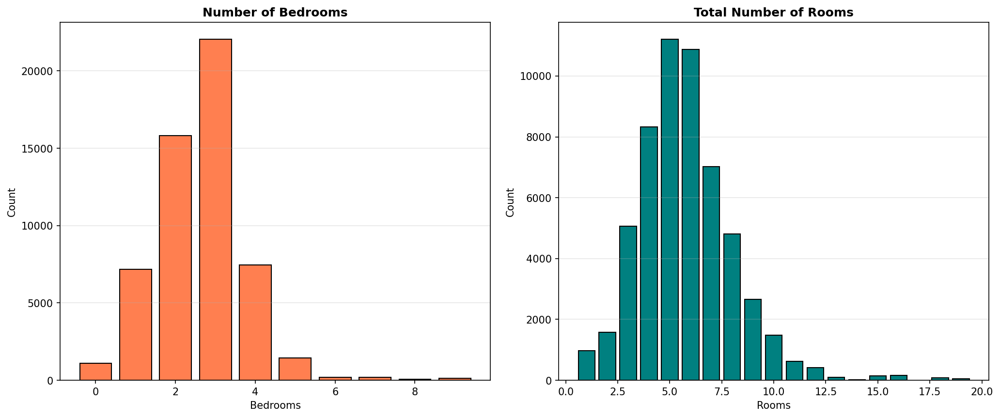

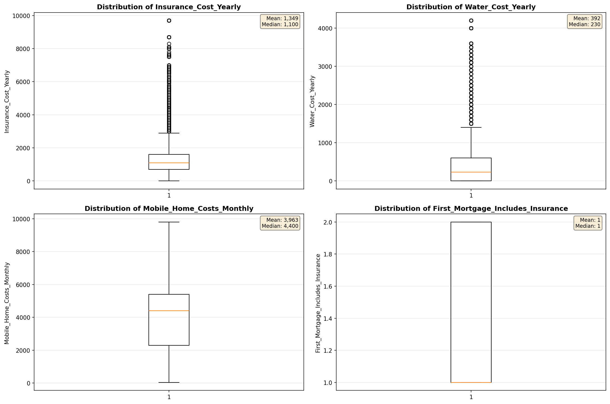

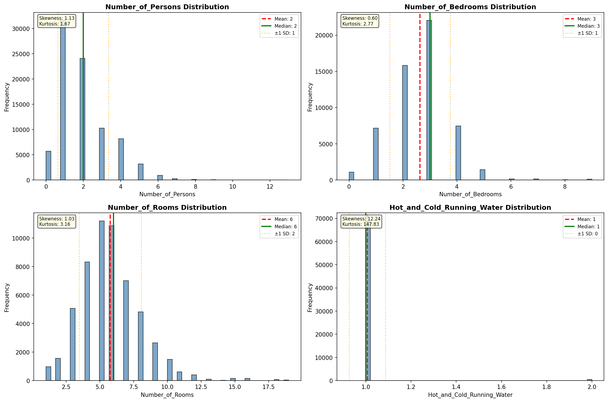

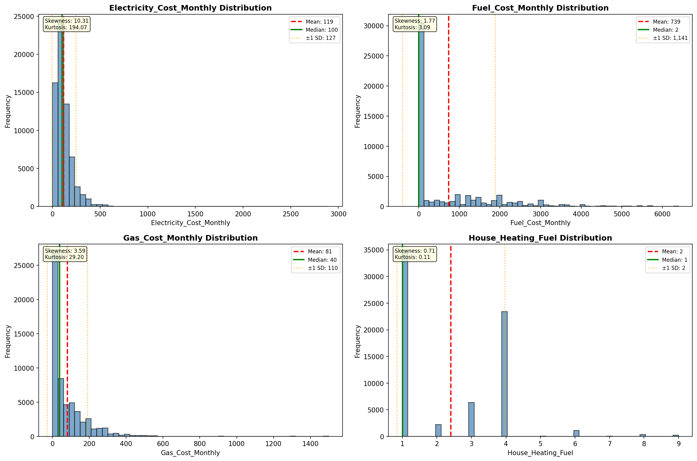

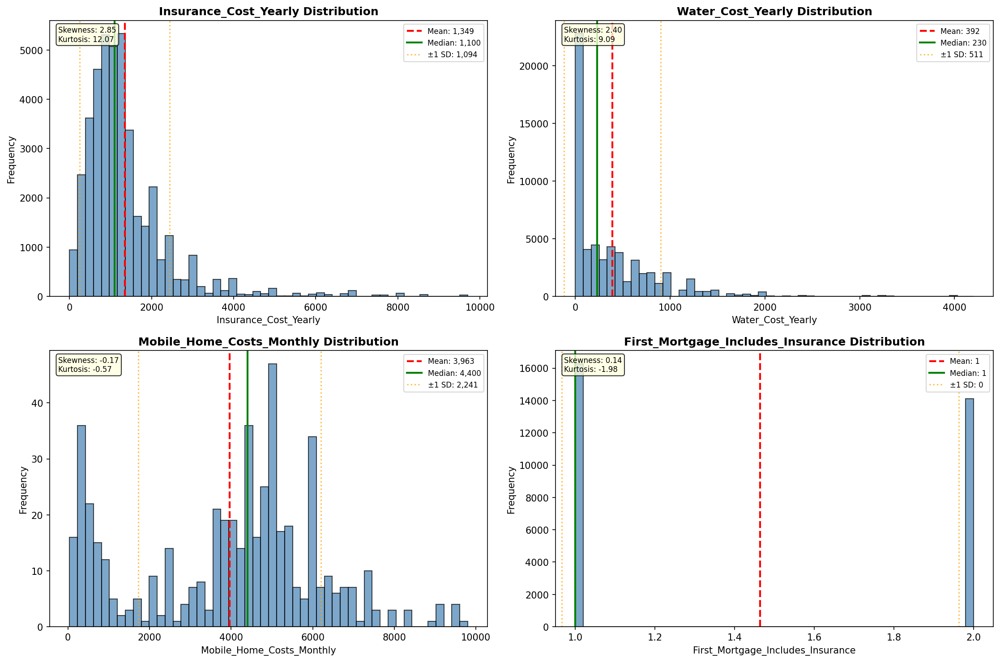

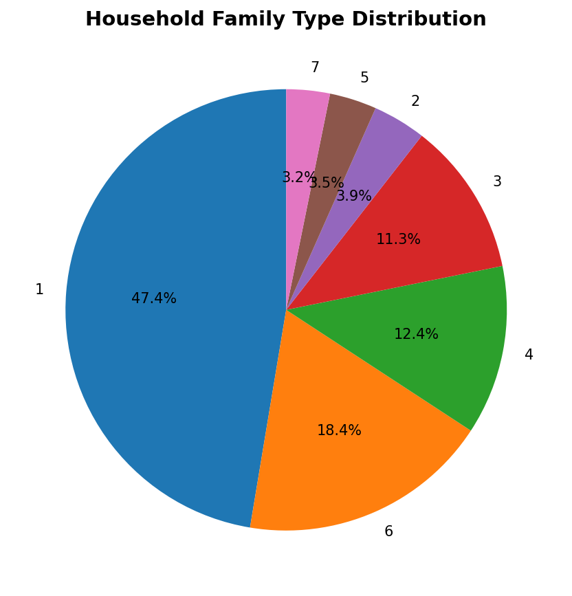

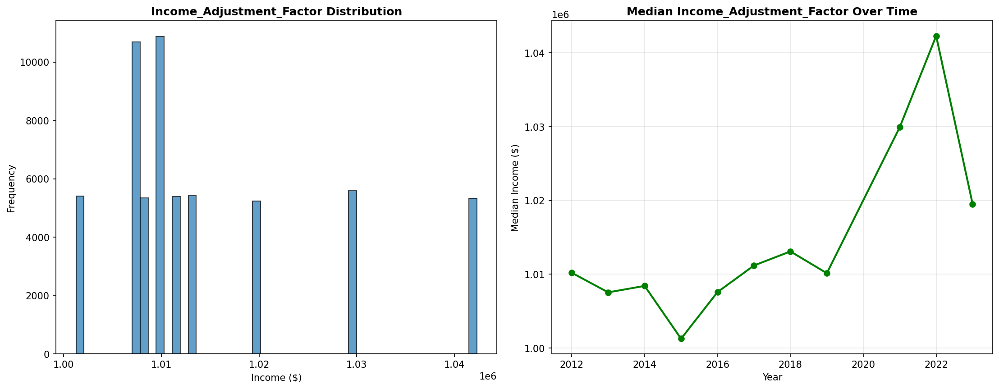

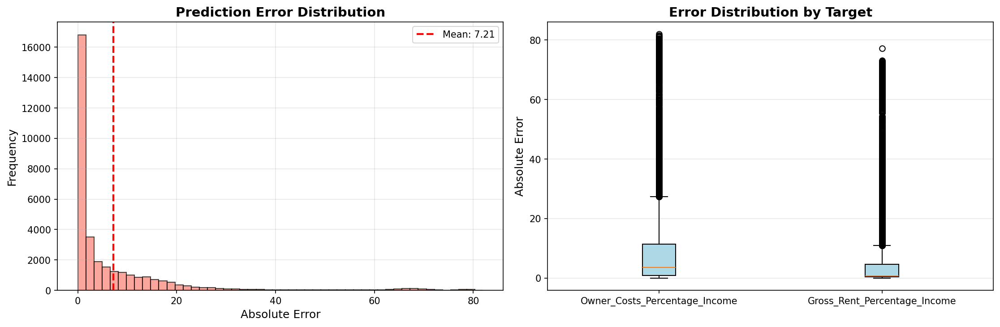

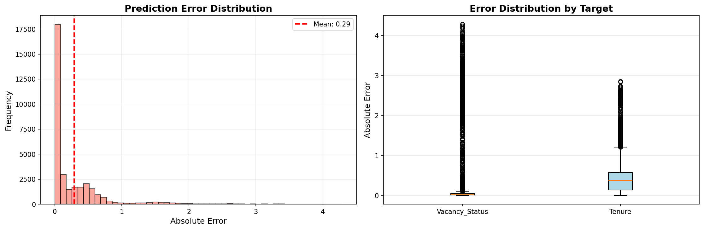

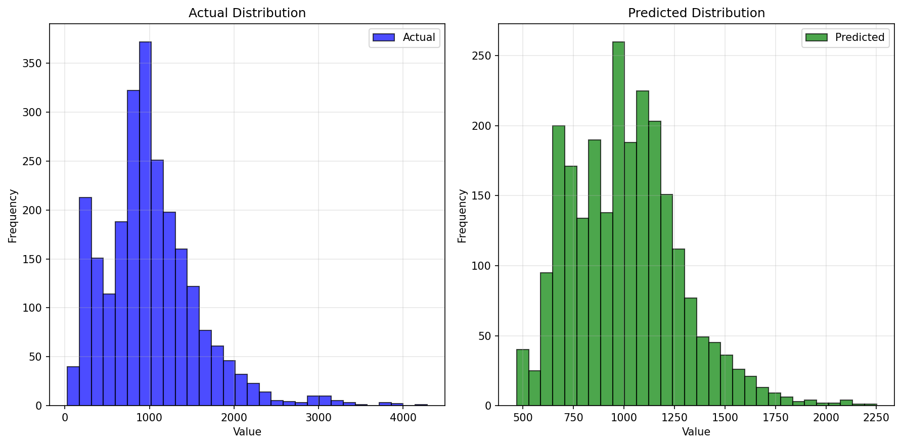

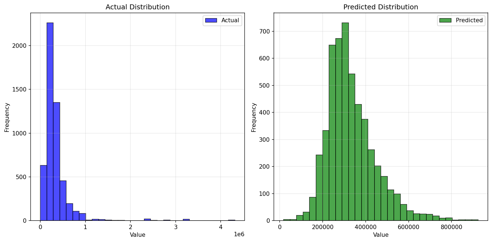

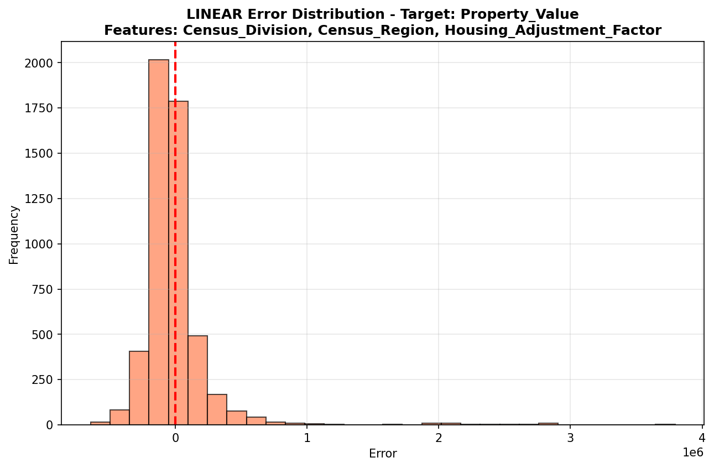

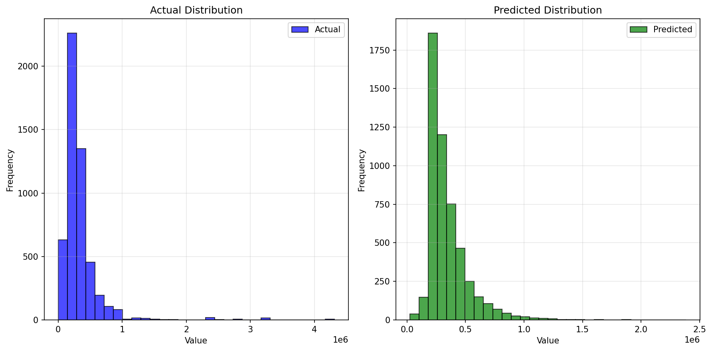

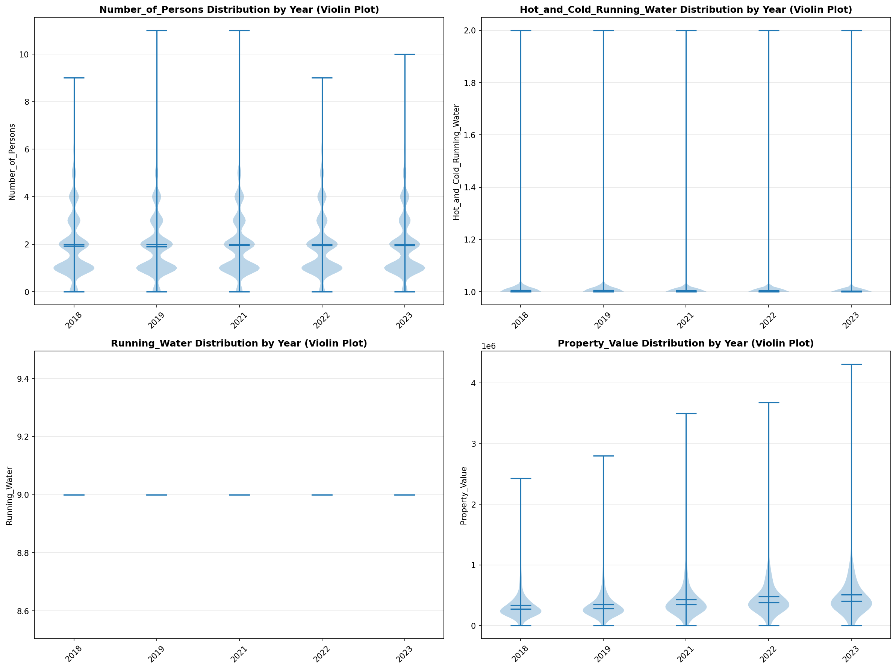

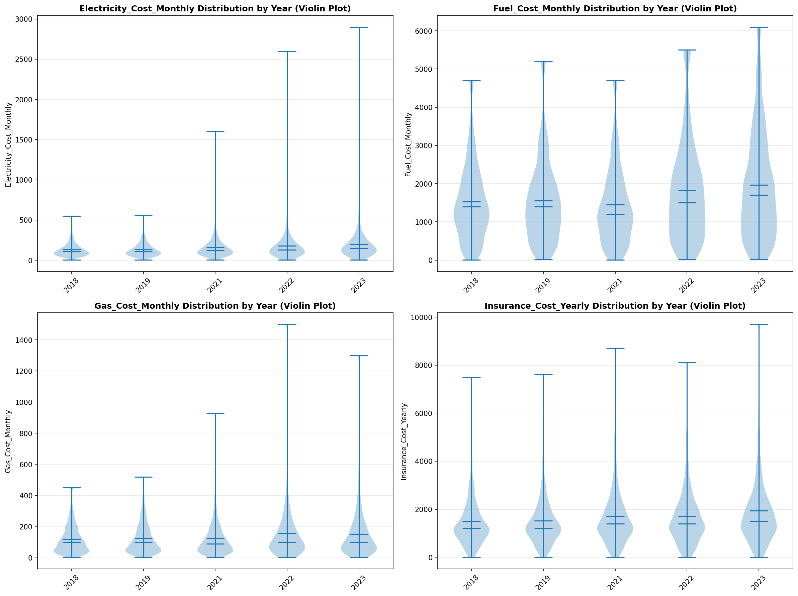

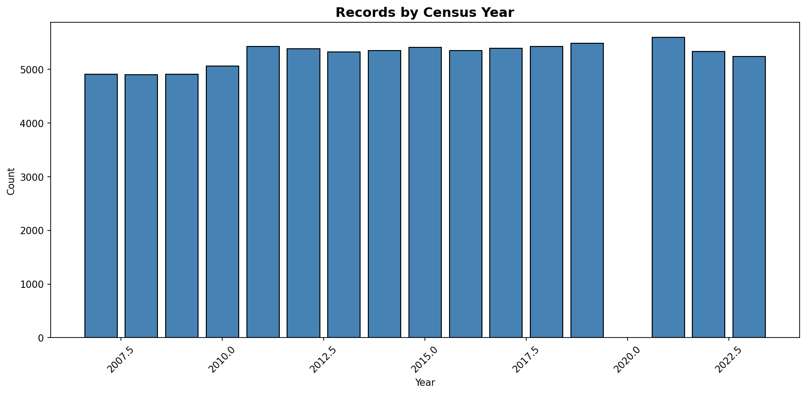
