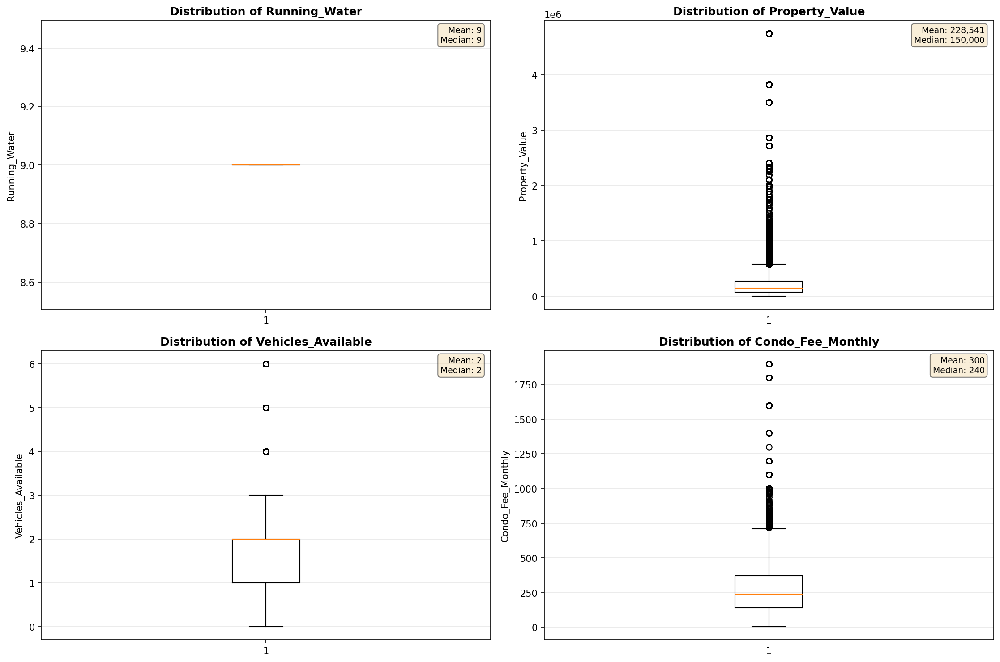
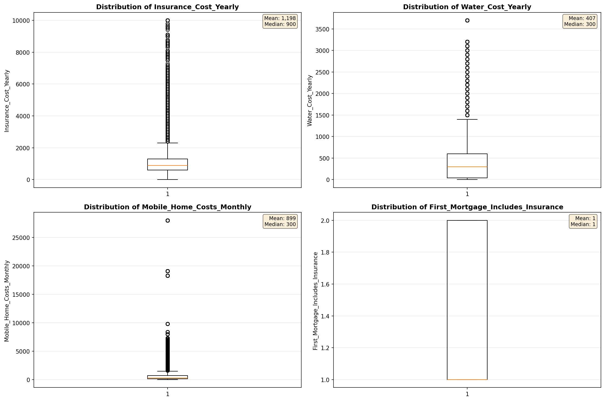
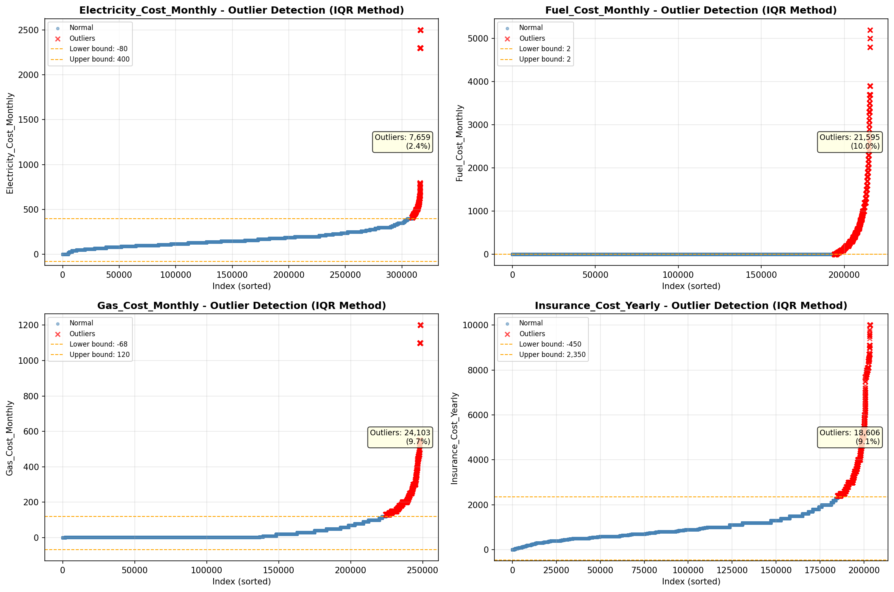

# Outlier Detection

> Statistical outlier detection using IQR (Interquartile Range) method. Outliers are values falling outside Q1 - 1.5×IQR or Q3 + 1.5×IQR bounds.

## Detection Methodology

| Parameter | Value | Description |
| :--- | :--- | :--- |
| Method | IQR | Outlier detection algorithm |
| Lower Bound | Q1 - 1.5 × IQR | Values below are outliers |
| Upper Bound | Q3 + 1.5 × IQR | Values above are outliers |
| IQR Definition | Q3 - Q1 | Interquartile Range |

> **Note**: The IQR method is robust to extreme values and works well for approximately symmetric distributions.

## Outlier Summary

_No outlier summary available._
## High Outlier Rate Variables

> Variables with outlier rate > 5% may indicate data quality issues, non-normal distributions, or genuinely extreme values.

- **('Flag_Selected_Monthly_Owner_Costs', 24.230672951678667)**: 0 outliers (0.00%)

- **('Specified_Rent_Unit', 24.16835912879053)**: 0 outliers (0.00%)

- **('Flag_Family_Income', 21.04312147970228)**: 0 outliers (0.00%)

- **('Property_Tax_Rate', 17.48889627716256)**: 0 outliers (0.00%)

- **('Mobile_Home_Costs_Monthly', 12.721375837494131)**: 0 outliers (0.00%)

- **('Property_Taxes_Yearly', 11.928718632561523)**: 0 outliers (0.00%)

- **('Structure_Age', 10.59611663701154)**: 0 outliers (0.00%)

- **('Fuel_Cost_Monthly', 10.014468692901993)**: 0 outliers (0.00%)

- **('Flag_Property_Taxes', 9.948776014767926)**: 0 outliers (0.00%)

- **('Income_Adjustment_Factor', 9.79844335380061)**: 0 outliers (0.00%)

- **('Gross_Rent_Percentage_Income', 9.709370520005214)**: 0 outliers (0.00%)

- **('Gas_Cost_Monthly', 9.701153126320662)**: 0 outliers (0.00%)

- **('Insurance_Cost_Yearly', 9.143267123354988)**: 0 outliers (0.00%)

- **('Flag_Property_Value', 8.383780376777086)**: 0 outliers (0.00%)

- **('Structure_Age_Score', 8.071379724968967)**: 0 outliers (0.00%)

> *Consider investigating these variables for data entry errors, applying transformations, or using robust statistical methods.*

## Visualizations

