# Deep Learning Models

> Neural network analysis using TensorFlow/Keras for complex pattern recognition and multi-output prediction tasks.

## Deep Learning Summary

- **Total Tasks**: 5

- **Tasks**: Property Valuation, Affordability Analysis, Housing Quality, Cost Prediction, Occupancy Prediction

### Aggregate Statistics

| Metric | Value |
| :--- | :--- |
| Total Parameters | 78,283 |
| Average Validation Loss | 2699964117.9910 |
| Number of Tasks | 5 |

## Task: Property Valuation

### Model Configuration

| Property | Value |
| :--- | :--- |
| Model Type | HousingValuationModel |
| Task Type | Multi_Output |
| Target Variables | Property_Value, Gross_Rent |
| Number of Targets | 2 |
| Input Features | 10 |

### Network Architecture

| Component | Value | Notes |
| :--- | :--- | :--- |
| Total Layers | 7 | Including input and output |
| Total Parameters | 36,994 | Trainable weights |
| Parameters per Layer | 5,284 | Average |

### Performance Metrics

| Metric | Value | Assessment |
| :--- | :--- | :--- |
| Training Loss | 10574579712.0000 | Final epoch |
| Validation Loss | 13499545600.0000 | Final epoch |
| Loss Gap | 2924965888.0000 | HIGH overfitting risk |

> *Model may be overfitting significantly*

#### Test Set Metrics

| Metric | Value | Description |
| :--- | :--- | :--- |
| MAE | 29983.2520 | Mean Absolute Error (lower is better) |
| MSE | 12292102144.0000 | Mean Squared Error (lower is better) |
| RMSE | 110869.7531 | Root Mean Squared Error (lower is better) |
| R2 | -0.3830 | R-squared (higher is better) |

### Training Analysis

| Training Statistic | Value |
| :--- | :--- |
| Epochs Trained | 75 |
| Initial Training Loss | 22914836480.0000 |
| Final Training Loss | 10574579712.0000 |
| Loss Improvement | 53.9% |
| Initial Validation Loss | 26339624960.0000 |
| Final Validation Loss | 13499545600.0000 |
| Validation Improvement | 48.7% |

#### Convergence Assessment

- **Status**: Fully converged (< 1% change in last 10 epochs)

- **Last 10 epochs change**: 0.04%

## Task: Affordability Analysis

### Model Configuration

| Property | Value |
| :--- | :--- |
| Model Type | HousingAffordabilityModel |
| Task Type | Multi_Output |
| Target Variables | Owner_Costs_Percentage_Income, Gross_Rent_Percentage_Income |
| Number of Targets | 2 |
| Input Features | 10 |

### Network Architecture

| Component | Value | Notes |
| :--- | :--- | :--- |
| Total Layers | 6 | Including input and output |
| Total Parameters | 10,306 | Trainable weights |
| Parameters per Layer | 1,717 | Average |

### Performance Metrics

| Metric | Value | Assessment |
| :--- | :--- | :--- |
| Training Loss | 150.6576 | Final epoch |
| Validation Loss | 148.2254 | Final epoch |
| Loss Gap | -2.4322 | NONE overfitting risk |

> *Good generalization*

#### Test Set Metrics

| Metric | Value | Description |
| :--- | :--- | :--- |
| MAE | 5.5836 | Mean Absolute Error (lower is better) |
| MSE | 155.1538 | Mean Squared Error (lower is better) |
| RMSE | 12.4561 | Root Mean Squared Error (lower is better) |
| R2 | 0.0455 | R-squared (higher is better) |

### Training Analysis

| Training Statistic | Value |
| :--- | :--- |
| Epochs Trained | 75 |
| Initial Training Loss | 318.6844 |
| Final Training Loss | 150.6576 |
| Loss Improvement | 52.7% |
| Initial Validation Loss | 197.6987 |
| Final Validation Loss | 148.2254 |
| Validation Improvement | 25.0% |

#### Convergence Assessment

- **Status**: Fully converged (< 1% change in last 10 epochs)

- **Last 10 epochs change**: 0.10%

## Task: Housing Quality

### Model Configuration

| Property | Value |
| :--- | :--- |
| Model Type | HousingQualityModel |
| Task Type | Multi_Output |
| Target Variables | Year_Structure_Built, Number_of_Bedrooms, Number_of_Rooms |
| Number of Targets | 3 |
| Input Features | 10 |

### Network Architecture

| Component | Value | Notes |
| :--- | :--- | :--- |
| Total Layers | 6 | Including input and output |
| Total Parameters | 10,371 | Trainable weights |
| Parameters per Layer | 1,728 | Average |

### Performance Metrics

| Metric | Value | Assessment |
| :--- | :--- | :--- |
| Training Loss | 572.8333 | Final epoch |
| Validation Loss | 19.2331 | Final epoch |
| Loss Gap | -553.6001 | NONE overfitting risk |

> *Good generalization*

#### Test Set Metrics

| Metric | Value | Description |
| :--- | :--- | :--- |
| MAE | 1.0130 | Mean Absolute Error (lower is better) |
| MSE | 19.8474 | Mean Squared Error (lower is better) |
| RMSE | 4.4550 | Root Mean Squared Error (lower is better) |
| R2 | 0.8605 | R-squared (higher is better) |

### Training Analysis

| Training Statistic | Value |
| :--- | :--- |
| Epochs Trained | 75 |
| Initial Training Loss | 52085.1484 |
| Final Training Loss | 572.8333 |
| Loss Improvement | 98.9% |
| Initial Validation Loss | 16909.5156 |
| Final Validation Loss | 19.2331 |
| Validation Improvement | 99.9% |

#### Convergence Assessment

- **Status**: Still improving (> 5% change)

- **Last 10 epochs change**: 7.27%

## Task: Cost Prediction

### Model Configuration

| Property | Value |
| :--- | :--- |
| Model Type | HousingDefaultModel |
| Task Type | Multi_Output |
| Target Variables | Property_Taxes_Yearly, Insurance_Cost_Yearly |
| Number of Targets | 2 |
| Input Features | 10 |

### Network Architecture

| Component | Value | Notes |
| :--- | :--- | :--- |
| Total Layers | 6 | Including input and output |
| Total Parameters | 10,306 | Trainable weights |
| Parameters per Layer | 1,717 | Average |

### Performance Metrics

| Metric | Value | Assessment |
| :--- | :--- | :--- |
| Training Loss | 351916.5000 | Final epoch |
| Validation Loss | 274822.1562 | Final epoch |
| Loss Gap | -77094.3438 | NONE overfitting risk |

> *Good generalization*

#### Test Set Metrics

| Metric | Value | Description |
| :--- | :--- | :--- |
| MAE | 220.6067 | Mean Absolute Error (lower is better) |
| MSE | 375337.2500 | Mean Squared Error (lower is better) |
| RMSE | 612.6477 | Root Mean Squared Error (lower is better) |
| R2 | 0.2669 | R-squared (higher is better) |

### Training Analysis

| Training Statistic | Value |
| :--- | :--- |
| Epochs Trained | 75 |
| Initial Training Loss | 759942.5625 |
| Final Training Loss | 351916.5000 |
| Loss Improvement | 53.7% |
| Initial Validation Loss | 651168.8750 |
| Final Validation Loss | 274822.1562 |
| Validation Improvement | 57.8% |

#### Convergence Assessment

- **Status**: Fully converged (< 1% change in last 10 epochs)

- **Last 10 epochs change**: 0.21%

## Task: Occupancy Prediction

### Model Configuration

| Property | Value |
| :--- | :--- |
| Model Type | HousingDefaultModel |
| Task Type | Multi_Output |
| Target Variables | Vacancy_Status, Tenure |
| Number of Targets | 2 |
| Input Features | 10 |

### Network Architecture

| Component | Value | Notes |
| :--- | :--- | :--- |
| Total Layers | 6 | Including input and output |
| Total Parameters | 10,306 | Trainable weights |
| Parameters per Layer | 1,717 | Average |

### Performance Metrics

| Metric | Value | Assessment |
| :--- | :--- | :--- |
| Training Loss | 0.3442 | Final epoch |
| Validation Loss | 0.3405 | Final epoch |
| Loss Gap | -0.0038 | NONE overfitting risk |

> *Good generalization*

#### Test Set Metrics

| Metric | Value | Description |
| :--- | :--- | :--- |
| MAE | 0.2997 | Mean Absolute Error (lower is better) |
| MSE | 0.3481 | Mean Squared Error (lower is better) |
| RMSE | 0.5900 | Root Mean Squared Error (lower is better) |
| R2 | 0.2158 | R-squared (higher is better) |

### Training Analysis

| Training Statistic | Value |
| :--- | :--- |
| Epochs Trained | 75 |
| Initial Training Loss | 1.4494 |
| Final Training Loss | 0.3442 |
| Loss Improvement | 76.3% |
| Initial Validation Loss | 2.6840 |
| Final Validation Loss | 0.3405 |
| Validation Improvement | 87.3% |

#### Convergence Assessment

- **Status**: Fully converged (< 1% change in last 10 epochs)

- **Last 10 epochs change**: 0.43%

## Cross-Task Comparison

| Task | Model Type | Parameters | Train Loss | Val Loss | Gap |
| :--- | :--- | :--- | :--- | :--- | :--- |
| Property Valuation | HousingValuationModel | 36,994 | 10574579712.0000 | 13499545600.0000 | 2924965888.0000 |
| Affordability Analysis | HousingAffordabilityModel | 10,306 | 150.6576 | 148.2254 | -2.4322 |
| Housing Quality | HousingQualityModel | 10,371 | 572.8333 | 19.2331 | -553.6001 |
| Cost Prediction | HousingDefaultModel | 10,306 | 351916.5000 | 274822.1562 | -77094.3438 |
| Occupancy Prediction | HousingDefaultModel | 10,306 | 0.3442 | 0.3405 | -0.0038 |

## Visualizations

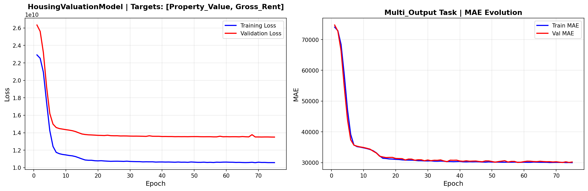

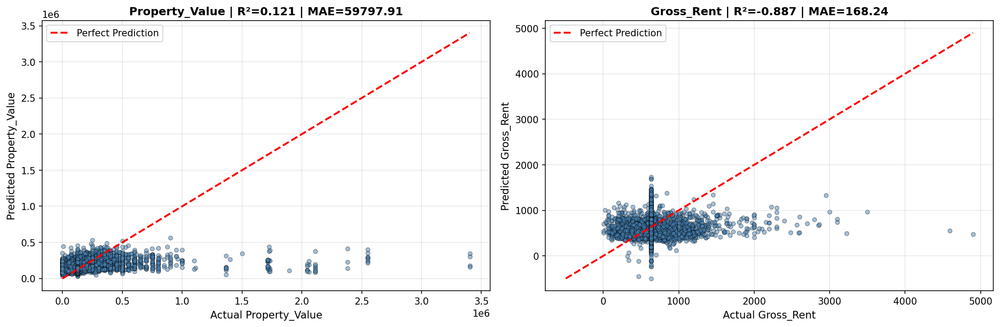

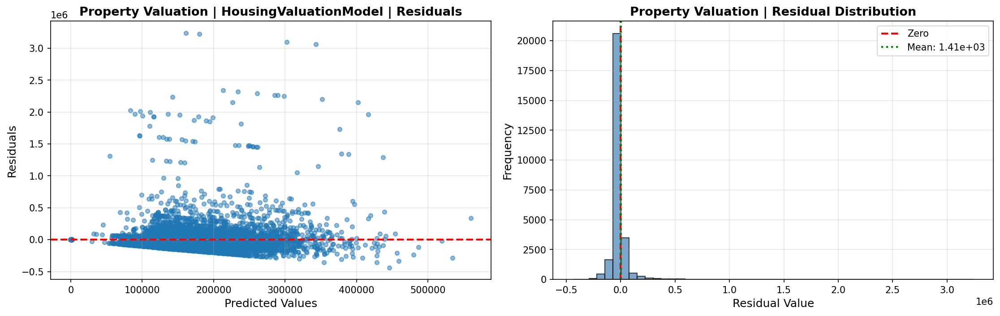

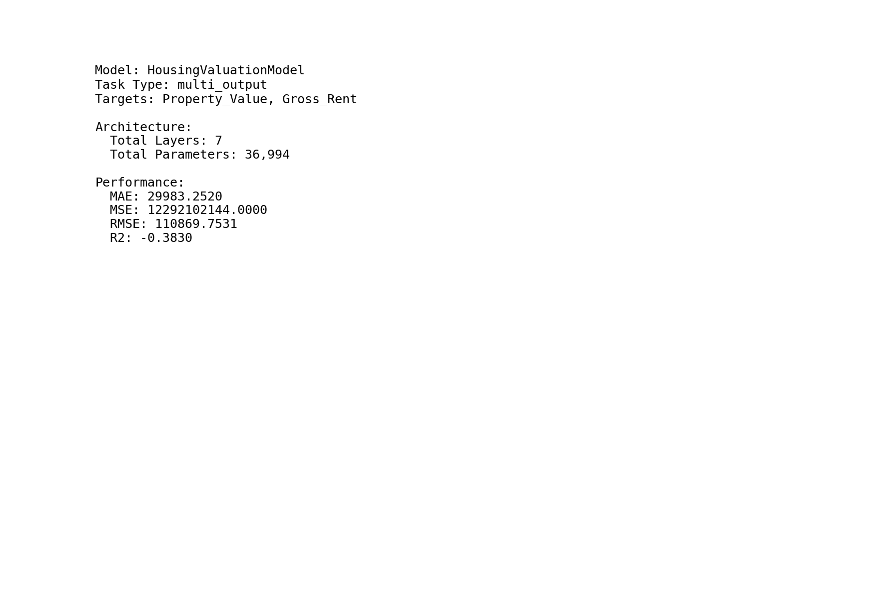

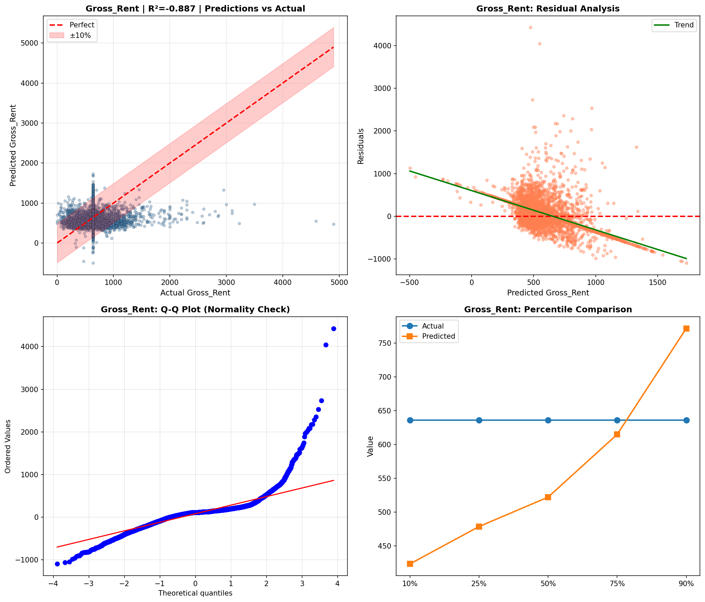

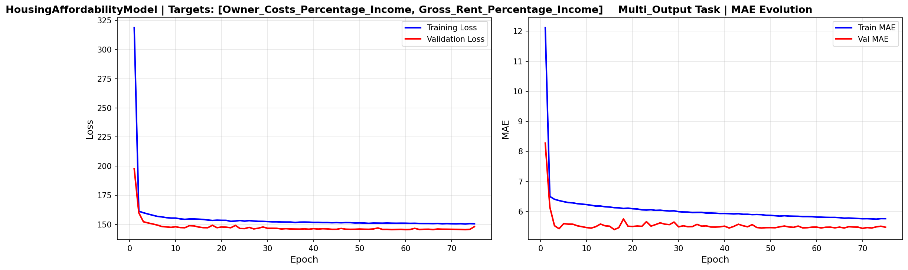

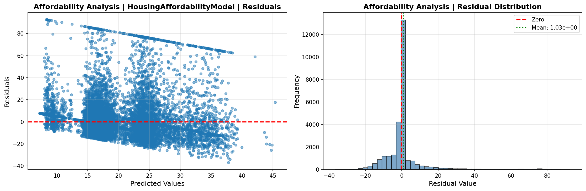

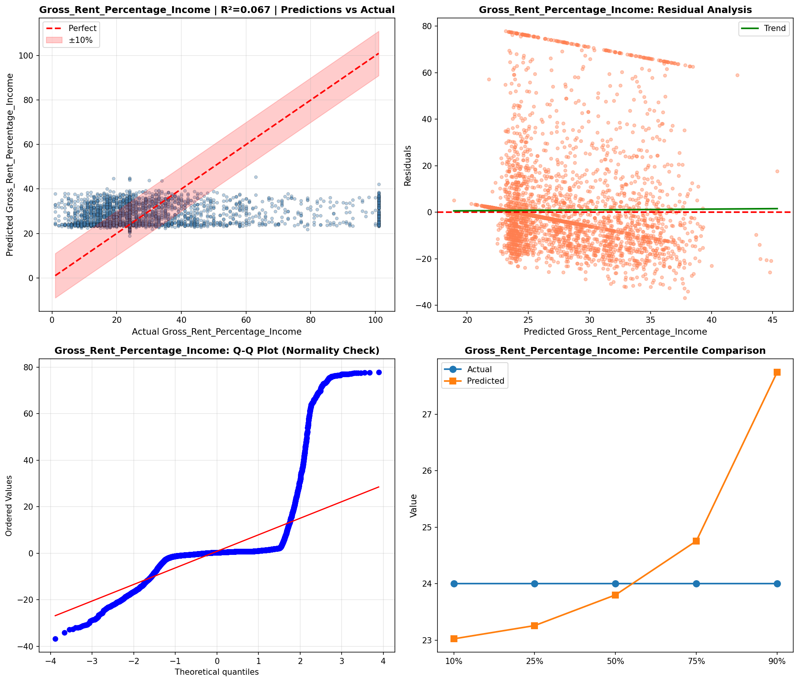

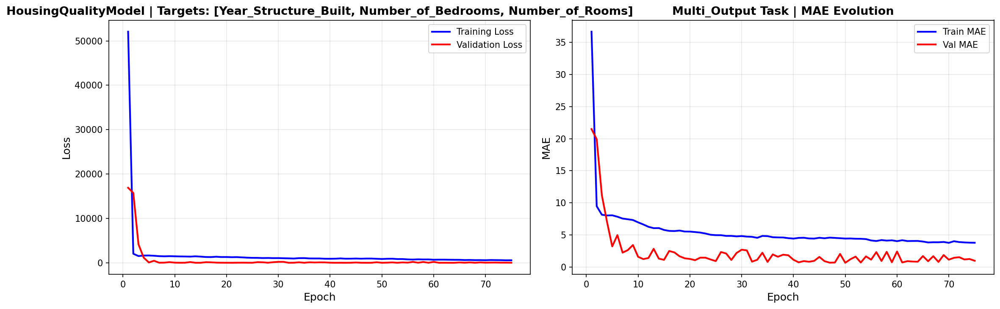

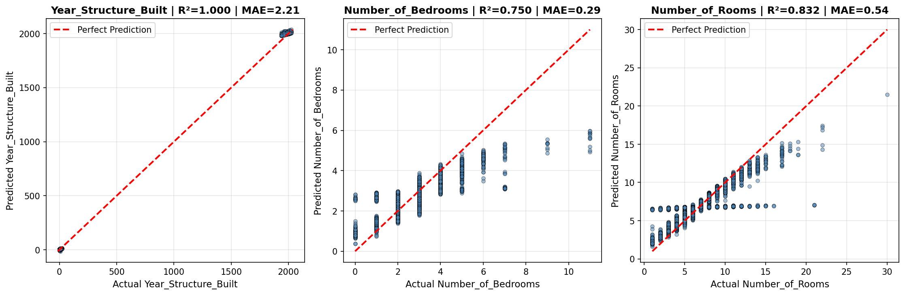

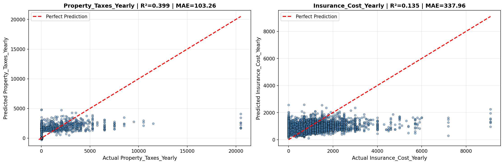

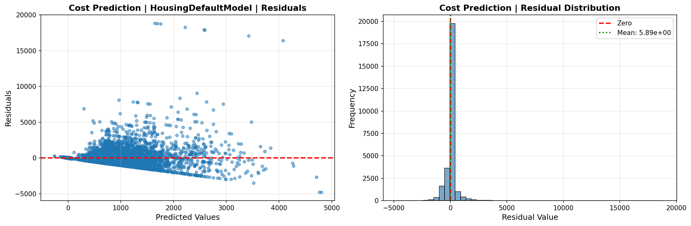

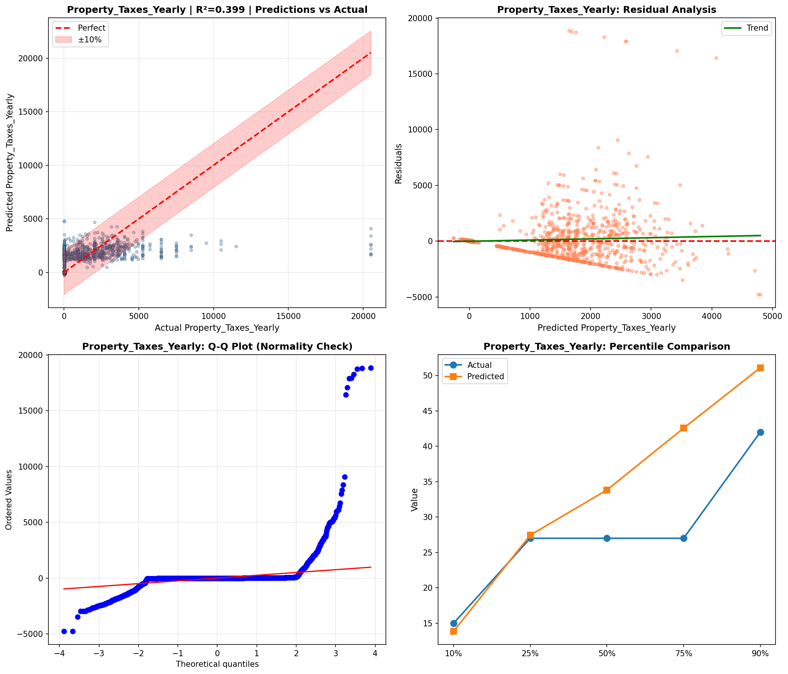

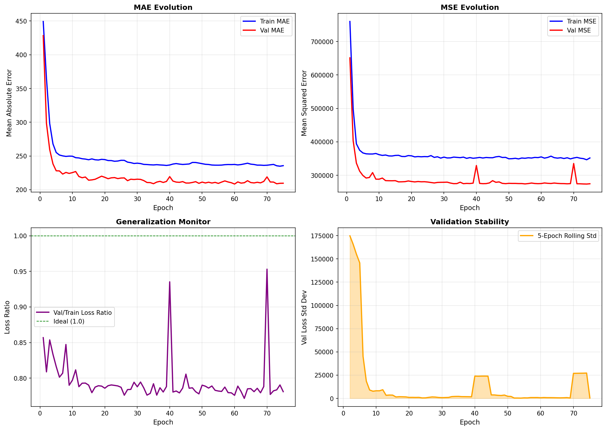

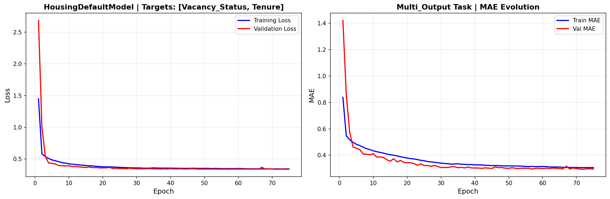

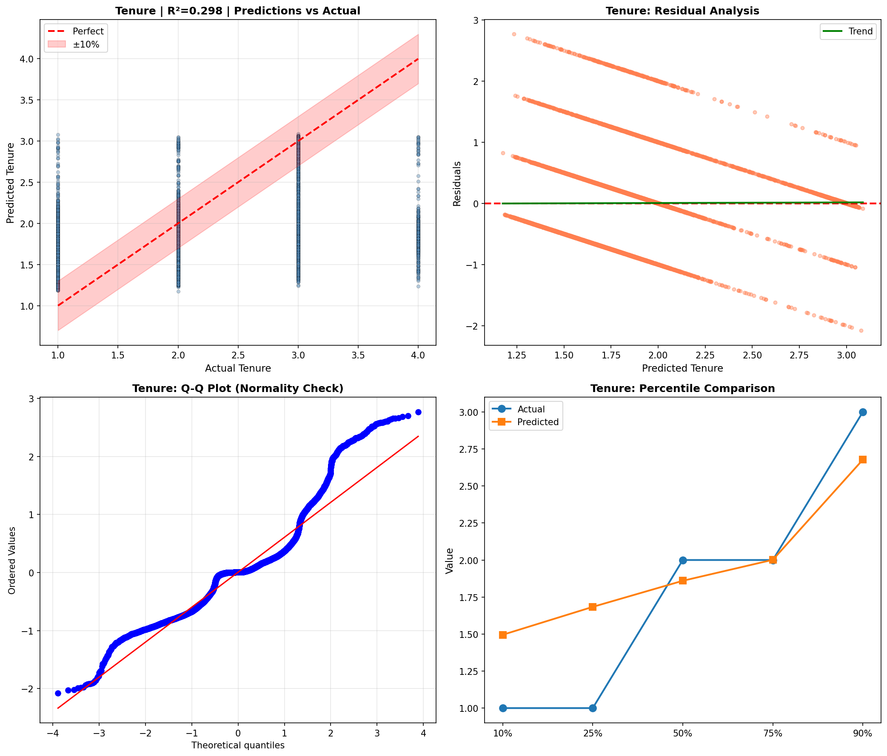

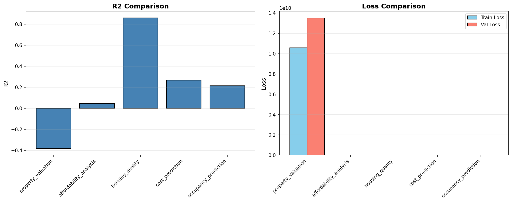

