# Statistical Analysis

> Comprehensive descriptive statistics including central tendency, dispersion, distribution characteristics, and weighted statistics using ACS sample weights.

## Summary Statistics

- **Variables Analyzed**: 41

### Income_Adjustment_Factor

| Statistic | Unweighted | Weighted (ACS) |
| :--- | :--- | :--- |
| Mean | 1,015,016.50 | 1,014,656.45 |
| Median | 1,010,207.00 | 1,014,656.45 |
| Std Deviation | 11,442.26 | — |
| Minimum | 1,001,264.00 | — |
| Maximum | 1,042,311.00 | — |
| Count | 359,722 | — |

> *Distribution is highly right-skewed (skewness: 1.29), light-tailed/platykurtic (kurtosis: 0.63).*

- **Coefficient of Variation**: 1.1 % (low variability)

### Property_Value

| Statistic | Unweighted | Weighted (ACS) |
| :--- | :--- | :--- |
| Mean | 222,963.85 | 221,060.10 |
| Median | 150,000.00 | 168,834.58 |
| Std Deviation | 293,091.77 | — |
| Minimum | 1.00 | — |
| Maximum | 3,515,000.00 | — |
| Count | 242,590 | — |

> *Distribution is highly right-skewed (skewness: 5.42), heavy-tailed/leptokurtic (kurtosis: 44.46).*

- **Coefficient of Variation**: 131.5 % (very high variability)

### Electricity_Cost_Monthly

| Statistic | Unweighted | Weighted (ACS) |
| :--- | :--- | :--- |
| Mean | 164.78 | 164.90 |
| Median | 150.00 | 145.00 |
| Std Deviation | 123.50 | — |
| Minimum | 1.00 | — |
| Maximum | 3,100.00 | — |
| Count | 427,339 | — |

> *Distribution is highly right-skewed (skewness: 9.00), heavy-tailed/leptokurtic (kurtosis: 181.44).*

- **Coefficient of Variation**: 74.9 % (high variability)

### Fuel_Cost_Monthly

| Statistic | Unweighted | Weighted (ACS) |
| :--- | :--- | :--- |
| Mean | 62.37 | 189.67 |
| Median | 2.00 | 95.12 |
| Std Deviation | 293.40 | — |
| Minimum | 1.00 | — |
| Maximum | 5,800.00 | — |
| Count | 295,242 | — |

> *Distribution is highly right-skewed (skewness: 7.69), heavy-tailed/leptokurtic (kurtosis: 75.24).*

- **Coefficient of Variation**: 470.4 % (very high variability)

### Gas_Cost_Monthly

| Statistic | Unweighted | Weighted (ACS) |
| :--- | :--- | :--- |
| Mean | 45.74 | 49.83 |
| Median | 10.00 | 18.94 |
| Std Deviation | 83.40 | — |
| Minimum | 1.00 | — |
| Maximum | 1,400.00 | — |
| Count | 347,261 | — |

> *Distribution is highly right-skewed (skewness: 5.67), heavy-tailed/leptokurtic (kurtosis: 62.33).*

- **Coefficient of Variation**: 182.3 % (very high variability)

### Insurance_Cost_Yearly

| Statistic | Unweighted | Weighted (ACS) |
| :--- | :--- | :--- |
| Mean | 1,050.80 | 1,041.37 |
| Median | 900.00 | 900.00 |
| Std Deviation | 812.12 | — |
| Minimum | 4.00 | — |
| Maximum | 9,000.00 | — |
| Count | 276,519 | — |

> *Distribution is highly right-skewed (skewness: 3.28), heavy-tailed/leptokurtic (kurtosis: 17.95).*

- **Coefficient of Variation**: 77.3 % (high variability)

### Water_Cost_Yearly

| Statistic | Unweighted | Weighted (ACS) |
| :--- | :--- | :--- |
| Mean | 385.68 | 386.98 |
| Median | 300.00 | 303.12 |
| Std Deviation | 450.49 | — |
| Minimum | 1.00 | — |
| Maximum | 4,700.00 | — |
| Count | 408,164 | — |

> *Distribution is highly right-skewed (skewness: 2.94), heavy-tailed/leptokurtic (kurtosis: 15.31).*

- **Coefficient of Variation**: 116.8 % (very high variability)

### Mobile_Home_Costs_Monthly

| Statistic | Unweighted | Weighted (ACS) |
| :--- | :--- | :--- |
| Mean | 1,032.55 | 1,078.71 |
| Median | 380.00 | 392.50 |
| Std Deviation | 2,429.46 | — |
| Minimum | 4.00 | — |
| Maximum | 28,400.00 | — |
| Count | 15,535 | — |

> *Distribution is highly right-skewed (skewness: 7.51), heavy-tailed/leptokurtic (kurtosis: 71.82).*

- **Coefficient of Variation**: 235.3 % (very high variability)

### First_Mortgage_Payment_Monthly

| Statistic | Unweighted | Weighted (ACS) |
| :--- | :--- | :--- |
| Mean | 851.36 | 933.73 |
| Median | 730.00 | 748.62 |
| Std Deviation | 739.66 | — |
| Minimum | 4.00 | — |
| Maximum | 5,400.00 | — |
| Count | 213,182 | — |

> *Distribution is highly right-skewed (skewness: 1.85), heavy-tailed/leptokurtic (kurtosis: 6.10).*

- **Coefficient of Variation**: 86.9 % (high variability)

### First_Mortgage_Includes_Taxes

| Statistic | Unweighted | Weighted (ACS) |
| :--- | :--- | :--- |
| Mean | 1.31 | 1.29 |
| Median | 1.00 | 1.00 |
| Std Deviation | 0.46 | — |
| Minimum | 1.00 | — |
| Maximum | 2.00 | — |
| Count | 178,684 | — |

> *Distribution is moderately right-skewed (skewness: 0.82), light-tailed/platykurtic (kurtosis: -1.33).*

- **Coefficient of Variation**: 35.3 % (moderate variability)

### Second_Mortgage_Payment_Monthly

| Statistic | Unweighted | Weighted (ACS) |
| :--- | :--- | :--- |
| Mean | 367.02 | 369.71 |
| Median | 250.00 | 251.88 |
| Std Deviation | 397.46 | — |
| Minimum | 4.00 | — |
| Maximum | 3,700.00 | — |
| Count | 26,788 | — |

> *Distribution is highly right-skewed (skewness: 3.74), heavy-tailed/leptokurtic (kurtosis: 20.21).*

- **Coefficient of Variation**: 108.3 % (very high variability)

### Property_Taxes_Yearly

| Statistic | Unweighted | Weighted (ACS) |
| :--- | :--- | :--- |
| Mean | 198.12 | 184.24 |
| Median | 22.00 | 131.75 |
| Std Deviation | 897.89 | — |
| Minimum | 1.00 | — |
| Maximum | 19,500.00 | — |
| Count | 232,020 | — |

> *Distribution is highly right-skewed (skewness: 11.86), heavy-tailed/leptokurtic (kurtosis: 208.60).*

- **Coefficient of Variation**: 453.2 % (very high variability)

### Meals_Included_in_Rent

| Statistic | Unweighted | Weighted (ACS) |
| :--- | :--- | :--- |
| Mean | 1.98 | 1.98 |
| Median | 2.00 | 2.00 |
| Std Deviation | 0.13 | — |
| Minimum | 1.00 | — |
| Maximum | 2.00 | — |
| Count | 112,256 | — |

> *Distribution is highly left-skewed (skewness: -7.19), heavy-tailed/leptokurtic (kurtosis: 49.64).*

- **Coefficient of Variation**: 6.8 % (low variability)

### Rent_Amount_Monthly

| Statistic | Unweighted | Weighted (ACS) |
| :--- | :--- | :--- |
| Mean | 697.39 | 721.35 |
| Median | 600.00 | 643.75 |
| Std Deviation | 484.66 | — |
| Minimum | 4.00 | — |
| Maximum | 4,500.00 | — |
| Count | 112,256 | — |

> *Distribution is highly right-skewed (skewness: 2.49), heavy-tailed/leptokurtic (kurtosis: 10.38).*

- **Coefficient of Variation**: 69.5 % (high variability)

### Gross_Rent

| Statistic | Unweighted | Weighted (ACS) |
| :--- | :--- | :--- |
| Mean | 864.80 | 883.07 |
| Median | 770.00 | 819.00 |
| Std Deviation | 501.15 | — |
| Minimum | 4.00 | — |
| Maximum | 6,367.00 | — |
| Count | 104,565 | — |

> *Distribution is highly right-skewed (skewness: 2.13), heavy-tailed/leptokurtic (kurtosis: 8.76).*

- **Coefficient of Variation**: 57.9 % (high variability)

### Gross_Rent_Percentage_Income

| Statistic | Unweighted | Weighted (ACS) |
| :--- | :--- | :--- |
| Mean | 38.14 | 38.38 |
| Median | 29.00 | 29.38 |
| Std Deviation | 26.87 | — |
| Minimum | 1.00 | — |
| Maximum | 101.00 | — |
| Count | 102,022 | — |

> *Distribution is highly right-skewed (skewness: 1.19), light-tailed/platykurtic (kurtosis: 0.40).*

- **Coefficient of Variation**: 70.5 % (high variability)

### Selected_Monthly_Owner_Costs

| Statistic | Unweighted | Weighted (ACS) |
| :--- | :--- | :--- |
| Mean | 983.14 | 1,017.26 |
| Median | 777.00 | 842.56 |
| Std Deviation | 830.27 | — |
| Minimum | 2.00 | — |
| Maximum | 15,238.00 | — |
| Count | 316,014 | — |

> *Distribution is highly right-skewed (skewness: 2.50), heavy-tailed/leptokurtic (kurtosis: 11.11).*

- **Coefficient of Variation**: 84.5 % (high variability)

### Owner_Costs_Percentage_Income

| Statistic | Unweighted | Weighted (ACS) |
| :--- | :--- | :--- |
| Mean | 21.89 | 22.48 |
| Median | 16.00 | 16.75 |
| Std Deviation | 20.10 | — |
| Minimum | 1.00 | — |
| Maximum | 101.00 | — |
| Count | 313,411 | — |

> *Distribution is highly right-skewed (skewness: 2.25), heavy-tailed/leptokurtic (kurtosis: 5.51).*

- **Coefficient of Variation**: 91.8 % (high variability)

### Family_Income

| Statistic | Unweighted | Weighted (ACS) |
| :--- | :--- | :--- |
| Mean | 84,045.71 | 81,034.32 |
| Median | 62,000.00 | 61,155.62 |
| Std Deviation | 86,650.09 | — |
| Minimum | 1.00 | — |
| Maximum | 2,108,000.00 | — |
| Count | 285,562 | — |

> *Distribution is highly right-skewed (skewness: 3.76), heavy-tailed/leptokurtic (kurtosis: 23.46).*

- **Coefficient of Variation**: 103.1 % (very high variability)

### Household_Income

| Statistic | Unweighted | Weighted (ACS) |
| :--- | :--- | :--- |
| Mean | 71,009.35 | 68,774.05 |
| Median | 50,000.00 | 49,568.75 |
| Std Deviation | 79,420.56 | — |
| Minimum | 1.00 | — |
| Maximum | 2,108,000.00 | — |
| Count | 425,887 | — |

> *Distribution is highly right-skewed (skewness: 3.99), heavy-tailed/leptokurtic (kurtosis: 26.83).*

- **Coefficient of Variation**: 111.8 % (very high variability)

### Specified_Rent_Unit

| Statistic | Unweighted | Weighted (ACS) |
| :--- | :--- | :--- |
| Mean | 0.26 | 0.31 |
| Median | 0.00 | 0.00 |
| Std Deviation | 0.44 | — |
| Minimum | 0.00 | — |
| Maximum | 1.00 | — |
| Count | 466,726 | — |

> *Distribution is highly right-skewed (skewness: 1.10), light-tailed/platykurtic (kurtosis: -0.80).*

- **Coefficient of Variation**: 168.9 % (very high variability)

### Specified_Value_Unit

| Statistic | Unweighted | Weighted (ACS) |
| :--- | :--- | :--- |
| Mean | 0.57 | 0.50 |
| Median | 1.00 | 0.50 |
| Std Deviation | 0.50 | — |
| Minimum | 0.00 | — |
| Maximum | 1.00 | — |
| Count | 466,726 | — |

> *Distribution is approximately symmetric (skewness: -0.27), light-tailed/platykurtic (kurtosis: -1.93).*

- **Coefficient of Variation**: 87.5 % (high variability)

### Flag_Family_Income

| Statistic | Unweighted | Weighted (ACS) |
| :--- | :--- | :--- |
| Mean | 0.21 | 0.20 |
| Median | 0.00 | 0.00 |
| Std Deviation | 0.41 | — |
| Minimum | 0.00 | — |
| Maximum | 1.00 | — |
| Count | 355,938 | — |

> *Distribution is highly right-skewed (skewness: 1.43), light-tailed/platykurtic (kurtosis: 0.06).*

- **Coefficient of Variation**: 194.7 % (very high variability)

### Flag_Gross_Rent

| Statistic | Unweighted | Weighted (ACS) |
| :--- | :--- | :--- |
| Mean | 0.08 | 0.13 |
| Median | 0.00 | 0.00 |
| Std Deviation | 0.27 | — |
| Minimum | 0.00 | — |
| Maximum | 1.00 | — |
| Count | 230,833 | — |

> *Distribution is highly right-skewed (skewness: 3.08), heavy-tailed/leptokurtic (kurtosis: 7.47).*

- **Coefficient of Variation**: 337.4 % (very high variability)

### Flag_Household_Income

| Statistic | Unweighted | Weighted (ACS) |
| :--- | :--- | :--- |
| Mean | 0.31 | 0.30 |
| Median | 0.00 | 0.00 |
| Std Deviation | 0.46 | — |
| Minimum | 0.00 | — |
| Maximum | 1.00 | — |
| Count | 355,938 | — |

> *Distribution is moderately right-skewed (skewness: 0.83), light-tailed/platykurtic (kurtosis: -1.32).*

- **Coefficient of Variation**: 149.5 % (very high variability)

### Flag_First_Mortgage_Payment

| Statistic | Unweighted | Weighted (ACS) |
| :--- | :--- | :--- |
| Mean | 0.04 | 0.04 |
| Median | 0.00 | 0.00 |
| Std Deviation | 0.19 | — |
| Minimum | 0.00 | — |
| Maximum | 1.00 | — |
| Count | 466,726 | — |

> *Distribution is highly right-skewed (skewness: 4.99), heavy-tailed/leptokurtic (kurtosis: 22.91).*

- **Coefficient of Variation**: 518.4 % (very high variability)

### Flag_First_Mortgage_Taxes

| Statistic | Unweighted | Weighted (ACS) |
| :--- | :--- | :--- |
| Mean | 0.03 | 0.03 |
| Median | 0.00 | 0.00 |
| Std Deviation | 0.17 | — |
| Minimum | 0.00 | — |
| Maximum | 1.00 | — |
| Count | 466,726 | — |

> *Distribution is highly right-skewed (skewness: 5.37), heavy-tailed/leptokurtic (kurtosis: 26.88).*

- **Coefficient of Variation**: 555.4 % (very high variability)

### Flag_Meals_Included_Rent

| Statistic | Unweighted | Weighted (ACS) |
| :--- | :--- | :--- |
| Mean | 0.01 | 0.01 |
| Median | 0.00 | 0.00 |
| Std Deviation | 0.08 | — |
| Minimum | 0.00 | — |
| Maximum | 1.00 | — |
| Count | 466,726 | — |

> *Distribution is highly right-skewed (skewness: 12.19), heavy-tailed/leptokurtic (kurtosis: 146.54).*

- **Coefficient of Variation**: 1,226.9 % (very high variability)

### Flag_Rent_Amount

| Statistic | Unweighted | Weighted (ACS) |
| :--- | :--- | :--- |
| Mean | 0.02 | 0.03 |
| Median | 0.00 | 0.00 |
| Std Deviation | 0.14 | — |
| Minimum | 0.00 | — |
| Maximum | 1.00 | — |
| Count | 466,726 | — |

> *Distribution is highly right-skewed (skewness: 6.88), heavy-tailed/leptokurtic (kurtosis: 45.38).*

- **Coefficient of Variation**: 702.6 % (very high variability)

### Flag_Selected_Monthly_Owner_Costs

| Statistic | Unweighted | Weighted (ACS) |
| :--- | :--- | :--- |
| Mean | 0.24 | 0.24 |
| Median | 0.00 | 0.00 |
| Std Deviation | 0.43 | — |
| Minimum | 0.00 | — |
| Maximum | 1.00 | — |
| Count | 305,116 | — |

> *Distribution is highly right-skewed (skewness: 1.19), light-tailed/platykurtic (kurtosis: -0.58).*

- **Coefficient of Variation**: 176.1 % (very high variability)

### Flag_Second_Mortgage_Payment

| Statistic | Unweighted | Weighted (ACS) |
| :--- | :--- | :--- |
| Mean | 0.03 | 0.03 |
| Median | 0.00 | 0.00 |
| Std Deviation | 0.17 | — |
| Minimum | 0.00 | — |
| Maximum | 1.00 | — |
| Count | 466,726 | — |

> *Distribution is highly right-skewed (skewness: 5.45), heavy-tailed/leptokurtic (kurtosis: 27.75).*

- **Coefficient of Variation**: 563.2 % (very high variability)

### Flag_Property_Taxes

| Statistic | Unweighted | Weighted (ACS) |
| :--- | :--- | :--- |
| Mean | 0.10 | 0.11 |
| Median | 0.00 | 0.00 |
| Std Deviation | 0.30 | — |
| Minimum | 0.00 | — |
| Maximum | 1.00 | — |
| Count | 434,772 | — |

> *Distribution is highly right-skewed (skewness: 2.62), heavy-tailed/leptokurtic (kurtosis: 4.84).*

- **Coefficient of Variation**: 295.4 % (very high variability)

### Flag_Property_Value

| Statistic | Unweighted | Weighted (ACS) |
| :--- | :--- | :--- |
| Mean | 0.08 | 0.08 |
| Median | 0.00 | 0.00 |
| Std Deviation | 0.27 | — |
| Minimum | 0.00 | — |
| Maximum | 1.00 | — |
| Count | 466,726 | — |

> *Distribution is highly right-skewed (skewness: 3.12), heavy-tailed/leptokurtic (kurtosis: 7.74).*

- **Coefficient of Variation**: 341.3 % (very high variability)

### Flag_Water_Cost

| Statistic | Unweighted | Weighted (ACS) |
| :--- | :--- | :--- |
| Mean | 0.09 | 0.11 |
| Median | 0.00 | 0.00 |
| Std Deviation | 0.29 | — |
| Minimum | 0.00 | — |
| Maximum | 1.00 | — |
| Count | 31,954 | — |

> *Distribution is highly right-skewed (skewness: 2.79), heavy-tailed/leptokurtic (kurtosis: 5.79).*

- **Coefficient of Variation**: 311.3 % (very high variability)

### Annual_Rent_to_Value_Ratio

### Total_Monthly_Utility_Cost

| Statistic | Unweighted | Weighted (ACS) |
| :--- | :--- | :--- |
| Mean | 201.72 | 197.80 |
| Median | 173.00 | 173.38 |
| Std Deviation | 150.99 | — |
| Minimum | 2.00 | — |
| Maximum | 4,500.00 | — |
| Count | 427,839 | — |

> *Distribution is highly right-skewed (skewness: 8.01), heavy-tailed/leptokurtic (kurtosis: 151.24).*

- **Coefficient of Variation**: 74.9 % (high variability)

### Property_Tax_Rate

| Statistic | Unweighted | Weighted (ACS) |
| :--- | :--- | :--- |
| Mean | 17.40 | 17.77 |
| Median | 0.02 | 16.74 |
| Std Deviation | 52.63 | — |
| Minimum | 0.00 | — |
| Maximum | 1,300.00 | — |
| Count | 155,522 | — |

> *Distribution is highly right-skewed (skewness: 4.27), heavy-tailed/leptokurtic (kurtosis: 34.94).*

- **Coefficient of Variation**: 302.4 % (very high variability)

#### Weighted Statistics by Year

| Year | Weighted Mean | Weighted Median |
| :--- | :--- | :--- |
| 2007 | 141.27 | 133.33 |
| 2012 | 0.02 | 0.01 |
| 2013 | 0.05 | 0.01 |
| 2014 | 0.06 | 0.01 |
| 2015 | 0.02 | 0.01 |
| 2016 | 0.02 | 0.01 |
| 2017 | 0.02 | 0.01 |
| 2023 | 0.72 | 0.49 |

### Structure_Age

| Statistic | Unweighted | Weighted (ACS) |
| :--- | :--- | :--- |
| Mean | 1,862.16 | 1,876.92 |
| Median | 2,018.00 | 1,877.00 |
| Std Deviation | 532.49 | — |
| Minimum | 1.00 | — |
| Maximum | 2,023.00 | — |
| Count | 404,399 | — |

> *Distribution is highly left-skewed (skewness: -3.12), heavy-tailed/leptokurtic (kurtosis: 7.75).*

- **Coefficient of Variation**: 28.6 % (moderate variability)

### Structure_Age_Score

| Statistic | Unweighted | Weighted (ACS) |
| :--- | :--- | :--- |
| Mean | 0.04 | 0.04 |
| Median | 0.00 | 0.04 |
| Std Deviation | 0.16 | — |
| Minimum | 0.00 | — |
| Maximum | 0.99 | — |
| Count | 404,399 | — |

> *Distribution is highly right-skewed (skewness: 3.86), heavy-tailed/leptokurtic (kurtosis: 14.04).*

- **Coefficient of Variation**: 372.1 % (very high variability)

### Working_Age_Persons

| Statistic | Unweighted | Weighted (ACS) |
| :--- | :--- | :--- |
| Mean | 1.63 | 1.73 |
| Median | 2.00 | 2.00 |
| Std Deviation | 1.31 | — |
| Minimum | 0.00 | — |
| Maximum | 20.00 | — |
| Count | 431,718 | — |

> *Distribution is moderately right-skewed (skewness: 0.93), light-tailed/platykurtic (kurtosis: 2.19).*

- **Coefficient of Variation**: 80.4 % (high variability)

### Income_to_FPL_Ratio

| Statistic | Unweighted | Weighted (ACS) |
| :--- | :--- | :--- |
| Mean | 3.25 | 3.13 |
| Median | 2.36 | 2.32 |
| Std Deviation | 3.61 | — |
| Minimum | -0.97 | — |
| Maximum | 97.11 | — |
| Count | 431,718 | — |

> *Distribution is highly right-skewed (skewness: 4.34), heavy-tailed/leptokurtic (kurtosis: 32.08).*

- **Coefficient of Variation**: 111.2 % (very high variability)

## Distribution Analysis

### Skewed Distributions

> Variables with skewness > |0.5| indicate non-normal distributions. Consider log transformations for highly skewed variables in modeling.

| Variable | Skewness | Direction | Severity |
| :--- | :--- | :--- | :--- |
| Flag_Meals_Included_Rent | 12.188 | Right-skewed | High |
| Property_Taxes_Yearly | 11.860 | Right-skewed | High |
| Electricity_Cost_Monthly | 8.995 | Right-skewed | High |
| Total_Monthly_Utility_Cost | 8.009 | Right-skewed | High |
| Fuel_Cost_Monthly | 7.686 | Right-skewed | High |
| Mobile_Home_Costs_Monthly | 7.513 | Right-skewed | High |
| Meals_Included_in_Rent | -7.186 | Left-skewed | High |
| Flag_Rent_Amount | 6.884 | Right-skewed | High |
| Gas_Cost_Monthly | 5.674 | Right-skewed | High |
| Flag_Second_Mortgage_Payment | 5.455 | Right-skewed | High |
| Property_Value | 5.420 | Right-skewed | High |
| Flag_First_Mortgage_Taxes | 5.374 | Right-skewed | High |
| Flag_First_Mortgage_Payment | 4.991 | Right-skewed | High |
| Income_to_FPL_Ratio | 4.339 | Right-skewed | High |
| Property_Tax_Rate | 4.271 | Right-skewed | High |
| Household_Income | 3.994 | Right-skewed | High |
| Structure_Age_Score | 3.855 | Right-skewed | High |
| Family_Income | 3.757 | Right-skewed | High |
| Second_Mortgage_Payment_Monthly | 3.741 | Right-skewed | High |
| Insurance_Cost_Yearly | 3.280 | Right-skewed | High |

- **Total Skewed Variables**: 39

- **Right-skewed**: 37

- **Left-skewed**: 2

## Variance Analysis

### Coefficient of Variation Ranking

> CV (Coefficient of Variation) = (Std Dev / Mean) × 100%. Higher CV indicates greater relative variability.

| Variable | CV (%) | Std Dev | Mean | Variability |
| :--- | :--- | :--- | :--- | :--- |
| Flag_Meals_Included_Rent | 1226.9% | 0.08 | 0.01 | Very High |
| Flag_Rent_Amount | 702.6% | 0.14 | 0.02 | Very High |
| Flag_Second_Mortgage_Payment | 563.2% | 0.17 | 0.03 | Very High |
| Flag_First_Mortgage_Taxes | 555.4% | 0.17 | 0.03 | Very High |
| Flag_First_Mortgage_Payment | 518.4% | 0.19 | 0.04 | Very High |
| Fuel_Cost_Monthly | 470.4% | 293.40 | 62.37 | Very High |
| Property_Taxes_Yearly | 453.2% | 897.89 | 198.12 | Very High |
| Structure_Age_Score | 372.1% | 0.16 | 0.04 | Very High |
| Flag_Property_Value | 341.3% | 0.27 | 0.08 | Very High |
| Flag_Gross_Rent | 337.4% | 0.27 | 0.08 | Very High |
| Flag_Water_Cost | 311.3% | 0.29 | 0.09 | Very High |
| Property_Tax_Rate | 302.4% | 52.63 | 17.40 | Very High |
| Flag_Property_Taxes | 295.4% | 0.30 | 0.10 | Very High |
| Mobile_Home_Costs_Monthly | 235.3% | 2,429.46 | 1,032.55 | Very High |
| Flag_Family_Income | 194.7% | 0.41 | 0.21 | Very High |
| Gas_Cost_Monthly | 182.3% | 83.40 | 45.74 | Very High |
| Flag_Selected_Monthly_Owner_Costs | 176.1% | 0.43 | 0.24 | Very High |
| Specified_Rent_Unit | 168.9% | 0.44 | 0.26 | Very High |
| Flag_Household_Income | 149.5% | 0.46 | 0.31 | Very High |
| Property_Value | 131.5% | 293,091.77 | 222,963.85 | Very High |

- **Average CV**: 229.2 %

- **High Variance Variables (CV > 50%)**: 36

## Visualizations

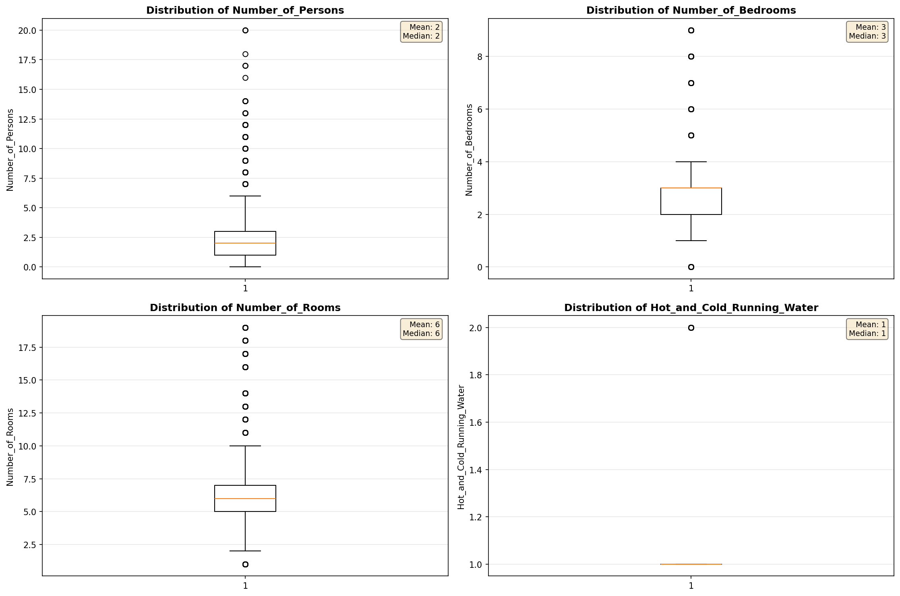

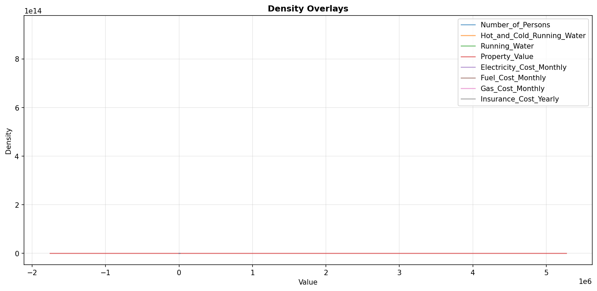

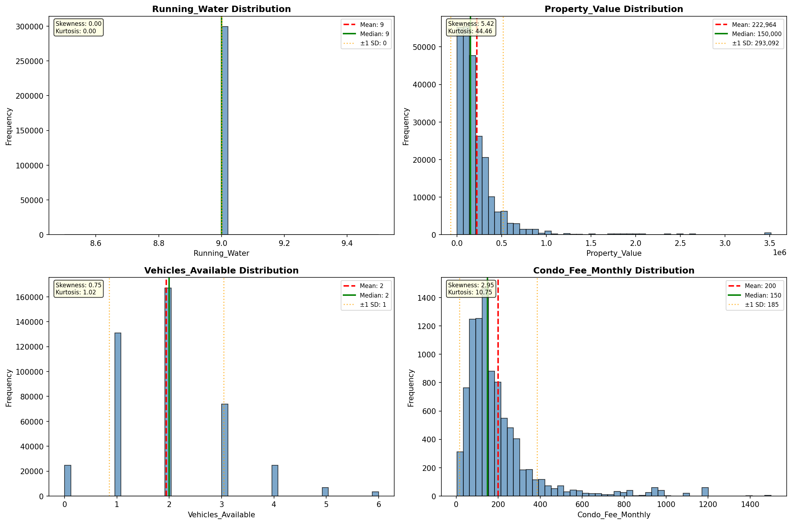

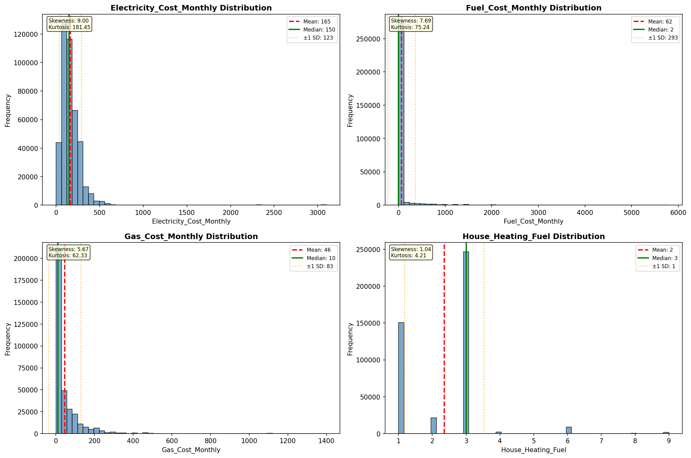

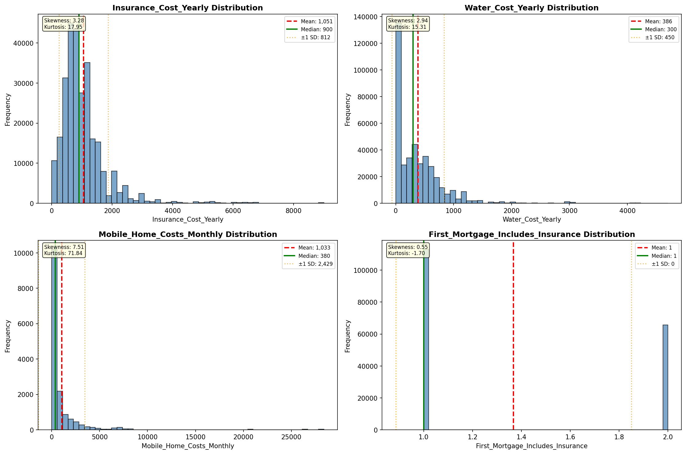

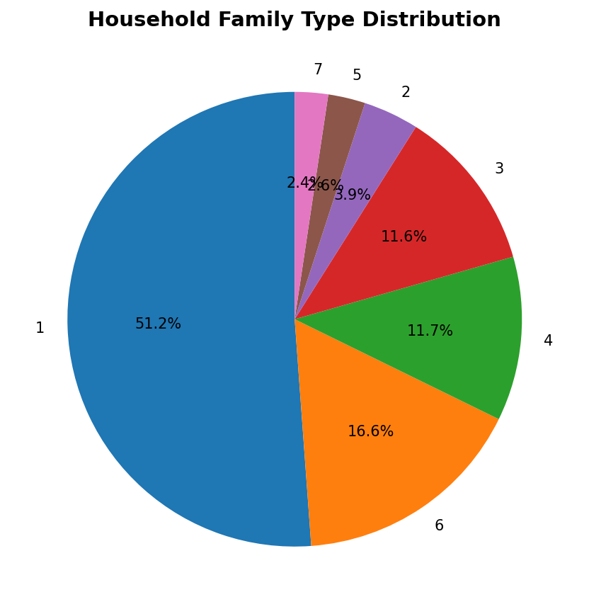

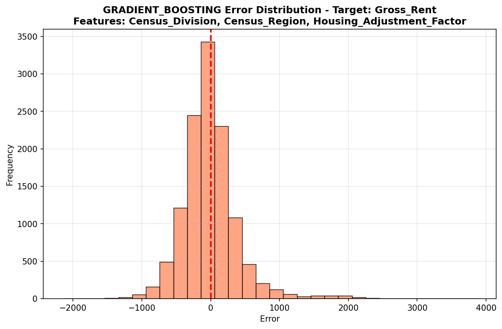

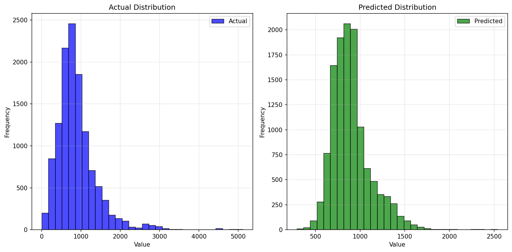

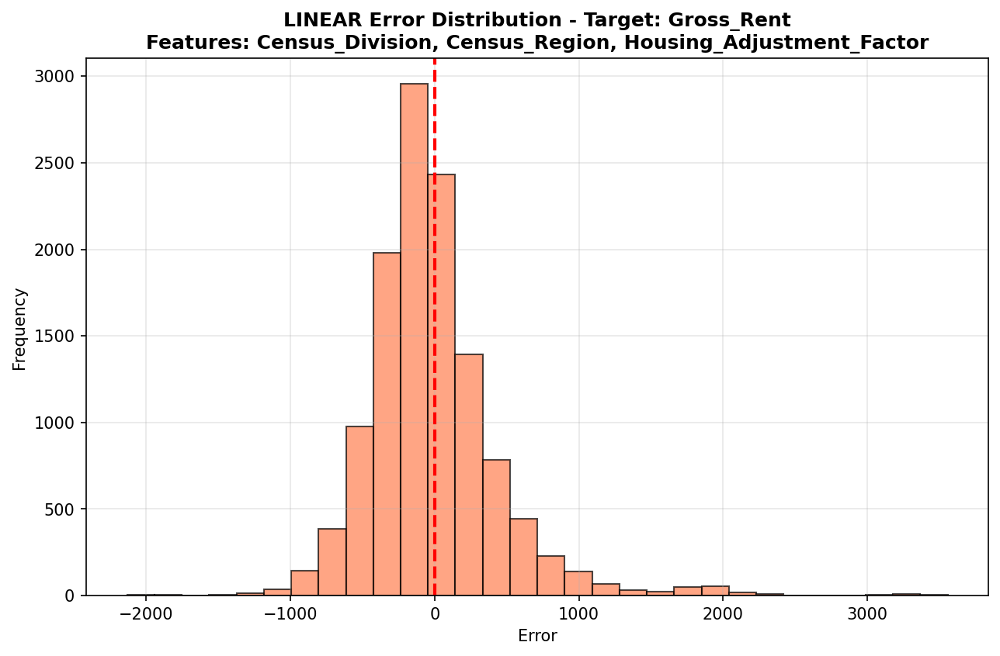

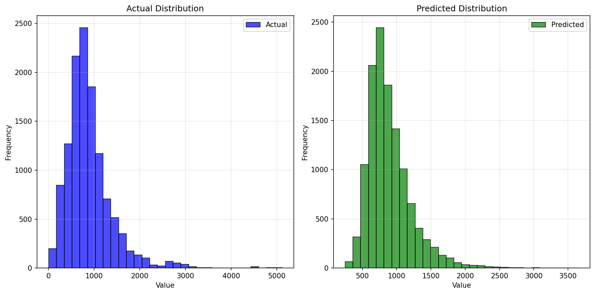

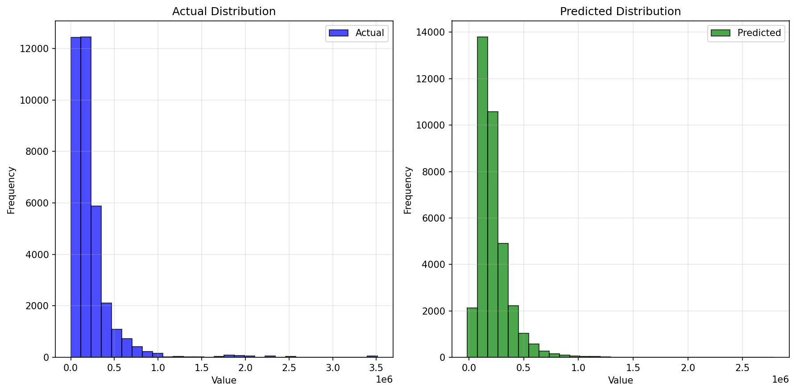

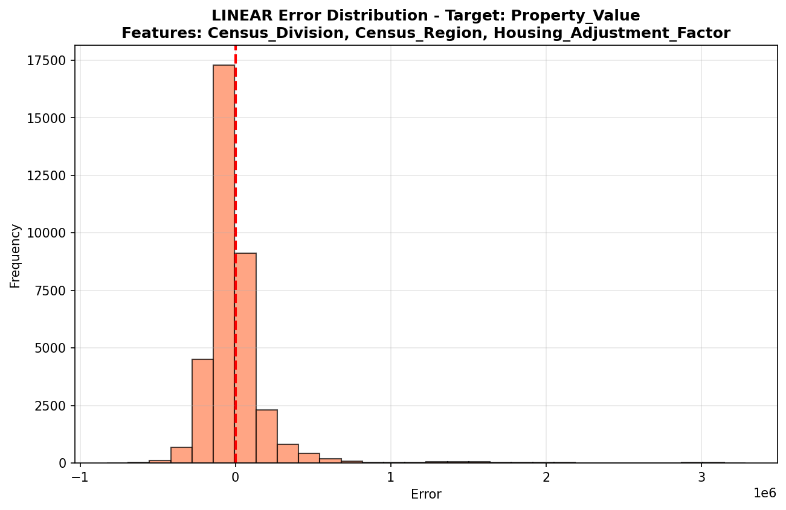

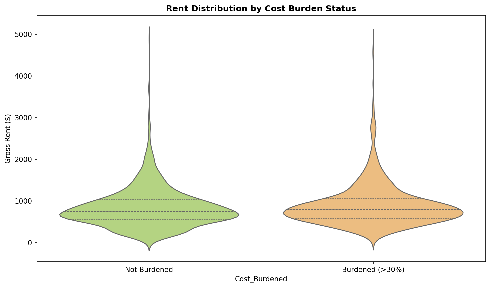

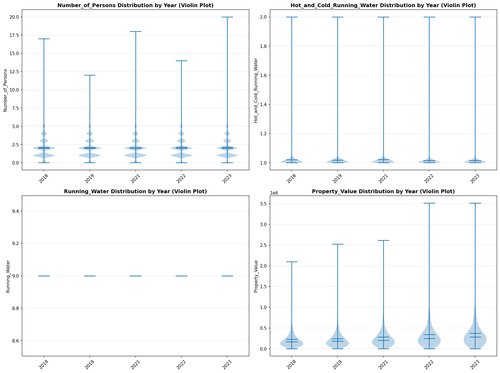

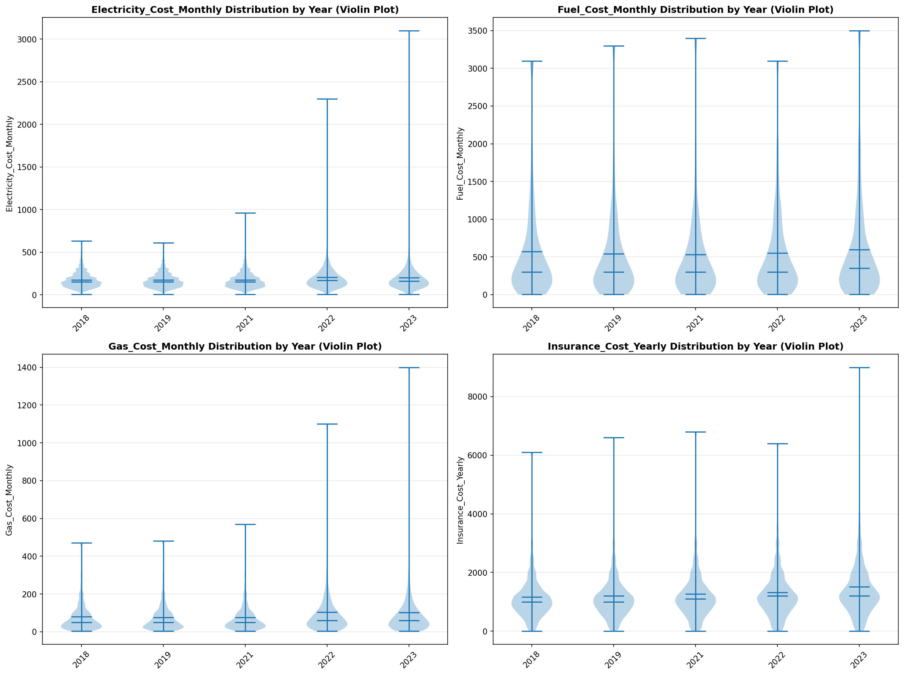

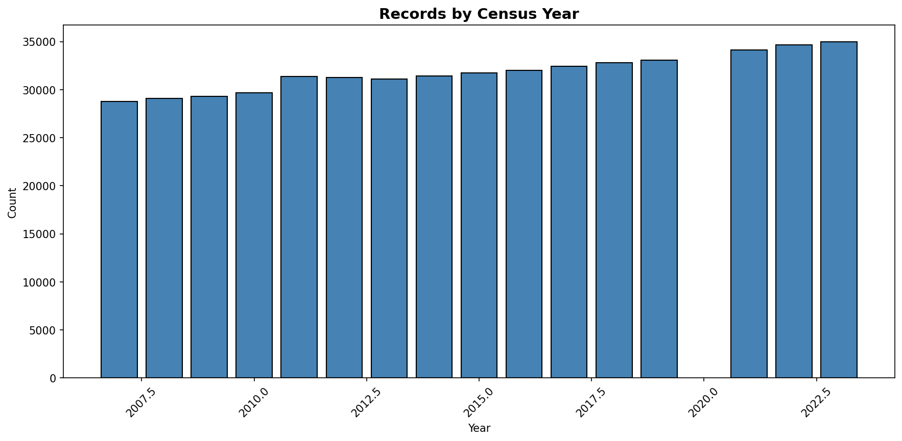
