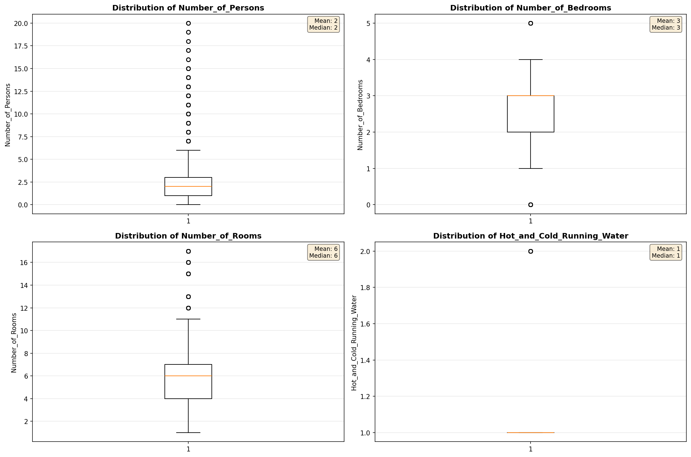
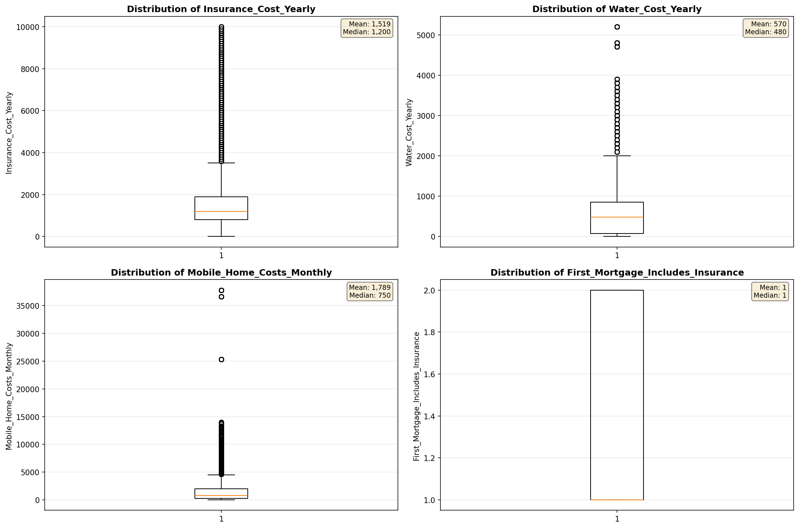
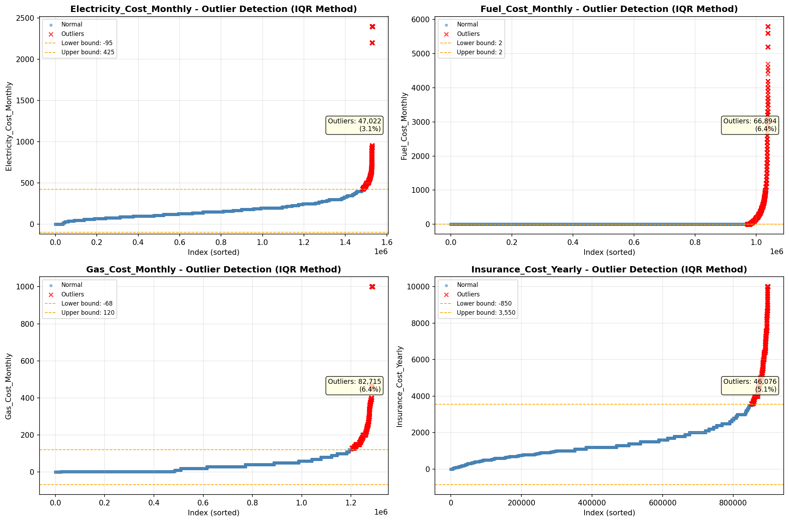
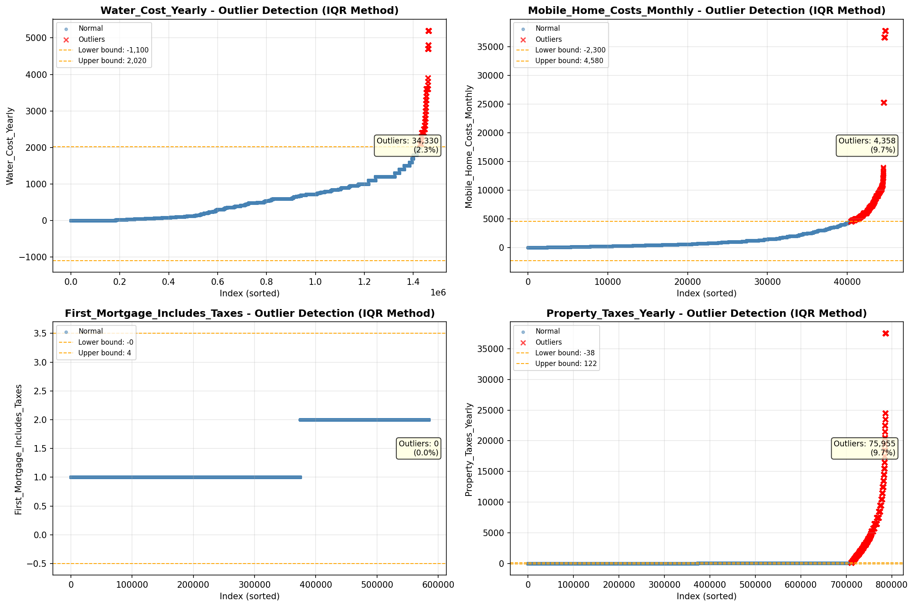

# Outlier Detection

> Statistical outlier detection using IQR (Interquartile Range) method. Outliers are values falling outside Q1 - 1.5×IQR or Q3 + 1.5×IQR bounds.

## Detection Methodology

| Parameter | Value | Description |
| :--- | :--- | :--- |
| Method | IQR | Outlier detection algorithm |
| Lower Bound | Q1 - 1.5 × IQR | Values below are outliers |
| Upper Bound | Q3 + 1.5 × IQR | Values above are outliers |
| IQR Definition | Q3 - Q1 | Interquartile Range |

> **Note**: The IQR method is robust to extreme values and works well for approximately symmetric distributions.

## Outlier Summary

_No outlier summary available._
## High Outlier Rate Variables

> Variables with outlier rate > 5% may indicate data quality issues, non-normal distributions, or genuinely extreme values.

- **('Flag_Family_Income', 22.10177530394473)**: 0 outliers (0.00%)

- **('Property_Tax_Rate', 20.38310136106243)**: 0 outliers (0.00%)

- **('Flag_Selected_Monthly_Owner_Costs', 19.653139198584228)**: 0 outliers (0.00%)

- **('Structure_Age', 11.459733683638316)**: 0 outliers (0.00%)

- **('Income_Adjustment_Factor', 10.009428801262994)**: 0 outliers (0.00%)

- **('Flag_Property_Taxes', 9.900094935297453)**: 0 outliers (0.00%)

- **('Mobile_Home_Costs_Monthly', 9.725941796107838)**: 0 outliers (0.00%)

- **('Property_Taxes_Yearly', 9.655783490777713)**: 0 outliers (0.00%)

- **('Gross_Rent_Percentage_Income', 9.41988924391638)**: 0 outliers (0.00%)

- **('Structure_Age_Score', 8.368987914614525)**: 0 outliers (0.00%)

- **('Owner_Costs_Percentage_Income', 7.59050661286707)**: 0 outliers (0.00%)

- **('Flag_Property_Value', 7.56503990090959)**: 0 outliers (0.00%)

- **('Flag_Water_Cost', 7.38537269156167)**: 0 outliers (0.00%)

- **('Flag_Gross_Rent', 6.5634486876641915)**: 0 outliers (0.00%)

- **('Fuel_Cost_Monthly', 6.444403126345715)**: 0 outliers (0.00%)

> *Consider investigating these variables for data entry errors, applying transformations, or using robust statistical methods.*

## Visualizations

