# Temporal Analysis

> Analysis of data patterns and trends over time, including year-over-year changes and growth rate calculations.

## Year Distribution

### Summary

- **Total Years**: 16

- **Year Range**: 2007 - 2023

- **Total Records**: 184,236

- **Average Records/Year**: 11,515

### Records by Year

| Year | Records | % of Total | Deviation from Avg |
| :--- | :--- | :--- | :--- |
| 2007 | 9,699 | 5.3% | -15.8% |
| 2008 | 9,888 | 5.4% | -14.1% |
| 2009 | 9,979 | 5.4% | -13.3% |
| 2010 | 10,280 | 5.6% | -10.7% |
| 2011 | 10,812 | 5.9% | -6.1% |
| 2012 | 10,779 | 5.9% | -6.4% |
| 2013 | 10,916 | 5.9% | -5.2% |
| 2014 | 11,017 | 6.0% | -4.3% |
| 2015 | 11,448 | 6.2% | -0.6% |
| 2016 | 11,568 | 6.3% | +0.5% |
| 2017 | 11,931 | 6.5% | +3.6% |
| 2018 | 12,233 | 6.6% | +6.2% |
| 2019 | 12,416 | 6.7% | +7.8% |
| 2021 | 13,351 | 7.2% | +15.9% |
| 2022 | 13,783 | 7.5% | +19.7% |
| 2023 | 14,136 | 7.7% | +22.8% |

> *Sample size increased by 45.7% from 2007 to 2023.*

## Sample Size Consistency

- **Standard Deviation**: 1,331 records

- **Coefficient of Variation**: 11.6 %

- **Consistency Rating**: moderately consistent

> *Some variation in sample sizes, but within acceptable range.*

## Temporal Trends

### Trend Summary

| Direction | Count | Percentage |
| :--- | :--- | :--- |
| Increasing | 0 | 0.0% |
| Decreasing | 0 | 0.0% |
| Stable/Other | 250 | 100.0% |

## Growth Rates

### Growth Rate Summary

- **Average Growth Rate**: 4,574.70 %

- **Variables with Positive Growth**: 1

- **Variables with Negative Growth**: 0

### Top Growth Rates

| Variable | Growth Rate | Direction |
| :--- | :--- | :--- |
| sample_growth | 4574.70% | Increasing |

## Visualizations

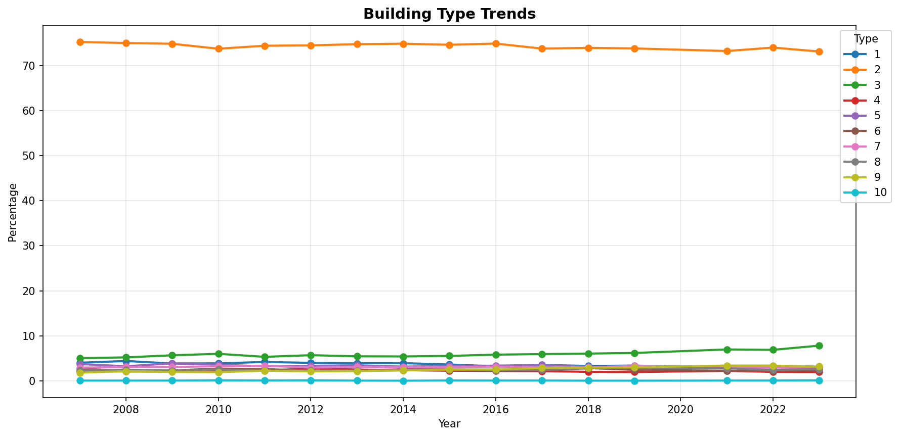

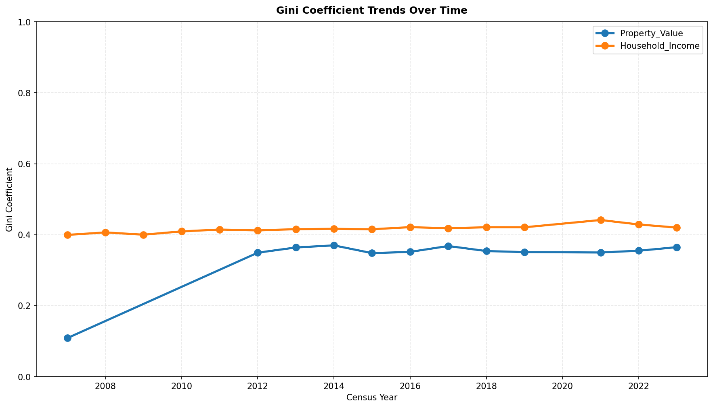

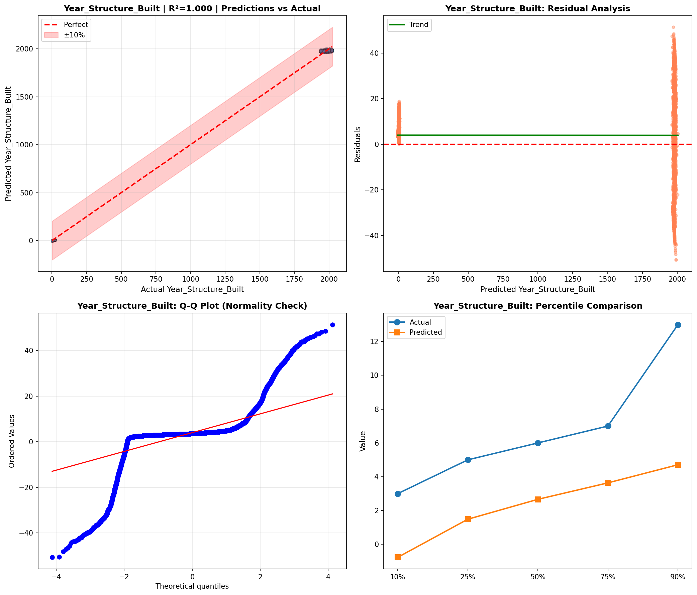

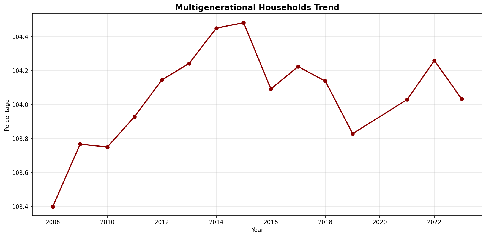

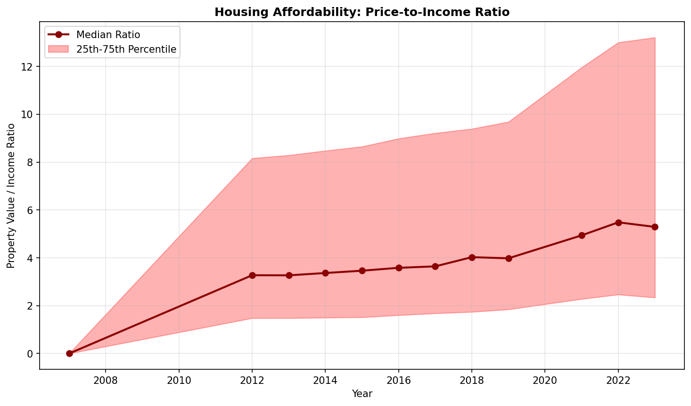

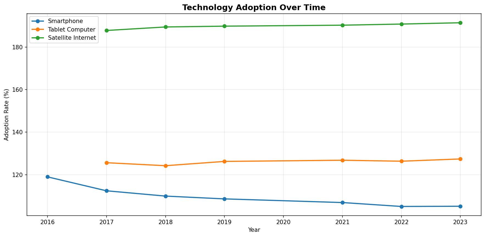

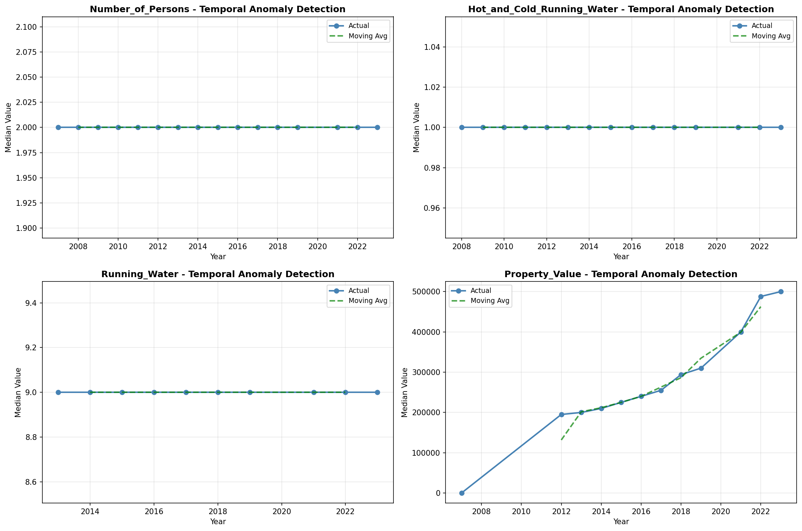

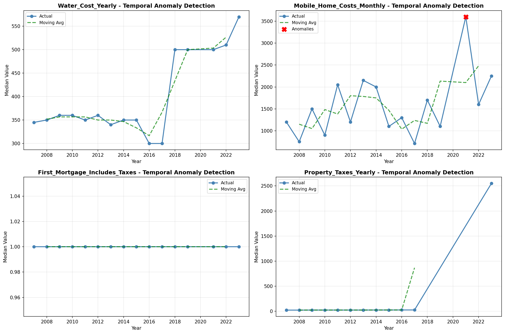

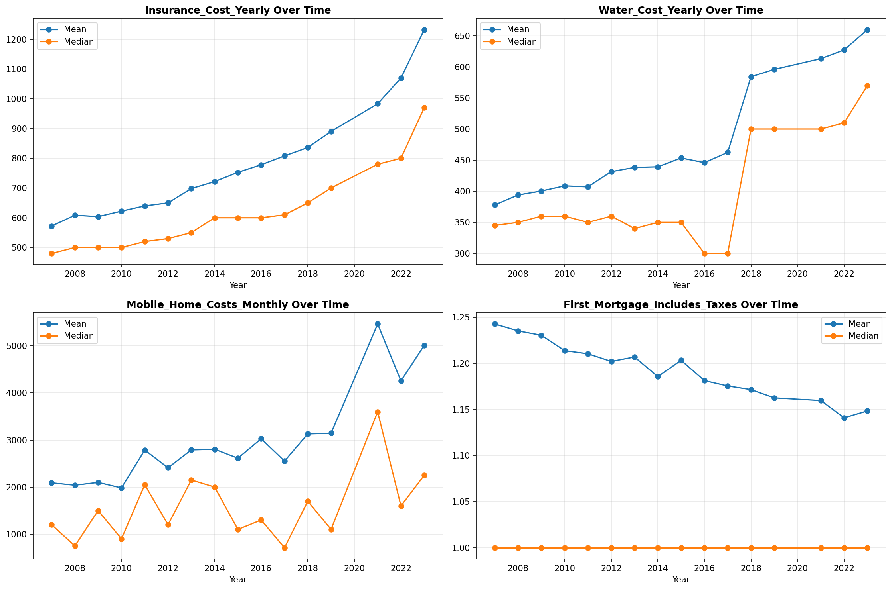

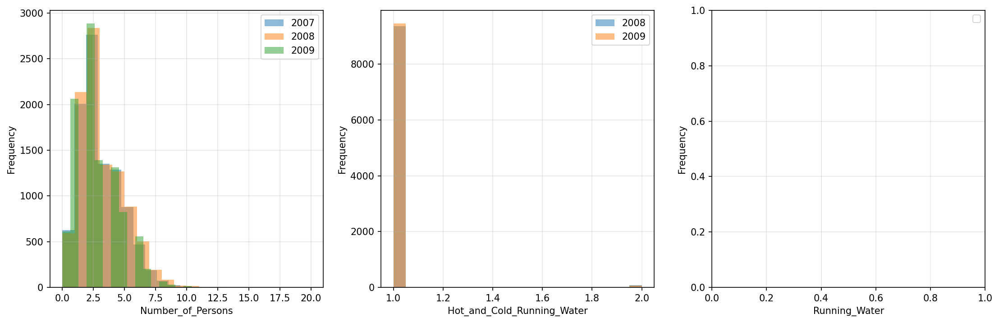

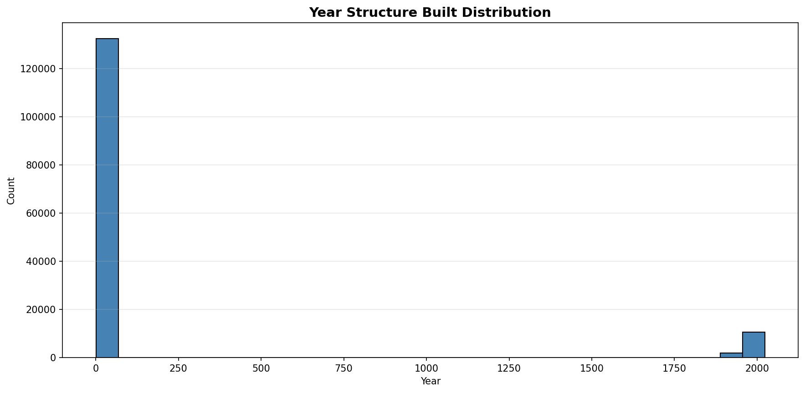

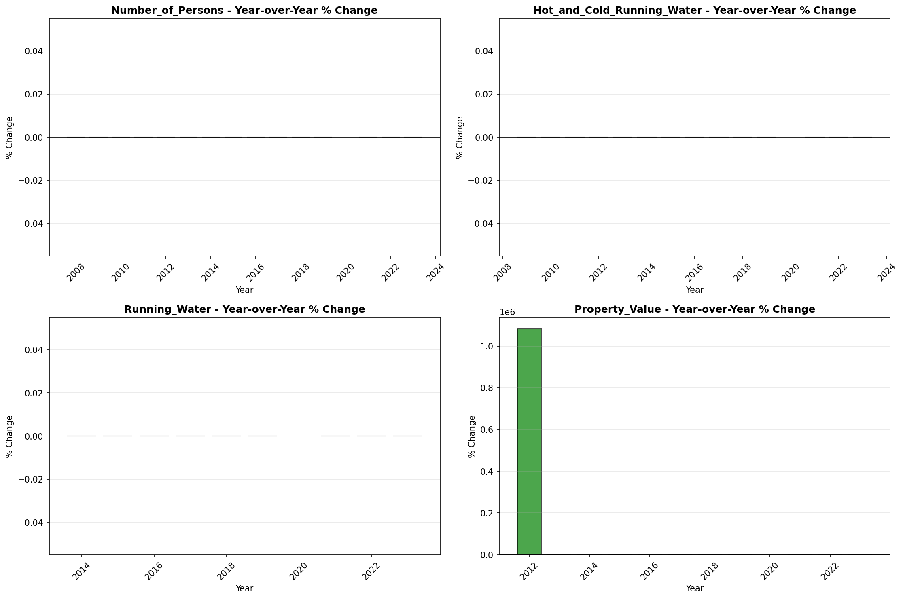

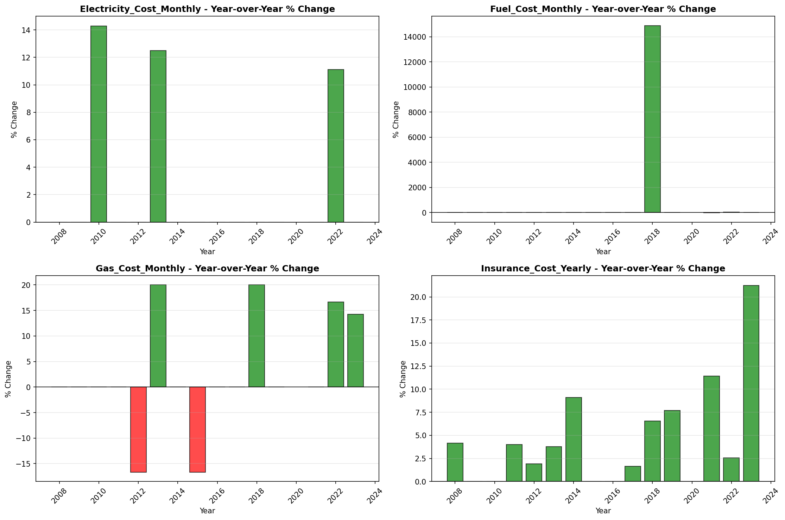

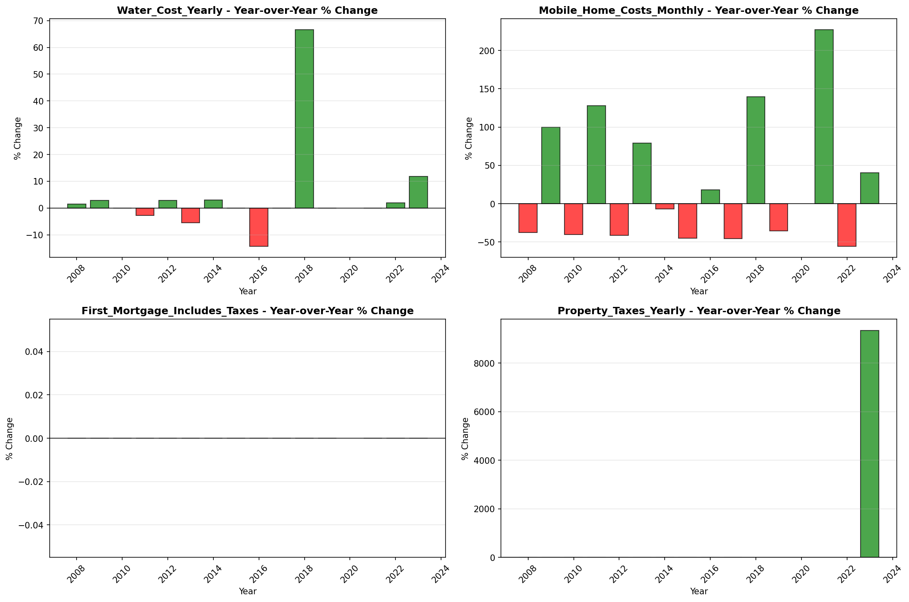
