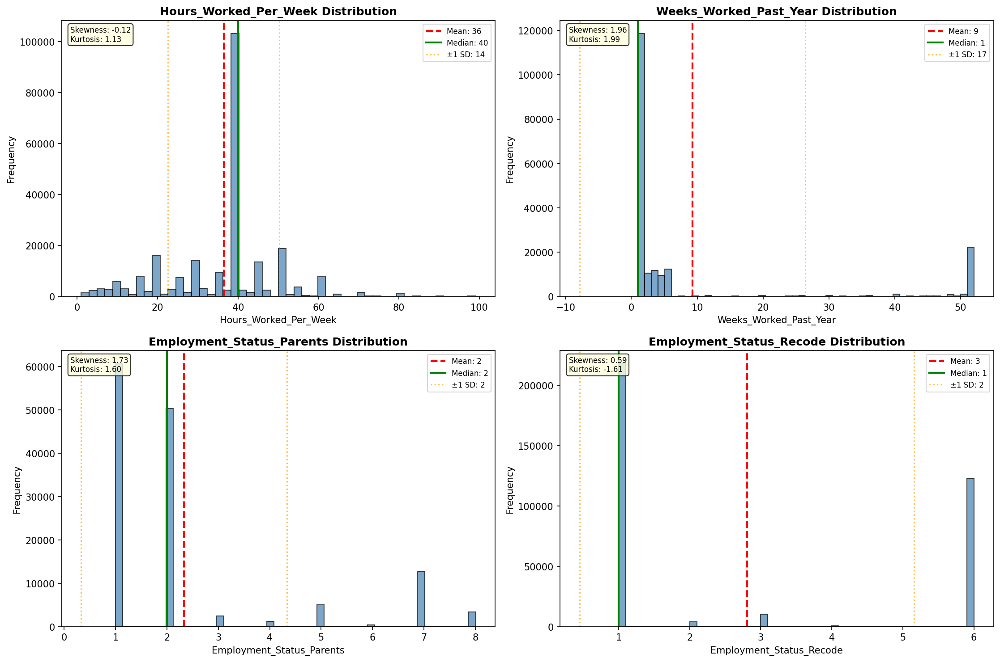
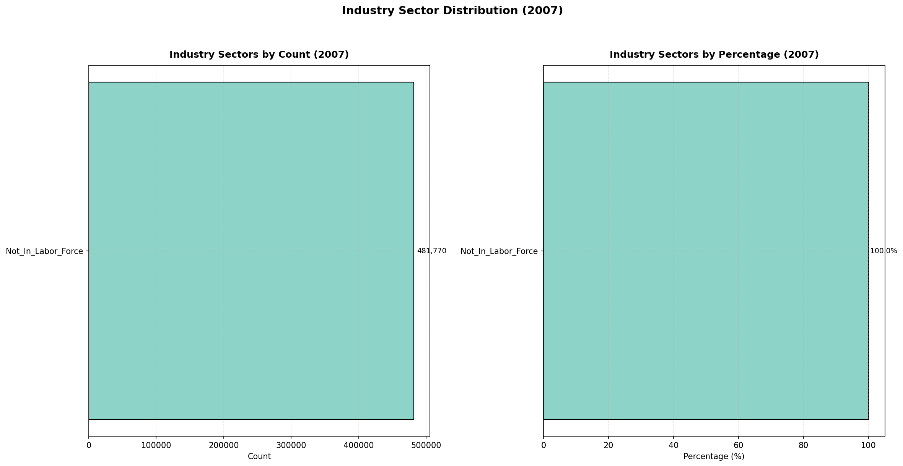
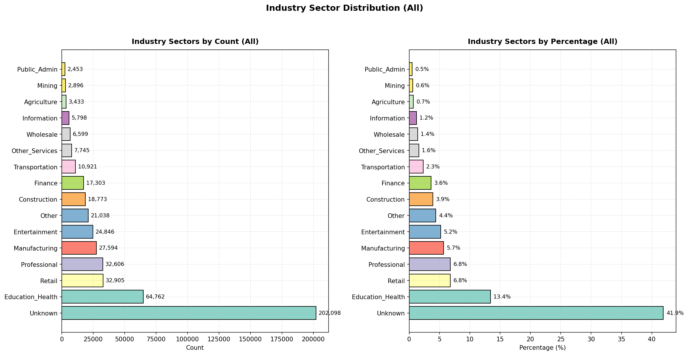
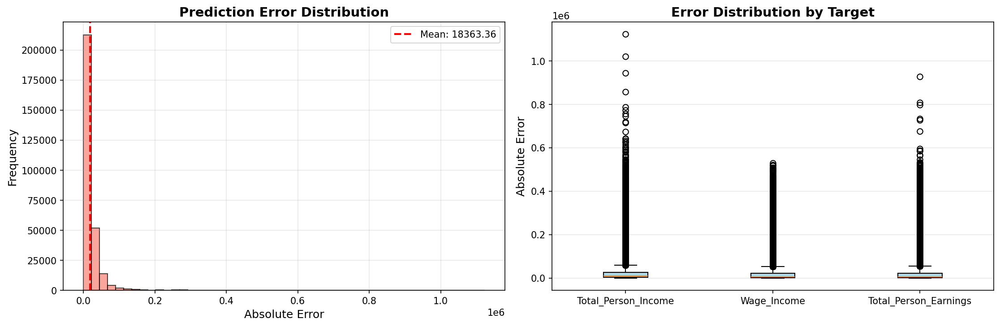
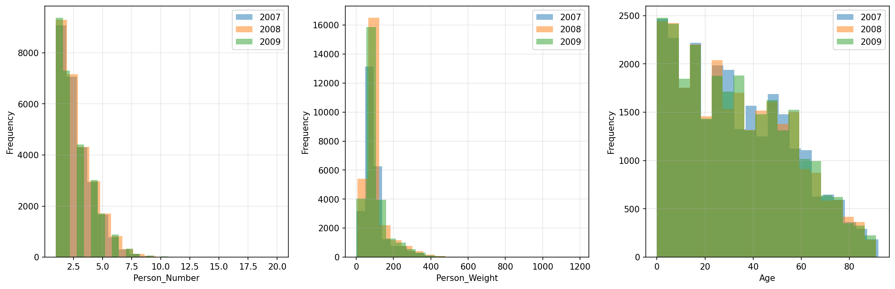
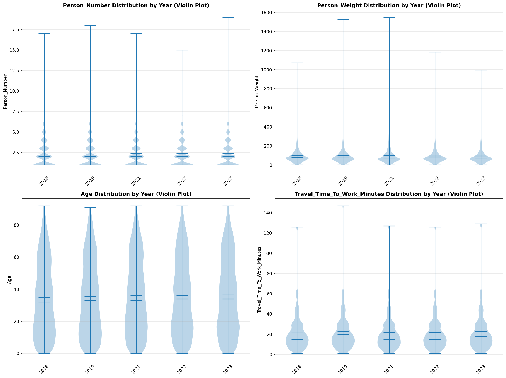
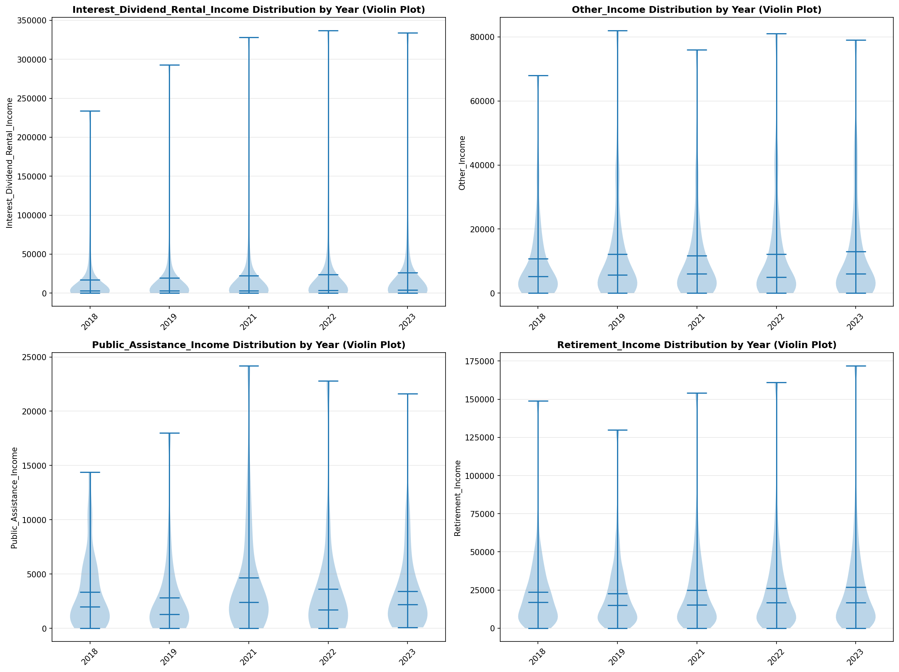

# Statistical Analysis

> Comprehensive descriptive statistics including central tendency, dispersion, distribution characteristics, and weighted statistics using ACS sample weights.

## Summary Statistics

- **Variables Analyzed**: 30

### Income_Adjustment_Factor

| Statistic | Unweighted | Weighted (ACS) |
| :--- | :--- | :--- |
| Mean | 1,015,503.53 | 1,014,834.00 |
| Median | 1,011,189.00 | 1,014,834.00 |
| Std Deviation | 11,213.64 | — |
| Minimum | 1,001,264.00 | — |
| Maximum | 1,042,311.00 | — |
| Count | 371,711 | — |

> *Distribution is highly right-skewed (skewness: 1.24), light-tailed/platykurtic (kurtosis: 0.64).*

- **Coefficient of Variation**: 1.1 % (low variability)

### Age

| Statistic | Unweighted | Weighted (ACS) |
| :--- | :--- | :--- |
| Mean | 34.74 | 32.88 |
| Median | 32.00 | 29.94 |
| Std Deviation | 23.07 | — |
| Minimum | 0.00 | — |
| Maximum | 92.00 | — |
| Count | 481,770 | — |

> *Distribution is approximately symmetric (skewness: 0.38), light-tailed/platykurtic (kurtosis: -0.87).*

- **Coefficient of Variation**: 66.4 % (high variability)

### Interest_Dividend_Rental_Income

| Statistic | Unweighted | Weighted (ACS) |
| :--- | :--- | :--- |
| Mean | 15,285.51 | 15,007.08 |
| Median | 1,700.00 | 1,934.38 |
| Std Deviation | 45,013.35 | — |
| Minimum | 1.00 | — |
| Maximum | 337,000.00 | — |
| Count | 45,848 | — |

> *Distribution is highly right-skewed (skewness: 5.03), heavy-tailed/leptokurtic (kurtosis: 27.21).*

- **Coefficient of Variation**: 294.5 % (very high variability)

### Other_Income

| Statistic | Unweighted | Weighted (ACS) |
| :--- | :--- | :--- |
| Mean | 9,986.13 | 9,947.61 |
| Median | 4,800.00 | 4,887.50 |
| Std Deviation | 14,208.43 | — |
| Minimum | 4.00 | — |
| Maximum | 82,000.00 | — |
| Count | 20,308 | — |

> *Distribution is highly right-skewed (skewness: 2.67), heavy-tailed/leptokurtic (kurtosis: 7.80).*

- **Coefficient of Variation**: 142.3 % (very high variability)

### Public_Assistance_Income

| Statistic | Unweighted | Weighted (ACS) |
| :--- | :--- | :--- |
| Mean | 3,205.61 | 3,144.75 |
| Median | 1,600.00 | 1,618.75 |
| Std Deviation | 4,373.14 | — |
| Minimum | 10.00 | — |
| Maximum | 30,000.00 | — |
| Count | 3,243 | — |

> *Distribution is highly right-skewed (skewness: 2.92), heavy-tailed/leptokurtic (kurtosis: 10.69).*

- **Coefficient of Variation**: 136.4 % (very high variability)

### Retirement_Income

| Statistic | Unweighted | Weighted (ACS) |
| :--- | :--- | :--- |
| Mean | 22,610.39 | 22,119.70 |
| Median | 15,000.00 | 14,875.00 |
| Std Deviation | 25,793.22 | — |
| Minimum | 4.00 | — |
| Maximum | 181,000.00 | — |
| Count | 38,110 | — |

> *Distribution is highly right-skewed (skewness: 2.96), heavy-tailed/leptokurtic (kurtosis: 11.74).*

- **Coefficient of Variation**: 114.1 % (very high variability)

### Self_Employment_Income

| Statistic | Unweighted | Weighted (ACS) |
| :--- | :--- | :--- |
| Mean | 28,942.07 | 28,838.94 |
| Median | 10,000.00 | 11,431.25 |
| Std Deviation | 56,226.77 | — |
| Minimum | 1.00 | — |
| Maximum | 495,000.00 | — |
| Count | 22,733 | — |

> *Distribution is highly right-skewed (skewness: 4.34), heavy-tailed/leptokurtic (kurtosis: 22.90).*

- **Coefficient of Variation**: 194.3 % (very high variability)

### Supplemental_Security_Income

| Statistic | Unweighted | Weighted (ACS) |
| :--- | :--- | :--- |
| Mean | 9,028.33 | 8,738.23 |
| Median | 8,100.00 | 8,281.25 |
| Std Deviation | 5,506.45 | — |
| Minimum | 1,000.00 | — |
| Maximum | 30,000.00 | — |
| Count | 7,115 | — |

> *Distribution is highly right-skewed (skewness: 1.32), light-tailed/platykurtic (kurtosis: 1.98).*

- **Coefficient of Variation**: 61.0 % (high variability)

### Social_Security_Income

| Statistic | Unweighted | Weighted (ACS) |
| :--- | :--- | :--- |
| Mean | 13,935.90 | 13,596.07 |
| Median | 13,000.00 | 12,856.25 |
| Std Deviation | 8,098.33 | — |
| Minimum | 4.00 | — |
| Maximum | 50,000.00 | — |
| Count | 63,370 | — |

> *Distribution is moderately right-skewed (skewness: 0.82), light-tailed/platykurtic (kurtosis: 1.00).*

- **Coefficient of Variation**: 58.1 % (high variability)

### Wage_Income

| Statistic | Unweighted | Weighted (ACS) |
| :--- | :--- | :--- |
| Mean | 43,868.13 | 41,911.04 |
| Median | 30,000.00 | 29,862.50 |
| Std Deviation | 53,905.91 | — |
| Minimum | 4.00 | — |
| Maximum | 536,000.00 | — |
| Count | 236,932 | — |

> *Distribution is highly right-skewed (skewness: 4.12), heavy-tailed/leptokurtic (kurtosis: 25.41).*

- **Coefficient of Variation**: 122.9 % (very high variability)

### Hours_Worked_Per_Week

| Statistic | Unweighted | Weighted (ACS) |
| :--- | :--- | :--- |
| Mean | 36.41 | 36.83 |
| Median | 40.00 | 40.00 |
| Std Deviation | 13.87 | — |
| Minimum | 1.00 | — |
| Maximum | 99.00 | — |
| Count | 249,018 | — |

> *Distribution is approximately symmetric (skewness: -0.12), light-tailed/platykurtic (kurtosis: 1.13).*

- **Coefficient of Variation**: 38.1 % (moderate variability)

### Presence_And_Age_Own_Children

| Statistic | Unweighted | Weighted (ACS) |
| :--- | :--- | :--- |
| Mean | 3.36 | 3.33 |
| Median | 4.00 | 4.00 |
| Std Deviation | 1.01 | — |
| Minimum | 1.00 | — |
| Maximum | 4.00 | — |
| Count | 174,073 | — |

> *Distribution is highly left-skewed (skewness: -1.20), light-tailed/platykurtic (kurtosis: -0.07).*

- **Coefficient of Variation**: 30.0 % (moderate variability)

### Total_Person_Earnings

| Statistic | Unweighted | Weighted (ACS) |
| :--- | :--- | :--- |
| Mean | 44,426.98 | 42,430.03 |
| Median | 30,000.00 | 29,731.25 |
| Std Deviation | 56,898.64 | — |
| Minimum | 1.00 | — |
| Maximum | 989,000.00 | — |
| Count | 248,658 | — |

> *Distribution is highly right-skewed (skewness: 4.42), heavy-tailed/leptokurtic (kurtosis: 30.50).*

- **Coefficient of Variation**: 128.1 % (very high variability)

### Total_Person_Income

| Statistic | Unweighted | Weighted (ACS) |
| :--- | :--- | :--- |
| Mean | 43,438.89 | 41,705.19 |
| Median | 28,800.00 | 28,306.25 |
| Std Deviation | 57,658.42 | — |
| Minimum | 1.00 | — |
| Maximum | 1,218,000.00 | — |
| Count | 316,882 | — |

> *Distribution is highly right-skewed (skewness: 4.76), heavy-tailed/leptokurtic (kurtosis: 36.76).*

- **Coefficient of Variation**: 132.7 % (very high variability)

### Poverty_Status

| Statistic | Unweighted | Weighted (ACS) |
| :--- | :--- | :--- |
| Mean | 318.86 | 308.68 |
| Median | 321.00 | 307.56 |
| Std Deviation | 152.30 | — |
| Minimum | 0.00 | — |
| Maximum | 501.00 | — |
| Count | 467,696 | — |

> *Distribution is approximately symmetric (skewness: -0.26), light-tailed/platykurtic (kurtosis: -1.16).*

- **Coefficient of Variation**: 47.8 % (moderate variability)

### Flag_Age

| Statistic | Unweighted | Weighted (ACS) |
| :--- | :--- | :--- |
| Mean | 0.01 | 0.02 |
| Median | 0.00 | 0.00 |
| Std Deviation | 0.11 | — |
| Minimum | 0.00 | — |
| Maximum | 1.00 | — |
| Count | 481,770 | — |

> *Distribution is highly right-skewed (skewness: 8.53), heavy-tailed/leptokurtic (kurtosis: 70.70).*

- **Coefficient of Variation**: 864.2 % (very high variability)

### Flag_Interest_Dividend_Income

| Statistic | Unweighted | Weighted (ACS) |
| :--- | :--- | :--- |
| Mean | 0.09 | 0.08 |
| Median | 0.00 | 0.00 |
| Std Deviation | 0.28 | — |
| Minimum | 0.00 | — |
| Maximum | 1.00 | — |
| Count | 481,770 | — |

> *Distribution is highly right-skewed (skewness: 2.92), heavy-tailed/leptokurtic (kurtosis: 6.52).*

- **Coefficient of Variation**: 322.8 % (very high variability)

### Flag_Other_Income

| Statistic | Unweighted | Weighted (ACS) |
| :--- | :--- | :--- |
| Mean | 0.08 | 0.07 |
| Median | 0.00 | 0.00 |
| Std Deviation | 0.27 | — |
| Minimum | 0.00 | — |
| Maximum | 1.00 | — |
| Count | 481,770 | — |

> *Distribution is highly right-skewed (skewness: 3.18), heavy-tailed/leptokurtic (kurtosis: 8.09).*

- **Coefficient of Variation**: 346.4 % (very high variability)

### Flag_Retirement_Income

| Statistic | Unweighted | Weighted (ACS) |
| :--- | :--- | :--- |
| Mean | 0.08 | 0.08 |
| Median | 0.00 | 0.00 |
| Std Deviation | 0.27 | — |
| Minimum | 0.00 | — |
| Maximum | 1.00 | — |
| Count | 481,770 | — |

> *Distribution is highly right-skewed (skewness: 3.10), heavy-tailed/leptokurtic (kurtosis: 7.60).*

- **Coefficient of Variation**: 339.4 % (very high variability)

### Flag_Self_Employment_Income

| Statistic | Unweighted | Weighted (ACS) |
| :--- | :--- | :--- |
| Mean | 0.06 | 0.06 |
| Median | 0.00 | 0.00 |
| Std Deviation | 0.23 | — |
| Minimum | 0.00 | — |
| Maximum | 1.00 | — |
| Count | 481,770 | — |

> *Distribution is highly right-skewed (skewness: 3.79), heavy-tailed/leptokurtic (kurtosis: 12.39).*

- **Coefficient of Variation**: 404.1 % (very high variability)

### Flag_Social_Security_Income

| Statistic | Unweighted | Weighted (ACS) |
| :--- | :--- | :--- |
| Mean | 0.08 | 0.08 |
| Median | 0.00 | 0.00 |
| Std Deviation | 0.28 | — |
| Minimum | 0.00 | — |
| Maximum | 1.00 | — |
| Count | 481,770 | — |

> *Distribution is highly right-skewed (skewness: 3.01), heavy-tailed/leptokurtic (kurtosis: 7.09).*

- **Coefficient of Variation**: 331.6 % (very high variability)

### Flag_Supplemental_Security_Income

| Statistic | Unweighted | Weighted (ACS) |
| :--- | :--- | :--- |
| Mean | 0.07 | 0.07 |
| Median | 0.00 | 0.00 |
| Std Deviation | 0.26 | — |
| Minimum | 0.00 | — |
| Maximum | 1.00 | — |
| Count | 481,770 | — |

> *Distribution is highly right-skewed (skewness: 3.25), heavy-tailed/leptokurtic (kurtosis: 8.59).*

- **Coefficient of Variation**: 353.7 % (very high variability)

### Flag_Wage_Income

| Statistic | Unweighted | Weighted (ACS) |
| :--- | :--- | :--- |
| Mean | 0.10 | 0.12 |
| Median | 0.00 | 0.00 |
| Std Deviation | 0.31 | — |
| Minimum | 0.00 | — |
| Maximum | 1.00 | — |
| Count | 481,770 | — |

> *Distribution is highly right-skewed (skewness: 2.60), heavy-tailed/leptokurtic (kurtosis: 4.73).*

- **Coefficient of Variation**: 293.6 % (very high variability)

### Flag_Hours_Worked

| Statistic | Unweighted | Weighted (ACS) |
| :--- | :--- | :--- |
| Mean | 0.05 | 0.05 |
| Median | 0.00 | 0.00 |
| Std Deviation | 0.22 | — |
| Minimum | 0.00 | — |
| Maximum | 1.00 | — |
| Count | 481,770 | — |

> *Distribution is highly right-skewed (skewness: 4.19), heavy-tailed/leptokurtic (kurtosis: 15.57).*

- **Coefficient of Variation**: 441.9 % (very high variability)

### Income_Per_Hour

| Statistic | Unweighted | Weighted (ACS) |
| :--- | :--- | :--- |
| Mean | 25.62 | 23.79 |
| Median | 16.83 | 16.08 |
| Std Deviation | 67.91 | — |
| Minimum | 0.00 | — |
| Maximum | 16,792.31 | — |
| Count | 248,780 | — |

> *Distribution is highly right-skewed (skewness: 92.51), heavy-tailed/leptokurtic (kurtosis: 17557.73).*

- **Coefficient of Variation**: 265.1 % (very high variability)

### Income_Per_Week_Worked

| Statistic | Unweighted | Weighted (ACS) |
| :--- | :--- | :--- |
| Mean | 33,243.32 | 32,418.12 |
| Median | 18,000.00 | 21,943.59 |
| Std Deviation | 50,279.74 | — |
| Minimum | 0.02 | — |
| Maximum | 973,000.00 | — |
| Count | 195,074 | — |

> *Distribution is highly right-skewed (skewness: 4.21), heavy-tailed/leptokurtic (kurtosis: 28.49).*

- **Coefficient of Variation**: 151.2 % (very high variability)

### Total_Annual_Hours

| Statistic | Unweighted | Weighted (ACS) |
| :--- | :--- | :--- |
| Mean | 343.49 | 319.70 |
| Median | 45.00 | 353.85 |
| Std Deviation | 714.36 | — |
| Minimum | 1.00 | — |
| Maximum | 5,148.00 | — |
| Count | 195,272 | — |

> *Distribution is highly right-skewed (skewness: 2.47), heavy-tailed/leptokurtic (kurtosis: 5.19).*

- **Coefficient of Variation**: 208.0 % (very high variability)

### In_Poverty

| Statistic | Unweighted | Weighted (ACS) |
| :--- | :--- | :--- |
| Mean | 0.30 | 0.30 |
| Median | 0.00 | 0.00 |
| Std Deviation | 0.46 | — |
| Minimum | 0.00 | — |
| Maximum | 1.00 | — |
| Count | 481,770 | — |

> *Distribution is moderately right-skewed (skewness: 0.87), light-tailed/platykurtic (kurtosis: -1.24).*

- **Coefficient of Variation**: 152.7 % (very high variability)

### Poverty_Gap

| Statistic | Unweighted | Weighted (ACS) |
| :--- | :--- | :--- |
| Mean | 0.28 | 0.28 |
| Median | 0.00 | 0.00 |
| Std Deviation | 0.40 | — |
| Minimum | 0.00 | — |
| Maximum | 2.04 | — |
| Count | 364,317 | — |

> *Distribution is moderately right-skewed (skewness: 0.96), light-tailed/platykurtic (kurtosis: -0.82).*

- **Coefficient of Variation**: 142.6 % (very high variability)

### Poverty_Severity

| Statistic | Unweighted | Weighted (ACS) |
| :--- | :--- | :--- |
| Mean | 0.24 | 0.23 |
| Median | 0.00 | 0.00 |
| Std Deviation | 0.38 | — |
| Minimum | 0.00 | — |
| Maximum | 4.16 | — |
| Count | 364,317 | — |

> *Distribution is highly right-skewed (skewness: 1.30), light-tailed/platykurtic (kurtosis: 0.16).*

- **Coefficient of Variation**: 161.9 % (very high variability)

## Distribution Analysis

### Skewed Distributions

> Variables with skewness > |0.5| indicate non-normal distributions. Consider log transformations for highly skewed variables in modeling.

| Variable | Skewness | Direction | Severity |
| :--- | :--- | :--- | :--- |
| Income_Per_Hour | 92.515 | Right-skewed | High |
| Flag_Age | 8.527 | Right-skewed | High |
| Interest_Dividend_Rental_Income | 5.027 | Right-skewed | High |
| Total_Person_Income | 4.759 | Right-skewed | High |
| Total_Person_Earnings | 4.418 | Right-skewed | High |
| Self_Employment_Income | 4.344 | Right-skewed | High |
| Income_Per_Week_Worked | 4.215 | Right-skewed | High |
| Flag_Hours_Worked | 4.192 | Right-skewed | High |
| Wage_Income | 4.116 | Right-skewed | High |
| Flag_Self_Employment_Income | 3.794 | Right-skewed | High |
| Flag_Supplemental_Security_Income | 3.254 | Right-skewed | High |
| Flag_Other_Income | 3.176 | Right-skewed | High |
| Flag_Retirement_Income | 3.099 | Right-skewed | High |
| Flag_Social_Security_Income | 3.014 | Right-skewed | High |
| Retirement_Income | 2.964 | Right-skewed | High |
| Public_Assistance_Income | 2.920 | Right-skewed | High |
| Flag_Interest_Dividend_Income | 2.918 | Right-skewed | High |
| Other_Income | 2.669 | Right-skewed | High |
| Flag_Wage_Income | 2.595 | Right-skewed | High |
| Total_Annual_Hours | 2.468 | Right-skewed | High |

- **Total Skewed Variables**: 27

- **Right-skewed**: 26

- **Left-skewed**: 1

## Variance Analysis

### Coefficient of Variation Ranking

> CV (Coefficient of Variation) = (Std Dev / Mean) × 100%. Higher CV indicates greater relative variability.

| Variable | CV (%) | Std Dev | Mean | Variability |
| :--- | :--- | :--- | :--- | :--- |
| Flag_Age | 864.2% | 0.11 | 0.01 | Very High |
| Flag_Hours_Worked | 441.9% | 0.22 | 0.05 | Very High |
| Flag_Self_Employment_Income | 404.1% | 0.23 | 0.06 | Very High |
| Flag_Supplemental_Security_Income | 353.7% | 0.26 | 0.07 | Very High |
| Flag_Other_Income | 346.4% | 0.27 | 0.08 | Very High |
| Flag_Retirement_Income | 339.4% | 0.27 | 0.08 | Very High |
| Flag_Social_Security_Income | 331.6% | 0.28 | 0.08 | Very High |
| Flag_Interest_Dividend_Income | 322.8% | 0.28 | 0.09 | Very High |
| Interest_Dividend_Rental_Income | 294.5% | 45,013.35 | 15,285.51 | Very High |
| Flag_Wage_Income | 293.6% | 0.31 | 0.10 | Very High |
| Income_Per_Hour | 265.1% | 67.91 | 25.62 | Very High |
| Total_Annual_Hours | 208.0% | 714.36 | 343.49 | Very High |
| Self_Employment_Income | 194.3% | 56,226.77 | 28,942.07 | Very High |
| Poverty_Severity | 161.9% | 0.38 | 0.24 | Very High |
| In_Poverty | 152.7% | 0.46 | 0.30 | Very High |
| Income_Per_Week_Worked | 151.2% | 50,279.74 | 33,243.32 | Very High |
| Poverty_Gap | 142.6% | 0.40 | 0.28 | Very High |
| Other_Income | 142.3% | 14,208.43 | 9,986.13 | Very High |
| Public_Assistance_Income | 136.4% | 4,373.14 | 3,205.61 | Very High |
| Total_Person_Income | 132.7% | 57,658.42 | 43,438.89 | Very High |

- **Average CV**: 211.6 %

- **High Variance Variables (CV > 50%)**: 26

## Visualizations

