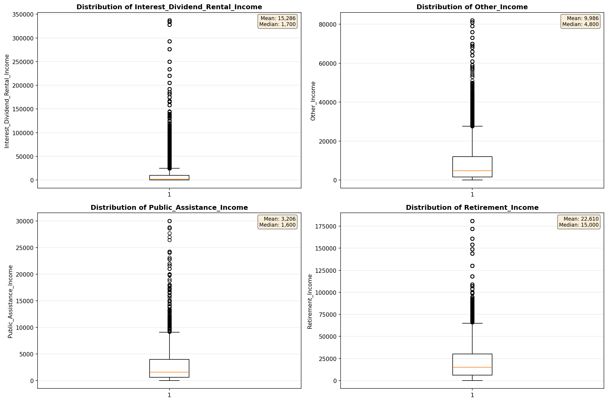
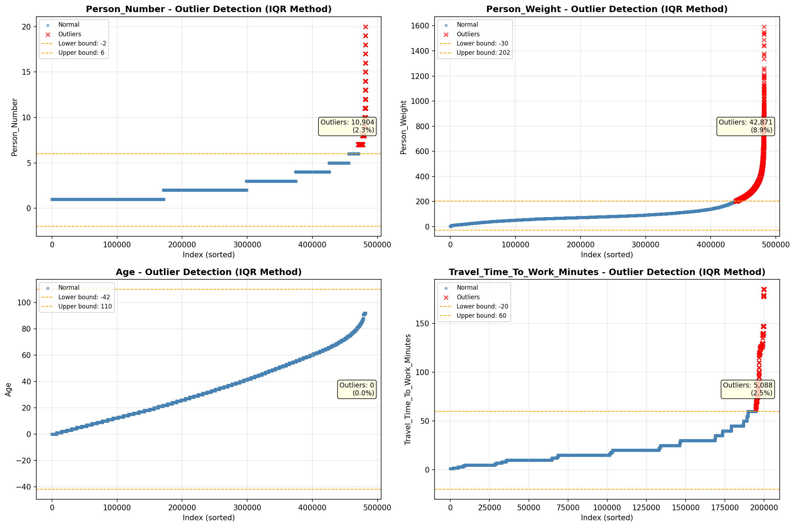

# Outlier Detection

> Statistical outlier detection using IQR (Interquartile Range) method. Outliers are values falling outside Q1 - 1.5×IQR or Q3 + 1.5×IQR bounds.

## Detection Methodology

| Parameter | Value | Description |
| :--- | :--- | :--- |
| Method | IQR | Outlier detection algorithm |
| Lower Bound | Q1 - 1.5 × IQR | Values below are outliers |
| Upper Bound | Q3 + 1.5 × IQR | Values above are outliers |
| IQR Definition | Q3 - Q1 | Interquartile Range |

> **Note**: The IQR method is robust to extreme values and works well for approximately symmetric distributions.

## Outlier Summary

_No outlier summary available._
## High Outlier Rate Variables

> Variables with outlier rate > 5% may indicate data quality issues, non-normal distributions, or genuinely extreme values.

- **('Total_Annual_Hours', 16.60657954033348)**: 0 outliers (0.00%)

- **('Hours_Worked_Per_Week', 13.325542731850708)**: 0 outliers (0.00%)

- **('Interest_Dividend_Rental_Income', 12.153201884487872)**: 0 outliers (0.00%)

- **('Flag_Wage_Income', 10.397077443593417)**: 0 outliers (0.00%)

- **('Income_Adjustment_Factor', 9.560384277032426)**: 0 outliers (0.00%)

- **('Other_Income', 9.183572976167028)**: 0 outliers (0.00%)

- **('Self_Employment_Income', 8.991334183785685)**: 0 outliers (0.00%)

- **('Flag_Interest_Dividend_Income', 8.755630280009132)**: 0 outliers (0.00%)

- **('Flag_Social_Security_Income', 8.336550636195696)**: 0 outliers (0.00%)

- **('Flag_Retirement_Income', 7.989704630840443)**: 0 outliers (0.00%)

- **('Public_Assistance_Income', 7.893925377736663)**: 0 outliers (0.00%)

- **('Flag_Other_Income', 7.69080681653071)**: 0 outliers (0.00%)

- **('Presence_And_Age_Own_Children', 7.542812498204777)**: 0 outliers (0.00%)

- **('Flag_Supplemental_Security_Income', 7.40145712684476)**: 0 outliers (0.00%)

- **('Supplemental_Security_Income', 6.563598032326072)**: 0 outliers (0.00%)

> *Consider investigating these variables for data entry errors, applying transformations, or using robust statistical methods.*

## Visualizations

