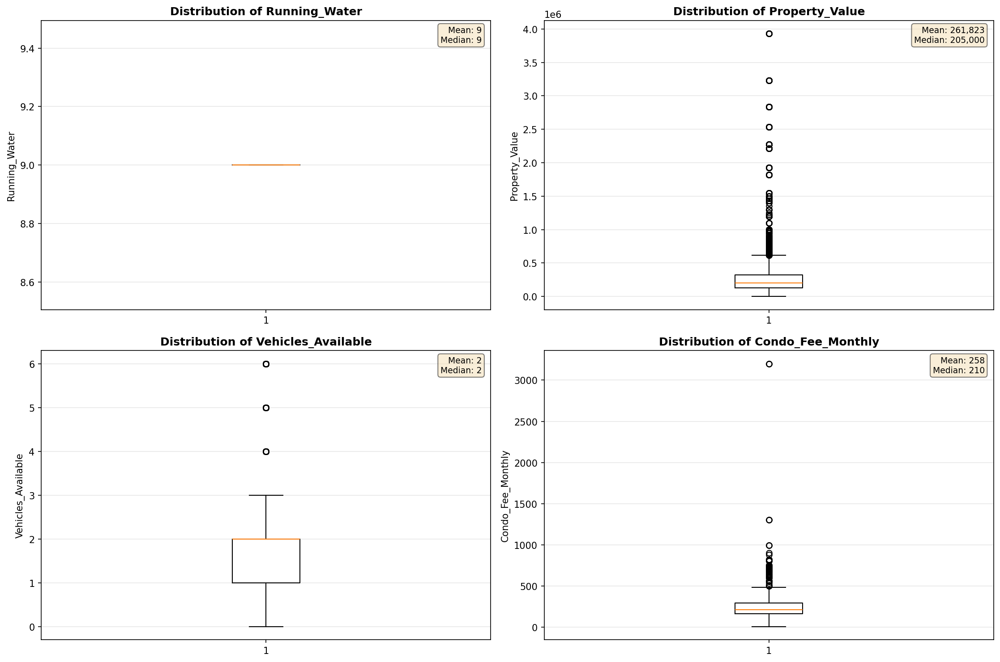
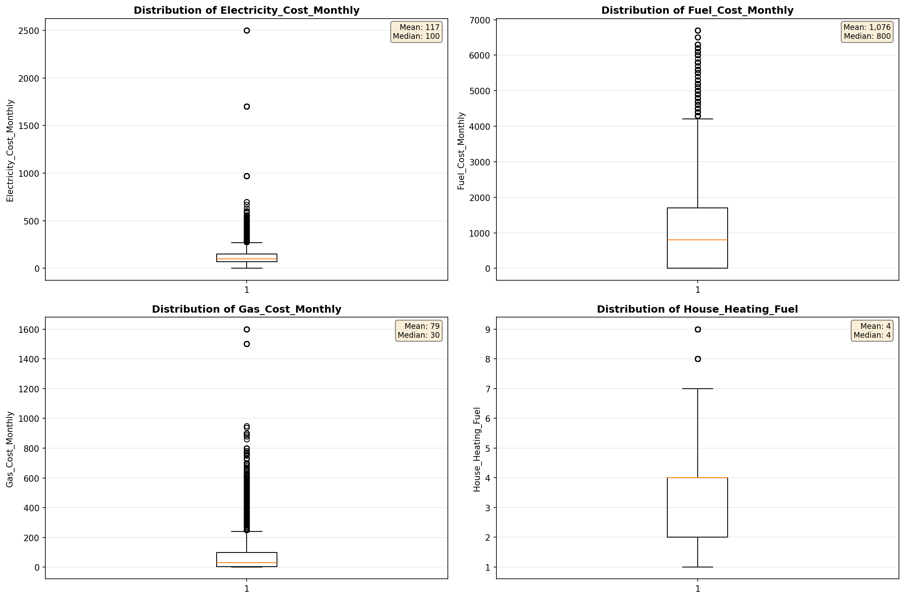
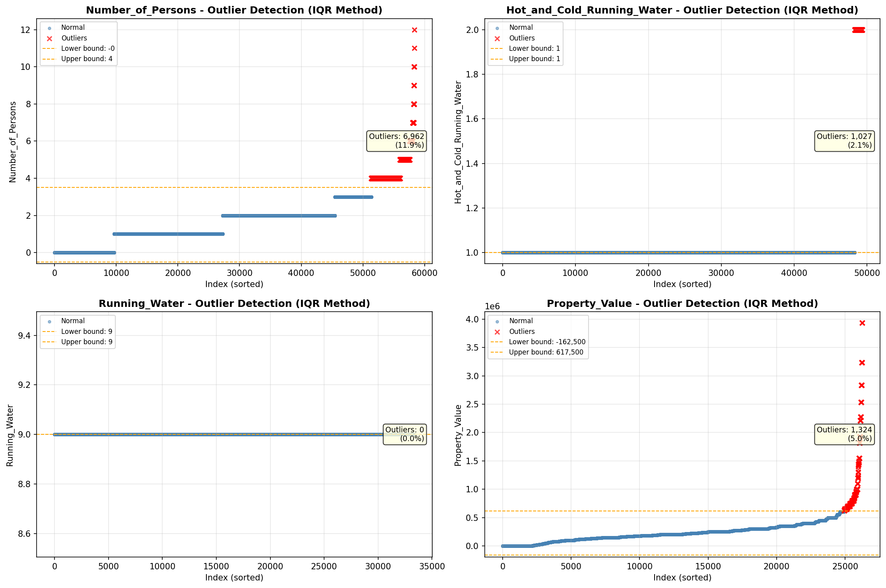
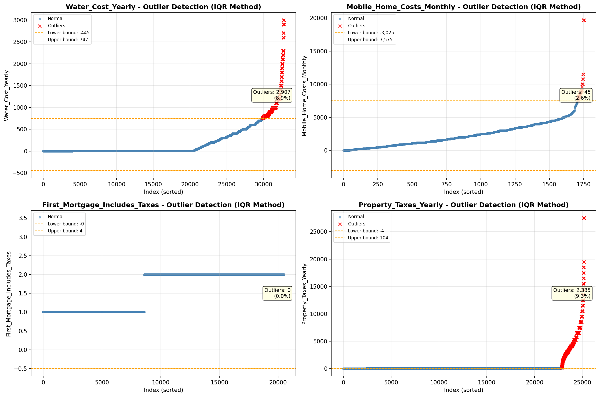

# Outlier Detection

> Statistical outlier detection using IQR (Interquartile Range) method. Outliers are values falling outside Q1 - 1.5×IQR or Q3 + 1.5×IQR bounds.

## Detection Methodology

| Parameter | Value | Description |
| :--- | :--- | :--- |
| Method | IQR | Outlier detection algorithm |
| Lower Bound | Q1 - 1.5 × IQR | Values below are outliers |
| Upper Bound | Q3 + 1.5 × IQR | Values above are outliers |
| IQR Definition | Q3 - Q1 | Interquartile Range |

> **Note**: The IQR method is robust to extreme values and works well for approximately symmetric distributions.

## Outlier Summary

_No outlier summary available._
## High Outlier Rate Variables

> Variables with outlier rate > 5% may indicate data quality issues, non-normal distributions, or genuinely extreme values.

- **('Flag_Household_Income', 23.636454908260333)**: 0 outliers (0.00%)

- **('Flag_Selected_Monthly_Owner_Costs', 22.471974705375107)**: 0 outliers (0.00%)

- **('Property_Tax_Rate', 16.12617924528302)**: 0 outliers (0.00%)

- **('Specified_Rent_Unit', 15.935867617340907)**: 0 outliers (0.00%)

- **('Flag_Family_Income', 15.125122361386511)**: 0 outliers (0.00%)

- **('Gross_Rent_Percentage_Income', 9.850245287890525)**: 0 outliers (0.00%)

- **('Income_Adjustment_Factor', 9.505056398288604)**: 0 outliers (0.00%)

- **('Gas_Cost_Monthly', 9.281956647478449)**: 0 outliers (0.00%)

- **('Property_Taxes_Yearly', 9.276179882409027)**: 0 outliers (0.00%)

- **('Water_Cost_Yearly', 8.869565217391303)**: 0 outliers (0.00%)

- **('Structure_Age', 8.819345661450924)**: 0 outliers (0.00%)

- **('Owner_Costs_Percentage_Income', 7.6411569129373)**: 0 outliers (0.00%)

- **('Structure_Age_Score', 7.471276944961155)**: 0 outliers (0.00%)

- **('Insurance_Cost_Yearly', 7.274704884993122)**: 0 outliers (0.00%)

- **('Flag_Water_Cost', 6.063268892794376)**: 0 outliers (0.00%)

> *Consider investigating these variables for data entry errors, applying transformations, or using robust statistical methods.*

## Visualizations

