# Statistical Analysis

> Comprehensive descriptive statistics including central tendency, dispersion, distribution characteristics, and weighted statistics using ACS sample weights.

## Summary Statistics

- **Variables Analyzed**: 30

### Income_Adjustment_Factor

| Statistic | Unweighted | Weighted (ACS) |
| :--- | :--- | :--- |
| Mean | 1,015,038.84 | 1,014,834.00 |
| Median | 1,011,189.00 | 1,014,834.00 |
| Std Deviation | 10,960.94 | — |
| Minimum | 1,001,264.00 | — |
| Maximum | 1,042,311.00 | — |
| Count | 1,012,701 | — |

> *Distribution is highly right-skewed (skewness: 1.32), light-tailed/platykurtic (kurtosis: 0.91).*

- **Coefficient of Variation**: 1.1 % (low variability)

### Age

| Statistic | Unweighted | Weighted (ACS) |
| :--- | :--- | :--- |
| Mean | 40.51 | 38.13 |
| Median | 41.00 | 37.50 |
| Std Deviation | 23.20 | — |
| Minimum | 0.00 | — |
| Maximum | 94.00 | — |
| Count | 1,330,759 | — |

> *Distribution is approximately symmetric (skewness: 0.07), light-tailed/platykurtic (kurtosis: -0.98).*

- **Coefficient of Variation**: 57.3 % (high variability)

### Interest_Dividend_Rental_Income

| Statistic | Unweighted | Weighted (ACS) |
| :--- | :--- | :--- |
| Mean | 15,152.18 | 14,719.63 |
| Median | 2,000.00 | 2,212.50 |
| Std Deviation | 42,016.77 | — |
| Minimum | 1.00 | — |
| Maximum | 326,000.00 | — |
| Count | 179,212 | — |

> *Distribution is highly right-skewed (skewness: 4.84), heavy-tailed/leptokurtic (kurtosis: 25.04).*

- **Coefficient of Variation**: 277.3 % (very high variability)

### Other_Income

| Statistic | Unweighted | Weighted (ACS) |
| :--- | :--- | :--- |
| Mean | 11,776.22 | 11,540.39 |
| Median | 6,000.00 | 6,318.75 |
| Std Deviation | 15,021.85 | — |
| Minimum | 4.00 | — |
| Maximum | 77,000.00 | — |
| Count | 70,528 | — |

> *Distribution is highly right-skewed (skewness: 2.25), heavy-tailed/leptokurtic (kurtosis: 5.31).*

- **Coefficient of Variation**: 127.6 % (very high variability)

### Public_Assistance_Income

| Statistic | Unweighted | Weighted (ACS) |
| :--- | :--- | :--- |
| Mean | 2,738.86 | 2,727.32 |
| Median | 1,500.00 | 1,575.00 |
| Std Deviation | 3,731.84 | — |
| Minimum | 4.00 | — |
| Maximum | 30,000.00 | — |
| Count | 11,113 | — |

> *Distribution is highly right-skewed (skewness: 3.13), heavy-tailed/leptokurtic (kurtosis: 13.00).*

- **Coefficient of Variation**: 136.3 % (very high variability)

### Retirement_Income

| Statistic | Unweighted | Weighted (ACS) |
| :--- | :--- | :--- |
| Mean | 26,761.17 | 25,629.57 |
| Median | 17,000.00 | 16,625.00 |
| Std Deviation | 30,004.86 | — |
| Minimum | 4.00 | — |
| Maximum | 181,000.00 | — |
| Count | 161,518 | — |

> *Distribution is highly right-skewed (skewness: 2.36), heavy-tailed/leptokurtic (kurtosis: 6.82).*

- **Coefficient of Variation**: 112.1 % (very high variability)

### Self_Employment_Income

| Statistic | Unweighted | Weighted (ACS) |
| :--- | :--- | :--- |
| Mean | 34,888.69 | 33,903.08 |
| Median | 12,000.00 | 13,675.00 |
| Std Deviation | 66,993.64 | — |
| Minimum | 1.00 | — |
| Maximum | 447,000.00 | — |
| Count | 58,555 | — |

> *Distribution is highly right-skewed (skewness: 3.84), heavy-tailed/leptokurtic (kurtosis: 15.87).*

- **Coefficient of Variation**: 192.0 % (very high variability)

### Supplemental_Security_Income

| Statistic | Unweighted | Weighted (ACS) |
| :--- | :--- | :--- |
| Mean | 8,250.42 | 8,068.15 |
| Median | 8,000.00 | 8,043.75 |
| Std Deviation | 5,011.79 | — |
| Minimum | 4.00 | — |
| Maximum | 30,000.00 | — |
| Count | 25,695 | — |

> *Distribution is highly right-skewed (skewness: 1.41), light-tailed/platykurtic (kurtosis: 2.76).*

- **Coefficient of Variation**: 60.7 % (high variability)

### Social_Security_Income

| Statistic | Unweighted | Weighted (ACS) |
| :--- | :--- | :--- |
| Mean | 13,937.67 | 13,578.11 |
| Median | 13,000.00 | 12,862.50 |
| Std Deviation | 7,941.59 | — |
| Minimum | 4.00 | — |
| Maximum | 50,000.00 | — |
| Count | 237,129 | — |

> *Distribution is moderately right-skewed (skewness: 0.89), light-tailed/platykurtic (kurtosis: 1.39).*

- **Coefficient of Variation**: 57.0 % (high variability)

### Wage_Income

| Statistic | Unweighted | Weighted (ACS) |
| :--- | :--- | :--- |
| Mean | 55,393.04 | 52,398.49 |
| Median | 39,000.00 | 37,206.25 |
| Std Deviation | 65,299.10 | — |
| Minimum | 4.00 | — |
| Maximum | 606,000.00 | — |
| Count | 690,836 | — |

> *Distribution is highly right-skewed (skewness: 3.75), heavy-tailed/leptokurtic (kurtosis: 21.22).*

- **Coefficient of Variation**: 117.9 % (very high variability)

### Hours_Worked_Per_Week

| Statistic | Unweighted | Weighted (ACS) |
| :--- | :--- | :--- |
| Mean | 38.44 | 38.70 |
| Median | 40.00 | 40.00 |
| Std Deviation | 12.98 | — |
| Minimum | 1.00 | — |
| Maximum | 99.00 | — |
| Count | 725,490 | — |

> *Distribution is approximately symmetric (skewness: -0.17), light-tailed/platykurtic (kurtosis: 1.89).*

- **Coefficient of Variation**: 33.8 % (moderate variability)

### Presence_And_Age_Own_Children

| Statistic | Unweighted | Weighted (ACS) |
| :--- | :--- | :--- |
| Mean | 3.48 | 3.44 |
| Median | 4.00 | 4.00 |
| Std Deviation | 0.95 | — |
| Minimum | 1.00 | — |
| Maximum | 4.00 | — |
| Count | 540,107 | — |

> *Distribution is highly left-skewed (skewness: -1.50), light-tailed/platykurtic (kurtosis: 0.69).*

- **Coefficient of Variation**: 27.4 % (moderate variability)

### Total_Person_Earnings

| Statistic | Unweighted | Weighted (ACS) |
| :--- | :--- | :--- |
| Mean | 55,621.72 | 52,592.91 |
| Median | 38,000.00 | 36,625.00 |
| Std Deviation | 67,835.55 | — |
| Minimum | 1.00 | — |
| Maximum | 1,053,000.00 | — |
| Count | 724,520 | — |

> *Distribution is highly right-skewed (skewness: 3.94), heavy-tailed/leptokurtic (kurtosis: 24.02).*

- **Coefficient of Variation**: 122.0 % (very high variability)

### Total_Person_Income

| Statistic | Unweighted | Weighted (ACS) |
| :--- | :--- | :--- |
| Mean | 52,939.10 | 50,349.15 |
| Median | 34,000.00 | 33,143.75 |
| Std Deviation | 67,850.76 | — |
| Minimum | 1.00 | — |
| Maximum | 1,233,000.00 | — |
| Count | 976,533 | — |

> *Distribution is highly right-skewed (skewness: 4.14), heavy-tailed/leptokurtic (kurtosis: 27.07).*

- **Coefficient of Variation**: 128.2 % (very high variability)

### Poverty_Status

| Statistic | Unweighted | Weighted (ACS) |
| :--- | :--- | :--- |
| Mean | 350.77 | 337.85 |
| Median | 401.00 | 371.81 |
| Std Deviation | 160.49 | — |
| Minimum | 0.00 | — |
| Maximum | 501.00 | — |
| Count | 1,270,072 | — |

> *Distribution is moderately left-skewed (skewness: -0.62), light-tailed/platykurtic (kurtosis: -1.01).*

- **Coefficient of Variation**: 45.8 % (moderate variability)

### Flag_Age

| Statistic | Unweighted | Weighted (ACS) |
| :--- | :--- | :--- |
| Mean | 0.01 | 0.01 |
| Median | 0.00 | 0.00 |
| Std Deviation | 0.10 | — |
| Minimum | 0.00 | — |
| Maximum | 1.00 | — |
| Count | 1,330,759 | — |

> *Distribution is highly right-skewed (skewness: 9.79), heavy-tailed/leptokurtic (kurtosis: 93.76).*

- **Coefficient of Variation**: 988.7 % (very high variability)

### Flag_Interest_Dividend_Income

| Statistic | Unweighted | Weighted (ACS) |
| :--- | :--- | :--- |
| Mean | 0.12 | 0.11 |
| Median | 0.00 | 0.00 |
| Std Deviation | 0.32 | — |
| Minimum | 0.00 | — |
| Maximum | 1.00 | — |
| Count | 1,330,759 | — |

> *Distribution is highly right-skewed (skewness: 2.41), heavy-tailed/leptokurtic (kurtosis: 3.80).*

- **Coefficient of Variation**: 277.0 % (very high variability)

### Flag_Other_Income

| Statistic | Unweighted | Weighted (ACS) |
| :--- | :--- | :--- |
| Mean | 0.10 | 0.10 |
| Median | 0.00 | 0.00 |
| Std Deviation | 0.30 | — |
| Minimum | 0.00 | — |
| Maximum | 1.00 | — |
| Count | 1,330,759 | — |

> *Distribution is highly right-skewed (skewness: 2.68), heavy-tailed/leptokurtic (kurtosis: 5.19).*

- **Coefficient of Variation**: 301.3 % (very high variability)

### Flag_Retirement_Income

| Statistic | Unweighted | Weighted (ACS) |
| :--- | :--- | :--- |
| Mean | 0.10 | 0.10 |
| Median | 0.00 | 0.00 |
| Std Deviation | 0.31 | — |
| Minimum | 0.00 | — |
| Maximum | 1.00 | — |
| Count | 1,330,759 | — |

> *Distribution is highly right-skewed (skewness: 2.58), heavy-tailed/leptokurtic (kurtosis: 4.66).*

- **Coefficient of Variation**: 292.4 % (very high variability)

### Flag_Self_Employment_Income

| Statistic | Unweighted | Weighted (ACS) |
| :--- | :--- | :--- |
| Mean | 0.08 | 0.08 |
| Median | 0.00 | 0.00 |
| Std Deviation | 0.27 | — |
| Minimum | 0.00 | — |
| Maximum | 1.00 | — |
| Count | 1,330,759 | — |

> *Distribution is highly right-skewed (skewness: 3.16), heavy-tailed/leptokurtic (kurtosis: 8.01).*

- **Coefficient of Variation**: 345.4 % (very high variability)

### Flag_Social_Security_Income

| Statistic | Unweighted | Weighted (ACS) |
| :--- | :--- | :--- |
| Mean | 0.11 | 0.11 |
| Median | 0.00 | 0.00 |
| Std Deviation | 0.31 | — |
| Minimum | 0.00 | — |
| Maximum | 1.00 | — |
| Count | 1,330,759 | — |

> *Distribution is highly right-skewed (skewness: 2.50), heavy-tailed/leptokurtic (kurtosis: 4.24).*

- **Coefficient of Variation**: 284.9 % (very high variability)

### Flag_Supplemental_Security_Income

| Statistic | Unweighted | Weighted (ACS) |
| :--- | :--- | :--- |
| Mean | 0.09 | 0.09 |
| Median | 0.00 | 0.00 |
| Std Deviation | 0.29 | — |
| Minimum | 0.00 | — |
| Maximum | 1.00 | — |
| Count | 1,330,759 | — |

> *Distribution is highly right-skewed (skewness: 2.76), heavy-tailed/leptokurtic (kurtosis: 5.63).*

- **Coefficient of Variation**: 308.7 % (very high variability)

### Flag_Wage_Income

| Statistic | Unweighted | Weighted (ACS) |
| :--- | :--- | :--- |
| Mean | 0.13 | 0.14 |
| Median | 0.00 | 0.00 |
| Std Deviation | 0.34 | — |
| Minimum | 0.00 | — |
| Maximum | 1.00 | — |
| Count | 1,330,759 | — |

> *Distribution is highly right-skewed (skewness: 2.21), light-tailed/platykurtic (kurtosis: 2.87).*

- **Coefficient of Variation**: 259.2 % (very high variability)

### Flag_Hours_Worked

| Statistic | Unweighted | Weighted (ACS) |
| :--- | :--- | :--- |
| Mean | 0.06 | 0.06 |
| Median | 0.00 | 0.00 |
| Std Deviation | 0.24 | — |
| Minimum | 0.00 | — |
| Maximum | 1.00 | — |
| Count | 1,330,759 | — |

> *Distribution is highly right-skewed (skewness: 3.73), heavy-tailed/leptokurtic (kurtosis: 11.90).*

- **Coefficient of Variation**: 397.9 % (very high variability)

### Income_Per_Hour

| Statistic | Unweighted | Weighted (ACS) |
| :--- | :--- | :--- |
| Mean | 31.45 | 28.96 |
| Median | 19.95 | 19.00 |
| Std Deviation | 63.67 | — |
| Minimum | 0.00 | — |
| Maximum | 10,519.23 | — |
| Count | 724,938 | — |

> *Distribution is highly right-skewed (skewness: 36.66), heavy-tailed/leptokurtic (kurtosis: 3063.74).*

- **Coefficient of Variation**: 202.4 % (very high variability)

### Income_Per_Week_Worked

| Statistic | Unweighted | Weighted (ACS) |
| :--- | :--- | :--- |
| Mean | 44,346.71 | 41,802.72 |
| Median | 25,300.00 | 27,843.79 |
| Std Deviation | 64,285.49 | — |
| Minimum | 0.02 | — |
| Maximum | 1,151,000.00 | — |
| Count | 584,799 | — |

> *Distribution is highly right-skewed (skewness: 3.90), heavy-tailed/leptokurtic (kurtosis: 24.04).*

- **Coefficient of Variation**: 145.0 % (very high variability)

### Total_Annual_Hours

| Statistic | Unweighted | Weighted (ACS) |
| :--- | :--- | :--- |
| Mean | 339.18 | 335.81 |
| Median | 45.00 | 353.85 |
| Std Deviation | 719.44 | — |
| Minimum | 1.00 | — |
| Maximum | 5,148.00 | — |
| Count | 585,257 | — |

> *Distribution is highly right-skewed (skewness: 2.49), heavy-tailed/leptokurtic (kurtosis: 5.21).*

- **Coefficient of Variation**: 212.1 % (very high variability)

### In_Poverty

| Statistic | Unweighted | Weighted (ACS) |
| :--- | :--- | :--- |
| Mean | 0.29 | 0.28 |
| Median | 0.00 | 0.00 |
| Std Deviation | 0.45 | — |
| Minimum | 0.00 | — |
| Maximum | 1.00 | — |
| Count | 1,330,759 | — |

> *Distribution is moderately right-skewed (skewness: 0.94), light-tailed/platykurtic (kurtosis: -1.13).*

- **Coefficient of Variation**: 157.1 % (very high variability)

### Poverty_Gap

| Statistic | Unweighted | Weighted (ACS) |
| :--- | :--- | :--- |
| Mean | 0.24 | 0.24 |
| Median | 0.00 | 0.00 |
| Std Deviation | 0.38 | — |
| Minimum | 0.00 | — |
| Maximum | 2.33 | — |
| Count | 1,104,895 | — |

> *Distribution is highly right-skewed (skewness: 1.20), light-tailed/platykurtic (kurtosis: -0.28).*

- **Coefficient of Variation**: 159.0 % (very high variability)

### Poverty_Severity

| Statistic | Unweighted | Weighted (ACS) |
| :--- | :--- | :--- |
| Mean | 0.20 | 0.20 |
| Median | 0.00 | 0.00 |
| Std Deviation | 0.36 | — |
| Minimum | 0.00 | — |
| Maximum | 5.44 | — |
| Count | 1,104,895 | — |

> *Distribution is highly right-skewed (skewness: 1.55), light-tailed/platykurtic (kurtosis: 0.95).*

- **Coefficient of Variation**: 180.3 % (very high variability)

## Distribution Analysis

### Skewed Distributions

> Variables with skewness > |0.5| indicate non-normal distributions. Consider log transformations for highly skewed variables in modeling.

| Variable | Skewness | Direction | Severity |
| :--- | :--- | :--- | :--- |
| Income_Per_Hour | 36.659 | Right-skewed | High |
| Flag_Age | 9.786 | Right-skewed | High |
| Interest_Dividend_Rental_Income | 4.841 | Right-skewed | High |
| Total_Person_Income | 4.137 | Right-skewed | High |
| Total_Person_Earnings | 3.945 | Right-skewed | High |
| Income_Per_Week_Worked | 3.905 | Right-skewed | High |
| Self_Employment_Income | 3.838 | Right-skewed | High |
| Wage_Income | 3.751 | Right-skewed | High |
| Flag_Hours_Worked | 3.728 | Right-skewed | High |
| Flag_Self_Employment_Income | 3.165 | Right-skewed | High |
| Public_Assistance_Income | 3.127 | Right-skewed | High |
| Flag_Supplemental_Security_Income | 2.763 | Right-skewed | High |
| Flag_Other_Income | 2.681 | Right-skewed | High |
| Flag_Retirement_Income | 2.582 | Right-skewed | High |
| Flag_Social_Security_Income | 2.499 | Right-skewed | High |
| Total_Annual_Hours | 2.491 | Right-skewed | High |
| Flag_Interest_Dividend_Income | 2.409 | Right-skewed | High |
| Retirement_Income | 2.358 | Right-skewed | High |
| Other_Income | 2.253 | Right-skewed | High |
| Flag_Wage_Income | 2.206 | Right-skewed | High |

- **Total Skewed Variables**: 28

- **Right-skewed**: 26

- **Left-skewed**: 2

## Variance Analysis

### Coefficient of Variation Ranking

> CV (Coefficient of Variation) = (Std Dev / Mean) × 100%. Higher CV indicates greater relative variability.

| Variable | CV (%) | Std Dev | Mean | Variability |
| :--- | :--- | :--- | :--- | :--- |
| Flag_Age | 988.7% | 0.10 | 0.01 | Very High |
| Flag_Hours_Worked | 397.9% | 0.24 | 0.06 | Very High |
| Flag_Self_Employment_Income | 345.4% | 0.27 | 0.08 | Very High |
| Flag_Supplemental_Security_Income | 308.7% | 0.29 | 0.09 | Very High |
| Flag_Other_Income | 301.3% | 0.30 | 0.10 | Very High |
| Flag_Retirement_Income | 292.4% | 0.31 | 0.10 | Very High |
| Flag_Social_Security_Income | 284.9% | 0.31 | 0.11 | Very High |
| Interest_Dividend_Rental_Income | 277.3% | 42,016.77 | 15,152.18 | Very High |
| Flag_Interest_Dividend_Income | 277.0% | 0.32 | 0.12 | Very High |
| Flag_Wage_Income | 259.2% | 0.34 | 0.13 | Very High |
| Total_Annual_Hours | 212.1% | 719.44 | 339.18 | Very High |
| Income_Per_Hour | 202.4% | 63.67 | 31.45 | Very High |
| Self_Employment_Income | 192.0% | 66,993.64 | 34,888.69 | Very High |
| Poverty_Severity | 180.3% | 0.36 | 0.20 | Very High |
| Poverty_Gap | 159.0% | 0.38 | 0.24 | Very High |
| In_Poverty | 157.1% | 0.45 | 0.29 | Very High |
| Income_Per_Week_Worked | 145.0% | 64,285.49 | 44,346.71 | Very High |
| Public_Assistance_Income | 136.3% | 3,731.84 | 2,738.86 | Very High |
| Total_Person_Income | 128.2% | 67,850.76 | 52,939.10 | Very High |
| Other_Income | 127.6% | 15,021.85 | 11,776.22 | Very High |

- **Average CV**: 200.3 %

- **High Variance Variables (CV > 50%)**: 26

## Visualizations

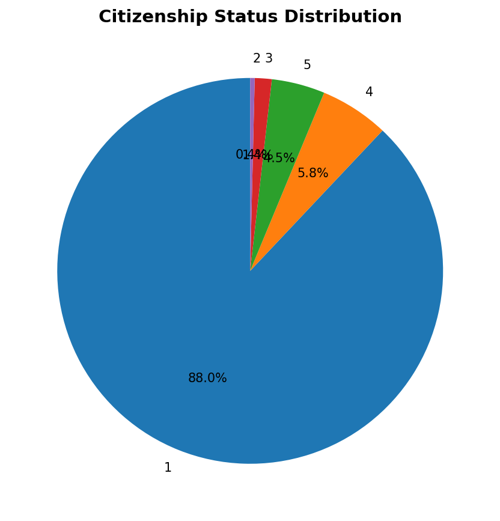

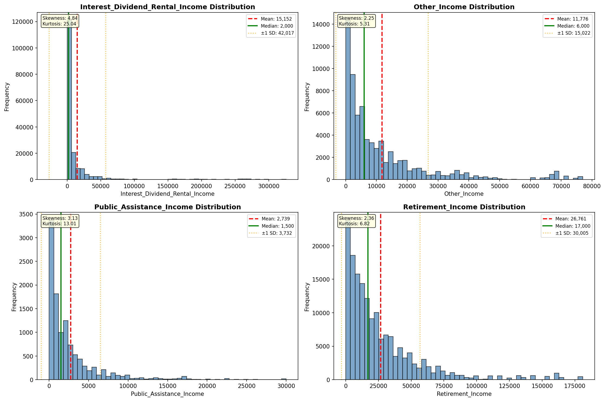

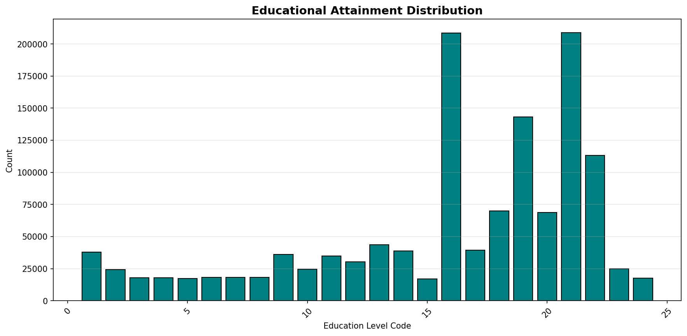

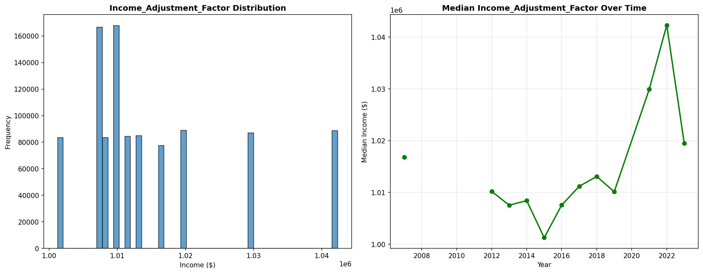

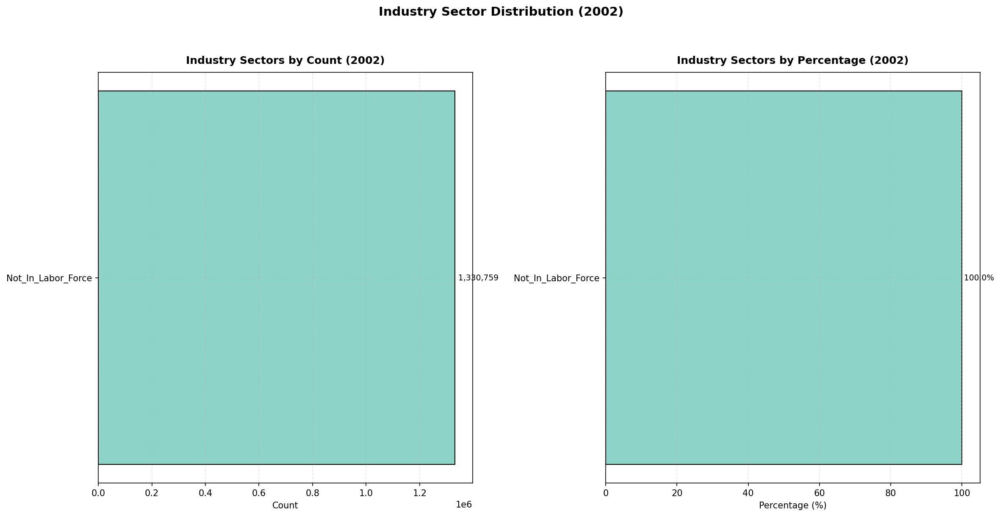

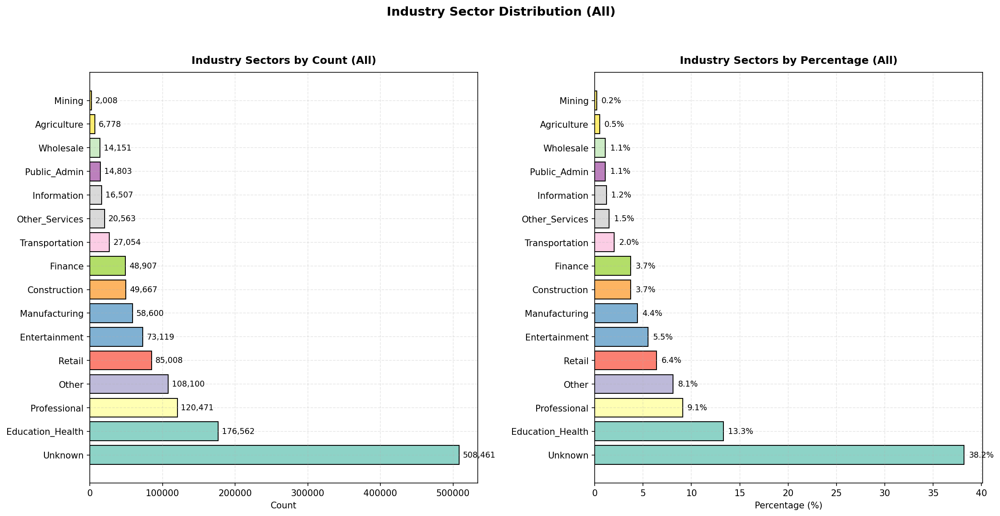

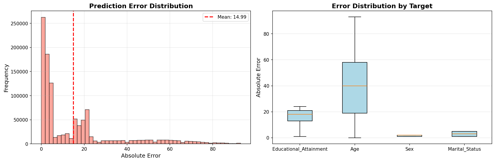

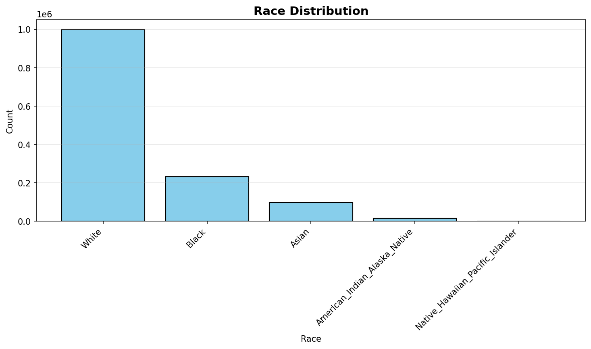

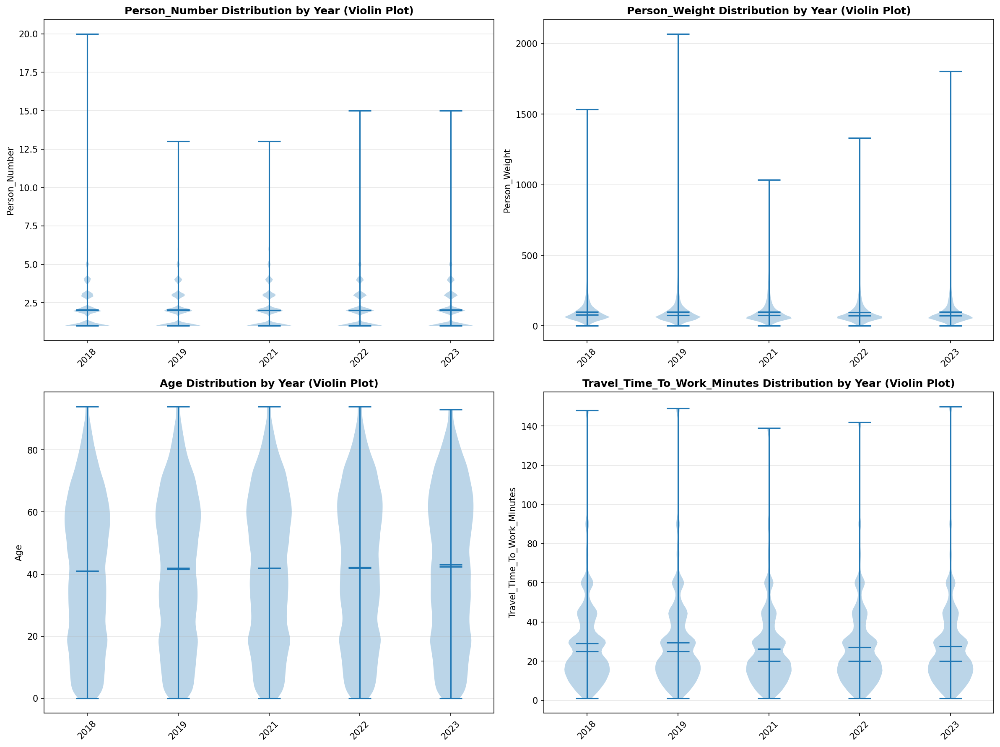

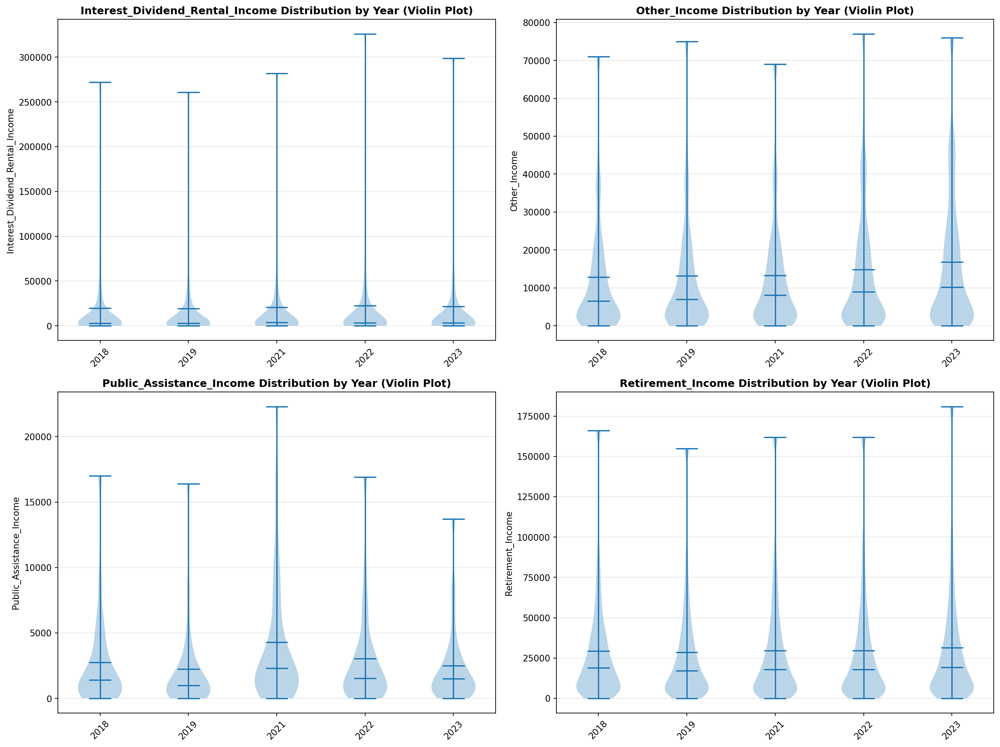

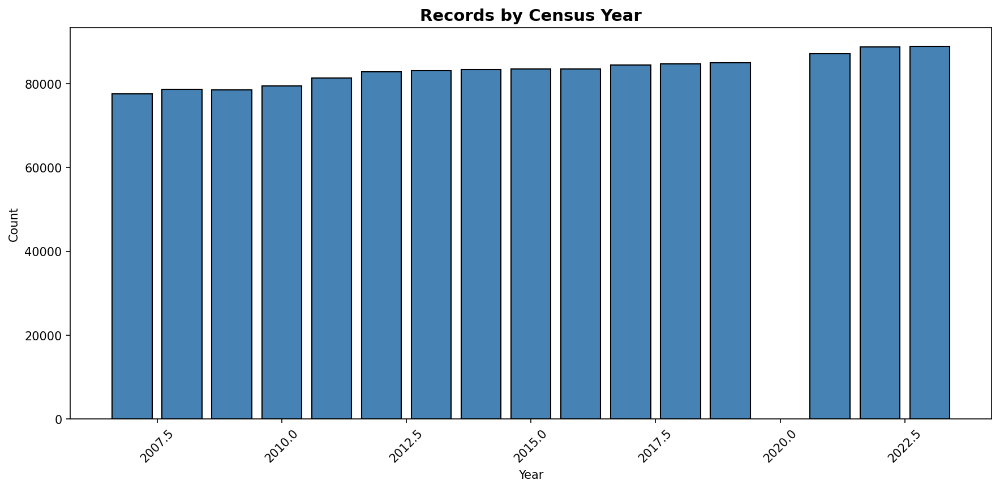
