# Statistical Analysis

> Comprehensive descriptive statistics including central tendency, dispersion, distribution characteristics, and weighted statistics using ACS sample weights.

## Summary Statistics

- **Variables Analyzed**: 41

### Income_Adjustment_Factor

| Statistic | Unweighted | Weighted (ACS) |
| :--- | :--- | :--- |
| Mean | 1,015,128.21 | 1,014,656.45 |
| Median | 1,010,207.00 | 1,014,656.45 |
| Std Deviation | 11,492.69 | — |
| Minimum | 1,001,264.00 | — |
| Maximum | 1,042,311.00 | — |
| Count | 377,720 | — |

> *Distribution is highly right-skewed (skewness: 1.27), light-tailed/platykurtic (kurtosis: 0.58).*

- **Coefficient of Variation**: 1.1 % (low variability)

### Property_Value

| Statistic | Unweighted | Weighted (ACS) |
| :--- | :--- | :--- |
| Mean | 428,547.00 | 413,892.61 |
| Median | 320,000.00 | 325,001.58 |
| Std Deviation | 520,779.59 | — |
| Minimum | 1.00 | — |
| Maximum | 6,858,000.00 | — |
| Count | 245,803 | — |

> *Distribution is highly right-skewed (skewness: 5.66), heavy-tailed/leptokurtic (kurtosis: 51.16).*

- **Coefficient of Variation**: 121.5 % (very high variability)

### Electricity_Cost_Monthly

| Statistic | Unweighted | Weighted (ACS) |
| :--- | :--- | :--- |
| Mean | 128.68 | 124.33 |
| Median | 100.00 | 101.25 |
| Std Deviation | 118.67 | — |
| Minimum | 1.00 | — |
| Maximum | 2,800.00 | — |
| Count | 448,604 | — |

> *Distribution is highly right-skewed (skewness: 9.03), heavy-tailed/leptokurtic (kurtosis: 172.25).*

- **Coefficient of Variation**: 92.2 % (high variability)

### Fuel_Cost_Monthly

| Statistic | Unweighted | Weighted (ACS) |
| :--- | :--- | :--- |
| Mean | 126.15 | 278.44 |
| Median | 2.00 | 145.75 |
| Std Deviation | 420.52 | — |
| Minimum | 1.00 | — |
| Maximum | 5,700.00 | — |
| Count | 315,340 | — |

> *Distribution is highly right-skewed (skewness: 5.24), heavy-tailed/leptokurtic (kurtosis: 34.98).*

- **Coefficient of Variation**: 333.3 % (very high variability)

### Gas_Cost_Monthly

| Statistic | Unweighted | Weighted (ACS) |
| :--- | :--- | :--- |
| Mean | 48.23 | 54.37 |
| Median | 3.00 | 23.31 |
| Std Deviation | 81.24 | — |
| Minimum | 1.00 | — |
| Maximum | 1,300.00 | — |
| Count | 358,165 | — |

> *Distribution is highly right-skewed (skewness: 5.16), heavy-tailed/leptokurtic (kurtosis: 54.71).*

- **Coefficient of Variation**: 168.4 % (very high variability)

### Insurance_Cost_Yearly

| Statistic | Unweighted | Weighted (ACS) |
| :--- | :--- | :--- |
| Mean | 1,009.81 | 985.60 |
| Median | 800.00 | 784.38 |
| Std Deviation | 909.27 | — |
| Minimum | 4.00 | — |
| Maximum | 9,900.00 | — |
| Count | 289,269 | — |

> *Distribution is highly right-skewed (skewness: 3.96), heavy-tailed/leptokurtic (kurtosis: 23.61).*

- **Coefficient of Variation**: 90.0 % (high variability)

### Water_Cost_Yearly

| Statistic | Unweighted | Weighted (ACS) |
| :--- | :--- | :--- |
| Mean | 629.80 | 636.35 |
| Median | 450.00 | 458.12 |
| Std Deviation | 704.45 | — |
| Minimum | 1.00 | — |
| Maximum | 5,400.00 | — |
| Count | 410,984 | — |

> *Distribution is highly right-skewed (skewness: 1.72), heavy-tailed/leptokurtic (kurtosis: 4.82).*

- **Coefficient of Variation**: 111.9 % (very high variability)

### Mobile_Home_Costs_Monthly

| Statistic | Unweighted | Weighted (ACS) |
| :--- | :--- | :--- |
| Mean | 3,498.68 | 3,633.54 |
| Median | 2,400.00 | 2,781.25 |
| Std Deviation | 3,850.87 | — |
| Minimum | 4.00 | — |
| Maximum | 36,900.00 | — |
| Count | 15,792 | — |

> *Distribution is highly right-skewed (skewness: 3.36), heavy-tailed/leptokurtic (kurtosis: 22.55).*

- **Coefficient of Variation**: 110.1 % (very high variability)

### First_Mortgage_Payment_Monthly

| Statistic | Unweighted | Weighted (ACS) |
| :--- | :--- | :--- |
| Mean | 1,358.93 | 1,454.58 |
| Median | 1,200.00 | 1,213.00 |
| Std Deviation | 1,059.30 | — |
| Minimum | 4.00 | — |
| Maximum | 8,000.00 | — |
| Count | 244,250 | — |

> *Distribution is highly right-skewed (skewness: 1.43), heavy-tailed/leptokurtic (kurtosis: 4.35).*

- **Coefficient of Variation**: 78.0 % (high variability)

### First_Mortgage_Includes_Taxes

| Statistic | Unweighted | Weighted (ACS) |
| :--- | :--- | :--- |
| Mean | 1.25 | 1.23 |
| Median | 1.00 | 1.00 |
| Std Deviation | 0.43 | — |
| Minimum | 1.00 | — |
| Maximum | 2.00 | — |
| Count | 210,231 | — |

> *Distribution is highly right-skewed (skewness: 1.17), light-tailed/platykurtic (kurtosis: -0.63).*

- **Coefficient of Variation**: 34.6 % (moderate variability)

### Second_Mortgage_Payment_Monthly

| Statistic | Unweighted | Weighted (ACS) |
| :--- | :--- | :--- |
| Mean | 464.70 | 472.68 |
| Median | 320.00 | 328.12 |
| Std Deviation | 493.09 | — |
| Minimum | 4.00 | — |
| Maximum | 4,400.00 | — |
| Count | 40,494 | — |

> *Distribution is highly right-skewed (skewness: 3.43), heavy-tailed/leptokurtic (kurtosis: 16.07).*

- **Coefficient of Variation**: 106.1 % (very high variability)

### Property_Taxes_Yearly

| Statistic | Unweighted | Weighted (ACS) |
| :--- | :--- | :--- |
| Mean | 550.50 | 483.28 |
| Median | 40.00 | 397.33 |
| Std Deviation | 2,181.58 | — |
| Minimum | 1.00 | — |
| Maximum | 37,500.00 | — |
| Count | 231,754 | — |

> *Distribution is highly right-skewed (skewness: 7.85), heavy-tailed/leptokurtic (kurtosis: 95.92).*

- **Coefficient of Variation**: 396.3 % (very high variability)

### Meals_Included_in_Rent

| Statistic | Unweighted | Weighted (ACS) |
| :--- | :--- | :--- |
| Mean | 1.97 | 1.97 |
| Median | 2.00 | 2.00 |
| Std Deviation | 0.18 | — |
| Minimum | 1.00 | — |
| Maximum | 2.00 | — |
| Count | 134,436 | — |

> *Distribution is highly left-skewed (skewness: -5.14), heavy-tailed/leptokurtic (kurtosis: 24.39).*

- **Coefficient of Variation**: 9.2 % (low variability)

### Rent_Amount_Monthly

| Statistic | Unweighted | Weighted (ACS) |
| :--- | :--- | :--- |
| Mean | 1,096.76 | 1,111.44 |
| Median | 950.00 | 1,022.50 |
| Std Deviation | 681.33 | — |
| Minimum | 4.00 | — |
| Maximum | 5,800.00 | — |
| Count | 134,436 | — |

> *Distribution is highly right-skewed (skewness: 1.79), heavy-tailed/leptokurtic (kurtosis: 6.21).*

- **Coefficient of Variation**: 62.1 % (high variability)

### Gross_Rent

| Statistic | Unweighted | Weighted (ACS) |
| :--- | :--- | :--- |
| Mean | 1,233.58 | 1,238.85 |
| Median | 1,080.00 | 1,145.38 |
| Std Deviation | 713.68 | — |
| Minimum | 4.00 | — |
| Maximum | 9,183.00 | — |
| Count | 129,561 | — |

> *Distribution is highly right-skewed (skewness: 1.67), heavy-tailed/leptokurtic (kurtosis: 5.56).*

- **Coefficient of Variation**: 57.9 % (high variability)

### Gross_Rent_Percentage_Income

| Statistic | Unweighted | Weighted (ACS) |
| :--- | :--- | :--- |
| Mean | 38.02 | 38.31 |
| Median | 29.00 | 29.38 |
| Std Deviation | 26.48 | — |
| Minimum | 1.00 | — |
| Maximum | 101.00 | — |
| Count | 127,647 | — |

> *Distribution is highly right-skewed (skewness: 1.24), light-tailed/platykurtic (kurtosis: 0.53).*

- **Coefficient of Variation**: 69.7 % (high variability)

### Selected_Monthly_Owner_Costs

| Statistic | Unweighted | Weighted (ACS) |
| :--- | :--- | :--- |
| Mean | 1,572.05 | 1,620.97 |
| Median | 1,350.00 | 1,440.25 |
| Std Deviation | 1,175.95 | — |
| Minimum | 2.00 | — |
| Maximum | 14,033.00 | — |
| Count | 318,514 | — |

> *Distribution is highly right-skewed (skewness: 1.85), heavy-tailed/leptokurtic (kurtosis: 6.36).*

- **Coefficient of Variation**: 74.8 % (high variability)

### Owner_Costs_Percentage_Income

| Statistic | Unweighted | Weighted (ACS) |
| :--- | :--- | :--- |
| Mean | 25.08 | 25.73 |
| Median | 19.00 | 20.12 |
| Std Deviation | 21.12 | — |
| Minimum | 1.00 | — |
| Maximum | 101.00 | — |
| Count | 316,744 | — |

> *Distribution is highly right-skewed (skewness: 1.99), heavy-tailed/leptokurtic (kurtosis: 4.17).*

- **Coefficient of Variation**: 84.2 % (high variability)

### Family_Income

| Statistic | Unweighted | Weighted (ACS) |
| :--- | :--- | :--- |
| Mean | 108,726.14 | 104,801.40 |
| Median | 82,000.00 | 81,161.25 |
| Std Deviation | 104,240.99 | — |
| Minimum | 1.00 | — |
| Maximum | 2,195,000.00 | — |
| Count | 299,232 | — |

> *Distribution is highly right-skewed (skewness: 3.46), heavy-tailed/leptokurtic (kurtosis: 20.55).*

- **Coefficient of Variation**: 95.9 % (high variability)

### Household_Income

| Statistic | Unweighted | Weighted (ACS) |
| :--- | :--- | :--- |
| Mean | 93,443.18 | 90,193.08 |
| Median | 68,400.00 | 67,559.00 |
| Std Deviation | 96,857.96 | — |
| Minimum | 1.00 | — |
| Maximum | 2,195,000.00 | — |
| Count | 450,840 | — |

> *Distribution is highly right-skewed (skewness: 3.61), heavy-tailed/leptokurtic (kurtosis: 22.71).*

- **Coefficient of Variation**: 103.7 % (very high variability)

### Specified_Rent_Unit

| Statistic | Unweighted | Weighted (ACS) |
| :--- | :--- | :--- |
| Mean | 0.29 | 0.35 |
| Median | 0.00 | 0.00 |
| Std Deviation | 0.45 | — |
| Minimum | 0.00 | — |
| Maximum | 1.00 | — |
| Count | 483,491 | — |

> *Distribution is moderately right-skewed (skewness: 0.93), light-tailed/platykurtic (kurtosis: -1.13).*

- **Coefficient of Variation**: 157.1 % (very high variability)

### Specified_Value_Unit

| Statistic | Unweighted | Weighted (ACS) |
| :--- | :--- | :--- |
| Mean | 0.56 | 0.50 |
| Median | 1.00 | 0.38 |
| Std Deviation | 0.50 | — |
| Minimum | 0.00 | — |
| Maximum | 1.00 | — |
| Count | 483,491 | — |

> *Distribution is approximately symmetric (skewness: -0.24), light-tailed/platykurtic (kurtosis: -1.94).*

- **Coefficient of Variation**: 88.8 % (high variability)

### Flag_Family_Income

| Statistic | Unweighted | Weighted (ACS) |
| :--- | :--- | :--- |
| Mean | 0.18 | 0.17 |
| Median | 0.00 | 0.00 |
| Std Deviation | 0.38 | — |
| Minimum | 0.00 | — |
| Maximum | 1.00 | — |
| Count | 371,107 | — |

> *Distribution is highly right-skewed (skewness: 1.69), light-tailed/platykurtic (kurtosis: 0.84).*

- **Coefficient of Variation**: 215.1 % (very high variability)

### Flag_Gross_Rent

| Statistic | Unweighted | Weighted (ACS) |
| :--- | :--- | :--- |
| Mean | 0.08 | 0.12 |
| Median | 0.00 | 0.00 |
| Std Deviation | 0.27 | — |
| Minimum | 0.00 | — |
| Maximum | 1.00 | — |
| Count | 248,320 | — |

> *Distribution is highly right-skewed (skewness: 3.19), heavy-tailed/leptokurtic (kurtosis: 8.18).*

- **Coefficient of Variation**: 347.9 % (very high variability)

### Flag_Household_Income

| Statistic | Unweighted | Weighted (ACS) |
| :--- | :--- | :--- |
| Mean | 0.27 | 0.26 |
| Median | 0.00 | 0.00 |
| Std Deviation | 0.44 | — |
| Minimum | 0.00 | — |
| Maximum | 1.00 | — |
| Count | 371,107 | — |

> *Distribution is highly right-skewed (skewness: 1.06), light-tailed/platykurtic (kurtosis: -0.87).*

- **Coefficient of Variation**: 166.5 % (very high variability)

### Flag_First_Mortgage_Payment

| Statistic | Unweighted | Weighted (ACS) |
| :--- | :--- | :--- |
| Mean | 0.03 | 0.03 |
| Median | 0.00 | 0.00 |
| Std Deviation | 0.18 | — |
| Minimum | 0.00 | — |
| Maximum | 1.00 | — |
| Count | 483,491 | — |

> *Distribution is highly right-skewed (skewness: 5.20), heavy-tailed/leptokurtic (kurtosis: 25.05).*

- **Coefficient of Variation**: 538.7 % (very high variability)

### Flag_First_Mortgage_Taxes

| Statistic | Unweighted | Weighted (ACS) |
| :--- | :--- | :--- |
| Mean | 0.03 | 0.03 |
| Median | 0.00 | 0.00 |
| Std Deviation | 0.17 | — |
| Minimum | 0.00 | — |
| Maximum | 1.00 | — |
| Count | 483,491 | — |

> *Distribution is highly right-skewed (skewness: 5.64), heavy-tailed/leptokurtic (kurtosis: 29.79).*

- **Coefficient of Variation**: 581.0 % (very high variability)

### Flag_Meals_Included_Rent

| Statistic | Unweighted | Weighted (ACS) |
| :--- | :--- | :--- |
| Mean | 0.01 | 0.01 |
| Median | 0.00 | 0.00 |
| Std Deviation | 0.08 | — |
| Minimum | 0.00 | — |
| Maximum | 1.00 | — |
| Count | 483,491 | — |

> *Distribution is highly right-skewed (skewness: 12.90), heavy-tailed/leptokurtic (kurtosis: 164.47).*

- **Coefficient of Variation**: 1,298.0 % (very high variability)

### Flag_Rent_Amount

| Statistic | Unweighted | Weighted (ACS) |
| :--- | :--- | :--- |
| Mean | 0.02 | 0.03 |
| Median | 0.00 | 0.00 |
| Std Deviation | 0.14 | — |
| Minimum | 0.00 | — |
| Maximum | 1.00 | — |
| Count | 483,491 | — |

> *Distribution is highly right-skewed (skewness: 6.96), heavy-tailed/leptokurtic (kurtosis: 46.44).*

- **Coefficient of Variation**: 710.1 % (very high variability)

### Flag_Selected_Monthly_Owner_Costs

| Statistic | Unweighted | Weighted (ACS) |
| :--- | :--- | :--- |
| Mean | 0.21 | 0.22 |
| Median | 0.00 | 0.00 |
| Std Deviation | 0.41 | — |
| Minimum | 0.00 | — |
| Maximum | 1.00 | — |
| Count | 313,928 | — |

> *Distribution is highly right-skewed (skewness: 1.39), light-tailed/platykurtic (kurtosis: -0.05).*

- **Coefficient of Variation**: 191.6 % (very high variability)

### Flag_Second_Mortgage_Payment

| Statistic | Unweighted | Weighted (ACS) |
| :--- | :--- | :--- |
| Mean | 0.03 | 0.03 |
| Median | 0.00 | 0.00 |
| Std Deviation | 0.17 | — |
| Minimum | 0.00 | — |
| Maximum | 1.00 | — |
| Count | 483,491 | — |

> *Distribution is highly right-skewed (skewness: 5.49), heavy-tailed/leptokurtic (kurtosis: 28.10).*

- **Coefficient of Variation**: 566.3 % (very high variability)

### Flag_Property_Taxes

| Statistic | Unweighted | Weighted (ACS) |
| :--- | :--- | :--- |
| Mean | 0.09 | 0.09 |
| Median | 0.00 | 0.00 |
| Std Deviation | 0.28 | — |
| Minimum | 0.00 | — |
| Maximum | 1.00 | — |
| Count | 449,874 | — |

> *Distribution is highly right-skewed (skewness: 2.95), heavy-tailed/leptokurtic (kurtosis: 6.70).*

- **Coefficient of Variation**: 325.7 % (very high variability)

### Flag_Property_Value

| Statistic | Unweighted | Weighted (ACS) |
| :--- | :--- | :--- |
| Mean | 0.05 | 0.05 |
| Median | 0.00 | 0.00 |
| Std Deviation | 0.22 | — |
| Minimum | 0.00 | — |
| Maximum | 1.00 | — |
| Count | 483,491 | — |

> *Distribution is highly right-skewed (skewness: 3.97), heavy-tailed/leptokurtic (kurtosis: 13.78).*

- **Coefficient of Variation**: 421.0 % (very high variability)

### Flag_Water_Cost

| Statistic | Unweighted | Weighted (ACS) |
| :--- | :--- | :--- |
| Mean | 0.08 | 0.09 |
| Median | 0.00 | 0.00 |
| Std Deviation | 0.28 | — |
| Minimum | 0.00 | — |
| Maximum | 1.00 | — |
| Count | 33,617 | — |

> *Distribution is highly right-skewed (skewness: 3.01), heavy-tailed/leptokurtic (kurtosis: 7.04).*

- **Coefficient of Variation**: 330.9 % (very high variability)

### Annual_Rent_to_Value_Ratio

### Total_Monthly_Utility_Cost

| Statistic | Unweighted | Weighted (ACS) |
| :--- | :--- | :--- |
| Mean | 166.93 | 159.53 |
| Median | 140.00 | 132.12 |
| Std Deviation | 145.72 | — |
| Minimum | 2.00 | — |
| Maximum | 4,100.00 | — |
| Count | 449,295 | — |

> *Distribution is highly right-skewed (skewness: 7.13), heavy-tailed/leptokurtic (kurtosis: 117.01).*

- **Coefficient of Variation**: 87.3 % (high variability)

### Property_Tax_Rate

| Statistic | Unweighted | Weighted (ACS) |
| :--- | :--- | :--- |
| Mean | 22.84 | 24.02 |
| Median | 0.02 | 23.86 |
| Std Deviation | 66.02 | — |
| Minimum | 0.00 | — |
| Maximum | 1,000.00 | — |
| Count | 156,560 | — |

> *Distribution is highly right-skewed (skewness: 2.96), heavy-tailed/leptokurtic (kurtosis: 8.83).*

- **Coefficient of Variation**: 289.1 % (very high variability)

#### Weighted Statistics by Year

| Year | Weighted Mean | Weighted Median |
| :--- | :--- | :--- |
| 2007 | 191.07 | 190.00 |
| 2012 | 0.02 | 0.02 |
| 2013 | 0.05 | 0.02 |
| 2014 | 0.04 | 0.01 |
| 2015 | 0.02 | 0.01 |
| 2016 | 0.02 | 0.01 |
| 2017 | 0.02 | 0.01 |
| 2023 | 0.93 | 0.79 |

### Structure_Age

| Statistic | Unweighted | Weighted (ACS) |
| :--- | :--- | :--- |
| Mean | 1,859.52 | 1,877.20 |
| Median | 2,018.00 | 1,877.36 |
| Std Deviation | 536.48 | — |
| Minimum | 1.00 | — |
| Maximum | 2,023.00 | — |
| Count | 417,775 | — |

> *Distribution is highly left-skewed (skewness: -3.09), heavy-tailed/leptokurtic (kurtosis: 7.52).*

- **Coefficient of Variation**: 28.9 % (moderate variability)

### Structure_Age_Score

| Statistic | Unweighted | Weighted (ACS) |
| :--- | :--- | :--- |
| Mean | 0.04 | 0.04 |
| Median | 0.00 | 0.04 |
| Std Deviation | 0.16 | — |
| Minimum | 0.00 | — |
| Maximum | 0.99 | — |
| Count | 417,775 | — |

> *Distribution is highly right-skewed (skewness: 3.87), heavy-tailed/leptokurtic (kurtosis: 14.18).*

- **Coefficient of Variation**: 372.0 % (very high variability)

### Working_Age_Persons

| Statistic | Unweighted | Weighted (ACS) |
| :--- | :--- | :--- |
| Mean | 1.73 | 1.81 |
| Median | 2.00 | 2.00 |
| Std Deviation | 1.38 | — |
| Minimum | 0.00 | — |
| Maximum | 20.00 | — |
| Count | 454,901 | — |

> *Distribution is highly right-skewed (skewness: 1.01), light-tailed/platykurtic (kurtosis: 2.75).*

- **Coefficient of Variation**: 79.5 % (high variability)

### Income_to_FPL_Ratio

| Statistic | Unweighted | Weighted (ACS) |
| :--- | :--- | :--- |
| Mean | 4.23 | 4.08 |
| Median | 3.16 | 3.11 |
| Std Deviation | 4.30 | — |
| Minimum | -0.95 | — |
| Maximum | 88.29 | — |
| Count | 454,901 | — |

> *Distribution is highly right-skewed (skewness: 3.77), heavy-tailed/leptokurtic (kurtosis: 24.98).*

- **Coefficient of Variation**: 101.6 % (very high variability)

## Distribution Analysis

### Skewed Distributions

> Variables with skewness > |0.5| indicate non-normal distributions. Consider log transformations for highly skewed variables in modeling.

| Variable | Skewness | Direction | Severity |
| :--- | :--- | :--- | :--- |
| Flag_Meals_Included_Rent | 12.902 | Right-skewed | High |
| Electricity_Cost_Monthly | 9.026 | Right-skewed | High |
| Property_Taxes_Yearly | 7.851 | Right-skewed | High |
| Total_Monthly_Utility_Cost | 7.127 | Right-skewed | High |
| Flag_Rent_Amount | 6.960 | Right-skewed | High |
| Property_Value | 5.660 | Right-skewed | High |
| Flag_First_Mortgage_Taxes | 5.638 | Right-skewed | High |
| Flag_Second_Mortgage_Payment | 5.486 | Right-skewed | High |
| Fuel_Cost_Monthly | 5.240 | Right-skewed | High |
| Flag_First_Mortgage_Payment | 5.201 | Right-skewed | High |
| Gas_Cost_Monthly | 5.157 | Right-skewed | High |
| Meals_Included_in_Rent | -5.137 | Left-skewed | High |
| Flag_Property_Value | 3.972 | Right-skewed | High |
| Insurance_Cost_Yearly | 3.959 | Right-skewed | High |
| Structure_Age_Score | 3.873 | Right-skewed | High |
| Income_to_FPL_Ratio | 3.769 | Right-skewed | High |
| Household_Income | 3.607 | Right-skewed | High |
| Family_Income | 3.462 | Right-skewed | High |
| Second_Mortgage_Payment_Monthly | 3.428 | Right-skewed | High |
| Mobile_Home_Costs_Monthly | 3.361 | Right-skewed | High |

- **Total Skewed Variables**: 39

- **Right-skewed**: 37

- **Left-skewed**: 2

## Variance Analysis

### Coefficient of Variation Ranking

> CV (Coefficient of Variation) = (Std Dev / Mean) × 100%. Higher CV indicates greater relative variability.

| Variable | CV (%) | Std Dev | Mean | Variability |
| :--- | :--- | :--- | :--- | :--- |
| Flag_Meals_Included_Rent | 1298.0% | 0.08 | 0.01 | Very High |
| Flag_Rent_Amount | 710.1% | 0.14 | 0.02 | Very High |
| Flag_First_Mortgage_Taxes | 581.0% | 0.17 | 0.03 | Very High |
| Flag_Second_Mortgage_Payment | 566.3% | 0.17 | 0.03 | Very High |
| Flag_First_Mortgage_Payment | 538.7% | 0.18 | 0.03 | Very High |
| Flag_Property_Value | 421.0% | 0.22 | 0.05 | Very High |
| Property_Taxes_Yearly | 396.3% | 2,181.58 | 550.50 | Very High |
| Structure_Age_Score | 372.0% | 0.16 | 0.04 | Very High |
| Flag_Gross_Rent | 347.9% | 0.27 | 0.08 | Very High |
| Fuel_Cost_Monthly | 333.3% | 420.52 | 126.15 | Very High |
| Flag_Water_Cost | 330.9% | 0.28 | 0.08 | Very High |
| Flag_Property_Taxes | 325.7% | 0.28 | 0.09 | Very High |
| Property_Tax_Rate | 289.1% | 66.02 | 22.84 | Very High |
| Flag_Family_Income | 215.1% | 0.38 | 0.18 | Very High |
| Flag_Selected_Monthly_Owner_Costs | 191.6% | 0.41 | 0.21 | Very High |
| Gas_Cost_Monthly | 168.4% | 81.24 | 48.23 | Very High |
| Flag_Household_Income | 166.5% | 0.44 | 0.27 | Very High |
| Specified_Rent_Unit | 157.1% | 0.45 | 0.29 | Very High |
| Property_Value | 121.5% | 520,779.59 | 428,547.00 | Very High |
| Water_Cost_Yearly | 111.9% | 704.45 | 629.80 | Very High |

- **Average CV**: 227.4 %

- **High Variance Variables (CV > 50%)**: 36

## Visualizations

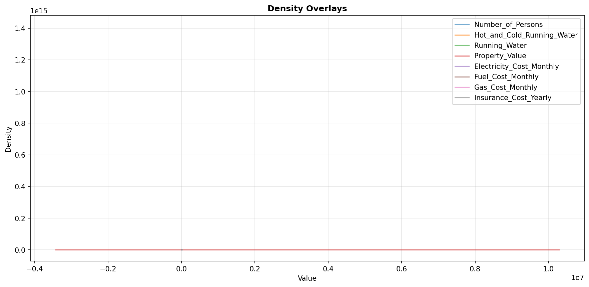

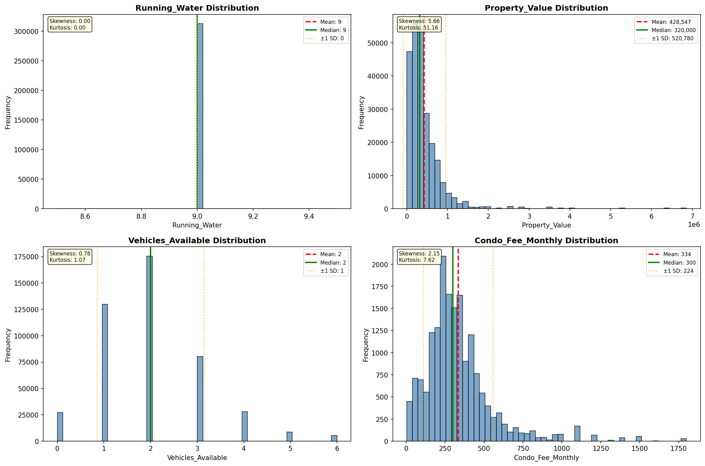

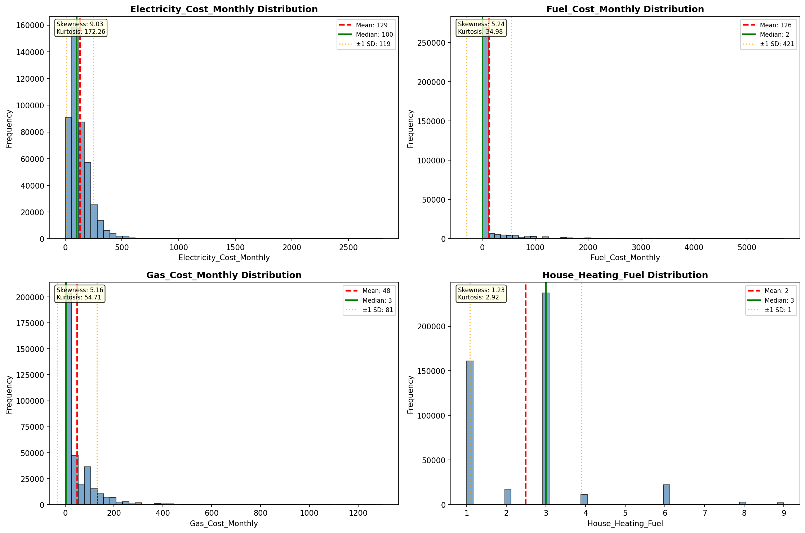

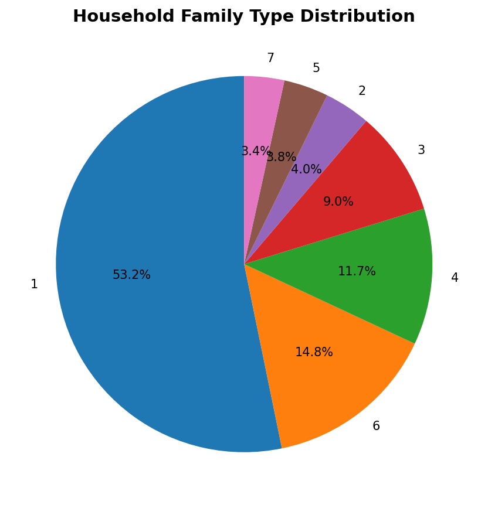

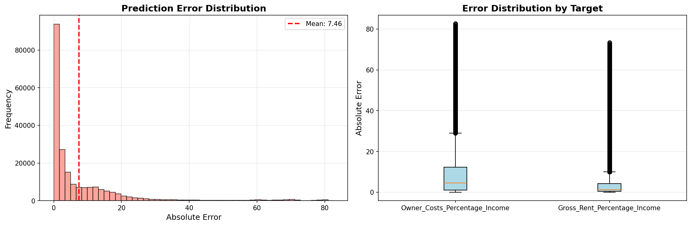

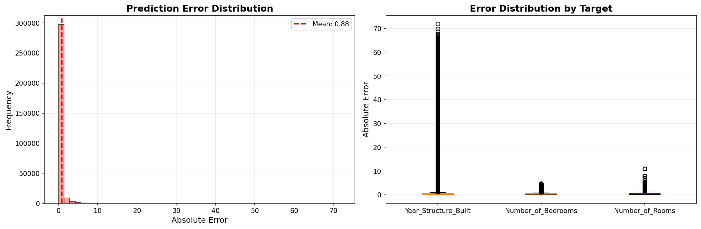

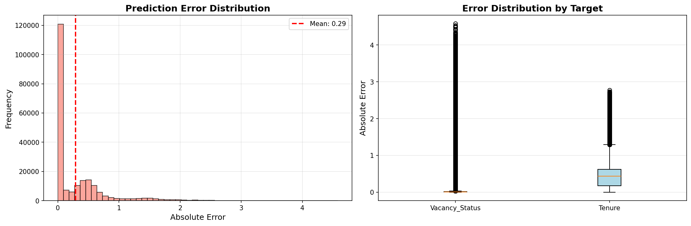

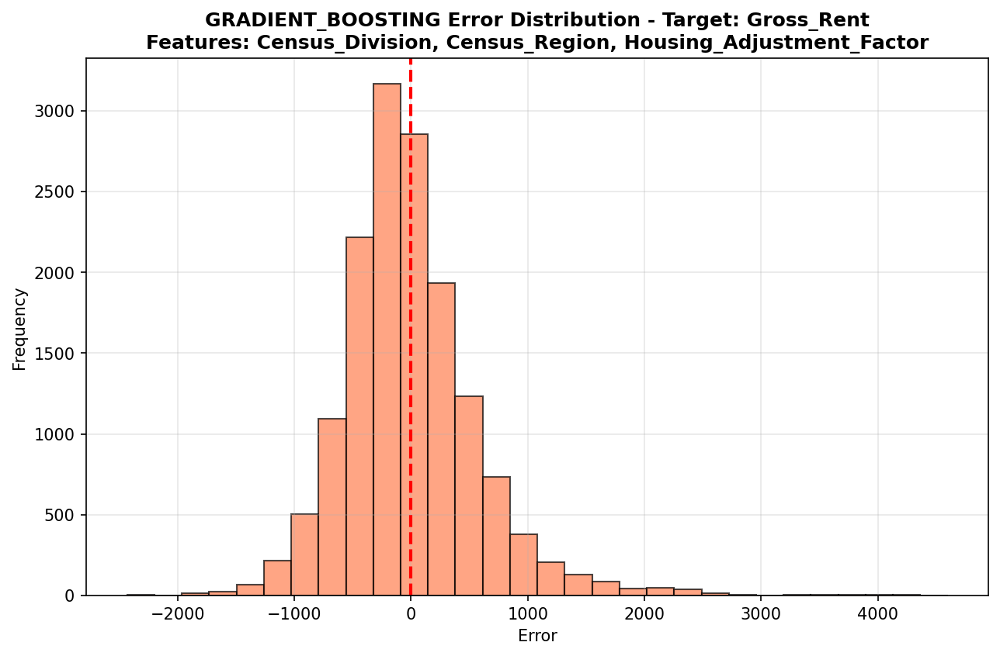

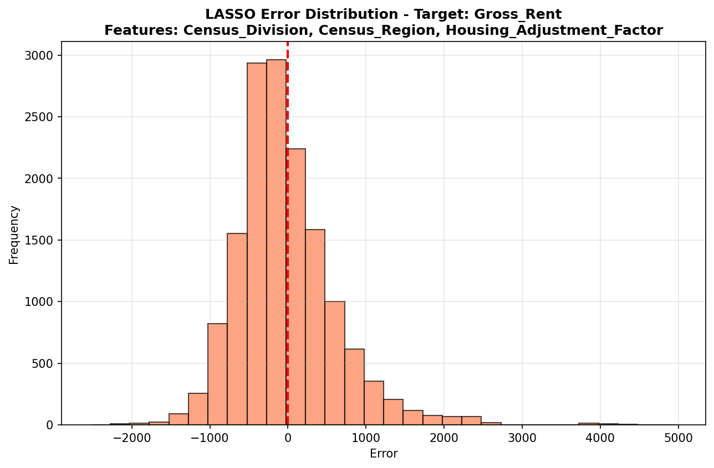

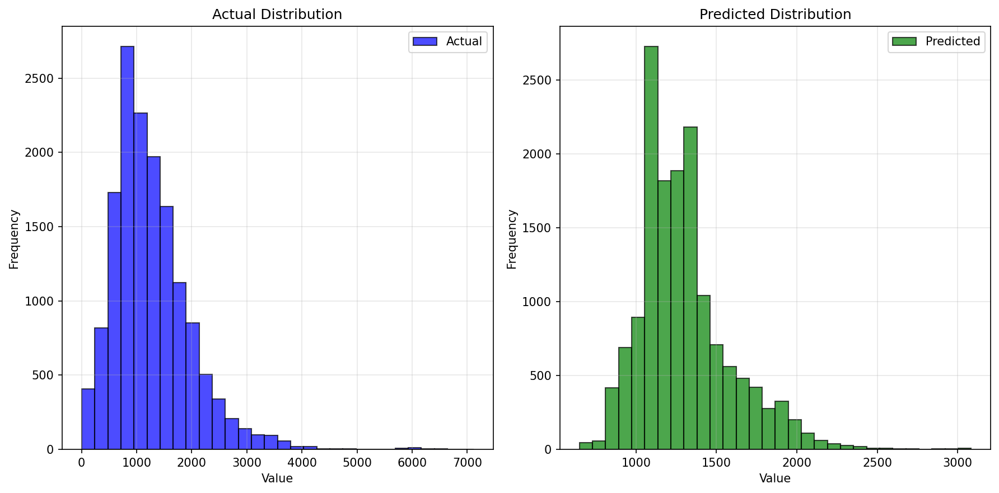

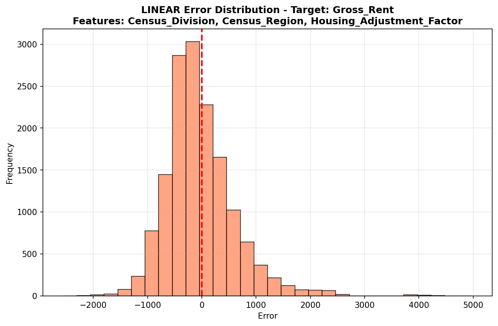

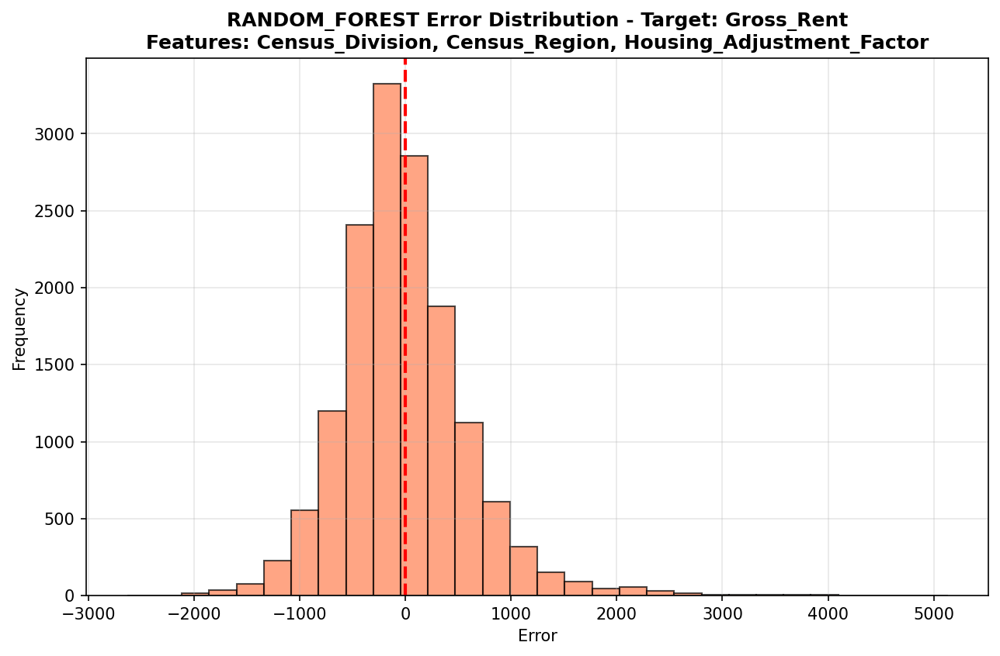

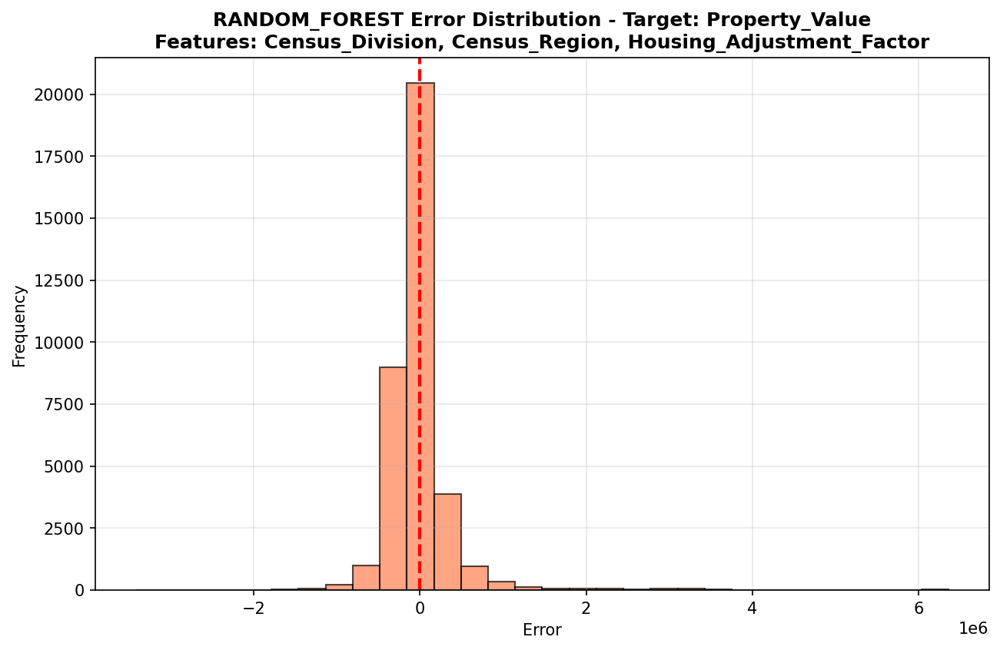

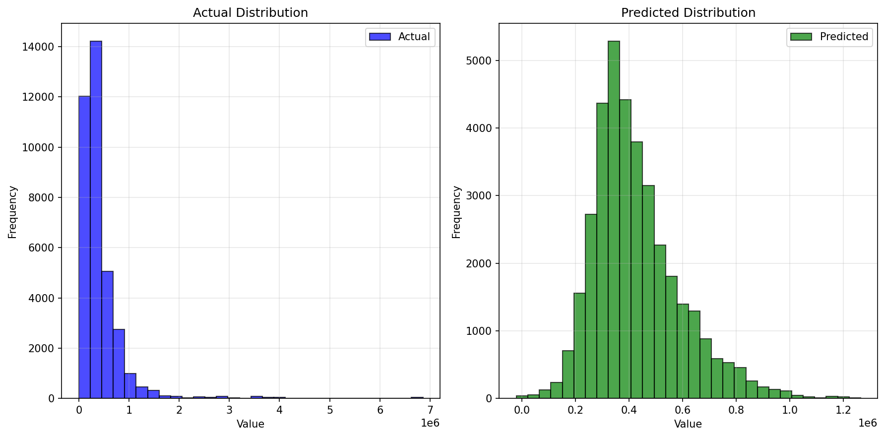

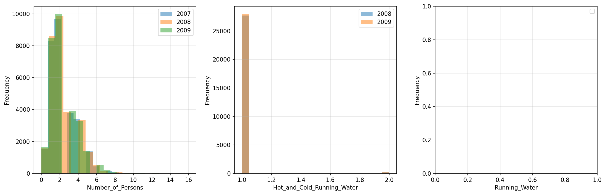

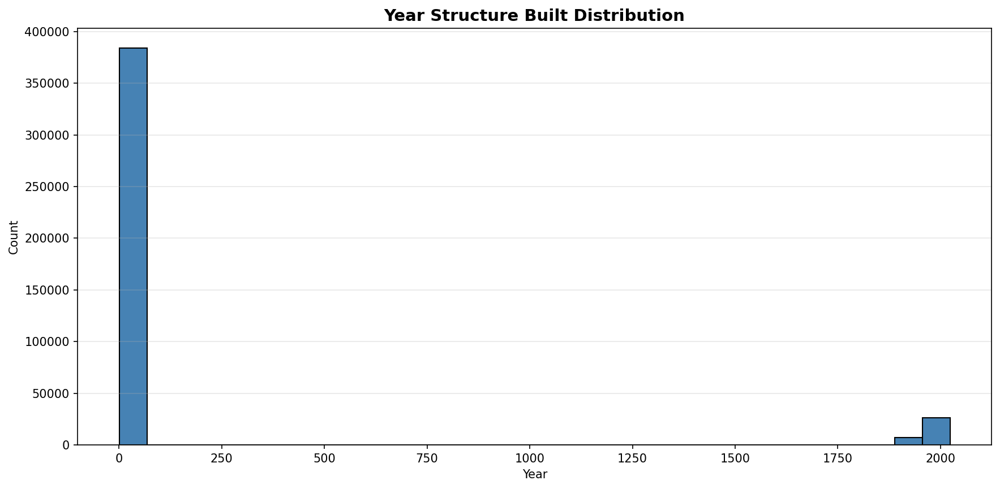

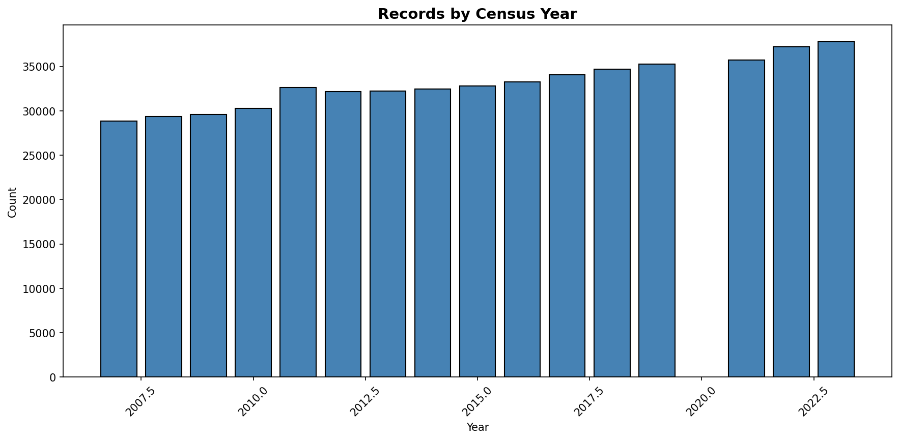
