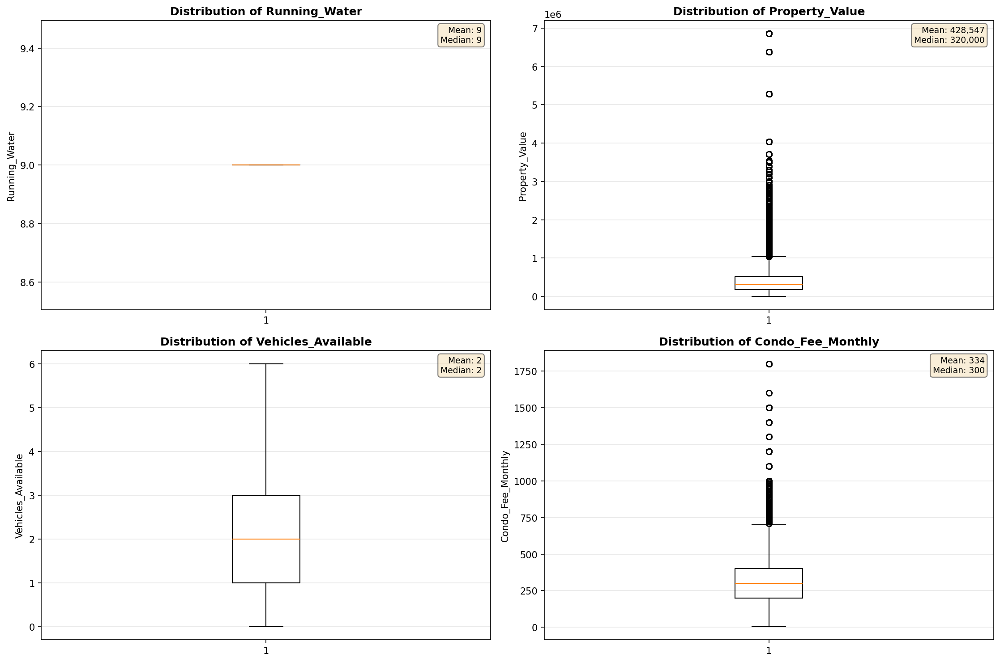
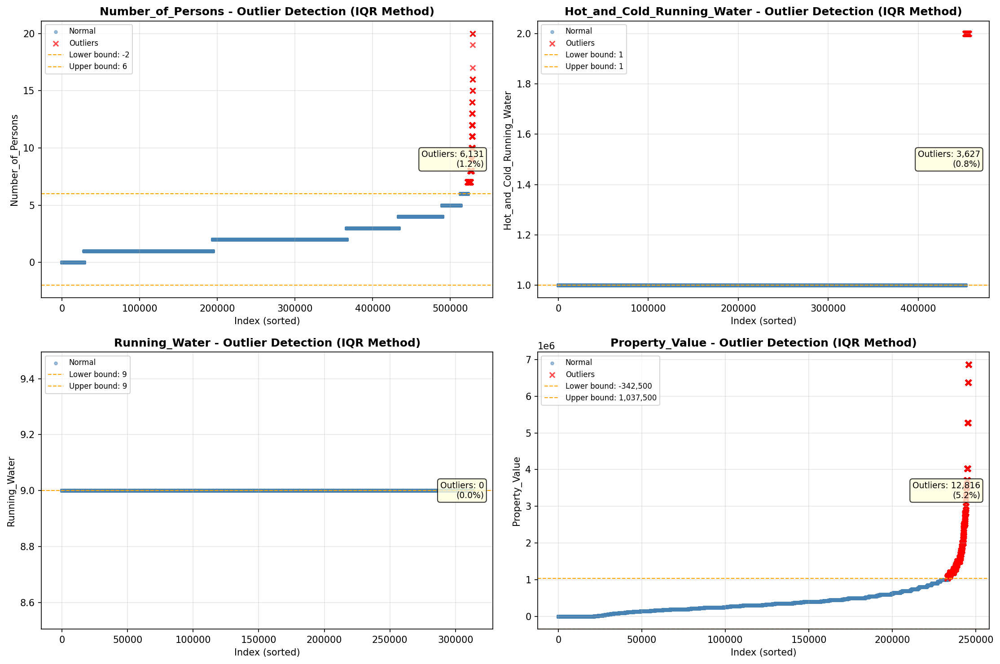
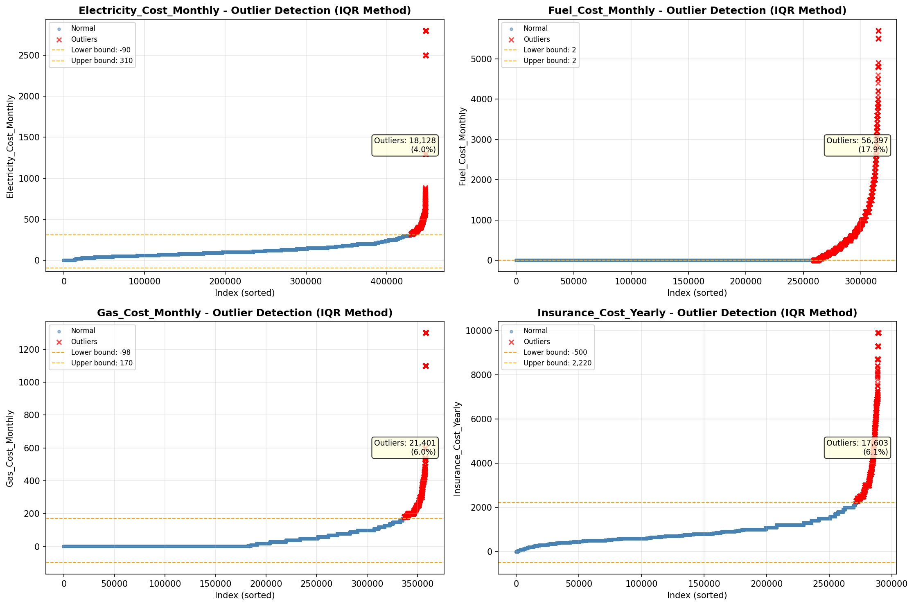
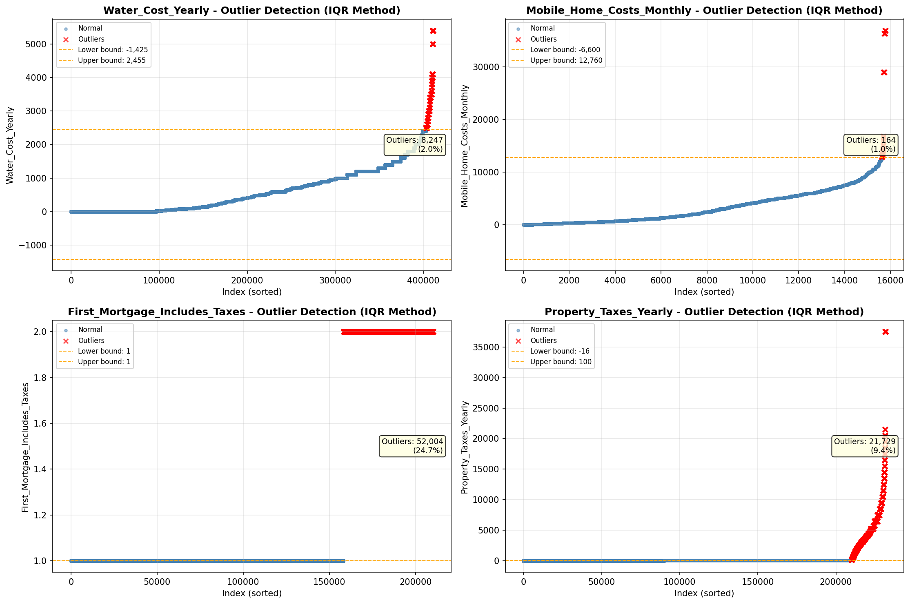

# Outlier Detection

> Statistical outlier detection using IQR (Interquartile Range) method. Outliers are values falling outside Q1 - 1.5×IQR or Q3 + 1.5×IQR bounds.

## Detection Methodology

| Parameter | Value | Description |
| :--- | :--- | :--- |
| Method | IQR | Outlier detection algorithm |
| Lower Bound | Q1 - 1.5 × IQR | Values below are outliers |
| Upper Bound | Q3 + 1.5 × IQR | Values above are outliers |
| IQR Definition | Q3 - Q1 | Interquartile Range |

> **Note**: The IQR method is robust to extreme values and works well for approximately symmetric distributions.

## Outlier Summary

_No outlier summary available._
## High Outlier Rate Variables

> Variables with outlier rate > 5% may indicate data quality issues, non-normal distributions, or genuinely extreme values.

- **('First_Mortgage_Includes_Taxes', 24.736599264618444)**: 0 outliers (0.00%)

- **('Flag_Selected_Monthly_Owner_Costs', 21.400129966106878)**: 0 outliers (0.00%)

- **('Fuel_Cost_Monthly', 17.884505612989155)**: 0 outliers (0.00%)

- **('Flag_Family_Income', 17.776544231178608)**: 0 outliers (0.00%)

- **('Property_Tax_Rate', 16.77376085845682)**: 0 outliers (0.00%)

- **('Structure_Age', 10.072407396325774)**: 0 outliers (0.00%)

- **('Gross_Rent_Percentage_Income', 9.867055238274304)**: 0 outliers (0.00%)

- **('Income_Adjustment_Factor', 9.854654241236895)**: 0 outliers (0.00%)

- **('Property_Taxes_Yearly', 9.375889952276983)**: 0 outliers (0.00%)

- **('Working_Age_Persons', 9.330161947324802)**: 0 outliers (0.00%)

- **('Flag_Property_Taxes', 8.613745181984289)**: 0 outliers (0.00%)

- **('Flag_Water_Cost', 8.370764791623287)**: 0 outliers (0.00%)

- **('Structure_Age_Score', 8.046675842259589)**: 0 outliers (0.00%)

- **('Flag_Gross_Rent', 7.632893041237114)**: 0 outliers (0.00%)

- **('Owner_Costs_Percentage_Income', 7.114894046927487)**: 0 outliers (0.00%)

> *Consider investigating these variables for data entry errors, applying transformations, or using robust statistical methods.*

## Visualizations

