# Statistical Analysis

> Comprehensive descriptive statistics including central tendency, dispersion, distribution characteristics, and weighted statistics using ACS sample weights.

## Summary Statistics

- **Variables Analyzed**: 41

### Income_Adjustment_Factor

| Statistic | Unweighted | Weighted (ACS) |
| :--- | :--- | :--- |
| Mean | 1,014,540.67 | 1,014,656.45 |
| Median | 1,010,207.00 | 1,014,656.45 |
| Std Deviation | 11,193.16 | — |
| Minimum | 1,001,264.00 | — |
| Maximum | 1,042,311.00 | — |
| Count | 106,636 | — |

> *Distribution is highly right-skewed (skewness: 1.38), light-tailed/platykurtic (kurtosis: 0.93).*

- **Coefficient of Variation**: 1.1 % (low variability)

### Property_Value

| Statistic | Unweighted | Weighted (ACS) |
| :--- | :--- | :--- |
| Mean | 139,182.62 | 141,633.32 |
| Median | 100,000.00 | 109,501.08 |
| Std Deviation | 180,905.21 | — |
| Minimum | 1.00 | — |
| Maximum | 2,473,000.00 | — |
| Count | 71,445 | — |

> *Distribution is highly right-skewed (skewness: 5.89), heavy-tailed/leptokurtic (kurtosis: 52.74).*

- **Coefficient of Variation**: 130.0 % (very high variability)

### Electricity_Cost_Monthly

| Statistic | Unweighted | Weighted (ACS) |
| :--- | :--- | :--- |
| Mean | 135.03 | 139.69 |
| Median | 110.00 | 116.88 |
| Std Deviation | 127.25 | — |
| Minimum | 1.00 | — |
| Maximum | 3,600.00 | — |
| Count | 121,873 | — |

> *Distribution is highly right-skewed (skewness: 12.21), heavy-tailed/leptokurtic (kurtosis: 286.25).*

- **Coefficient of Variation**: 94.2 % (high variability)

### Fuel_Cost_Monthly

| Statistic | Unweighted | Weighted (ACS) |
| :--- | :--- | :--- |
| Mean | 150.28 | 318.60 |
| Median | 2.00 | 182.62 |
| Std Deviation | 457.54 | — |
| Minimum | 1.00 | — |
| Maximum | 5,600.00 | — |
| Count | 89,300 | — |

> *Distribution is highly right-skewed (skewness: 4.62), heavy-tailed/leptokurtic (kurtosis: 27.46).*

- **Coefficient of Variation**: 304.4 % (very high variability)

### Gas_Cost_Monthly

| Statistic | Unweighted | Weighted (ACS) |
| :--- | :--- | :--- |
| Mean | 63.45 | 66.06 |
| Median | 40.00 | 26.62 |
| Std Deviation | 101.29 | — |
| Minimum | 1.00 | — |
| Maximum | 2,200.00 | — |
| Count | 105,681 | — |

> *Distribution is highly right-skewed (skewness: 8.61), heavy-tailed/leptokurtic (kurtosis: 147.51).*

- **Coefficient of Variation**: 159.6 % (very high variability)

### Insurance_Cost_Yearly

| Statistic | Unweighted | Weighted (ACS) |
| :--- | :--- | :--- |
| Mean | 765.04 | 781.01 |
| Median | 640.00 | 685.00 |
| Std Deviation | 578.52 | — |
| Minimum | 4.00 | — |
| Maximum | 7,000.00 | — |
| Count | 76,359 | — |

> *Distribution is highly right-skewed (skewness: 2.68), heavy-tailed/leptokurtic (kurtosis: 14.92).*

- **Coefficient of Variation**: 75.6 % (high variability)

### Water_Cost_Yearly

| Statistic | Unweighted | Weighted (ACS) |
| :--- | :--- | :--- |
| Mean | 523.14 | 522.14 |
| Median | 440.00 | 439.38 |
| Std Deviation | 530.11 | — |
| Minimum | 1.00 | — |
| Maximum | 5,600.00 | — |
| Count | 115,154 | — |

> *Distribution is highly right-skewed (skewness: 1.92), heavy-tailed/leptokurtic (kurtosis: 7.92).*

- **Coefficient of Variation**: 101.3 % (very high variability)

### Mobile_Home_Costs_Monthly

| Statistic | Unweighted | Weighted (ACS) |
| :--- | :--- | :--- |
| Mean | 824.45 | 893.93 |
| Median | 350.00 | 337.50 |
| Std Deviation | 1,400.63 | — |
| Minimum | 4.00 | — |
| Maximum | 19,600.00 | — |
| Count | 7,289 | — |

> *Distribution is highly right-skewed (skewness: 5.84), heavy-tailed/leptokurtic (kurtosis: 58.39).*

- **Coefficient of Variation**: 169.9 % (very high variability)

### First_Mortgage_Payment_Monthly

| Statistic | Unweighted | Weighted (ACS) |
| :--- | :--- | :--- |
| Mean | 599.82 | 693.43 |
| Median | 500.00 | 543.00 |
| Std Deviation | 542.05 | — |
| Minimum | 4.00 | — |
| Maximum | 4,100.00 | — |
| Count | 53,171 | — |

> *Distribution is highly right-skewed (skewness: 1.63), heavy-tailed/leptokurtic (kurtosis: 4.39).*

- **Coefficient of Variation**: 90.4 % (high variability)

### First_Mortgage_Includes_Taxes

| Statistic | Unweighted | Weighted (ACS) |
| :--- | :--- | :--- |
| Mean | 1.45 | 1.43 |
| Median | 1.00 | 1.31 |
| Std Deviation | 0.50 | — |
| Minimum | 1.00 | — |
| Maximum | 2.00 | — |
| Count | 42,766 | — |

> *Distribution is approximately symmetric (skewness: 0.20), light-tailed/platykurtic (kurtosis: -1.96).*

- **Coefficient of Variation**: 34.3 % (moderate variability)

### Second_Mortgage_Payment_Monthly

| Statistic | Unweighted | Weighted (ACS) |
| :--- | :--- | :--- |
| Mean | 326.39 | 322.64 |
| Median | 250.00 | 248.75 |
| Std Deviation | 297.16 | — |
| Minimum | 4.00 | — |
| Maximum | 2,500.00 | — |
| Count | 5,950 | — |

> *Distribution is highly right-skewed (skewness: 2.97), heavy-tailed/leptokurtic (kurtosis: 12.82).*

- **Coefficient of Variation**: 91.0 % (high variability)

### Property_Taxes_Yearly

| Statistic | Unweighted | Weighted (ACS) |
| :--- | :--- | :--- |
| Mean | 101.25 | 107.89 |
| Median | 12.00 | 79.42 |
| Std Deviation | 457.86 | — |
| Minimum | 1.00 | — |
| Maximum | 10,500.00 | — |
| Count | 70,129 | — |

> *Distribution is highly right-skewed (skewness: 12.24), heavy-tailed/leptokurtic (kurtosis: 232.15).*

- **Coefficient of Variation**: 452.2 % (very high variability)

### Meals_Included_in_Rent

| Statistic | Unweighted | Weighted (ACS) |
| :--- | :--- | :--- |
| Mean | 1.99 | 1.99 |
| Median | 2.00 | 2.00 |
| Std Deviation | 0.09 | — |
| Minimum | 1.00 | — |
| Maximum | 2.00 | — |
| Count | 26,557 | — |

> *Distribution is highly left-skewed (skewness: -10.49), heavy-tailed/leptokurtic (kurtosis: 108.02).*

- **Coefficient of Variation**: 4.7 % (low variability)

### Rent_Amount_Monthly

| Statistic | Unweighted | Weighted (ACS) |
| :--- | :--- | :--- |
| Mean | 505.04 | 532.45 |
| Median | 450.00 | 487.50 |
| Std Deviation | 322.02 | — |
| Minimum | 4.00 | — |
| Maximum | 3,800.00 | — |
| Count | 26,557 | — |

> *Distribution is highly right-skewed (skewness: 2.64), heavy-tailed/leptokurtic (kurtosis: 13.36).*

- **Coefficient of Variation**: 63.8 % (high variability)

### Gross_Rent

| Statistic | Unweighted | Weighted (ACS) |
| :--- | :--- | :--- |
| Mean | 672.50 | 699.39 |
| Median | 628.00 | 659.12 |
| Std Deviation | 360.05 | — |
| Minimum | 4.00 | — |
| Maximum | 4,858.00 | — |
| Count | 24,457 | — |

> *Distribution is highly right-skewed (skewness: 2.02), heavy-tailed/leptokurtic (kurtosis: 9.99).*

- **Coefficient of Variation**: 53.5 % (high variability)

### Gross_Rent_Percentage_Income

| Statistic | Unweighted | Weighted (ACS) |
| :--- | :--- | :--- |
| Mean | 37.82 | 38.44 |
| Median | 29.00 | 28.81 |
| Std Deviation | 27.65 | — |
| Minimum | 1.00 | — |
| Maximum | 101.00 | — |
| Count | 23,689 | — |

> *Distribution is highly right-skewed (skewness: 1.15), light-tailed/platykurtic (kurtosis: 0.25).*

- **Coefficient of Variation**: 73.1 % (high variability)

### Selected_Monthly_Owner_Costs

| Statistic | Unweighted | Weighted (ACS) |
| :--- | :--- | :--- |
| Mean | 697.15 | 718.87 |
| Median | 502.00 | 527.88 |
| Std Deviation | 593.58 | — |
| Minimum | 2.00 | — |
| Maximum | 9,150.00 | — |
| Count | 94,025 | — |

> *Distribution is highly right-skewed (skewness: 2.36), heavy-tailed/leptokurtic (kurtosis: 9.58).*

- **Coefficient of Variation**: 85.1 % (high variability)

### Owner_Costs_Percentage_Income

| Statistic | Unweighted | Weighted (ACS) |
| :--- | :--- | :--- |
| Mean | 18.67 | 18.94 |
| Median | 13.00 | 13.62 |
| Std Deviation | 18.41 | — |
| Minimum | 1.00 | — |
| Maximum | 101.00 | — |
| Count | 93,220 | — |

> *Distribution is highly right-skewed (skewness: 2.59), heavy-tailed/leptokurtic (kurtosis: 7.79).*

- **Coefficient of Variation**: 98.6 % (high variability)

### Family_Income

| Statistic | Unweighted | Weighted (ACS) |
| :--- | :--- | :--- |
| Mean | 72,053.10 | 71,192.14 |
| Median | 56,000.00 | 55,956.25 |
| Std Deviation | 66,478.42 | — |
| Minimum | 1.00 | — |
| Maximum | 1,309,090.00 | — |
| Count | 78,631 | — |

> *Distribution is highly right-skewed (skewness: 3.43), heavy-tailed/leptokurtic (kurtosis: 21.22).*

- **Coefficient of Variation**: 92.3 % (high variability)

### Household_Income

| Statistic | Unweighted | Weighted (ACS) |
| :--- | :--- | :--- |
| Mean | 59,885.98 | 59,524.33 |
| Median | 43,600.00 | 43,777.50 |
| Std Deviation | 61,564.69 | — |
| Minimum | 1.00 | — |
| Maximum | 1,309,090.00 | — |
| Count | 121,329 | — |

> *Distribution is highly right-skewed (skewness: 3.60), heavy-tailed/leptokurtic (kurtosis: 23.42).*

- **Coefficient of Variation**: 102.8 % (very high variability)

### Specified_Rent_Unit

| Statistic | Unweighted | Weighted (ACS) |
| :--- | :--- | :--- |
| Mean | 0.22 | 0.24 |
| Median | 0.00 | 0.00 |
| Std Deviation | 0.41 | — |
| Minimum | 0.00 | — |
| Maximum | 1.00 | — |
| Count | 141,114 | — |

> *Distribution is highly right-skewed (skewness: 1.38), light-tailed/platykurtic (kurtosis: -0.09).*

- **Coefficient of Variation**: 190.6 % (very high variability)

### Specified_Value_Unit

| Statistic | Unweighted | Weighted (ACS) |
| :--- | :--- | :--- |
| Mean | 0.54 | 0.48 |
| Median | 1.00 | 0.12 |
| Std Deviation | 0.50 | — |
| Minimum | 0.00 | — |
| Maximum | 1.00 | — |
| Count | 141,114 | — |

> *Distribution is approximately symmetric (skewness: -0.14), light-tailed/platykurtic (kurtosis: -1.98).*

- **Coefficient of Variation**: 93.2 % (high variability)

### Flag_Family_Income

| Statistic | Unweighted | Weighted (ACS) |
| :--- | :--- | :--- |
| Mean | 0.18 | 0.18 |
| Median | 0.00 | 0.00 |
| Std Deviation | 0.39 | — |
| Minimum | 0.00 | — |
| Maximum | 1.00 | — |
| Count | 105,662 | — |

> *Distribution is highly right-skewed (skewness: 1.63), light-tailed/platykurtic (kurtosis: 0.67).*

- **Coefficient of Variation**: 210.7 % (very high variability)

### Flag_Gross_Rent

| Statistic | Unweighted | Weighted (ACS) |
| :--- | :--- | :--- |
| Mean | 0.06 | 0.10 |
| Median | 0.00 | 0.00 |
| Std Deviation | 0.23 | — |
| Minimum | 0.00 | — |
| Maximum | 1.00 | — |
| Count | 65,857 | — |

> *Distribution is highly right-skewed (skewness: 3.86), heavy-tailed/leptokurtic (kurtosis: 12.89).*

- **Coefficient of Variation**: 410.2 % (very high variability)

### Flag_Household_Income

| Statistic | Unweighted | Weighted (ACS) |
| :--- | :--- | :--- |
| Mean | 0.28 | 0.27 |
| Median | 0.00 | 0.00 |
| Std Deviation | 0.45 | — |
| Minimum | 0.00 | — |
| Maximum | 1.00 | — |
| Count | 105,662 | — |

> *Distribution is moderately right-skewed (skewness: 0.97), light-tailed/platykurtic (kurtosis: -1.07).*

- **Coefficient of Variation**: 159.4 % (very high variability)

### Flag_First_Mortgage_Payment

| Statistic | Unweighted | Weighted (ACS) |
| :--- | :--- | :--- |
| Mean | 0.03 | 0.03 |
| Median | 0.00 | 0.00 |
| Std Deviation | 0.16 | — |
| Minimum | 0.00 | — |
| Maximum | 1.00 | — |
| Count | 141,114 | — |

> *Distribution is highly right-skewed (skewness: 6.02), heavy-tailed/leptokurtic (kurtosis: 34.20).*

- **Coefficient of Variation**: 617.9 % (very high variability)

### Flag_First_Mortgage_Taxes

| Statistic | Unweighted | Weighted (ACS) |
| :--- | :--- | :--- |
| Mean | 0.03 | 0.03 |
| Median | 0.00 | 0.00 |
| Std Deviation | 0.17 | — |
| Minimum | 0.00 | — |
| Maximum | 1.00 | — |
| Count | 141,114 | — |

> *Distribution is highly right-skewed (skewness: 5.37), heavy-tailed/leptokurtic (kurtosis: 26.79).*

- **Coefficient of Variation**: 554.6 % (very high variability)

### Flag_Meals_Included_Rent

| Statistic | Unweighted | Weighted (ACS) |
| :--- | :--- | :--- |
| Mean | 0.00 | 0.00 |
| Median | 0.00 | 0.00 |
| Std Deviation | 0.07 | — |
| Minimum | 0.00 | — |
| Maximum | 1.00 | — |
| Count | 141,114 | — |

> *Distribution is highly right-skewed (skewness: 14.40), heavy-tailed/leptokurtic (kurtosis: 205.31).*

- **Coefficient of Variation**: 1,446.7 % (very high variability)

### Flag_Rent_Amount

| Statistic | Unweighted | Weighted (ACS) |
| :--- | :--- | :--- |
| Mean | 0.02 | 0.02 |
| Median | 0.00 | 0.00 |
| Std Deviation | 0.13 | — |
| Minimum | 0.00 | — |
| Maximum | 1.00 | — |
| Count | 141,114 | — |

> *Distribution is highly right-skewed (skewness: 7.64), heavy-tailed/leptokurtic (kurtosis: 56.32).*

- **Coefficient of Variation**: 776.5 % (very high variability)

### Flag_Selected_Monthly_Owner_Costs

| Statistic | Unweighted | Weighted (ACS) |
| :--- | :--- | :--- |
| Mean | 0.24 | 0.24 |
| Median | 0.00 | 0.00 |
| Std Deviation | 0.43 | — |
| Minimum | 0.00 | — |
| Maximum | 1.00 | — |
| Count | 91,022 | — |

> *Distribution is highly right-skewed (skewness: 1.24), light-tailed/platykurtic (kurtosis: -0.47).*

- **Coefficient of Variation**: 179.4 % (very high variability)

### Flag_Second_Mortgage_Payment

| Statistic | Unweighted | Weighted (ACS) |
| :--- | :--- | :--- |
| Mean | 0.02 | 0.02 |
| Median | 0.00 | 0.00 |
| Std Deviation | 0.14 | — |
| Minimum | 0.00 | — |
| Maximum | 1.00 | — |
| Count | 141,114 | — |

> *Distribution is highly right-skewed (skewness: 6.64), heavy-tailed/leptokurtic (kurtosis: 42.14).*

- **Coefficient of Variation**: 679.1 % (very high variability)

### Flag_Property_Taxes

| Statistic | Unweighted | Weighted (ACS) |
| :--- | :--- | :--- |
| Mean | 0.12 | 0.13 |
| Median | 0.00 | 0.00 |
| Std Deviation | 0.32 | — |
| Minimum | 0.00 | — |
| Maximum | 1.00 | — |
| Count | 132,476 | — |

> *Distribution is highly right-skewed (skewness: 2.37), heavy-tailed/leptokurtic (kurtosis: 3.63).*

- **Coefficient of Variation**: 273.7 % (very high variability)

### Flag_Property_Value

| Statistic | Unweighted | Weighted (ACS) |
| :--- | :--- | :--- |
| Mean | 0.11 | 0.11 |
| Median | 0.00 | 0.00 |
| Std Deviation | 0.31 | — |
| Minimum | 0.00 | — |
| Maximum | 1.00 | — |
| Count | 141,114 | — |

> *Distribution is highly right-skewed (skewness: 2.55), heavy-tailed/leptokurtic (kurtosis: 4.51).*

- **Coefficient of Variation**: 289.7 % (very high variability)

### Flag_Water_Cost

| Statistic | Unweighted | Weighted (ACS) |
| :--- | :--- | :--- |
| Mean | 0.07 | 0.07 |
| Median | 0.00 | 0.00 |
| Std Deviation | 0.25 | — |
| Minimum | 0.00 | — |
| Maximum | 1.00 | — |
| Count | 8,638 | — |

> *Distribution is highly right-skewed (skewness: 3.39), heavy-tailed/leptokurtic (kurtosis: 9.47).*

- **Coefficient of Variation**: 366.0 % (very high variability)

### Annual_Rent_to_Value_Ratio

### Total_Monthly_Utility_Cost

| Statistic | Unweighted | Weighted (ACS) |
| :--- | :--- | :--- |
| Mean | 189.79 | 189.65 |
| Median | 160.00 | 163.81 |
| Std Deviation | 165.91 | — |
| Minimum | 2.00 | — |
| Maximum | 5,800.00 | — |
| Count | 122,039 | — |

> *Distribution is highly right-skewed (skewness: 11.80), heavy-tailed/leptokurtic (kurtosis: 281.47).*

- **Coefficient of Variation**: 87.4 % (high variability)

### Property_Tax_Rate

| Statistic | Unweighted | Weighted (ACS) |
| :--- | :--- | :--- |
| Mean | 12.97 | 12.40 |
| Median | 0.01 | 11.53 |
| Std Deviation | 42.44 | — |
| Minimum | 0.00 | — |
| Maximum | 1,200.00 | — |
| Count | 46,241 | — |

> *Distribution is highly right-skewed (skewness: 6.64), heavy-tailed/leptokurtic (kurtosis: 98.50).*

- **Coefficient of Variation**: 327.1 % (very high variability)

#### Weighted Statistics by Year

| Year | Weighted Mean | Weighted Median |
| :--- | :--- | :--- |
| 2007 | 98.29 | 91.67 |
| 2012 | 0.02 | 0.01 |
| 2013 | 0.03 | 0.01 |
| 2014 | 0.03 | 0.01 |
| 2015 | 0.02 | 0.01 |
| 2016 | 0.02 | 0.01 |
| 2017 | 0.02 | 0.01 |
| 2023 | 0.77 | 0.54 |

### Structure_Age

| Statistic | Unweighted | Weighted (ACS) |
| :--- | :--- | :--- |
| Mean | 1,881.99 | 1,878.36 |
| Median | 2,019.00 | 1,878.43 |
| Std Deviation | 500.35 | — |
| Minimum | 1.00 | — |
| Maximum | 2,023.00 | — |
| Count | 123,912 | — |

> *Distribution is highly left-skewed (skewness: -3.38), heavy-tailed/leptokurtic (kurtosis: 9.43).*

- **Coefficient of Variation**: 26.6 % (moderate variability)

### Structure_Age_Score

| Statistic | Unweighted | Weighted (ACS) |
| :--- | :--- | :--- |
| Mean | 0.03 | 0.03 |
| Median | 0.00 | 0.03 |
| Std Deviation | 0.13 | — |
| Minimum | 0.00 | — |
| Maximum | 0.99 | — |
| Count | 123,912 | — |

> *Distribution is highly right-skewed (skewness: 4.56), heavy-tailed/leptokurtic (kurtosis: 20.77).*

- **Coefficient of Variation**: 415.1 % (very high variability)

### Working_Age_Persons

| Statistic | Unweighted | Weighted (ACS) |
| :--- | :--- | :--- |
| Mean | 1.51 | 1.60 |
| Median | 1.00 | 1.56 |
| Std Deviation | 1.27 | — |
| Minimum | 0.00 | — |
| Maximum | 19.00 | — |
| Count | 123,168 | — |

> *Distribution is moderately right-skewed (skewness: 0.86), light-tailed/platykurtic (kurtosis: 1.66).*

- **Coefficient of Variation**: 84.0 % (high variability)

### Income_to_FPL_Ratio

| Statistic | Unweighted | Weighted (ACS) |
| :--- | :--- | :--- |
| Mean | 2.79 | 2.74 |
| Median | 2.08 | 2.08 |
| Std Deviation | 2.84 | — |
| Minimum | -0.69 | — |
| Maximum | 66.38 | — |
| Count | 123,168 | — |

> *Distribution is highly right-skewed (skewness: 4.08), heavy-tailed/leptokurtic (kurtosis: 30.85).*

- **Coefficient of Variation**: 101.8 % (very high variability)

## Distribution Analysis

### Skewed Distributions

> Variables with skewness > |0.5| indicate non-normal distributions. Consider log transformations for highly skewed variables in modeling.

| Variable | Skewness | Direction | Severity |
| :--- | :--- | :--- | :--- |
| Flag_Meals_Included_Rent | 14.398 | Right-skewed | High |
| Property_Taxes_Yearly | 12.237 | Right-skewed | High |
| Electricity_Cost_Monthly | 12.207 | Right-skewed | High |
| Total_Monthly_Utility_Cost | 11.802 | Right-skewed | High |
| Meals_Included_in_Rent | -10.489 | Left-skewed | High |
| Gas_Cost_Monthly | 8.607 | Right-skewed | High |
| Flag_Rent_Amount | 7.637 | Right-skewed | High |
| Flag_Second_Mortgage_Payment | 6.644 | Right-skewed | High |
| Property_Tax_Rate | 6.640 | Right-skewed | High |
| Flag_First_Mortgage_Payment | 6.017 | Right-skewed | High |
| Property_Value | 5.886 | Right-skewed | High |
| Mobile_Home_Costs_Monthly | 5.840 | Right-skewed | High |
| Flag_First_Mortgage_Taxes | 5.366 | Right-skewed | High |
| Fuel_Cost_Monthly | 4.617 | Right-skewed | High |
| Structure_Age_Score | 4.556 | Right-skewed | High |
| Income_to_FPL_Ratio | 4.076 | Right-skewed | High |
| Flag_Gross_Rent | 3.858 | Right-skewed | High |
| Household_Income | 3.601 | Right-skewed | High |
| Family_Income | 3.428 | Right-skewed | High |
| Flag_Water_Cost | 3.387 | Right-skewed | High |

- **Total Skewed Variables**: 38

- **Right-skewed**: 36

- **Left-skewed**: 2

## Variance Analysis

### Coefficient of Variation Ranking

> CV (Coefficient of Variation) = (Std Dev / Mean) × 100%. Higher CV indicates greater relative variability.

| Variable | CV (%) | Std Dev | Mean | Variability |
| :--- | :--- | :--- | :--- | :--- |
| Flag_Meals_Included_Rent | 1446.7% | 0.07 | 0.00 | Very High |
| Flag_Rent_Amount | 776.5% | 0.13 | 0.02 | Very High |
| Flag_Second_Mortgage_Payment | 679.1% | 0.14 | 0.02 | Very High |
| Flag_First_Mortgage_Payment | 617.9% | 0.16 | 0.03 | Very High |
| Flag_First_Mortgage_Taxes | 554.6% | 0.17 | 0.03 | Very High |
| Property_Taxes_Yearly | 452.2% | 457.86 | 101.25 | Very High |
| Structure_Age_Score | 415.1% | 0.13 | 0.03 | Very High |
| Flag_Gross_Rent | 410.2% | 0.23 | 0.06 | Very High |
| Flag_Water_Cost | 366.0% | 0.25 | 0.07 | Very High |
| Property_Tax_Rate | 327.1% | 42.44 | 12.97 | Very High |
| Fuel_Cost_Monthly | 304.4% | 457.54 | 150.28 | Very High |
| Flag_Property_Value | 289.7% | 0.31 | 0.11 | Very High |
| Flag_Property_Taxes | 273.7% | 0.32 | 0.12 | Very High |
| Flag_Family_Income | 210.7% | 0.39 | 0.18 | Very High |
| Specified_Rent_Unit | 190.6% | 0.41 | 0.22 | Very High |
| Flag_Selected_Monthly_Owner_Costs | 179.4% | 0.43 | 0.24 | Very High |
| Mobile_Home_Costs_Monthly | 169.9% | 1,400.63 | 824.45 | Very High |
| Gas_Cost_Monthly | 159.6% | 101.29 | 63.45 | Very High |
| Flag_Household_Income | 159.4% | 0.45 | 0.28 | Very High |
| Property_Value | 130.0% | 180,905.21 | 139,182.62 | Very High |

- **Average CV**: 239.2 %

- **High Variance Variables (CV > 50%)**: 36

## Visualizations

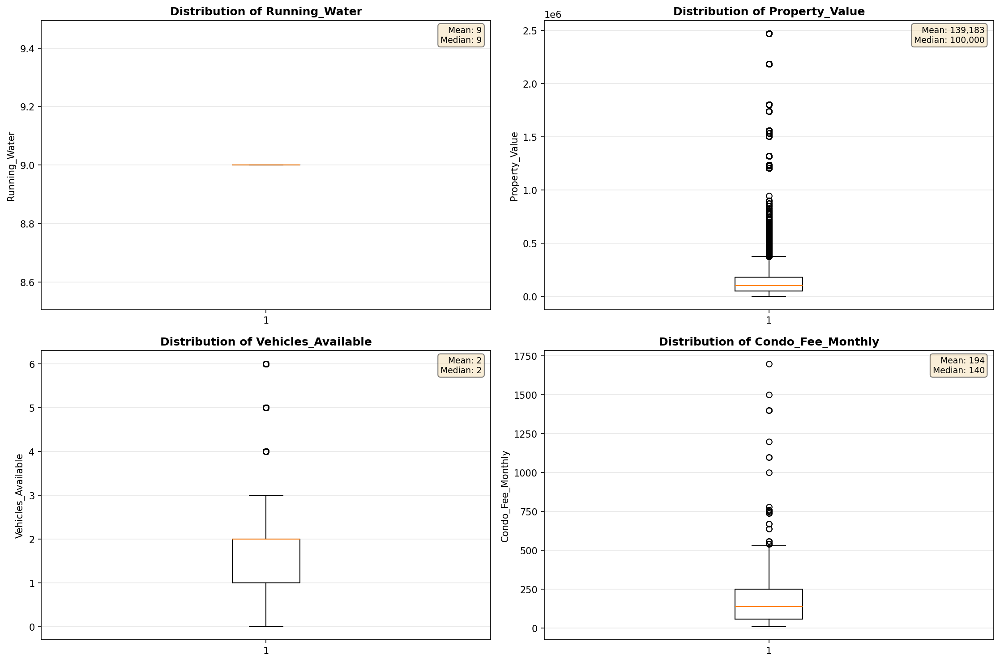

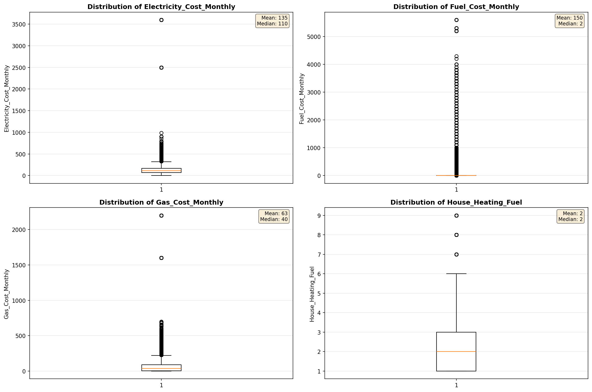

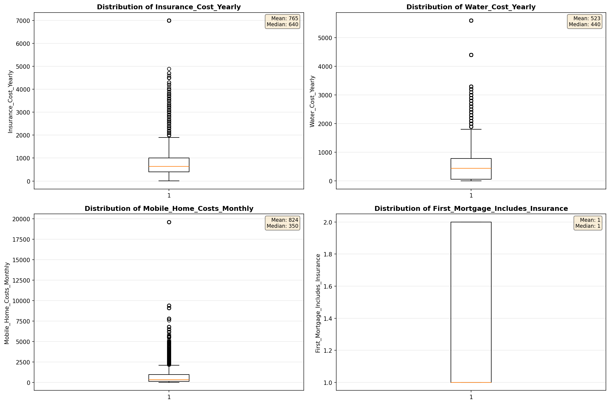

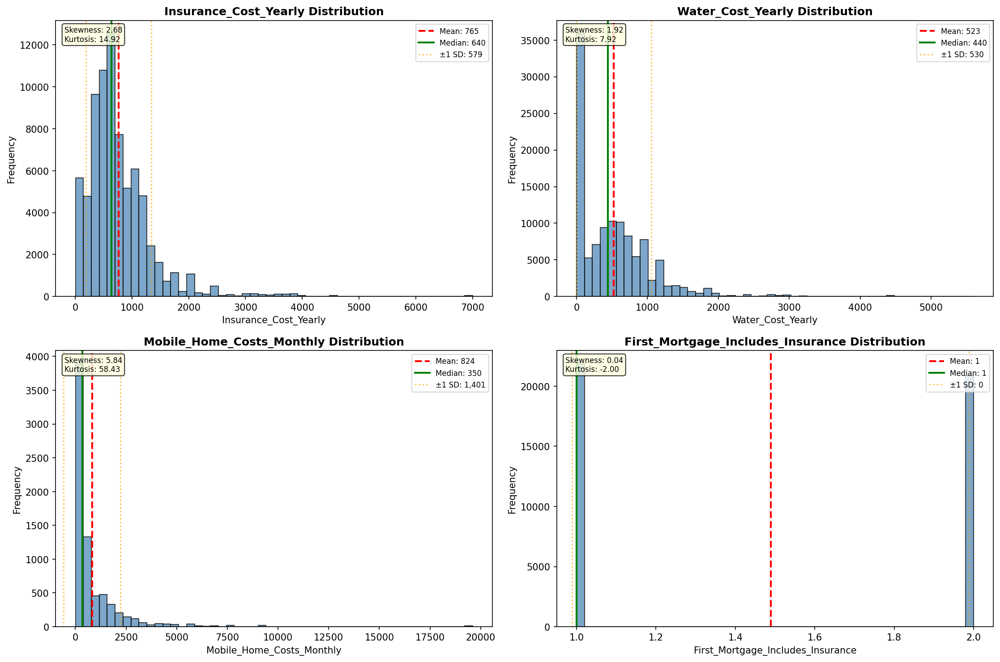

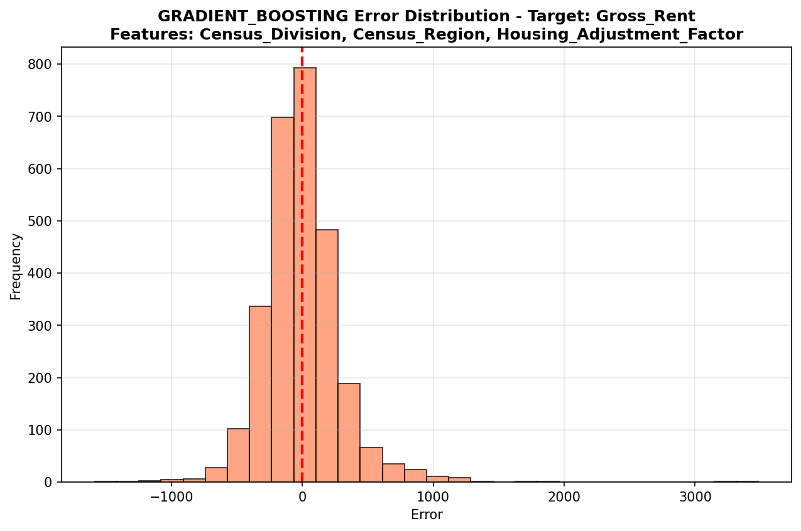

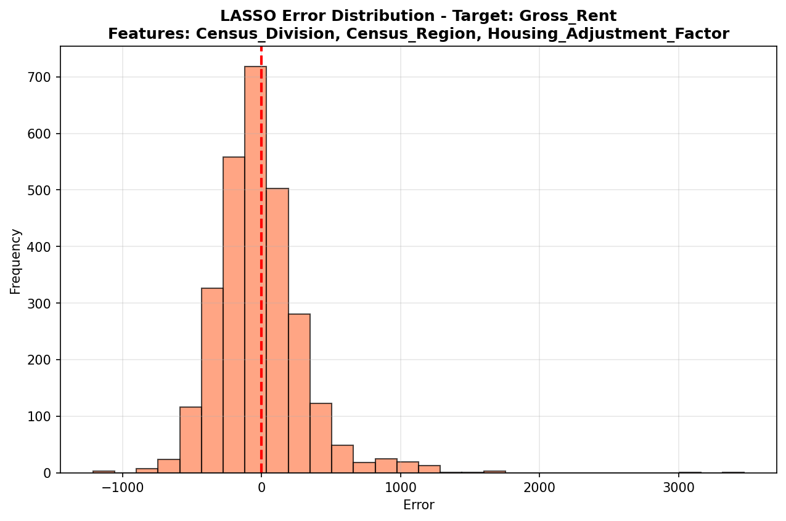

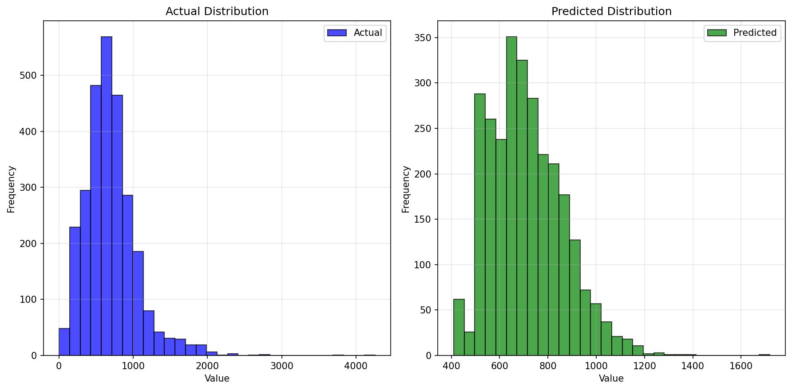

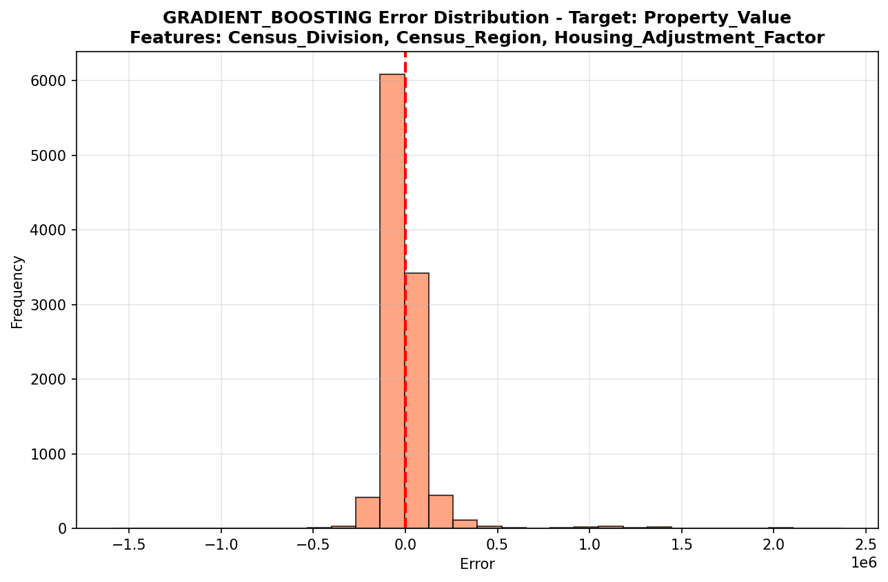

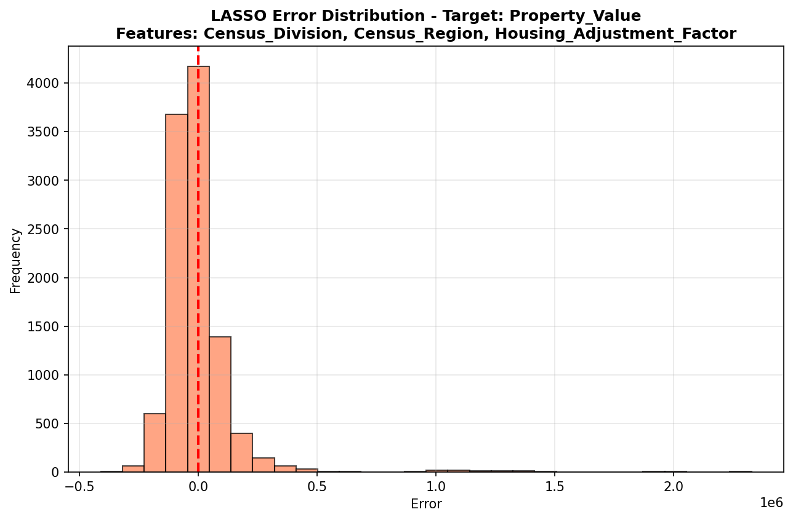

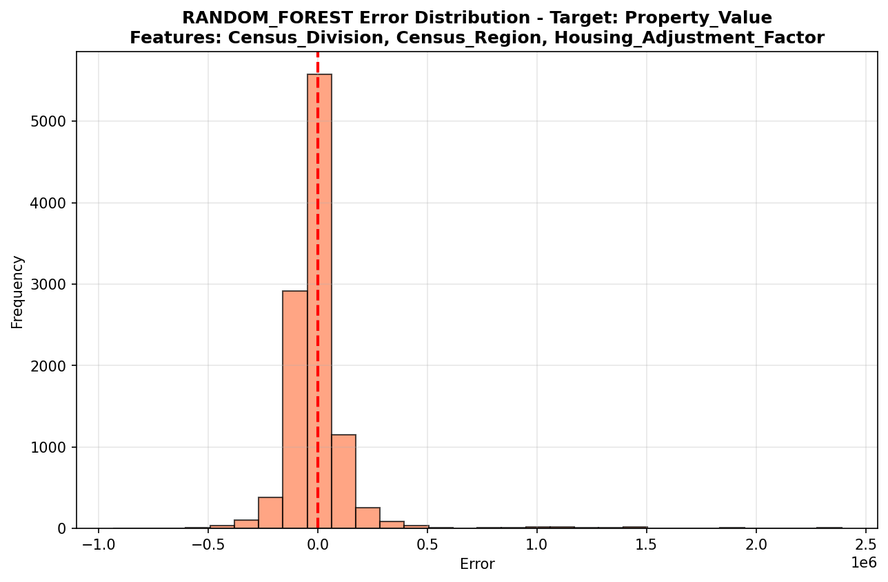

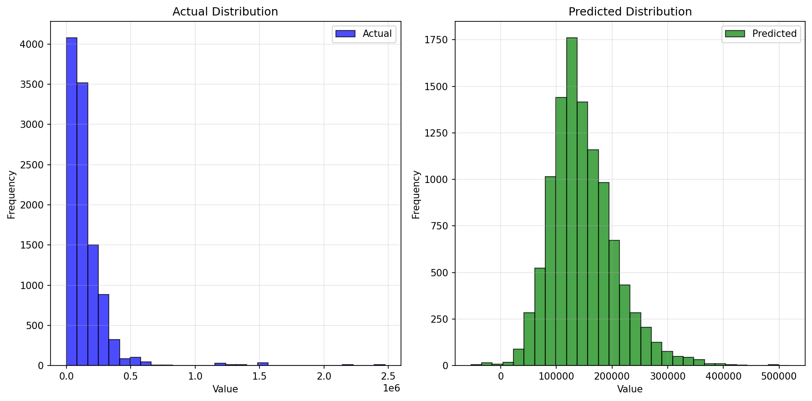

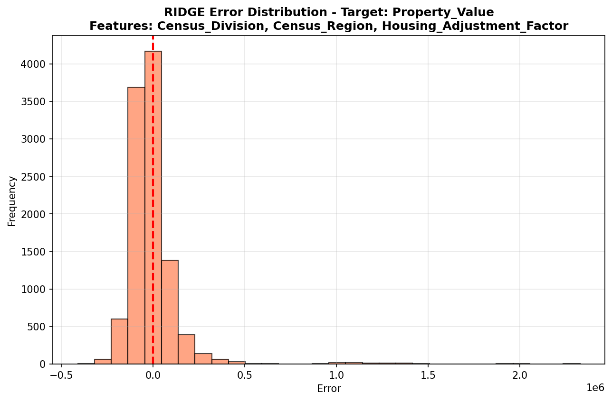

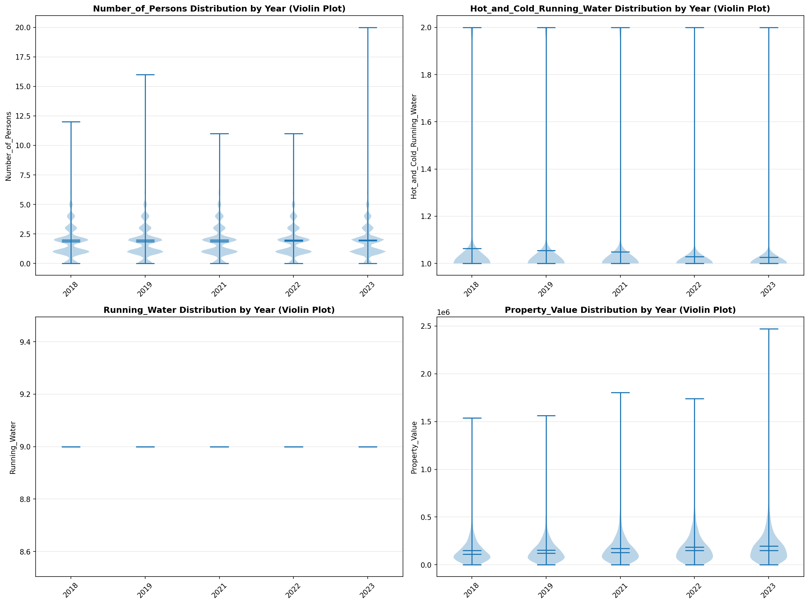

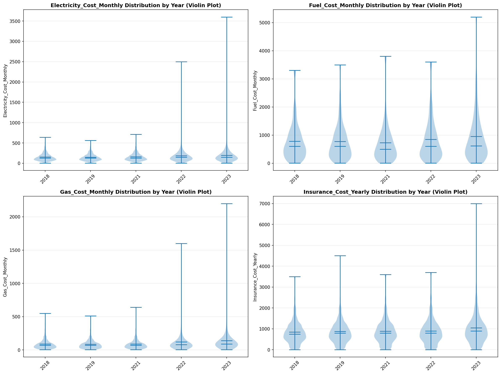

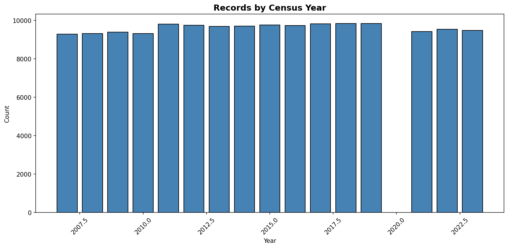
