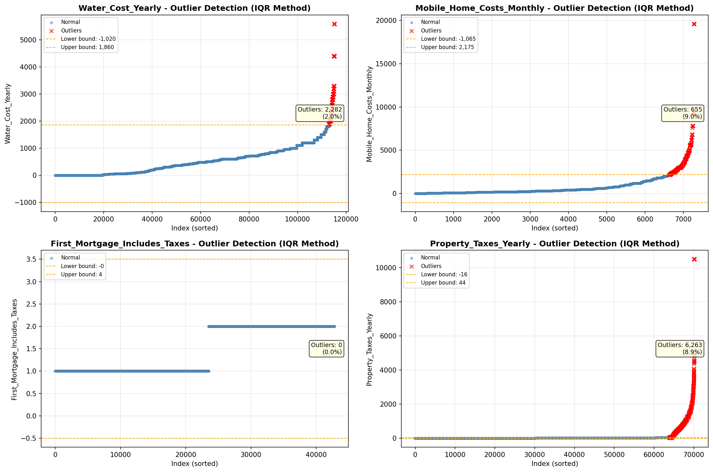

# Outlier Detection

> Statistical outlier detection using IQR (Interquartile Range) method. Outliers are values falling outside Q1 - 1.5×IQR or Q3 + 1.5×IQR bounds.

## Detection Methodology

| Parameter | Value | Description |
| :--- | :--- | :--- |
| Method | IQR | Outlier detection algorithm |
| Lower Bound | Q1 - 1.5 × IQR | Values below are outliers |
| Upper Bound | Q3 + 1.5 × IQR | Values above are outliers |
| IQR Definition | Q3 - Q1 | Interquartile Range |

> **Note**: The IQR method is robust to extreme values and works well for approximately symmetric distributions.

## Outlier Summary

_No outlier summary available._
## High Outlier Rate Variables

> Variables with outlier rate > 5% may indicate data quality issues, non-normal distributions, or genuinely extreme values.

- **('Flag_Selected_Monthly_Owner_Costs', 23.69976489200413)**: 0 outliers (0.00%)

- **('Specified_Rent_Unit', 21.58963674759414)**: 0 outliers (0.00%)

- **('Property_Tax_Rate', 21.26035336606042)**: 0 outliers (0.00%)

- **('Fuel_Cost_Monthly', 18.6976483762598)**: 0 outliers (0.00%)

- **('Flag_Family_Income', 18.381253430750885)**: 0 outliers (0.00%)

- **('Flag_Property_Taxes', 11.774963012168243)**: 0 outliers (0.00%)

- **('Flag_Property_Value', 10.644585228963816)**: 0 outliers (0.00%)

- **('Gross_Rent_Percentage_Income', 9.493857908734011)**: 0 outliers (0.00%)

- **('Mobile_Home_Costs_Monthly', 8.986143503910002)**: 0 outliers (0.00%)

- **('Income_Adjustment_Factor', 8.951010915638244)**: 0 outliers (0.00%)

- **('Property_Taxes_Yearly', 8.930684880719816)**: 0 outliers (0.00%)

- **('Structure_Age', 8.274420556523983)**: 0 outliers (0.00%)

- **('Owner_Costs_Percentage_Income', 7.612100407637847)**: 0 outliers (0.00%)

- **('Structure_Age_Score', 6.97107624765963)**: 0 outliers (0.00%)

- **('Flag_Water_Cost', 6.946052326927529)**: 0 outliers (0.00%)

> *Consider investigating these variables for data entry errors, applying transformations, or using robust statistical methods.*

## Visualizations

