# Statistical Analysis

> Comprehensive descriptive statistics including central tendency, dispersion, distribution characteristics, and weighted statistics using ACS sample weights.

## Summary Statistics

- **Variables Analyzed**: 41

### Income_Adjustment_Factor

| Statistic | Unweighted | Weighted (ACS) |
| :--- | :--- | :--- |
| Mean | 1,014,879.43 | 1,014,656.45 |
| Median | 1,010,207.00 | 1,014,656.45 |
| Std Deviation | 11,387.66 | — |
| Minimum | 1,001,264.00 | — |
| Maximum | 1,042,311.00 | — |
| Count | 328,185 | — |

> *Distribution is highly right-skewed (skewness: 1.32), light-tailed/platykurtic (kurtosis: 0.71).*

- **Coefficient of Variation**: 1.1 % (low variability)

### Property_Value

| Statistic | Unweighted | Weighted (ACS) |
| :--- | :--- | :--- |
| Mean | 214,583.05 | 212,858.35 |
| Median | 170,000.00 | 173,501.33 |
| Std Deviation | 237,823.13 | — |
| Minimum | 1.00 | — |
| Maximum | 2,919,000.00 | — |
| Count | 229,298 | — |

> *Distribution is highly right-skewed (skewness: 5.18), heavy-tailed/leptokurtic (kurtosis: 41.44).*

- **Coefficient of Variation**: 110.8 % (very high variability)

### Electricity_Cost_Monthly

| Statistic | Unweighted | Weighted (ACS) |
| :--- | :--- | :--- |
| Mean | 134.32 | 131.33 |
| Median | 120.00 | 114.38 |
| Std Deviation | 113.04 | — |
| Minimum | 1.00 | — |
| Maximum | 2,800.00 | — |
| Count | 379,981 | — |

> *Distribution is highly right-skewed (skewness: 10.94), heavy-tailed/leptokurtic (kurtosis: 233.94).*

- **Coefficient of Variation**: 84.2 % (high variability)

### Fuel_Cost_Monthly

| Statistic | Unweighted | Weighted (ACS) |
| :--- | :--- | :--- |
| Mean | 228.90 | 365.43 |
| Median | 2.00 | 227.62 |
| Std Deviation | 570.32 | — |
| Minimum | 1.00 | — |
| Maximum | 5,700.00 | — |
| Count | 275,042 | — |

> *Distribution is highly right-skewed (skewness: 3.39), heavy-tailed/leptokurtic (kurtosis: 14.06).*

- **Coefficient of Variation**: 249.2 % (very high variability)

### Gas_Cost_Monthly

| Statistic | Unweighted | Weighted (ACS) |
| :--- | :--- | :--- |
| Mean | 81.22 | 73.26 |
| Median | 50.00 | 37.81 |
| Std Deviation | 119.09 | — |
| Minimum | 1.00 | — |
| Maximum | 1,900.00 | — |
| Count | 332,274 | — |

> *Distribution is highly right-skewed (skewness: 5.98), heavy-tailed/leptokurtic (kurtosis: 72.38).*

- **Coefficient of Variation**: 146.6 % (very high variability)

### Insurance_Cost_Yearly

| Statistic | Unweighted | Weighted (ACS) |
| :--- | :--- | :--- |
| Mean | 840.40 | 794.26 |
| Median | 700.00 | 680.62 |
| Std Deviation | 655.69 | — |
| Minimum | 4.00 | — |
| Maximum | 7,000.00 | — |
| Count | 263,658 | — |

> *Distribution is highly right-skewed (skewness: 3.32), heavy-tailed/leptokurtic (kurtosis: 17.57).*

- **Coefficient of Variation**: 78.0 % (high variability)

### Water_Cost_Yearly

| Statistic | Unweighted | Weighted (ACS) |
| :--- | :--- | :--- |
| Mean | 310.32 | 392.95 |
| Median | 80.00 | 228.75 |
| Std Deviation | 426.25 | — |
| Minimum | 1.00 | — |
| Maximum | 3,400.00 | — |
| Count | 316,176 | — |

> *Distribution is highly right-skewed (skewness: 2.01), heavy-tailed/leptokurtic (kurtosis: 6.21).*

- **Coefficient of Variation**: 137.4 % (very high variability)

### Mobile_Home_Costs_Monthly

| Statistic | Unweighted | Weighted (ACS) |
| :--- | :--- | :--- |
| Mean | 2,068.02 | 2,509.87 |
| Median | 1,500.00 | 2,337.50 |
| Std Deviation | 2,063.95 | — |
| Minimum | 4.00 | — |
| Maximum | 28,500.00 | — |
| Count | 9,095 | — |

> *Distribution is highly right-skewed (skewness: 3.26), heavy-tailed/leptokurtic (kurtosis: 27.42).*

- **Coefficient of Variation**: 99.8 % (high variability)

### First_Mortgage_Payment_Monthly

| Statistic | Unweighted | Weighted (ACS) |
| :--- | :--- | :--- |
| Mean | 869.07 | 963.47 |
| Median | 800.00 | 813.00 |
| Std Deviation | 662.72 | — |
| Minimum | 4.00 | — |
| Maximum | 5,200.00 | — |
| Count | 209,681 | — |

> *Distribution is highly right-skewed (skewness: 1.40), heavy-tailed/leptokurtic (kurtosis: 4.25).*

- **Coefficient of Variation**: 76.3 % (high variability)

### First_Mortgage_Includes_Taxes

| Statistic | Unweighted | Weighted (ACS) |
| :--- | :--- | :--- |
| Mean | 1.50 | 1.43 |
| Median | 1.00 | 1.19 |
| Std Deviation | 0.50 | — |
| Minimum | 1.00 | — |
| Maximum | 2.00 | — |
| Count | 181,095 | — |

> *Distribution is approximately symmetric (skewness: 0.02), light-tailed/platykurtic (kurtosis: -2.00).*

- **Coefficient of Variation**: 33.4 % (moderate variability)

### Second_Mortgage_Payment_Monthly

| Statistic | Unweighted | Weighted (ACS) |
| :--- | :--- | :--- |
| Mean | 338.82 | 334.59 |
| Median | 250.00 | 236.25 |
| Std Deviation | 348.79 | — |
| Minimum | 4.00 | — |
| Maximum | 3,300.00 | — |
| Count | 39,611 | — |

> *Distribution is highly right-skewed (skewness: 3.46), heavy-tailed/leptokurtic (kurtosis: 16.37).*

- **Coefficient of Variation**: 102.9 % (very high variability)

### Property_Taxes_Yearly

| Statistic | Unweighted | Weighted (ACS) |
| :--- | :--- | :--- |
| Mean | 385.18 | 379.90 |
| Median | 42.00 | 334.25 |
| Std Deviation | 1,396.94 | — |
| Minimum | 1.00 | — |
| Maximum | 22,500.00 | — |
| Count | 223,084 | — |

> *Distribution is highly right-skewed (skewness: 6.57), heavy-tailed/leptokurtic (kurtosis: 66.13).*

- **Coefficient of Variation**: 362.7 % (very high variability)

### Meals_Included_in_Rent

| Statistic | Unweighted | Weighted (ACS) |
| :--- | :--- | :--- |
| Mean | 1.98 | 1.97 |
| Median | 2.00 | 2.00 |
| Std Deviation | 0.16 | — |
| Minimum | 1.00 | — |
| Maximum | 2.00 | — |
| Count | 79,320 | — |

> *Distribution is highly left-skewed (skewness: -6.13), heavy-tailed/leptokurtic (kurtosis: 35.58).*

- **Coefficient of Variation**: 7.9 % (low variability)

### Rent_Amount_Monthly

| Statistic | Unweighted | Weighted (ACS) |
| :--- | :--- | :--- |
| Mean | 699.51 | 739.78 |
| Median | 630.00 | 677.50 |
| Std Deviation | 410.14 | — |
| Minimum | 4.00 | — |
| Maximum | 4,100.00 | — |
| Count | 79,320 | — |

> *Distribution is highly right-skewed (skewness: 2.65), heavy-tailed/leptokurtic (kurtosis: 12.54).*

- **Coefficient of Variation**: 58.6 % (high variability)

### Gross_Rent

| Statistic | Unweighted | Weighted (ACS) |
| :--- | :--- | :--- |
| Mean | 842.10 | 867.90 |
| Median | 770.00 | 805.44 |
| Std Deviation | 434.65 | — |
| Minimum | 4.00 | — |
| Maximum | 5,580.00 | — |
| Count | 75,911 | — |

> *Distribution is highly right-skewed (skewness: 2.25), heavy-tailed/leptokurtic (kurtosis: 10.15).*

- **Coefficient of Variation**: 51.6 % (high variability)

### Gross_Rent_Percentage_Income

| Statistic | Unweighted | Weighted (ACS) |
| :--- | :--- | :--- |
| Mean | 35.76 | 36.94 |
| Median | 27.00 | 27.81 |
| Std Deviation | 26.10 | — |
| Minimum | 1.00 | — |
| Maximum | 101.00 | — |
| Count | 74,713 | — |

> *Distribution is highly right-skewed (skewness: 1.33), light-tailed/platykurtic (kurtosis: 0.83).*

- **Coefficient of Variation**: 73.0 % (high variability)

### Selected_Monthly_Owner_Costs

| Statistic | Unweighted | Weighted (ACS) |
| :--- | :--- | :--- |
| Mean | 1,158.69 | 1,226.05 |
| Median | 985.00 | 1,076.75 |
| Std Deviation | 799.20 | — |
| Minimum | 2.00 | — |
| Maximum | 10,914.00 | — |
| Count | 301,612 | — |

> *Distribution is highly right-skewed (skewness: 1.96), heavy-tailed/leptokurtic (kurtosis: 7.11).*

- **Coefficient of Variation**: 69.0 % (high variability)

### Owner_Costs_Percentage_Income

| Statistic | Unweighted | Weighted (ACS) |
| :--- | :--- | :--- |
| Mean | 23.74 | 23.92 |
| Median | 18.00 | 18.56 |
| Std Deviation | 19.94 | — |
| Minimum | 1.00 | — |
| Maximum | 101.00 | — |
| Count | 300,054 | — |

> *Distribution is highly right-skewed (skewness: 2.18), heavy-tailed/leptokurtic (kurtosis: 5.22).*

- **Coefficient of Variation**: 84.0 % (high variability)

### Family_Income

| Statistic | Unweighted | Weighted (ACS) |
| :--- | :--- | :--- |
| Mean | 88,401.77 | 88,999.63 |
| Median | 71,200.00 | 72,400.00 |
| Std Deviation | 77,023.29 | — |
| Minimum | 1.00 | — |
| Maximum | 1,491,200.00 | — |
| Count | 257,997 | — |

> *Distribution is highly right-skewed (skewness: 3.54), heavy-tailed/leptokurtic (kurtosis: 21.31).*

- **Coefficient of Variation**: 87.1 % (high variability)

### Household_Income

| Statistic | Unweighted | Weighted (ACS) |
| :--- | :--- | :--- |
| Mean | 75,342.45 | 73,925.73 |
| Median | 58,750.00 | 57,037.50 |
| Std Deviation | 72,099.41 | — |
| Minimum | 1.00 | — |
| Maximum | 1,491,200.00 | — |
| Count | 381,387 | — |

> *Distribution is highly right-skewed (skewness: 3.64), heavy-tailed/leptokurtic (kurtosis: 23.04).*

- **Coefficient of Variation**: 95.7 % (high variability)

### Specified_Rent_Unit

| Statistic | Unweighted | Weighted (ACS) |
| :--- | :--- | :--- |
| Mean | 0.19 | 0.29 |
| Median | 0.00 | 0.00 |
| Std Deviation | 0.39 | — |
| Minimum | 0.00 | — |
| Maximum | 1.00 | — |
| Count | 426,564 | — |

> *Distribution is highly right-skewed (skewness: 1.57), light-tailed/platykurtic (kurtosis: 0.47).*

- **Coefficient of Variation**: 205.9 % (very high variability)

### Specified_Value_Unit

| Statistic | Unweighted | Weighted (ACS) |
| :--- | :--- | :--- |
| Mean | 0.53 | 0.50 |
| Median | 1.00 | 0.38 |
| Std Deviation | 0.50 | — |
| Minimum | 0.00 | — |
| Maximum | 1.00 | — |
| Count | 426,564 | — |

> *Distribution is approximately symmetric (skewness: -0.14), light-tailed/platykurtic (kurtosis: -1.98).*

- **Coefficient of Variation**: 93.4 % (high variability)

### Flag_Family_Income

| Statistic | Unweighted | Weighted (ACS) |
| :--- | :--- | :--- |
| Mean | 0.17 | 0.16 |
| Median | 0.00 | 0.00 |
| Std Deviation | 0.38 | — |
| Minimum | 0.00 | — |
| Maximum | 1.00 | — |
| Count | 323,138 | — |

> *Distribution is highly right-skewed (skewness: 1.73), light-tailed/platykurtic (kurtosis: 0.99).*

- **Coefficient of Variation**: 218.6 % (very high variability)

### Flag_Gross_Rent

| Statistic | Unweighted | Weighted (ACS) |
| :--- | :--- | :--- |
| Mean | 0.05 | 0.11 |
| Median | 0.00 | 0.00 |
| Std Deviation | 0.23 | — |
| Minimum | 0.00 | — |
| Maximum | 1.00 | — |
| Count | 202,103 | — |

> *Distribution is highly right-skewed (skewness: 3.92), heavy-tailed/leptokurtic (kurtosis: 13.38).*

- **Coefficient of Variation**: 416.2 % (very high variability)

### Flag_Household_Income

| Statistic | Unweighted | Weighted (ACS) |
| :--- | :--- | :--- |
| Mean | 0.26 | 0.26 |
| Median | 0.00 | 0.00 |
| Std Deviation | 0.44 | — |
| Minimum | 0.00 | — |
| Maximum | 1.00 | — |
| Count | 323,138 | — |

> *Distribution is highly right-skewed (skewness: 1.10), light-tailed/platykurtic (kurtosis: -0.79).*

- **Coefficient of Variation**: 169.0 % (very high variability)

### Flag_First_Mortgage_Payment

| Statistic | Unweighted | Weighted (ACS) |
| :--- | :--- | :--- |
| Mean | 0.03 | 0.03 |
| Median | 0.00 | 0.00 |
| Std Deviation | 0.18 | — |
| Minimum | 0.00 | — |
| Maximum | 1.00 | — |
| Count | 426,564 | — |

> *Distribution is highly right-skewed (skewness: 5.10), heavy-tailed/leptokurtic (kurtosis: 24.02).*

- **Coefficient of Variation**: 529.0 % (very high variability)

### Flag_First_Mortgage_Taxes

| Statistic | Unweighted | Weighted (ACS) |
| :--- | :--- | :--- |
| Mean | 0.03 | 0.03 |
| Median | 0.00 | 0.00 |
| Std Deviation | 0.17 | — |
| Minimum | 0.00 | — |
| Maximum | 1.00 | — |
| Count | 426,564 | — |

> *Distribution is highly right-skewed (skewness: 5.52), heavy-tailed/leptokurtic (kurtosis: 28.49).*

- **Coefficient of Variation**: 569.7 % (very high variability)

### Flag_Meals_Included_Rent

| Statistic | Unweighted | Weighted (ACS) |
| :--- | :--- | :--- |
| Mean | 0.00 | 0.01 |
| Median | 0.00 | 0.00 |
| Std Deviation | 0.07 | — |
| Minimum | 0.00 | — |
| Maximum | 1.00 | — |
| Count | 426,564 | — |

> *Distribution is highly right-skewed (skewness: 15.02), heavy-tailed/leptokurtic (kurtosis: 223.60).*

- **Coefficient of Variation**: 1,508.6 % (very high variability)

### Flag_Rent_Amount

| Statistic | Unweighted | Weighted (ACS) |
| :--- | :--- | :--- |
| Mean | 0.01 | 0.02 |
| Median | 0.00 | 0.00 |
| Std Deviation | 0.11 | — |
| Minimum | 0.00 | — |
| Maximum | 1.00 | — |
| Count | 426,564 | — |

> *Distribution is highly right-skewed (skewness: 8.55), heavy-tailed/leptokurtic (kurtosis: 71.16).*

- **Coefficient of Variation**: 866.9 % (very high variability)

### Flag_Selected_Monthly_Owner_Costs

| Statistic | Unweighted | Weighted (ACS) |
| :--- | :--- | :--- |
| Mean | 0.23 | 0.22 |
| Median | 0.00 | 0.00 |
| Std Deviation | 0.42 | — |
| Minimum | 0.00 | — |
| Maximum | 1.00 | — |
| Count | 283,059 | — |

> *Distribution is highly right-skewed (skewness: 1.28), light-tailed/platykurtic (kurtosis: -0.36).*

- **Coefficient of Variation**: 182.9 % (very high variability)

### Flag_Second_Mortgage_Payment

| Statistic | Unweighted | Weighted (ACS) |
| :--- | :--- | :--- |
| Mean | 0.03 | 0.03 |
| Median | 0.00 | 0.00 |
| Std Deviation | 0.18 | — |
| Minimum | 0.00 | — |
| Maximum | 1.00 | — |
| Count | 426,564 | — |

> *Distribution is highly right-skewed (skewness: 5.28), heavy-tailed/leptokurtic (kurtosis: 25.92).*

- **Coefficient of Variation**: 546.7 % (very high variability)

### Flag_Property_Taxes

| Statistic | Unweighted | Weighted (ACS) |
| :--- | :--- | :--- |
| Mean | 0.06 | 0.06 |
| Median | 0.00 | 0.00 |
| Std Deviation | 0.24 | — |
| Minimum | 0.00 | — |
| Maximum | 1.00 | — |
| Count | 398,688 | — |

> *Distribution is highly right-skewed (skewness: 3.58), heavy-tailed/leptokurtic (kurtosis: 10.84).*

- **Coefficient of Variation**: 384.3 % (very high variability)

### Flag_Property_Value

| Statistic | Unweighted | Weighted (ACS) |
| :--- | :--- | :--- |
| Mean | 0.06 | 0.05 |
| Median | 0.00 | 0.00 |
| Std Deviation | 0.24 | — |
| Minimum | 0.00 | — |
| Maximum | 1.00 | — |
| Count | 426,564 | — |

> *Distribution is highly right-skewed (skewness: 3.65), heavy-tailed/leptokurtic (kurtosis: 11.32).*

- **Coefficient of Variation**: 390.5 % (very high variability)

### Flag_Water_Cost

| Statistic | Unweighted | Weighted (ACS) |
| :--- | :--- | :--- |
| Mean | 0.07 | 0.06 |
| Median | 0.00 | 0.00 |
| Std Deviation | 0.25 | — |
| Minimum | 0.00 | — |
| Maximum | 1.00 | — |
| Count | 27,876 | — |

> *Distribution is highly right-skewed (skewness: 3.39), heavy-tailed/leptokurtic (kurtosis: 9.49).*

- **Coefficient of Variation**: 366.3 % (very high variability)

### Annual_Rent_to_Value_Ratio

### Total_Monthly_Utility_Cost

| Statistic | Unweighted | Weighted (ACS) |
| :--- | :--- | :--- |
| Mean | 204.88 | 186.34 |
| Median | 172.00 | 161.56 |
| Std Deviation | 170.07 | — |
| Minimum | 2.00 | — |
| Maximum | 4,700.00 | — |
| Count | 380,826 | — |

> *Distribution is highly right-skewed (skewness: 7.73), heavy-tailed/leptokurtic (kurtosis: 134.88).*

- **Coefficient of Variation**: 83.0 % (high variability)

### Property_Tax_Rate

| Statistic | Unweighted | Weighted (ACS) |
| :--- | :--- | :--- |
| Mean | 30.65 | 31.77 |
| Median | 0.03 | 31.92 |
| Std Deviation | 83.51 | — |
| Minimum | 0.00 | — |
| Maximum | 1,100.00 | — |
| Count | 148,888 | — |

> *Distribution is highly right-skewed (skewness: 2.64), heavy-tailed/leptokurtic (kurtosis: 6.25).*

- **Coefficient of Variation**: 272.5 % (very high variability)

#### Weighted Statistics by Year

| Year | Weighted Mean | Weighted Median |
| :--- | :--- | :--- |
| 2007 | 252.36 | 253.85 |
| 2012 | 0.03 | 0.03 |
| 2013 | 0.08 | 0.03 |
| 2014 | 0.07 | 0.03 |
| 2015 | 0.03 | 0.03 |
| 2016 | 0.03 | 0.03 |
| 2017 | 0.04 | 0.02 |
| 2023 | 1.55 | 1.39 |

### Structure_Age

| Statistic | Unweighted | Weighted (ACS) |
| :--- | :--- | :--- |
| Mean | 1,871.24 | 1,878.40 |
| Median | 2,019.00 | 1,878.43 |
| Std Deviation | 518.13 | — |
| Minimum | 1.00 | — |
| Maximum | 2,023.00 | — |
| Count | 371,368 | — |

> *Distribution is highly left-skewed (skewness: -3.23), heavy-tailed/leptokurtic (kurtosis: 8.41).*

- **Coefficient of Variation**: 27.7 % (moderate variability)

### Structure_Age_Score

| Statistic | Unweighted | Weighted (ACS) |
| :--- | :--- | :--- |
| Mean | 0.04 | 0.03 |
| Median | 0.00 | 0.03 |
| Std Deviation | 0.14 | — |
| Minimum | 0.00 | — |
| Maximum | 0.99 | — |
| Count | 371,368 | — |

> *Distribution is highly right-skewed (skewness: 4.32), heavy-tailed/leptokurtic (kurtosis: 18.33).*

- **Coefficient of Variation**: 398.6 % (very high variability)

### Working_Age_Persons

| Statistic | Unweighted | Weighted (ACS) |
| :--- | :--- | :--- |
| Mean | 1.65 | 1.71 |
| Median | 2.00 | 1.94 |
| Std Deviation | 1.36 | — |
| Minimum | 0.00 | — |
| Maximum | 18.00 | — |
| Count | 384,363 | — |

> *Distribution is highly right-skewed (skewness: 1.00), light-tailed/platykurtic (kurtosis: 2.70).*

- **Coefficient of Variation**: 82.4 % (high variability)

### Income_to_FPL_Ratio

| Statistic | Unweighted | Weighted (ACS) |
| :--- | :--- | :--- |
| Mean | 3.46 | 3.39 |
| Median | 2.74 | 2.72 |
| Std Deviation | 3.25 | — |
| Minimum | -1.01 | — |
| Maximum | 73.91 | — |
| Count | 384,363 | — |

> *Distribution is highly right-skewed (skewness: 4.06), heavy-tailed/leptokurtic (kurtosis: 29.17).*

- **Coefficient of Variation**: 93.9 % (high variability)

## Distribution Analysis

### Skewed Distributions

> Variables with skewness > |0.5| indicate non-normal distributions. Consider log transformations for highly skewed variables in modeling.

| Variable | Skewness | Direction | Severity |
| :--- | :--- | :--- | :--- |
| Flag_Meals_Included_Rent | 15.020 | Right-skewed | High |
| Electricity_Cost_Monthly | 10.940 | Right-skewed | High |
| Flag_Rent_Amount | 8.553 | Right-skewed | High |
| Total_Monthly_Utility_Cost | 7.726 | Right-skewed | High |
| Property_Taxes_Yearly | 6.568 | Right-skewed | High |
| Meals_Included_in_Rent | -6.130 | Left-skewed | High |
| Gas_Cost_Monthly | 5.984 | Right-skewed | High |
| Flag_First_Mortgage_Taxes | 5.521 | Right-skewed | High |
| Flag_Second_Mortgage_Payment | 5.284 | Right-skewed | High |
| Property_Value | 5.177 | Right-skewed | High |
| Flag_First_Mortgage_Payment | 5.101 | Right-skewed | High |
| Structure_Age_Score | 4.319 | Right-skewed | High |
| Income_to_FPL_Ratio | 4.061 | Right-skewed | High |
| Flag_Gross_Rent | 3.922 | Right-skewed | High |
| Flag_Property_Value | 3.649 | Right-skewed | High |
| Household_Income | 3.638 | Right-skewed | High |
| Flag_Property_Taxes | 3.583 | Right-skewed | High |
| Family_Income | 3.541 | Right-skewed | High |
| Second_Mortgage_Payment_Monthly | 3.457 | Right-skewed | High |
| Flag_Water_Cost | 3.389 | Right-skewed | High |

- **Total Skewed Variables**: 38

- **Right-skewed**: 36

- **Left-skewed**: 2

## Variance Analysis

### Coefficient of Variation Ranking

> CV (Coefficient of Variation) = (Std Dev / Mean) × 100%. Higher CV indicates greater relative variability.

| Variable | CV (%) | Std Dev | Mean | Variability |
| :--- | :--- | :--- | :--- | :--- |
| Flag_Meals_Included_Rent | 1508.6% | 0.07 | 0.00 | Very High |
| Flag_Rent_Amount | 866.9% | 0.11 | 0.01 | Very High |
| Flag_First_Mortgage_Taxes | 569.7% | 0.17 | 0.03 | Very High |
| Flag_Second_Mortgage_Payment | 546.7% | 0.18 | 0.03 | Very High |
| Flag_First_Mortgage_Payment | 529.0% | 0.18 | 0.03 | Very High |
| Flag_Gross_Rent | 416.2% | 0.23 | 0.05 | Very High |
| Structure_Age_Score | 398.6% | 0.14 | 0.04 | Very High |
| Flag_Property_Value | 390.5% | 0.24 | 0.06 | Very High |
| Flag_Property_Taxes | 384.3% | 0.24 | 0.06 | Very High |
| Flag_Water_Cost | 366.3% | 0.25 | 0.07 | Very High |
| Property_Taxes_Yearly | 362.7% | 1,396.94 | 385.18 | Very High |
| Property_Tax_Rate | 272.5% | 83.51 | 30.65 | Very High |
| Fuel_Cost_Monthly | 249.2% | 570.32 | 228.90 | Very High |
| Flag_Family_Income | 218.6% | 0.38 | 0.17 | Very High |
| Specified_Rent_Unit | 205.9% | 0.39 | 0.19 | Very High |
| Flag_Selected_Monthly_Owner_Costs | 182.9% | 0.42 | 0.23 | Very High |
| Flag_Household_Income | 169.0% | 0.44 | 0.26 | Very High |
| Gas_Cost_Monthly | 146.6% | 119.09 | 81.22 | Very High |
| Water_Cost_Yearly | 137.4% | 426.25 | 310.32 | Very High |
| Property_Value | 110.8% | 237,823.13 | 214,583.05 | Very High |

- **Average CV**: 235.4 %

- **High Variance Variables (CV > 50%)**: 36

## Visualizations

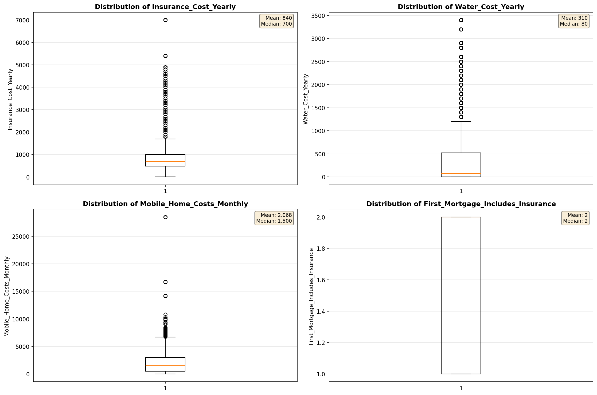

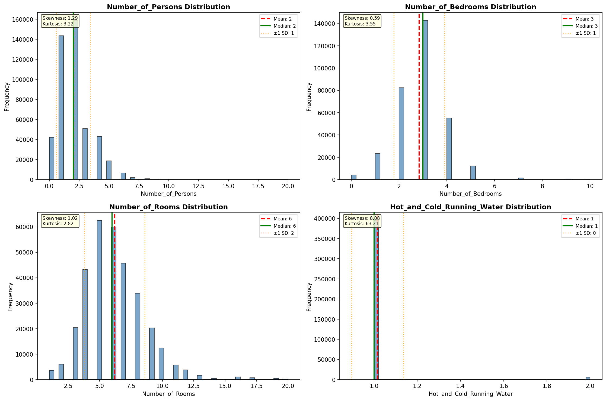

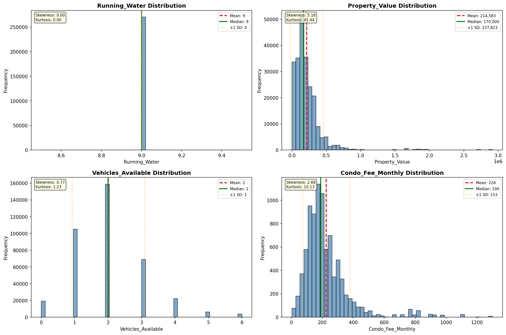

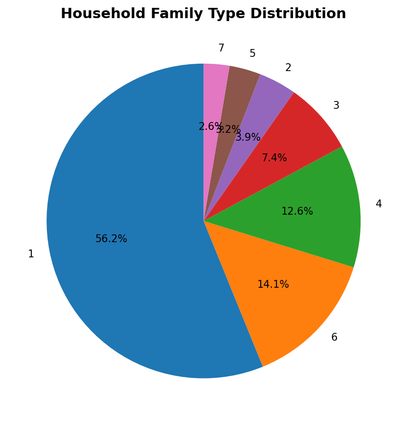

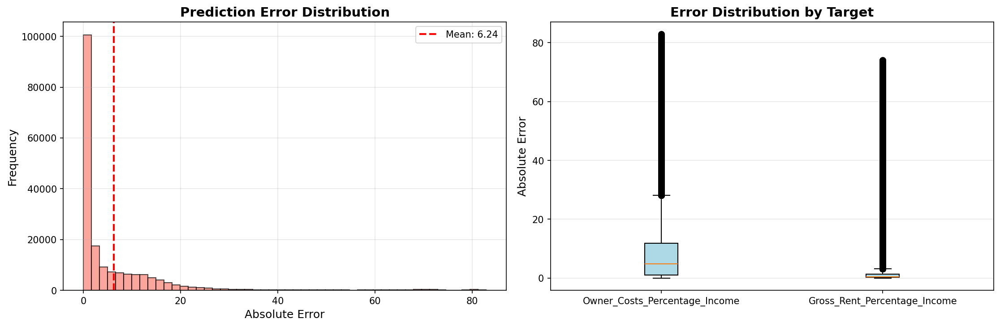

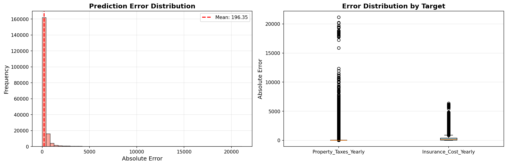

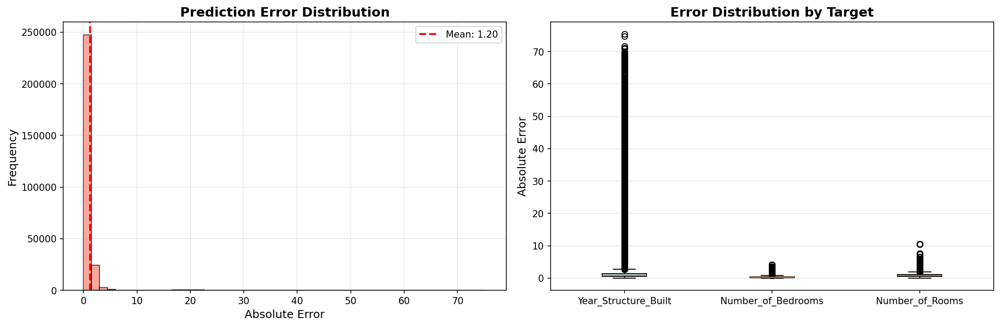

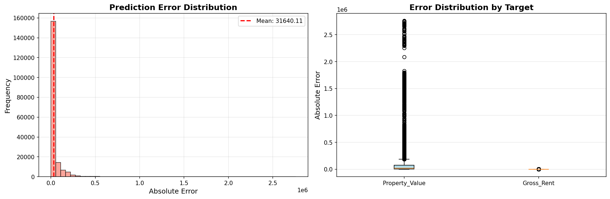

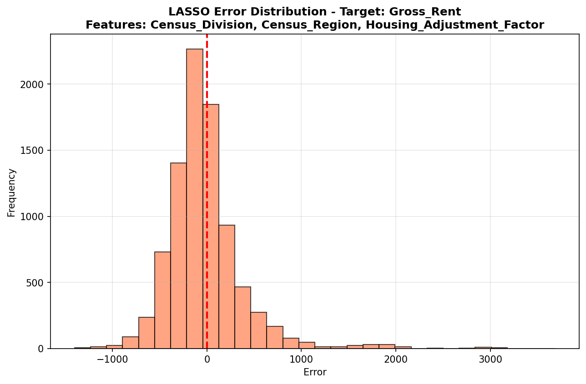

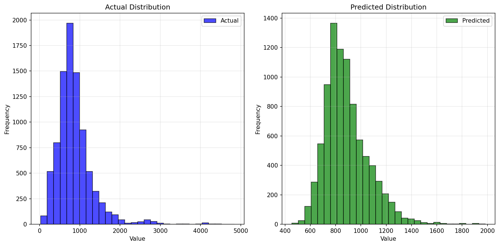

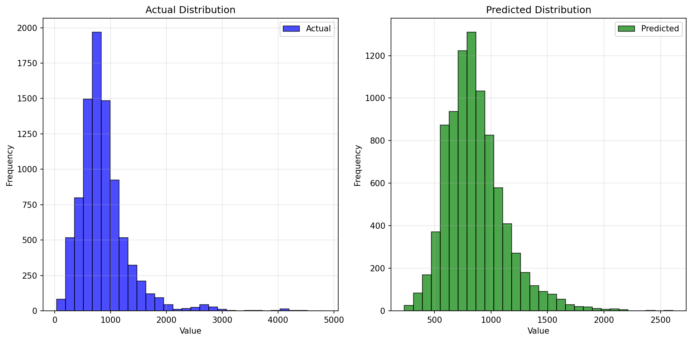

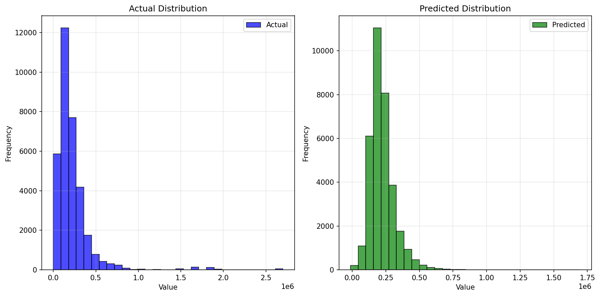

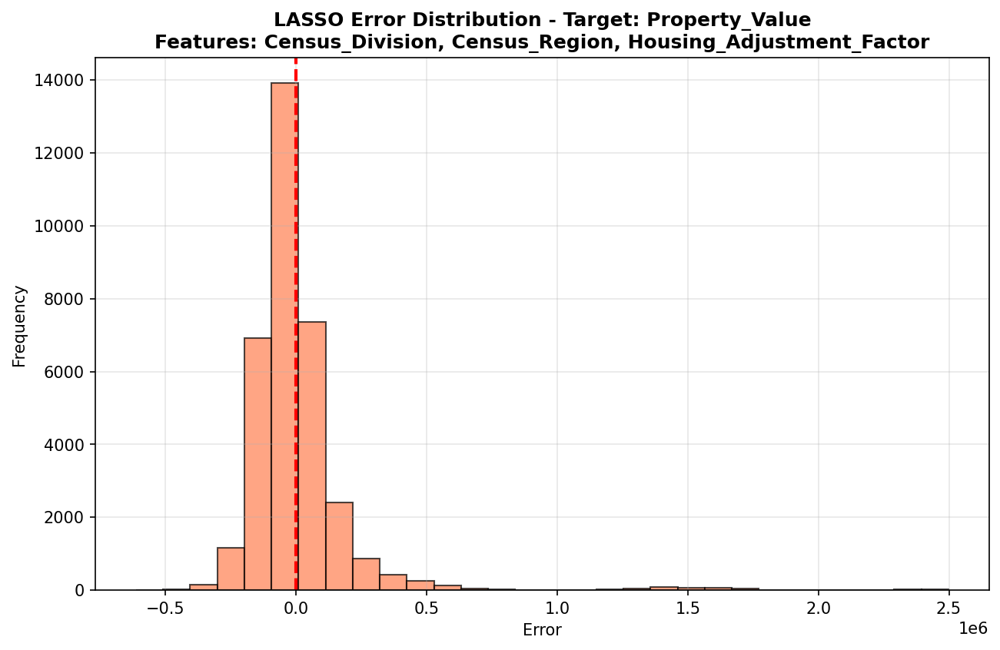

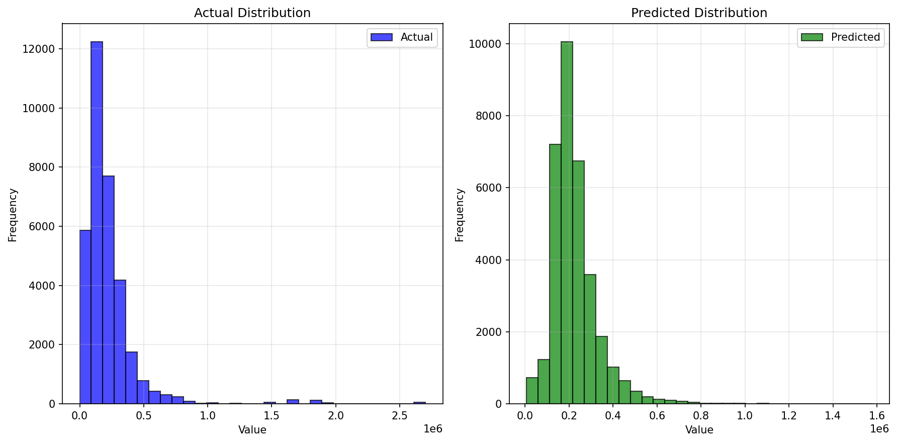

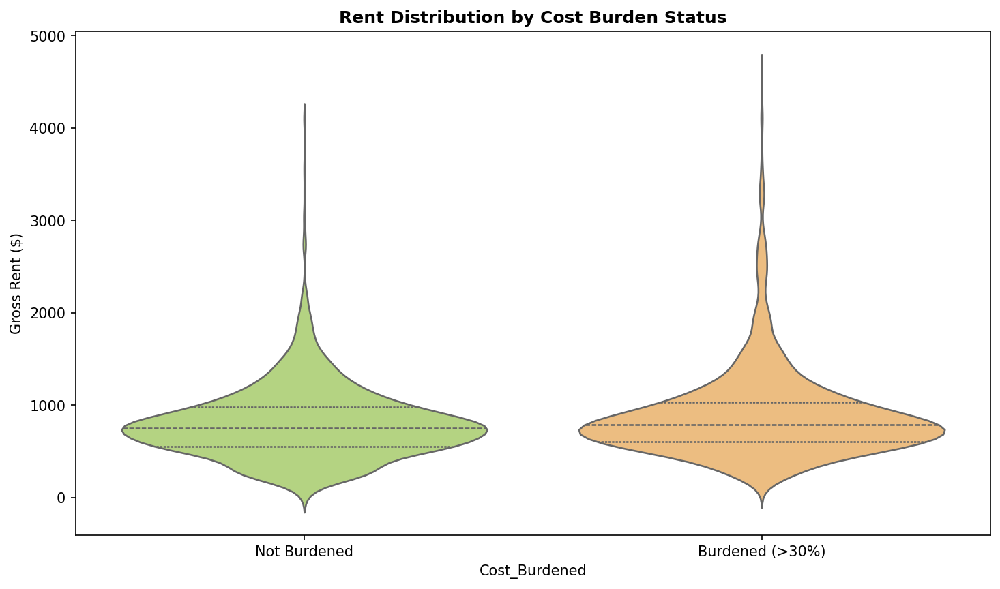

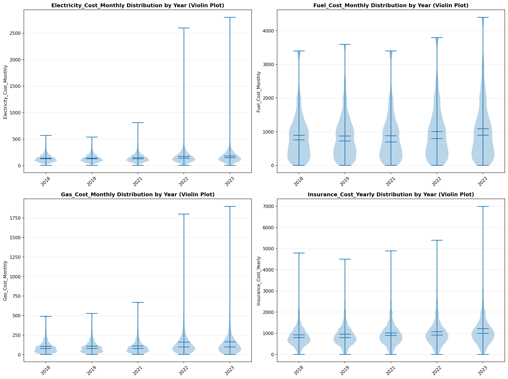

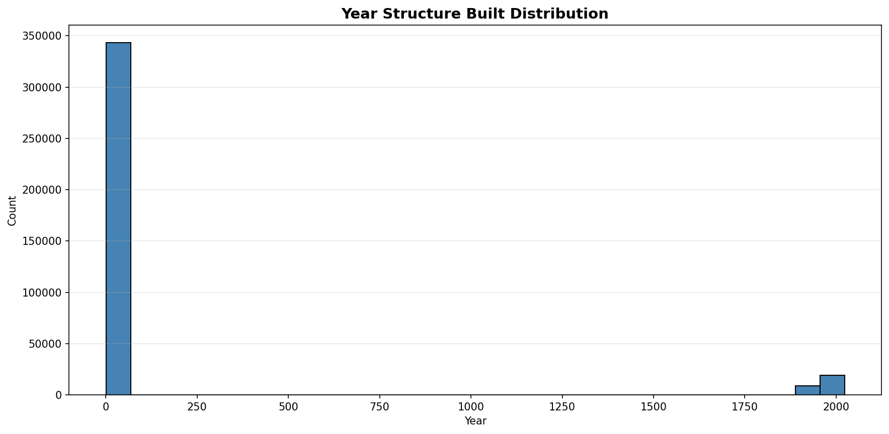

