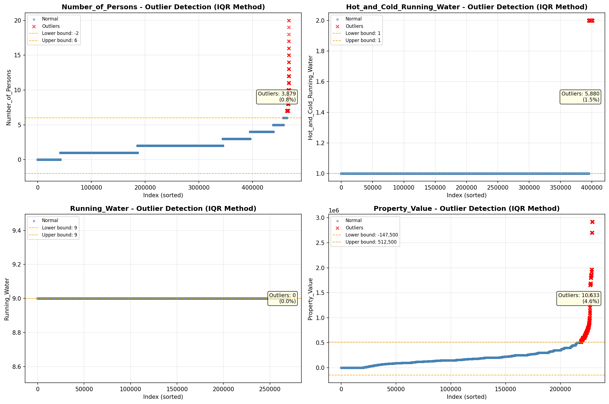
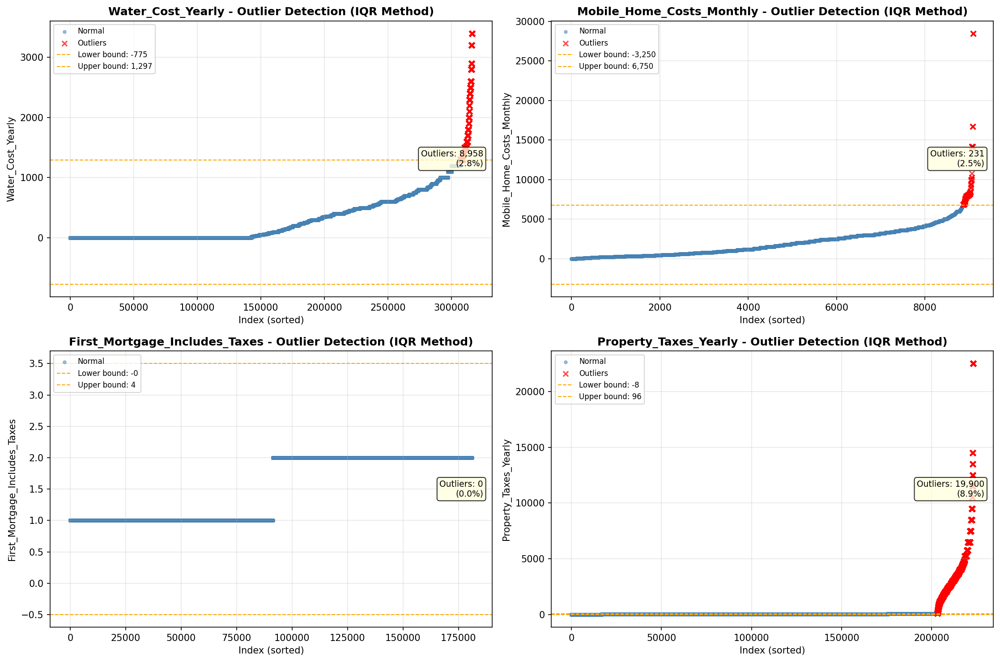

# Outlier Detection

> Statistical outlier detection using IQR (Interquartile Range) method. Outliers are values falling outside Q1 - 1.5×IQR or Q3 + 1.5×IQR bounds.

## Detection Methodology

| Parameter | Value | Description |
| :--- | :--- | :--- |
| Method | IQR | Outlier detection algorithm |
| Lower Bound | Q1 - 1.5 × IQR | Values below are outliers |
| Upper Bound | Q3 + 1.5 × IQR | Values above are outliers |
| IQR Definition | Q3 - Q1 | Interquartile Range |

> **Note**: The IQR method is robust to extreme values and works well for approximately symmetric distributions.

## Outlier Summary

_No outlier summary available._
## High Outlier Rate Variables

> Variables with outlier rate > 5% may indicate data quality issues, non-normal distributions, or genuinely extreme values.

- **('Fuel_Cost_Monthly', 24.361006682615745)**: 0 outliers (0.00%)

- **('Flag_Selected_Monthly_Owner_Costs', 23.019935773107374)**: 0 outliers (0.00%)

- **('Specified_Rent_Unit', 19.08974972102662)**: 0 outliers (0.00%)

- **('Flag_Family_Income', 17.30653776405127)**: 0 outliers (0.00%)

- **('Property_Tax_Rate', 16.229649132233625)**: 0 outliers (0.00%)

- **('Income_Adjustment_Factor', 9.509880098115392)**: 0 outliers (0.00%)

- **('Gross_Rent_Percentage_Income', 9.49500086999585)**: 0 outliers (0.00%)

- **('Property_Taxes_Yearly', 8.920406662961037)**: 0 outliers (0.00%)

- **('Structure_Age', 8.42021929730079)**: 0 outliers (0.00%)

- **('Working_Age_Persons', 8.386343118354263)**: 0 outliers (0.00%)

- **('Structure_Age_Score', 7.506301027552185)**: 0 outliers (0.00%)

- **('Owner_Costs_Percentage_Income', 7.486319129223407)**: 0 outliers (0.00%)

- **('Flag_Water_Cost', 6.93786769981346)**: 0 outliers (0.00%)

- **('Insurance_Cost_Yearly', 6.64307549932109)**: 0 outliers (0.00%)

- **('Flag_Property_Taxes', 6.341801107633037)**: 0 outliers (0.00%)

> *Consider investigating these variables for data entry errors, applying transformations, or using robust statistical methods.*

## Visualizations

