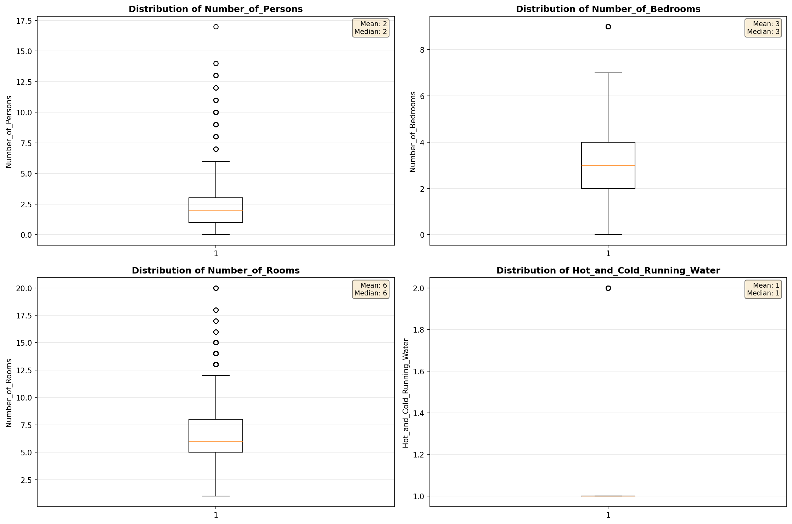
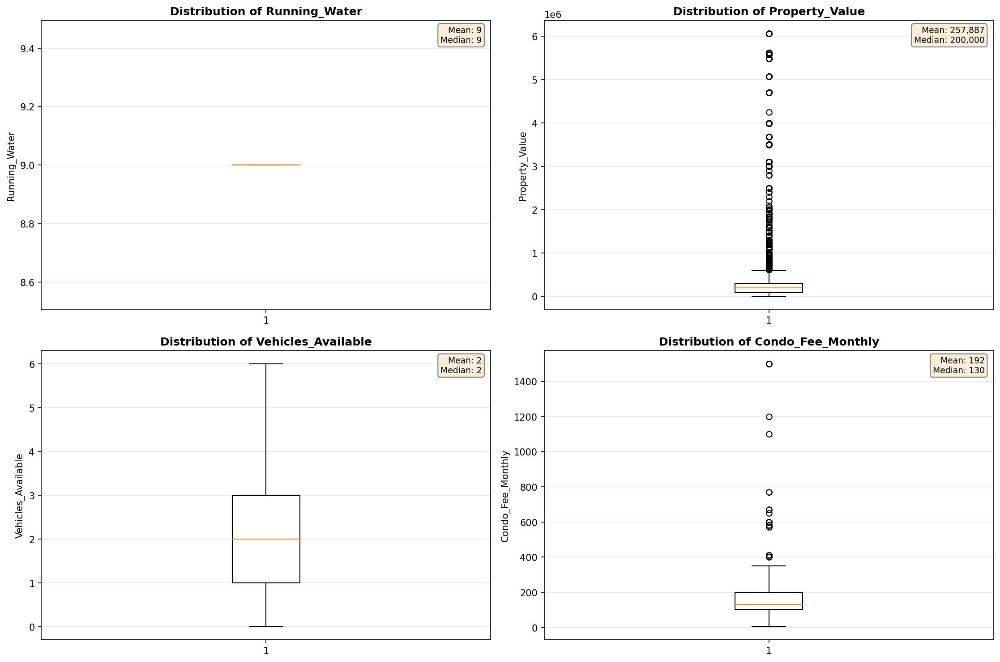
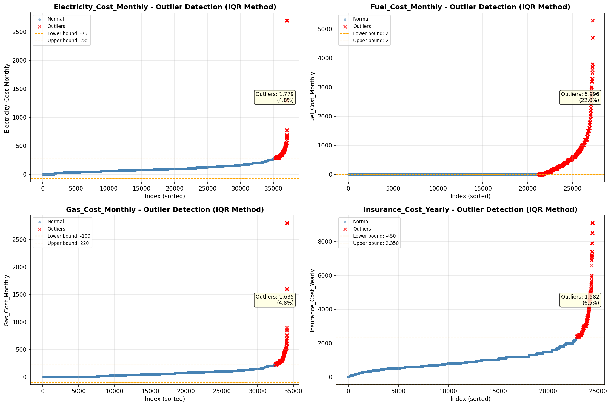
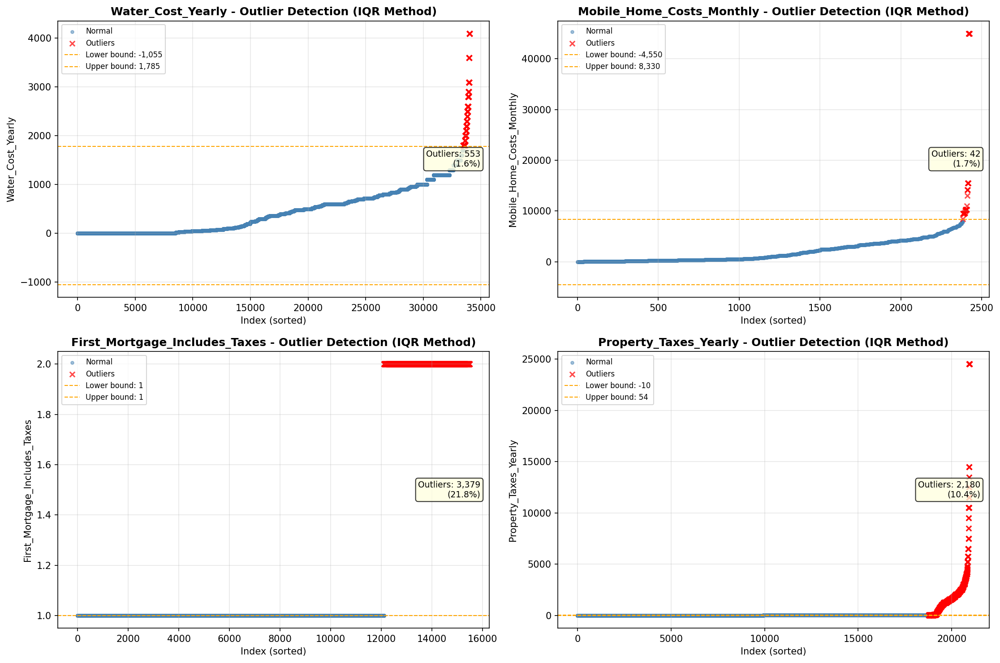

# Outlier Detection

> Statistical outlier detection using IQR (Interquartile Range) method. Outliers are values falling outside Q1 - 1.5×IQR or Q3 + 1.5×IQR bounds.

## Detection Methodology

| Parameter | Value | Description |
| :--- | :--- | :--- |
| Method | IQR | Outlier detection algorithm |
| Lower Bound | Q1 - 1.5 × IQR | Values below are outliers |
| Upper Bound | Q3 + 1.5 × IQR | Values above are outliers |
| IQR Definition | Q3 - Q1 | Interquartile Range |

> **Note**: The IQR method is robust to extreme values and works well for approximately symmetric distributions.

## Outlier Summary

_No outlier summary available._
## High Outlier Rate Variables

> Variables with outlier rate > 5% may indicate data quality issues, non-normal distributions, or genuinely extreme values.

- **('Specified_Rent_Unit', 22.802911507945794)**: 0 outliers (0.00%)

- **('Fuel_Cost_Monthly', 22.011747430249635)**: 0 outliers (0.00%)

- **('Property_Tax_Rate', 21.94861575688563)**: 0 outliers (0.00%)

- **('First_Mortgage_Includes_Taxes', 21.82252647894601)**: 0 outliers (0.00%)

- **('Flag_Selected_Monthly_Owner_Costs', 20.88403277874348)**: 0 outliers (0.00%)

- **('Flag_Family_Income', 17.801479127192714)**: 0 outliers (0.00%)

- **('Property_Taxes_Yearly', 10.405727923627685)**: 0 outliers (0.00%)

- **('Flag_Property_Taxes', 9.72323105823419)**: 0 outliers (0.00%)

- **('Gross_Rent_Percentage_Income', 9.44)**: 0 outliers (0.00%)

- **('Structure_Age', 9.354760689043562)**: 0 outliers (0.00%)

- **('Income_Adjustment_Factor', 9.232445897555658)**: 0 outliers (0.00%)

- **('Working_Age_Persons', 8.73558364783194)**: 0 outliers (0.00%)

- **('Flag_Water_Cost', 8.493932905067808)**: 0 outliers (0.00%)

- **('Structure_Age_Score', 7.530031442315445)**: 0 outliers (0.00%)

- **('Flag_Property_Value', 7.356004400028085)**: 0 outliers (0.00%)

> *Consider investigating these variables for data entry errors, applying transformations, or using robust statistical methods.*

## Visualizations

