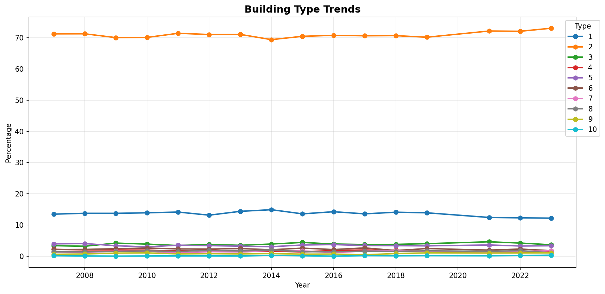
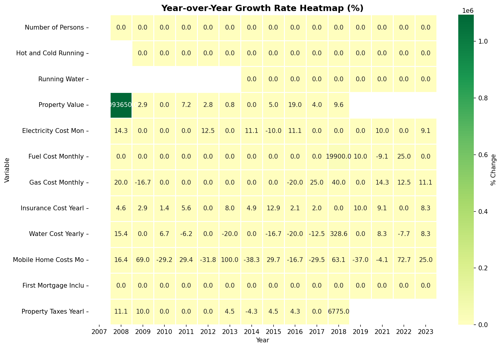
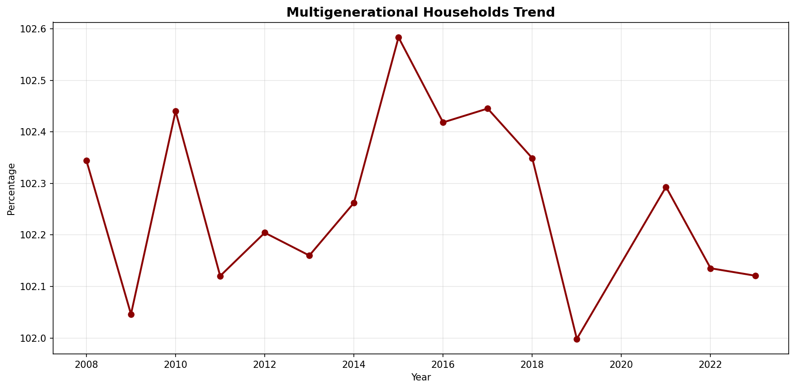
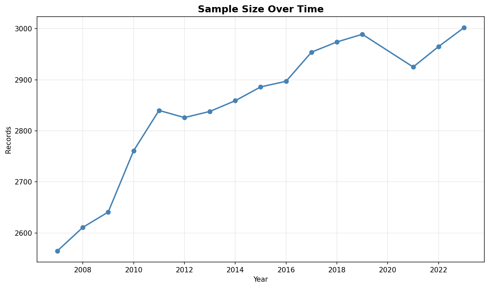
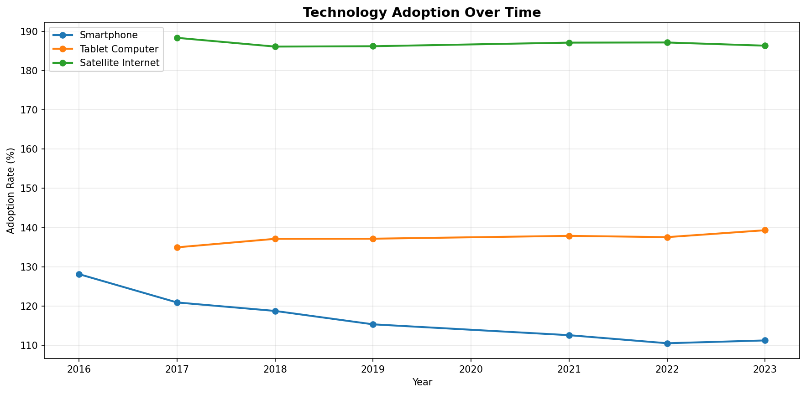
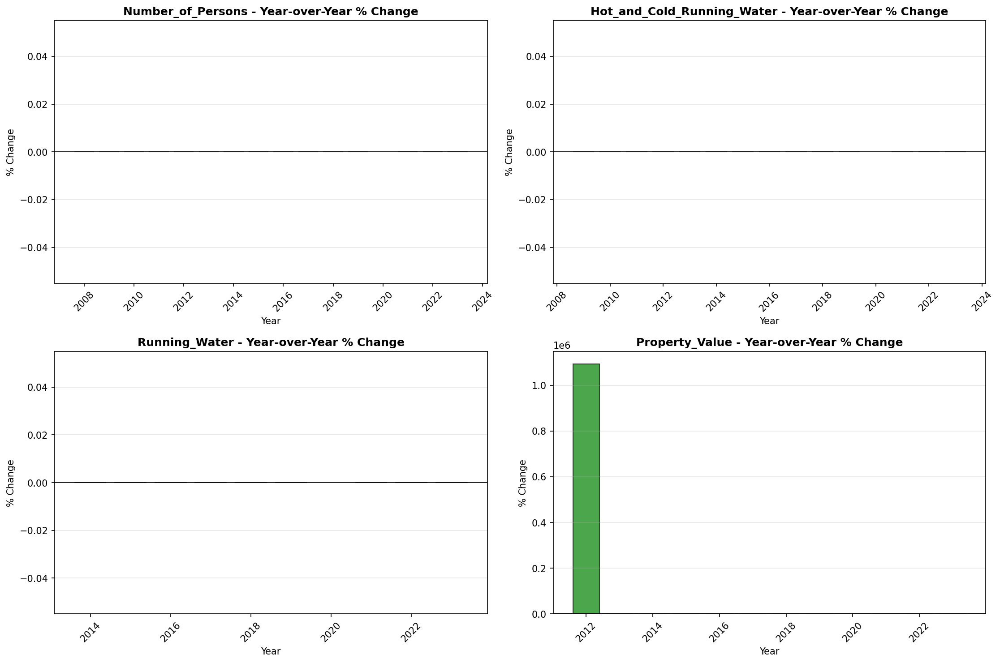

# Trend Analysis

> Analysis of long-term trends in key variables, including trend direction, strength, and statistical significance.

## Trend Summary

_No trend summary available._
## Strong Trends

> Variables showing significant long-term trends that may require attention or represent important patterns in the data.

- **('Insurance_Cost_Yearly', 0.9736326598830999, 'increasing')**: decreasing trend (slope: 0.0000)

- **('Rent_Amount_Monthly', 0.9466338074820675, 'increasing')**: decreasing trend (slope: 0.0000)

- **('Gross_Rent', 0.9381140451709784, 'increasing')**: decreasing trend (slope: 0.0000)

- **('Electricity_Cost_Monthly', 0.9236057292750735, 'increasing')**: decreasing trend (slope: 0.0000)

- **('Family_Income', 0.9220664878319147, 'increasing')**: decreasing trend (slope: 0.0000)

- **('Income_to_FPL_Ratio', 0.8773497672959328, 'increasing')**: decreasing trend (slope: 0.0000)

- **('Household_Income', 0.8558827220494599, 'increasing')**: decreasing trend (slope: 0.0000)

- **('Property_Value', 0.8425007955758126, 'increasing')**: decreasing trend (slope: 0.0000)

- **('Total_Monthly_Utility_Cost', 0.7469976372935335, 'increasing')**: decreasing trend (slope: 0.0000)

- **('Gross_Rent_Percentage_Income', 0.7250182702060379, 'increasing')**: decreasing trend (slope: 0.0000)

## Trend Categories

_Trend category data not available._
## Visualizations

