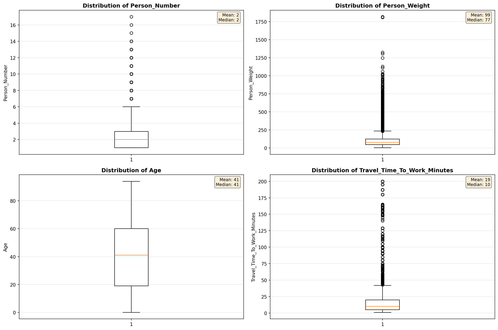
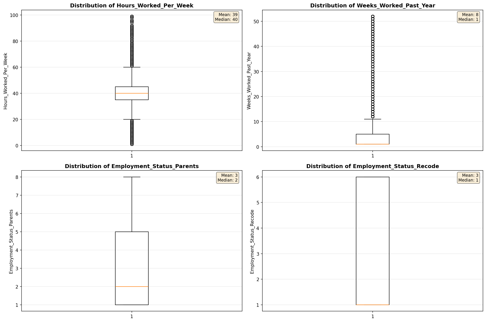

# Outlier Detection

> Statistical outlier detection using IQR (Interquartile Range) method. Outliers are values falling outside Q1 - 1.5×IQR or Q3 + 1.5×IQR bounds.

## Detection Methodology

| Parameter | Value | Description |
| :--- | :--- | :--- |
| Method | IQR | Outlier detection algorithm |
| Lower Bound | Q1 - 1.5 × IQR | Values below are outliers |
| Upper Bound | Q3 + 1.5 × IQR | Values above are outliers |
| IQR Definition | Q3 - Q1 | Interquartile Range |

> **Note**: The IQR method is robust to extreme values and works well for approximately symmetric distributions.

## Outlier Summary

_No outlier summary available._
## High Outlier Rate Variables

> Variables with outlier rate > 5% may indicate data quality issues, non-normal distributions, or genuinely extreme values.

- **('Total_Annual_Hours', 15.128716679085644)**: 0 outliers (0.00%)

- **('Hours_Worked_Per_Week', 13.272306727301238)**: 0 outliers (0.00%)

- **('Interest_Dividend_Rental_Income', 12.022025084123584)**: 0 outliers (0.00%)

- **('Flag_Wage_Income', 11.51227116735772)**: 0 outliers (0.00%)

- **('Flag_Interest_Dividend_Income', 9.84724643015665)**: 0 outliers (0.00%)

- **('Flag_Social_Security_Income', 9.299455456799212)**: 0 outliers (0.00%)

- **('Other_Income', 8.911576397300571)**: 0 outliers (0.00%)

- **('Income_Adjustment_Factor', 8.53408911982365)**: 0 outliers (0.00%)

- **('Flag_Retirement_Income', 8.448539043639238)**: 0 outliers (0.00%)

- **('Supplemental_Security_Income', 8.21831869510665)**: 0 outliers (0.00%)

- **('Flag_Other_Income', 8.07288001645538)**: 0 outliers (0.00%)

- **('Flag_Supplemental_Security_Income', 7.6181918567515785)**: 0 outliers (0.00%)

- **('Self_Employment_Income', 7.518796992481203)**: 0 outliers (0.00%)

- **('Flag_Self_Employment_Income', 6.1047298394517755)**: 0 outliers (0.00%)

- **('Presence_And_Age_Own_Children', 5.843904060266992)**: 0 outliers (0.00%)

> *Consider investigating these variables for data entry errors, applying transformations, or using robust statistical methods.*

## Visualizations

